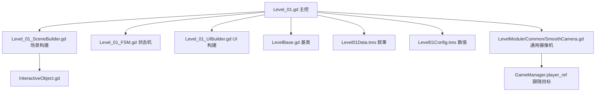

## Product Overview

为叙事驱动关卡 1（《黑暗庇护所》）解决两个核心架构问题：1) 7 个交互物在原 1500 像素宽地图上间距过近，导致 `InteractiveObject` 触发区（基于 `_create_interactive` 2.5×/1.1× 放大系数）相互重叠，玩家可能同时触发多个物体或错过物体；2) 摄像机没有平滑跟随，开局有抖动，且未配置大地图长卷轴能力，限制横向叙事展开。本方案在**零侵入**（不动 LevelBase / InteractiveObject / GlobalDefine 等基类）前提下，把地图扩展到 3000 像素（约 2.3 屏），并提取一个独立 `SmoothCamera` 模块（死区+lerp+lookahead 混合算法）供关卡 1 立即使用、未来 Level_02/Level_03 直接复用。

## Core Features

- **地图扩展到 3000 像素**：Level01Config.tres 摄像机 right 边界 1550→3000；地面/墙宽相应扩展
- **消除交互重叠**：将 7 个交互物坐标重新分布到 100-2700 区间（客厅-走廊-卧室三段），最小间距 ≥130 像素（1.0× 触发区右边界到下一物体左边界）
- **缩小触发区**：`_create_interactive` 私有方法的触发区放大系数从 2.5×x/1.1×y 改为 1.0×x/1.0×y（与可视指示器大小一致）
- **SmoothCamera 通用模块**：基于 `Camera2D`，导出 `lerp_speed` / `deadzone_size` / `lookahead_offset` / `lookahead_lerp` / `limit_*`，在 Level_01._on_ready 末尾通过 `set_script()` 升级基类创建的 LevelCamera，启用死区+lerp+lookahead 混合跟随
- **关卡 1 主控集成**：新增 `_setup_smooth_camera()` 私有方法，在 SceneBuilder 之后调用
- **数据驱动**：所有摄像机参数与地图宽 3000 由 .tres 控制，Level_01.gd 不硬编码

## Tech Stack

- 引擎：Godot 4.6（GL Compatibility，GDScript）
- 架构：保留 4 文件拆分（Level_01 / SceneBuilder / FSM / UIBuilder）+ 2 资源（Config/Data）+ 1 场景（Level_01.tscn），新增 1 个通用模块（Common/SmoothCamera.gd）
- 零侵入：不动 LevelBase / InteractiveObject / GlobalDefine / EventBus / GameManager
- 模块化：SmoothCamera 作为独立 .gd 文件（无 .tscn 依赖，仅靠 set_script 升级运行时摄像机节点），便于跨关卡复用

## Tech Architecture

### 模块依赖图



### SmoothCamera 死区+lerp+lookahead 混合算法

```mermaid
flowchart LR
    A[读取 player.global_position] --> B{玩家在死区内?}
    B -- 是 --> C[target = player_global<br/>摄像机不主动移动]
    B -- 否 --> D[target.x = player.x +<br/>sign(vx) * lookahead_offset]
    D --> E[lerp to target by lerp_speed * delta]
    E --> F[clamp to limit_left + vw/2,<br/>limit_right - vw/2]
    F --> G[赋值 camera.global_position]
    C --> G
```

### 摄像机升级时序

```
LevelBase._ready() 创建普通 Camera2D (LevelCamera)
  → Level_01._on_ready() 调用 _setup_smooth_camera()
    → 找到 player_ref.LevelCamera 节点
    → camera.set_script(load(SmoothCamera.gd))
    → set_process(true) 启用 _process
    → 把 level_config.camera_limit_* 同步到 SmoothCamera
    → 初始化 camera.global_position = player.global_position（避免开局抖动）
```

## Implementation Details

### 1. 新增 `res://LevelModule/Common/SmoothCamera.gd`

**核心类结构**：

```
extends Camera2D
class_name SmoothCamera

# 跟随参数
@export_range(0.1, 20.0, 0.1) var lerp_speed: float = 5.0
@export var deadzone_size: Vector2 = Vector2(60.0, 80.0)
@export_range(0.0, 200.0, 1.0) var lookahead_offset: float = 80.0
@export_range(0.1, 10.0, 0.1) var lookahead_lerp: float = 3.0

# 跟随目标（player）
var _target: Node2D = null
var _last_target_x: float = 0.0
var _lookahead_x: float = 0.0

func _ready() -> void:
    set_process(true)

func bind_target(node: Node2D) -> void:
    _target = node
    if _target:
        global_position = _target.global_position
        _last_target_x = _target.global_position.x
        _lookahead_x = 0.0

func _process(delta: float) -> void:
    if not _target or not is_instance_valid(_target):
        return
    var target_pos: Vector2 = _target.global_position
    var cam_pos: Vector2 = global_position
    var offset: Vector2 = target_pos - cam_pos

    # 死区判定
    var target_with_lookahead: Vector2 = target_pos

    # X 方向 lookahead：玩家速度方向偏移
    var player_vx: float = target_pos.x - _last_target_x
    if abs(offset.x) > deadzone_size.x:
        # 超出死区 → 添加 lookahead
        if abs(player_vx) > 0.1:
            var dir: float = sign(player_vx)
            _lookahead_x = lerp(_lookahead_x, dir * lookahead_offset, lookahead_lerp * delta)
        target_with_lookahead.x += _lookahead_x

    # 死区内：Y 不变（保持垂直稳定），X 轻微跟随
    if abs(offset.x) < deadzone_size.x:
        target_with_lookahead.x = cam_pos.x  # 死区内不移动 X
    if abs(offset.y) < deadzone_size.y:
        target_with_lookahead.y = cam_pos.y  # 死区内不移动 Y

    # lerp 插值
    var new_pos: Vector2 = cam_pos.lerp(target_with_lookahead, clamp(lerp_speed * delta, 0.0, 1.0))

    # clamp 到 limit 边界
    var vp_size: Vector2 = get_viewport_rect().size
    if limit_left < limit_right:
        new_pos.x = clamp(new_pos.x, limit_left + vp_size.x * 0.5, limit_right - vp_size.x * 0.5)
    if limit_top < limit_bottom:
        new_pos.y = clamp(new_pos.y, limit_top + vp_size.y * 0.5, limit_bottom - vp_size.y * 0.5)

    global_position = new_pos
    _last_target_x = target_pos.x
```

### 2. 修改 `Level_01.gd`

新增字段：

```
var _smooth_camera: SmoothCamera = null
```

新增方法（放在 SceneBuilder 之后调用）：

```
func _setup_smooth_camera() -> void:
    var player = GameManager.player_ref
    if not player: return
    var cam = player.get_node_or_null("LevelCamera")
    if not cam: return
    cam.set_script(load("res://LevelModule/Common/SmoothCamera.gd"))
    _smooth_camera = cam as SmoothCamera
    if _smooth_camera and level_config:
        _smooth_camera.limit_left = level_config.camera_limit_left
        _smooth_camera.limit_right = level_config.camera_limit_right
        _smooth_camera.limit_top = level_config.camera_limit_top
        _smooth_camera.limit_bottom = level_config.camera_limit_bottom
        _smooth_camera.bind_target(player)
```

`_on_ready` 末尾（在 `builder.build_all()` 之后、`_cache_ui_refs()` 之前）插入：

```
_setup_smooth_camera()
```

### 3. 修改 `Level_01_SceneBuilder.gd`

**3.1 地形扩展**：

- `MainGround`: pos (1650, 620) size (3000, 40)（宽 3000）
- `LeftWall`: pos (-10, 360) size (20, 720)（不变）
- `RightWall`: pos (3010, 360) size (20, 720)

**3.2 交互物坐标迁移 + 触发区缩小**：

| 物体 | 旧坐标 | 新坐标 | 旧 size | 新 size | 触发区（旧 2.5x/1.1x） | 触发区（新 1.0x/1.0x） |
| --- | --- | --- | --- | --- | --- | --- |
| box | (500, 560) | (500, 560) | (120, 80) | (120, 80) | (300, 88) | (120, 80) |
| clothes | (850, 560) | (1200, 560) | (100, 80) | (100, 80) | (250, 88) | (100, 80) |
| notice | (1020, 570) | (1700, 570) | (40, 40) | (40, 40) | (100, 44) | (40, 40) |
| computer | (1100, 560) | (1900, 560) | (100, 80) | (100, 80) | (250, 88) | (100, 80) |
| phone | (1180, 580) | (2150, 580) | (50, 40) | (50, 40) | (125, 44) | (50, 40) |
| thermos | (1250, 580) | (2400, 580) | (30, 40) | (30, 40) | (75, 44) | (30, 40) |
| bed | (1350, 570) | (2700, 570) | (160, 60) | (160, 60) | (400, 66) | (160, 60) |


**3.3 _create_interactive 触发区系数**：

```
# 旧：rect_shape.size = Vector2(size.x * 2.5, size.y * 1.1)
# 新：rect_shape.size = size  # 与可视指示器一致
rect_shape.size = size
```

### 4. 修改 `Level01Config.tres`

```
camera_limit_left = -50
camera_limit_right = 3000      # 原 1550
camera_limit_top = -100
camera_limit_bottom = 750
```

### 5. 文件清单

| 路径 | 类型 | 改动 |
| --- | --- | --- |
| `LevelModule/Common/SmoothCamera.gd` | [NEW] | 通用死区+lerp+lookahead 摄像机 |
| `LevelModule/Formal/Level_01.gd` | [MODIFY] | +_smooth_camera 字段，+_setup_smooth_camera()，_on_ready 末尾调用 |
| `LevelModule/Formal/Level_01_SceneBuilder.gd` | [MODIFY] | 地形扩展到 3000px，交互物坐标迁移，_create_interactive 触发区 1.0x |
| `DataConfig/Level/Level01Config.tres` | [MODIFY] | camera_limit_right 1550→3000 |


### 6. 关键不变量验证

**新坐标间距验证**（触发区右边界 vs 下一物体左边界）：

- box (560) vs clothes (1150) → 590px 间距 ✓
- clothes (1250) vs notice (1680) → 430px ✓
- notice (1720) vs computer (1850) → 130px ✓
- computer (1950) vs phone (2125) → 175px ✓
- phone (2175) vs thermos (2385) → 210px ✓
- thermos (2415) vs bed (2620) → 205px ✓

**摄像机边界验证**：

- 屏幕宽 1280，limit_left=-50，limit_right=3000
- 摄像机 x 范围: [-50+640, 3000-640] = [590, 2360]
- 玩家初始 (100, 550) → 摄像机立即插值到 (590, 590) → 不超出左边界
- 玩家到达 bed (2700, 570) → 摄像机插值到 (2360, 590) → 不超出右边界
- 玩家始终在屏幕中央 60% 区域内