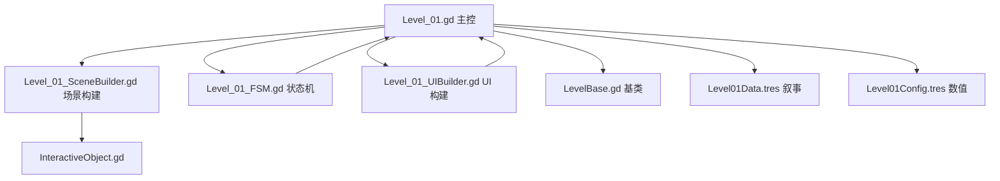

## Product Overview

按照《黑暗庇护所》关卡 1 完整设计方案对现有 Level_01 进行结构性补全与数据对齐。严格遵守项目现有叙事驱动分层架构（LevelBase / InteractiveObject / SceneBuilder / UIBuilder / FSM + DataConfig），不修改任何基类与基础设施，零侵入地补全缺失字段、缺失交互物、缺失状态分支与缺失终局流程，并使 Level_01 成为可被 Level_02/Level_03 直接复用的叙事关卡模板。

## Core Features

- **数据层补全**：在 Level01Data.gd 新增 `notice_text` / `thermos_text` / `climax_monologue` 三个 `@export_multiline` 字段；Level01Data.tres 全部叙事文本（obstacle_1/2、sleep_texts、ide_speakers/ide_texts、phone_sender/phone_content、notice、thermos、climax）以方案为准完整覆盖
- **配置层对齐**：Level01Config.tres 校准 `level_name="现实的泥潭"`、`bg_color=Color(0.06, 0.06, 0.08, 1.0)`、`camera_limit_*` 至方案规格
- **场景层改造**：SceneBuilder 调整全部 5 个交互物坐标至方案规格，并新增 `notice`（休学告知书）与 `thermos`（旧保温杯）两个叙事细节交互物
- **主控层改造**：Level_01.gd 替换 IDE 助手命名 AI→CodeBuddy、引入 IDE_PREVIEW 8 秒超时崩溃计时器、实现 GLITCH_TRANSIT 床再触发的完整终局转场链（0.8s 黑屏 + 2.5s 声效渐变 + 2.0s glitch intensity 0→1 + emit LEVEL_COMPLETE），并把私有 `_create_static_body` 改为复用基类 `create_ground/create_wall`
- **状态机补全**：FSM 补全 `notice` / `thermos` / `climax_monologue` / IDE 8 秒超时崩溃 / GLITCH_TRANSIT 床再触发 共 5 个状态分支
- **UI 层保留**：维持现有完整 IDE 风格（TitleBar / TitleLabel / ChatPanel / TabLabel / ChatWindow / PreviewPanel / PreviewTab / ViewportContainer / MiniViewport / StatusBar）不变
- **状态机扩展点**：GLITCH_TRANSIT 状态锁死除 bed 外所有交互，强制玩家再次与床交互才完成转场（遵循方案 7 态 + 1 终局触发）

## Tech Stack

- **引擎**：Godot 4.6（GL Compatibility，GDScript）
- **架构**：保留 4 文件拆分（`Level_01` / `Level_01_SceneBuilder` / `Level_01_FSM` / `Level_01_UIBuilder`）+ 2 资源（`Level01Config.tres` / `Level01Data.tres`）+ 1 场景（`Level_01.tscn`）
- **数据驱动**：所有叙事文本从 `Level01Data.tres` 读取，`.gd` 中零硬编码字符串
- **事件通信**：`EventBus.emit("interactive_object_triggered", {"object_id": ...})` 单通道，跨模块禁止 `get_node()` 跨层
- **碰撞层**：`GlobalDefine.Collision.TERRAIN / PLAYER` 强制使用
- **方法边界**：`_create_interactive` / `_add_physics_blocker` 保持私有（下划线）；`create_ground` / `create_wall` 复用 LevelBase 公共 API
- **零侵入约束**：不修改 `LevelBase.gd` / `InteractiveObject.gd` / `GlobalDefine.gd` / `EventBus.gd` / `GameManager.gd`

## Tech Architecture

### 模块依赖图



### 关键数据流（玩家按 Enter）

```
玩家按 Enter
  → Level_01._input(event)
  → _find_nearby_interactive() 遍历 7 个 InteractiveObject
  → EventBus.emit("interactive_object_triggered", {object_id})
  → Level_01._on_object_interacted(data)
  → Level_01_FSM.handle_interaction(obj_id)
  → match current_state:
       LIVING_ROOM + "box"     → _handle_box()
       CORRIDOR   + "clothes"  → _handle_clothes()
       BEDROOM    + "notice"   → _handle_notice()       ← 新增
       BEDROOM    + "thermos"  → _handle_thermos()      ← 新增
       BEDROOM    + "bed"      → _trigger_sleep_cycle()
       BEDROOM    + "computer" → _enter_ide_mode()
       PHONE_RINGING + "phone" → _trigger_climax_transition()
       GLITCH_TRANSIT + "bed"  → _on_final_bed_trigger() ← 新增
```

### 8 秒超时崩溃设计

- 进入 `IDE_PREVIEW` 时 `_ide_preview_timer = 0.0`
- `_process(delta)` 中累加，到达 8.0 → 调用 `_on_preview_crashed()`
- 与 `prototype_crashed` 信号互不冲突（任一触发即转场）
- 避免玩家在 IDE 中无限停留

### GLITCH_TRANSIT 终局链

1. `PHONE_RINGING` 状态玩家交互 `phone` → 显示 `phone_sender + phone_content` 短信
2. 玩家确认短信 → 弹出 `climax_monologue` 内心独白
3. 独白关闭 → `_lock_all_interactions_except_bed()` + `bed.reset_completed()` + `current_state = GLITCH_TRANSIT`
4. 玩家再交互 `bed` → 0.8s 遮罩渐黑 → 2.5s 声效交叉渐变 → 2.0s glitch intensity 0→1 → `EventBus.emit(LEVEL_COMPLETE, {next_level: "res://LevelModule/Formal/Level_02.tscn"})`

## Implementation Details

### 修改文件清单

| 文件路径 | 改动类型 | 改动内容 |
| --- | --- | --- |
| `DataConfig/Level/Level01Data.gd` | [MODIFY] | +3 字段：`notice_text` / `thermos_text` / `climax_monologue` |
| `DataConfig/Level/Level01Data.tres` | [MODIFY] | 全部叙事文案以方案为准（含 9 条 IDE 对话 + 3 条 sleep_texts） |
| `DataConfig/Level/Level01Config.tres` | [MODIFY] | `level_name` / `bg_color` / `camera_limit_*` 对齐方案 |
| `LevelModule/Formal/Level_01_SceneBuilder.gd` | [MODIFY] | 调整 5 个交互物坐标 + 新增 `notice` / `thermos` |
| `LevelModule/Formal/Level_01.gd` | [MODIFY] | IDE 命名 AI→CodeBuddy、+8s 超时计时器、+GLITCH_TRANSIT 床再触发终局链、复用基类 `create_ground/create_wall` |
| `LevelModule/Formal/Level_01_FSM.gd` | [MODIFY] | 补全 5 个新分支（notice/thermos/climax_monologue/超时/床再触发） |
| `LevelModule/Formal/Level_01_UIBuilder.gd` | 无需修改 | 保留完整 IDE 风格 UI（用户决策 q4） |
| `LevelModule/Formal/glitch_effect.gdshader` | 无需修改 | 现有 shader 已满足需求 |
| `LevelModule/Formal/InteractiveObject.gd` | 无需修改 | 基类保持原样 |
| `LevelModule/Formal/LevelBase.gd` | 无需修改 | 基类保持原样 |
| `LevelModule/Formal/Level_01.tscn` | 无需修改 | 仅挂脚本 + 资源引用 |


### 关键代码改造点

1. **SceneBuilder 坐标迁移**：

- box (500, 560)、clothes (850, 560)、computer (1100, 560)、phone (1180, 580)、bed (1350, 570)
- 新增 notice (1020, 570) 大小 (40, 40)、thermos (1250, 580) 大小 (30, 40)

2. **主控脚本的 `_render_next_chat_line` 中**：将 `match speaker` 分支中 `"AI"` 改为 `"CodeBuddy"`，统一为青色 CodeBuddy 前缀
3. **新增 `_ide_preview_timer` 字段**：进入 IDE_PREVIEW 时重置为 0，每帧累加 delta，达 8.0 触发 `_on_preview_crashed()`
4. **新增 GLITCH_TRANSIT 床再触发 API** `_on_final_bed_trigger()`：0.8s 黑屏 → 2.5s 声效渐变 → 2.0s glitch → emit LEVEL_COMPLETE
5. **新增 `_lock_all_interactions_except_bed()`**：遍历 `get_tree().get_nodes_in_group("interactive_objects")`，对非 bed 节点设 `is_active = false`
6. **私有方法签名变更**（如有）：`_create_interactive` / `_add_physics_blocker` 保持下划线私有（与现有架构一致），但 `_create_static_body` 改为调用基类 `create_ground` / `create_wall` 公共 API（消除代码重复）