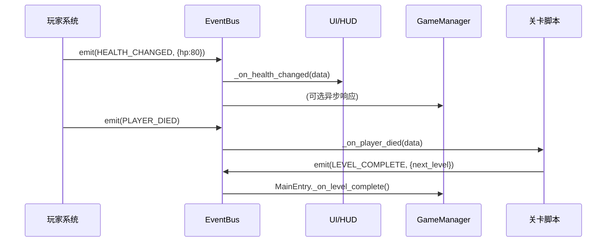

# 「织梦者 Dreamweaver」架构深度分析

> 聚焦开发解耦与数据流向设计  
> 分析日期：2026-06-29

---

## 一、分层架构总览

```
┌─────────────────────────────────────────────────────┐
│                  入口层 (UI)                         │
│   TitleScreen ──→ MainEntry (正式流程宿主)           │
├─────────────────────────────────────────────────────┤
│                  关卡层 (LevelModule)                │
│   LevelBase → Level_01~05 + Level_final             │
│   每关 = 主控脚本 + FSM + SceneBuilder + UIBuilder   │
├──────────────┬───────────────┬──────────────────────┤
│   玩家系统    │   敌人系统     │      UI 系统          │
│  PlayerBase  │  EnemyBase    │  HUD / TitleScreen   │
│  +3种皮肤    │  +5种敌人     │  / KeybindSettings   │
│  +SmoothCam  │  +BossHuadan  │  / GameUIStyle       │
├──────────────┴───────────────┴──────────────────────┤
│                  工具层 (Tools/)                      │
│  DamageCalculator / CodeRain / SwordQiProjectile     │
├─────────────────────────────────────────────────────┤
│                数据配置层 (DataConfig/)               │
│   PlayerConfig / EnemyConfig / LevelConfig / Skill   │
├─────────────────────────────────────────────────────┤
│          全局基础设施层 (Autoload 单例)               │
│   EventBus → 跨模块通信唯一通道                        │
│   GameManager → 全局状态                               │
│   InputManager → 输入屏蔽与信号分发                     │
│   SceneTransitionManager → 统一转场                    │
│   MusicManager / SFXManager → 音频                     │
│   GlobalDefine → 枚举与常量                            │
└─────────────────────────────────────────────────────┘
```

---

## 二、Global Autoload 层设计精析

Global 层承载的是**横切关注点(cross-cutting concerns)**——不隶属于任何单一业务模块、但被所有模块依赖的基础设施。本项目的 Global 层由 8 个 Autoload 单例组成，下面从设计模式、契约规范、工程质量三个维度逐一分析。

---

### 2.1 EventBus — 观察者模式的工程化落地

#### 2.1.1 设计意图

Godot 原生提供了 `signal` 机制用于节点间通信，但它有一个根本限制：**信号的发送方必须与接收方存在引用关系**（`emitter.signal.connect(receiver.method)`）。在大型项目中，这迫使持有信号的节点成为"耦合中心"——要么通过 `$` 路径硬编码查找、要么通过 `get_node()` 遍历场景树、要么通过 Autoload 暴露引用。

EventBus 通过**中介者模式(Mediator Pattern)**消除这种耦合：它作为全局 Autoload 承载所有信号，任何节点仅依赖 `EventBus` 这一个中介，不再需要知道消息的原始发送方。

#### 2.1.2 四层容错设计

```gdscript
func emit(event_name: String, data: Dictionary) -> void:
    # 层1: 空集合快速返回（大多数帧无事件，避免不必要的复制和迭代）
    if not _listeners.has(event_name):  return

    # 层2: 副本快照——回调中修改 _listeners（如 subscribe/unsubscribe）不会污染迭代器
    var listeners_copy = _listeners[event_name].duplicate()

    for item in listeners_copy:
        # 层3: is_instance_valid 双重失效检查——节点被 queue_free 但尚未 tree_exited
        if not is_instance_valid(item["node"]):
            _listeners[event_name].erase(item)  # 懒清理：不额外维护定时器
            continue

        # 层4: call_deferred 异步调用——回调中的异常不会中断 emit 循环
        #      同时也避免回调在物理帧中间修改状态导致后续订阅者看到不一致的数据
        node.call_deferred(method, data)
```

| 容错层 | 防御场景 | 代价 |
|--------|---------|------|
| 空集合检查 | 大多数事件名无订阅者 | O(1) |
| 副本快照 | 回调中调用了 subscribe/unsubscribe | O(n) 内存复制 |
| is_instance_valid | 节点已 queue_free 但 tree_exited 尚未触发 | 每回调一次有效性检查 |
| call_deferred | 回调抛异常或修改共享状态 | 延迟一帧才执行 |

#### 2.1.3 自动生命周期管理

```gdscript
func subscribe(event_name, node, method):
    # ...
    if not node.is_connected("tree_exited", _on_subscriber_tree_exited):
        node.connect("tree_exited", _on_subscriber_tree_exited.bind(node), CONNECT_ONE_SHOT)

func _on_subscriber_tree_exited(node):
    unsubscribe_all(node)  # 一次性清除该节点所有事件订阅，而非仅当前事件
```

**设计权衡**：`CONNECT_ONE_SHOT` 确保 `tree_exited` 信号只连接一次；`unsubscribe_all(node)` 而非 `unsubscribe(event_name, node)` 确保节点销毁时**全部**事件订阅被清除——因为同一个节点可能订阅了多个不同事件。

#### 2.1.4 幂等性

```gdscript
for item in _listeners[event_name]:
    if item["node"] == node and item["method"] == method:
        return  # 已存在，不重复添加
```

在关卡重载场景中，某些脚本的 `_ready()` 可能被调用两次（如 `reload_current_scene`），幂等订阅防止同一对 `(node, method)` 被重复注册，避免事件发射时重复回调。

---

### 2.2 InputManager — 责任链 + 引用计数屏蔽

#### 2.2.1 架构定位

InputManager 不是简单的"按键映射器"——它是**输入关注点分离(Input Concern Separation)**的落地：

```
物理输入捕获 (_input)  →  守卫链过滤  →  动作识别  →  信号分发
   │                        │              │             │
   │                   ┌─────┴──────┐  player_attack   PlayerBase
   │                   │ 暂停?       │  player_dash      ↓
   │                   │ 屏蔽?       │  player_skill   _on_game_action()
   │                   │ UI焦点?     │  ui_accept      Level_01
   │                   │ 鼠标在GUI?  │                  ↓
   │                   │ 动作禁用?   │              _on_game_action()
   │                   └────────────┘
   │
   └── 不接管: jump, left/right/up/down → _physics_process 轮询
```

**分工原则**：单次触发的离散动作走事件管道（attack/dash/skill），需要连续值的模拟输入保留轮询（jump 的按住变高、move 的 `get_vector()`）。

#### 2.2.2 栈式屏蔽——引用计数而非 boolean

```gdscript
var _block_count: int = 0   # 不是 is_input_blocked: bool

func block_input(reason, _caller):
    _block_count += 1
    is_input_blocked = true

func unblock_input(_reason):
    _block_count = maxi(_block_count - 1, 0)
    if _block_count <= 0:
        is_input_blocked = false   # 仅当计数归零才真正解除
        _block_count = 0
```

**为何不用 boolean**：嵌套场景（对话A → 弹出确认框 → 关确认框 → 关对话A）。boolean 模式下，关确认框的 `is_input_blocked = false` 会提前释放外层对话A的屏蔽。引用计数保证"最后一层退出才真正解除"。

#### 2.2.3 暴力清理——`force_unblock_all()`

```gdscript
func force_unblock_all():
    _block_count = 0
    is_input_blocked = false
    block_reason = ""
    clear_action_blocks()  # 同时清除动作级禁用
```

**设计动机**：关卡切换时，可能存在"block 了但未配对 unblock"的异常路径（如关卡因 bug 中途退出）。SceneTransitionManager 在切换前调用此方法，以**最终一致性**覆盖引用计数的精确配对——这是一种防御性编程实践：正常路径依赖引用计数保证正确性，异常路径用暴力清理兜底。

#### 2.2.4 动作级屏蔽——细粒度控制

```gdscript
var _blocked_actions: Dictionary = {}  # { "player_attack": "教学阶段", "player_jump": "禁跳区域" }

func block_action(action: StringName, reason: String):   _blocked_actions[action] = reason
func unblock_action(action: StringName):                  _blocked_actions.erase(action)
```

与 `block_input`（全局屏蔽所有游戏操作）形成两级粒度：
- **全局屏蔽**：对话、暂停、过场动画
- **动作级屏蔽**：教学关禁攻击、禁跳跃区域

---

### 2.3 SceneTransitionManager — 统一转场 + 防御性清理

#### 2.3.1 职责边界

SceneTransitionManager 是"场景切换的门面(Facade)"，它封装了三件事：

1. **防抖**：`is_transitioning` 标志防止同一帧内多次切换请求
2. **全局状态重置**：切换前强制执行标准化清理
3. **关卡协商退出**：通过 duck-typing 调用 `prepare_for_level_exit()`

#### 2.3.2 清理清单——基于"最坏情况假设"

```gdscript
func cleanup_for_transition(source):
    _call_prepare_for_exit(source)        # 1. 源关卡自定义清理
    # ...
    get_tree().paused = false             # 2. 无论是否暂停过，强制恢复
    GameManager.is_paused = false
    GameManager.is_game_over = false
    GameManager.player_ref = null         # 3. 清空引用（节点将随旧场景销毁）
    GameManager.current_level = null
    GameManager.enemy_list.clear()        # 4. 清空集合（元素随旧场景销毁）
    GameManager.boss_target = null
    InputManager.force_unblock_all()      # 5. 暴力解屏蔽（兜底未配对 block）
    MusicManager.clear_game_pause()       # 6. 音频状态恢复
    get_viewport().gui_release_focus()    # 7. UI焦点释放
```

**设计哲学**：切换时不检查"之前有没有暂停"——无论之前什么状态，全部重置到安全初始态。这是一种**无状态恢复(stateless reset)**策略，相比于"记住之前的状态，切换完后恢复"更简单、更不容易出错。

#### 2.3.3 duck-typing 协商退出

```gdscript
func _call_prepare_for_exit(node):
    if node and is_instance_valid(node) and node.has_method("prepare_for_level_exit"):
        node.call("prepare_for_level_exit")
```

使用 `has_method()` 而非 `is` 类型检查，目的是**不强制关卡实现某个基类或接口**。`Level_final` 继承 `Node2D` 而非 `LevelBase`，但只要它实现了 `prepare_for_level_exit()` 方法，清理流程就能正常工作。这是运行时多态的轻量替代——牺牲编译期检查换取灵活性。

#### 2.3.4 关卡内部切换的托管

`MainEntry._switch_to_level()` 不走 `change_scene_to_file()`，而走 `add_child` + `queue_free`：

```gdscript
func _switch_to_level(next_path):
    _show_level_switch_overlay(color)          # 黑/白屏遮罩
    SceneTransitionManager.cleanup_for_transition(self)
    _current_level_node.queue_free()           # 释放旧关卡（子节点玩家随之销毁）
    await get_tree().process_frame             # 等一帧让 free 生效
    _current_level_node = load(next_path).instantiate()
    add_child(_current_level_node)             # 新关卡作为 MainEntry 子节点
    await _fade_out_level_switch_overlay()     # 遮罩淡出
```

**设计动机**：保持 `MainEntry` 作为常驻宿主节点，关卡在其下增删。这避免了 `change_scene_to_file()` 的整树重建开销，且让 `MainEntry` 可以在关卡切换间持有持久状态（如转场遮罩的 CanvasLayer）。

---

### 2.4 GlobalDefine — 编译期安全 + 单一事实来源 (Single Source of Truth)

#### 2.4.1 设计原则

```gdscript
# 碰撞层 —— 不是数字，是语义
class Collision:
    const TERRAIN  := 1   # 使用 := 赋值（常量不可变），而非 =
    const ENEMY    := 2
    const PLAYER   := 4   # 使用 2 的幂次方以支持位掩码操作
    const INTERACT := 8

# 事件名 —— 不是字符串，是符号
class EventName:
    const PLAYER_SPAWNED := "player_spawned"
    const LEVEL_COMPLETE := "level_complete"
    # ...
```

三个关键设计决策：

1. **`:=` 而非 `=`**：`const` 在 GDScript 中使用 `:=` 声明，语义上强调"这是常量定义，不是可重新赋值的变量"
2. **2的幂碰撞层**：`1, 2, 4, 8` 支持 `collision_mask = TERRAIN | ENEMY` 的位运算组合
3. **内部类(namespace)**：`Collision`, `EventName` 作为嵌套类提供命名空间隔离，调用方写 `GlobalDefine.Collision.TERRAIN` 而非 `GlobalDefine.TERRAIN`，避免命名冲突

#### 2.4.2 防止的问题

| 问题 | 无 GlobalDefine | 有 GlobalDefine |
|------|----------------|----------------|
| 碰撞层散落 | `collision_layer = 1` 出现在 20 个文件中，修改需全文搜 | 改 `Collision.TERRAIN = 2` 一处，全部生效 |
| 事件名拼写 | `"level_complete"` vs `"LEVEL_COMPLETE"` 运行时静默失败 | 拼错常量名 → 编译期 `Invalid get index` 错误，立即发现 |
| 枚举语义丢失 | `current_state = 3` 是什么状态？ | `current_state = PlayerState.DASH` 自注释 |

---

### 2.5 GameManager — 全局状态容器 + 懒注册

#### 2.5.1 职责分类

```
GameManager
  ├── 实体引用:  player_ref, boss_target, current_level
  ├── 集合管理:  enemy_list（注册/注销/查询/过滤）
  ├── 状态标志:  is_paused, is_game_over, is_dialog_active
  ├── 检查点:    checkpoint_scene_path, checkpoint_stage, checkpoint_data
  ├── 跨关卡配置: dream_runtime_flags (Dictionary)
  └── 生命周期:  _ready: 字体注入 + 运行模式检测
```

#### 2.5.2 懒注册模式

```gdscript
# 敌人 _ready() 中自动注册
func _ready():
    GameManager.register_enemy(self)

# GameManager 中过滤已失效引用
func get_enemies() -> Array[Node2D]:
    enemy_list = enemy_list.filter(func(e): return is_instance_valid(e))
    return enemy_list
```

敌人注册是自动的（继承 `EnemyBase` 即自动注册），但查询时每次做一层 **惰性有效性过滤**——而不是维护 `tree_exited` 信号来做主动注销。这是一种性能换简洁的权衡：在敌人数量(<100)的场景下，每次 `filter` 遍历的开销可忽略。

#### 2.5.3 运行模式自动检测

```gdscript
func _detect_run_mode():
    var scene_path = get_tree().current_scene.scene_file_path
    run_mode = SELF_TEST if "SelfTest" in scene_path else FORMAL
```

**不需要手动设置**，"SelfTest" 关键字在路径中即触发自测模式。这允许自测场景和正式场景共用一个 `GameManager`，不需要条件编译或构建配置。

---

### 2.6 MusicManager — 双播放器淡入淡出

```gdscript
# 简化架构
var _primary_player: AudioStreamPlayer    # 当前主播放
var _fade_player: AudioStreamPlayer       # 淡入/淡出用

func play_bgm(stream, fade_in_duration):
    if _primary_player.playing:
        _fade_player.stream = stream
        _fade_player.play()
        # tween: _primary_player.volume_db → -80, _fade_player.volume_db → 0
        # 完成后交换
    else:
        _primary_player.stream = stream
        _primary_player.play()
```

**设计要点**：`transition_id` 机制——每次切换生成唯一ID，Tween 回调时校验 ID，防止旧 Tween 回调污染新切换（竞态条件）。

---

### 2.7 SFXManager — 对象池 + 防抖

```gdscript
var _pool: Array[AudioStreamPlayer] = []   # 8 个播放器

func play_sfx(stream):
    var player = _get_idle_player()        # 轮询找到空闲播放器
    if player:
        player.stream = stream
        player.play()
```

两个关键设计：
1. **对象池轮询**：8个播放器循环使用，避免频繁创建/销毁 `AudioStreamPlayer`
2. **内置防抖**：同一音效在极短时间内的重复请求被合并，防止叠加播放

---

### 2.8 Global 层整体评价

| 维度 | 评级 | 说明 |
|------|------|------|
| 单一职责 | ⭐⭐⭐⭐ | 每个单例职责边界清晰，无功能重叠 |
| 契约规范 | ⭐⭐⭐⭐⭐ | EventName 常量化、碰撞层枚举化、输入屏蔽 API 清晰 |
| 容错设计 | ⭐⭐⭐⭐ | EventBus 四层容错、输入栈式屏蔽+暴力清理双重保障 |
| 可测试性 | ⭐⭐⭐ | EventBus 易于单元测试，但 GameManager 全局状态使测试隔离困难 |
| 扩展性 | ⭐⭐⭐⭐ | 新增事件/碰撞层/输入动作遵循统一模式，侵入性低 |
| 文档完备性 | ⭐⭐⭐⭐⭐ | 每个文件头部注释清晰声明职责、使用方式、设计原则 |

---

## 三、三大核心模块设计详解

### 3.1 玩家模块 (PlayerModule) — 模板方法 + 皮肤变体

#### 2.1.1 继承体系

```
CharacterBody2D
  └── PlayerBase (class_name)          ← 基类：9状态机、物理、碰撞、冻结
        └── Player_Warrior             ← 中间层：动画系统、攻击判定、闪电剑气技能
              ├── Player_Warrior_Cyber      ← 赛博皮肤：闪电突进+蓄力散射追踪剑气
              └── Player_Warrior_Lingnan   ← 岭南皮肤：蓄力回旋斩+霸体+残影
```

**设计意图**：`PlayerBase` 不持有任何视觉表现（无 `AnimatedSprite2D`），只负责核心物理与状态机；`Player_Warrior` 层添加动画和基础战斗；皮肤层只做差异化技能。

#### 2.1.2 PlayerBase — 基类的模板方法设计

```gdscript
# _physics_process 主循环（基类固定，子类不可覆盖）
func _physics_process(delta):
    if frozen: return              # 冻结检查
    if is_dead: return
    _update_timers(delta)          # 冷却、无敌帧
    _handle_input(delta)           # 输入→状态转换
    _apply_gravity(delta)          # 重力（含变高跳逻辑）
    _handle_state(delta)           # 根据 current_state 分发行为
    _check_enemy_contact()         # 碰敌人受伤
    move_and_slide()
    _update_facing()               # 面朝方向
    _update_blink(delta)           # 受伤闪烁
    _on_physics_process(delta)     # ← 【子类扩展点】
```

**模板方法虚函数一览**：

| 扩展点 | 调用时机 | 默认行为 | 典型子类覆盖 |
|--------|---------|---------|-------------|
| `_on_ready()` | `_ready()` 末尾 | 空 | Warrior 初始化动画、Cyber 初始化闪电变量 |
| `_on_physics_process(delta)` | 每帧末尾 | 空 | Lingnan 蓄力状态下减速 |
| `_on_attack()` | 状态机 ATTACK 段 | 空 | Warrior 圆形扫描敌人，Cyber 延迟命中 |
| `_on_dash()` | 状态机 DASH 段 | 空 | Cyber/Lingnan 各有长按触发逻辑 |
| `_on_skill()` | 状态机 SKILL 段 | 空 | Warrior 扇形电弧+剑气，Cyber 蓄力散射，Lingnan 回旋斩 |
| `_on_die()` | 死亡逻辑末尾 | 空 | 各皮肤播不同死亡动画 |

#### 2.1.3 九状态机设计

```
                  ┌────────────────────────────┐
                  │           IDLE              │
                  └──────┬──────────┬───────────┘
                    is_on_floor?  is_on_floor?
                    NO+moving     YES+moving
                         │              │
                    ┌────▼───┐     ┌───▼──┐
                    │  JUMP  │     │  RUN │
                    └──┬──┬──┘     └──┬───┘
               vel.y>0 │  │DoubleJump  │ action
                       │  └──────┐     │
                    ┌──▼──┐      │  ┌──▼────┐  ┌──────┐
                    │FALL │      │  │ ATTACK │  │ DASH │
                    └─────┘      │  └──┬─────┘  └──┬───┘
                                 │     │ timer      │ timer
                                 │  ┌──▼──┐      ┌──▼──┐
                                 │  │SKILL │      │IDLE │(恢复)
                                 │  └─────┘      └─────┘
                    ┌─────────────▼─────────────┐
                    │       受击 / 死亡路径       │
                    │  任意状态 → HURT → DEAD    │
                    └───────────────────────────┘
```

**状态转换规则**（核心约束）：
- SKILL 与 ATTACK 互斥 —— 两者不能同时进入
- JUMP 支持二段跳 —— 空中再次按下跳跃，且仅一次
- DASH 只能在 IDLE/RUN/JUMP/FALL 状态进入
- HURT 状态持续 `hurt_invincible_time` 后有霸体保护
- DEAD 不可逆

**地面防抖机制**：`_air_time` + `AIR_THRESHOLD = 0.05s`，防止短暂浮空误触发 FALL 状态。

#### 2.1.4 霸体与受击系统

```gdscript
func take_damage(amount, attacker=null, damage_type=PHYSICAL):
    if is_dead or invincible: return         # 死/无敌→跳过
    if _is_super_armor:
        current_health -= damage             # 霸体：只扣血，不中断状态
        return
    # 正常受击流程
    if current_state == IDLE or RUN:
        _change_state(HURT)                  # 轻击：中断
    else:
        _change_state(HURT)                  # 重击：始终中断
    _apply_knockback(attacker)               # sin曲线缓动击退
    emit(HEALTH_CHANGED)
```

**关键设计**：霸体不意味着无敌——`_is_super_armor` 下仍扣血，只是不中断当前动作。这专为 Lingnan 蓄力期设计：蓄力中挨打仍能放出大回旋斩，但血量会掉。

#### 2.1.5 输入接入：事件式 vs 轮询式

```
┌─ 事件式（InputManager.game_action 信号）─┐
│  attack → _start_attack()                 │  ← 单次触发，不受屏蔽影响的一帧内
│  dash   → _start_dash()                   │
│  skill  → _start_skill()                  │
└───────────────────────────────────────────┘

┌─ 轮询式（_physics_process 中每帧读取）────┐
│  jump   → Input.is_action_pressed()       │  ← 需要连续值（变高跳）
│  left/right → Input.get_vector().x        │  ← 需要加速度向量
└───────────────────────────────────────────┘
```

**为什么 split？** attack/dash/skill 是"触发即执行"的单次动作，适合事件化；jump 需要根据按住时长计算 `jump_hold_gravity_scale`，move 需要 `get_vector()` 返回的连续 [-1,1] 区间值，不适合事件化。

#### 2.1.6 皮肤切换机制

```
Level_04/05._swap_player_skin(old_skin, "Cyber" → "Lingnan"):
    ① 保存: hp_cyber, hp_lingnan, position, facing, camera_limits
    ② GameManager.player_ref = null
    ③ old_player.queue_free()
    ④ await process_frame
    ⑤ new = Player_Warrior_Lingnan.instantiate()
    ⑥ 恢复: position, facing, camera_limits, 对应血量
    ⑦ GameManager.register_player(new)
    ⑧ EventBus.emit(HEALTH_CHANGED)
```

**解耦效果**：两个皮肤之间零直接引用，切换逻辑完全由关卡脚本托管。

#### 2.1.7 SmoothCamera — 镜头内聚

```
SmoothCamera (Camera2D 子类)
  ├── anchor_mode = DRAG_CENTER
  ├── lookahead_x (玩家朝向方向偏移)
  ├── dead_zone_y (Y轴死区，防上下小跳动)
  ├── lerp_speed (平滑插值速度)
  ├── shake(duration, intensity) → 正弦衰减震屏
  └── _ready() 自动:
        ├── bind_target(get_parent())  ← 绑定所在玩家
        ├── make_current()
        └── top_level = true           ← 脱离玩家变换继承
```

**设计优势**：相机不再由关卡创建，而是作为玩家预制体的子节点。皮肤切换时相机自动跟随新皮肤，无需重新设置。

---

### 3.2 敌人模块 (EnemyModule) — 基类状态机 + 行为多样化

#### 2.2.1 继承体系

```
CharacterBody2D
  └── EnemyBase (class_name)         ← 基类：6状态AI、巡逻、追踪、受击、死亡
        ├── Enemy_Slime              ← 跳跃攻击、接触伤害
        ├── Enemy_CyberWolf          ← 连击(2次)→休息→追踪、无接触伤害
        ├── Enemy_CyberBull          ← 前摇→冲撞→眩晕、冲撞期接触伤害
        ├── Enemy_LanternGhost       ← 空中漂浮、火球远程、保持距离
        ├── Enemy_PaperEffigy        ← 逻辑同 CyberWolf（皮肤不同）
        └── Enemy_BossHuadan         ← 自定义决策树AI、4阶段、2800+行
```

#### 2.2.2 EnemyBase — 6状态 AI 状态机

```
                ┌──────────────────────────────┐
                │            IDLE               │ ← 等待 patrol_wait_time
                └──────┬───────────────────────┘
                       │ 超时
                ┌──────▼──────┐
                │    PATROL   │ ← 在 wander_radius 内左右巡逻
                └──────┬──────┘
                       │ 玩家进入 detect_range
                ┌──────▼──────┐
                │    CHASE    │ ← chase_speed_multiplier 加速追踪
                └──────┬──────┘
                       │ 玩家进入 attack_range
                ┌──────▼──────┐     受击
                │   ATTACK    │ ────────→ HURT
                └──────┬──────┘           │
                       │                  │ hp<=0
                   冷却完成              │
                       │             ┌───▼──┐
                   返回 CHASE         │ DEAD │
                                      └──────┘
```

**核心设计决策**：

- **对话/叙事兼容**：`_can_detect_player()` 中检查 `GameManager.is_dialog_active`，对话期间敌人不锁定玩家
- **残血闪烁**：HP < 30% 时触发红色闪烁，频率随血量降低加快（`blink_interval = 0.3 * (hp/max_hp)`）
- **音效隔离**：待机/行走音效有播放概率 + `global_position.distance_to(camera_pos)` 检查，远距离敌人不播声音
- **统一受击**：`take_damage()` 方法处理击退、硬直、死亡→注销→`queue_free`

#### 2.2.3 敌人行为差异化分析

| 敌人 | 独特设计 | 复杂度 |
|------|---------|--------|
| **Slime** | 跳跃攻击：`_do_jump_attack()` 设置 `velocity.y` 负值 → 模拟跳跃弧线到达玩家位置 | 简单 |
| **CyberWolf** | 连击系统：攻击2次→`rest_timer=1s`→重新追踪；`_can_reach_player()` 检测玩家是否在高处（不可达则停下） | 中等 |
| **CyberBull** | 冲撞三段：前摇0.35s(站立抖动)→冲刺0.4s(`speed=550`)→眩晕0.8s；冲撞期间临时启用接触伤害 | 中等 |
| **LanternGhost** | 飞行模式：`process_mode = FLOATING`，重力=0，y轴浮动；保持 `preferred_distance` 150-300px；火球远程攻击 | 较高 |
| **PaperEffigy** | 逻辑与 CyberWolf 完全相同，仅皮肤差异 | 简单 |
| **BossHuadan** | **全项目最复杂敌人**，见下方专节 | 极高 |

**设计模式 — 策略模式**：每个敌人子类只需覆盖 `_handle_attack_state(delta)` 实现自己的攻击逻辑，其余巡逻/追踪/受击/死亡全由基类统一处理。

#### 2.2.4 BossHuadan — 自定义决策树 AI

Boss 不使用基类的6状态机，而是实现了**独立的决策树系统**：

```
每 0.3s 评估一次决策:

当前阶段判定（HP范围）:
  Phase 1 (600~451): 基础行为，高闪避70%，易打断
  Phase 2 (450~301): 霸体免疫打断，移速+10%
  Phase 3 (300~151): 解锁 JUMP+HOVER，3发独立瞄准剑气，召唤小怪
  Phase 4 (150~0):   近战+剑气连击，移速暴增350，极低闪避15%

行为决策树 (优先级从上到下):
  ┌── 反应式覆盖 ──────────────────────────┐
  │ 玩家跳跃/冲刺中？→ 剑气反击              │
  │ 玩家在近战范围？→ MELEE (Phase4连击)     │
  │ 刚受到累积90伤害？→ RETREAT (逃离)       │
  └────────────────────────────────────────┘
  ┌── 常规行为选择 ─────────────────────────┐
  │ IDLE → APPROACH(近身) / RANGED(远程剑气) │
  │      → RETREAT(拉距离) / EVADE(闪避)     │
  │ Phase3专属: JUMP→HOVER(悬停10s)→每1s 3发剑气│
  └────────────────────────────────────────┘
```

**阶段参数平滑插值**：阶段切换时 `move_speed/jump_velocity/damage/cooldown` 通过 `lerp` 过渡，避免突变。

**近战帧精确判定**：`_melee_attack_frame = 9`，攻击动画总16帧，第9帧出伤害判定。

**悬停系统**：
```
Phase 3: JUMP → 上升动画 → HOVER 10秒
  ├── 每 1s: spawn 3× SwordEnergy (独立瞄准玩家)
  ├── HOVER 第5秒: 召唤 1~6 只小怪 (随 phase 递增)
  └── 小怪全灭: 玩家双血条各回血35 → EventBus.emit(HEALTH_CHANGED)
```

**死亡演出**：`Engine.time_scale = 0.25` 时缓 → `shake(40, 1.0)` 震屏 → 1.5s 恢复 → 生成灯笼NPC → 对话 → 终局转场。

#### 2.2.5 SwordEnergy — Boss 剑气弹幕

```
SwordEnergy (Area2D)
  ├── _physics_process: global_position += direction * speed * delta
  ├── 追踪模式: 延迟0.25s后每帧 lerp 方向指向 GameManager.player_ref
  ├── 碰撞检测: body_entered 信号 → 若为玩家 → 造成伤害 → queue_free
  └── 超时: lifetime 后自动 queue_free
```

**解耦设计**：Boss 不持有剑气引用，每次 `_spawn_projectile()` 创建独立实例 → `add_child(get_tree().current_scene)`，剑气自己负责飞行和碰撞。

---

### 3.3 关卡模块 (LevelModule) — Builder 模式下的四层正交架构

#### 2.3.1 关卡的整体装配模型

每个正式关卡由 **4 个正交组件** 构成：

```
Level_01.tscn (场景文件)
  │
  ├── Level_01.gd               ← 主控：生命周期、流程编排、事件中转
  ├── Level_01_FSM.gd            ← 状态机：阶段定义、状态转换、行为映射
  ├── Level_01_SceneBuilder.gd   ← 场景装配：地形、交互物、触发器、出生点
  └── Level_01_UIBuilder.gd      ← UI装配：CanvasLayer 叙事面板、对话框、IDE界面
```

**四层职责边界**：

| 层 | 关心什么 | 不关心什么 |
|----|---------|-----------|
| 主控脚本 | 关卡整体流程：何时开始对话、何时进入下一阶段、何时触发转场 | 地形怎么摆放、UI什么样式 |
| FSM | 阶段状态迁移规则、"状态A → 触发条件 → 状态B" | 阶段内具体做什么 |
| SceneBuilder | 创建地面、墙壁、交互物、触发器、出生点 | 关卡流程逻辑、UI元素 |
| UIBuilder | 对话面板、警告覆盖层、Glitch特效、IDE界面、代码雨 | 地形、战斗逻辑 |

#### 2.3.2 LevelBase — 关卡基类生命周期

```
_ready():
  ① _apply_config()         ← 设置背景色 + 播放BGM
  ② _setup_camera()         ← pass（相机已移交 SmoothCamera）
  ③ _setup_player()         ← 若 player_ref 不存在则实例化
                              └── 有 level_config.player_scene_path 则用指定皮肤
                              └── 无则 fallback Player_Warrior.tscn
                              └── GameManager.register_player(player)
  ④ _setup_enemies()        ← 遍历 enemy_spawn_points
                              └── 子类重写 _spawn_enemy_at() 决定实例哪种敌人
  ⑤ _setup_triggers()       ← 【子类扩展点】添加关卡触发区域
  ⑥ GameManager.current_level = self
  ⑦ GameManager.set_checkpoint(scene_path, stage)
  ⑧ EventBus.emit(LEVEL_LOADED, {level: self})
  ⑨ _on_ready()             ← 【子类入口】每个关卡从这里开始自定义逻辑
```

**关卡退出时**：
```
SceneTransitionManager.cleanup_for_transition()
  └── level.prepare_for_level_exit()  ← 关卡自定义清理
        └── Level_01: 清理睡眠覆盖层、叙事面板、IDE界面
        └── Level_05: 清理Shader材质、双世界引用、侵蚀计时器
```

#### 2.3.3 FSM 层设计 — 以 Level_01_FSM 为例

```
Level_01_FSM (状态枚举):
  INIT → HALLWAY → CORRIDOR → BEDROOM → SLEEP_LOOP
       → IDE_DIALOG → PHONE → GLITCH_TRANSITION → END

核心方法:
  advance(next_state) → enter_state(new_state):
    └── 根据 new_state 映射到 Level_01 的具体方法执行
```

**FSM 与主控的协作模式**：
- FSM 只做 **"给定当前阶段和触发条件，返回下一阶段"** 的决策
- 主控脚本调用 `fsm.advance("trigger_name")` → FSM 返回新阶段 → 主控调用对应行为方法
- 行为方法（如 `_do_bedroom_sequence()`）在主控脚本中实现，FSM 不接触任何节点

#### 2.3.4 SceneBuilder 层设计

```gdscript
# Level_01_SceneBuilder.gd (RefCounted，非 Node)
class_name Level_01_SceneBuilder extends RefCounted

func build(level: Node2D) -> void:
    _build_terrain(level)           # 创建地面、墙壁、天花板
    _build_interactives(level)      # 创建 InteractiveObject 实例
    _build_triggers(level)          # 创建 Area2D 触发器
    _build_spawn_point(level)       # 设置玩家出生点
```

**为何用 RefCounted 而非 Node**：
- 构建器只在 `_ready()` 时执行一次，不需要 `_process`
- RefCounted 自动内存管理，构建完毕即释放
- 不污染场景树

#### 2.3.5 InteractiveObject — 交互物系统

```
InteractiveObject (Area2D)
  ├── 碰撞检测: body_entered → 检查是否为玩家 → 显示提示
  ├── 幂等性: _triggered 标志，同一交互物只能触发一次
  ├── 呼吸闪烁: modulate.a 正弦变化（视觉提示"这里可以交互"）
  ├── 冻结/解冻: set_frozen() 在对话期间禁用交互
  ├── 触发信号: EventBus.emit(INTERACTIVE_OBJECT_TRIGGERED, {object, player})
  └── 输入: 依赖 InputManager.game_action("ui_accept") 信号
```

#### 2.3.6 关卡特有机制对照

| 关卡 | 独有系统 | 技术要点 |
|------|---------|---------|
| **Level_01** | 7阶段叙事状态机 | FSM + InteractiveObject + 睡眠循环 + IDE对话 + Glitch转场 |
| **Level_02** | 四段分段链 | Level_02 → 02_01 → 02_02 → 02_03 串联；白屏转场；梯子解谜 |
| **Level_03** | 无缝单坐标世界 | 凉茶铺区(0-1200)→岭南街巷(1200-2400)→过渡走廊(2400-3600)→赛博城(3600-15600)；世界异化；记忆光团；CodeRain+Glitch+WarningBarrier三层特效 |
| **Level_04** | 维度侵蚀双世界 | Y轴偏移2500px实现两套地图；攻击/受击触发世界切换+皮肤切换；阶段2自动切换(5-12s随机+2.5s预警+脉冲覆盖)；侵蚀值系统(随时间增长，击杀降低) |
| **Level_05** | 双世界Shader撕裂+Boss战 | PixelTearing Shader+Glitch多效果叠加；双角色独立血量(G键切换Cyber↔Lingnan各100血)；BossHuadan 4阶段AI；bg5结局区域 |
| **Level_final** | 终局叙事 | 视频演出后进入；交互→"太阳照常升起"→5秒黑屏→返回标题 |

#### 2.3.7 Level_05 双世界 Shader 架构

```
Level_05 场景树:
  ├── TopSprite (上半世界 — Shader材质: PixelTearing)
  ├── BotSprite (下半世界 — Shader材质: edge_tear)
  ├── CyberCollisions (赛博世界碰撞层)
  ├── LingnanCollisions (岭南世界碰撞层)
  ├── erosion_vignette (侵蚀遮罩 — Shader材质: erosion_vignette)
  ├── glitch_effect (Glitch特效 — Shader材质: glitch_effect)
  ├── memory_echo_effect (记忆回声 — Shader材质: memory_echo_effect)
  ├── Bg5 (Boss战背景)
  └── Bg5Collisions

Shader 参数绑定:
  PixelTearing Shader:
    ├── player_pos (uniform) ← 每帧从 GameManager.player_ref 更新
    ├── tear_amount  ← 侵蚀值映射
    └── safe_zone_radius ← 玩家周围安全区大小

双角色血量:
  var cyber_health  = 100   # 赛博角色独立血量
  var lingnan_health = 100  # 岭南角色独立血量
  G键切换: _swap_player_skin()，切换时不合并血量
```

---

## 四、核心解耦机制分析

### 4.1 事件驱动架构 (EventBus) — 最核心的解耦手段

**设计决策**：所有跨模块通信**唯一通过 EventBus**，严禁模块间直接相互引用节点。



**关键解耦点**：

| 解耦手段 | 实现细节 | 效果 |
|----------|---------|------|
| 事件名常量化 | `GlobalDefine.EventName` 枚举为唯一引用，禁止散落字符串 | 重构时编译期可追踪 |
| 节点头失效保护 | `is_instance_valid()` 双重检查 | 节点被 `queue_free` 后自动跳过，不抛错 |
| 错误隔离 | 每个订阅者通过 `call_deferred` 异步调用 | 单个订阅者崩溃不影响其他订阅者 |
| 幂等订阅 | 同一节点+同一方法不允许重复注册 | 防止 `_ready()` 被多次调用时重复累积 |
| 自动清理 | `tree_exited` → `CONNECT_ONE_SHOT` → `unsubscribe_all(node)` | 节点销毁时**一次性清除该节点全部事件订阅**，防止游离回调 |
| 延迟发射 | `emit_deferred()` 收集一帧事件，帧末统一触发 | 避免高频发射导致帧内状态不一致 |

**代码合约**：
```gdscript
# ✅ 正确：通过 EventBus 解耦
EventBus.subscribe(GlobalDefine.EventName.LEVEL_COMPLETE, self, "_on_level_complete")

# ❌ 禁止：直接持有其他模块节点引用
var hud = get_node("/root/MainEntry/HUD")  # 违反解耦原则
```

---

### 4.2 InputManager — 输入层的彻底解耦

**设计决策**：将游戏输入与各模块**完全分离**，不再是每个节点各自监听 `_input()`。

```
用户按键 → _input(event) → InputManager._input()
                ↓
         ┌──── 守卫检查 ────┐
         │ 1. 暂停中？      │ YES → 丢弃
         │ 2. 输入已屏蔽？   │ YES → 丢弃
         │ 3. UI焦点？      │ YES → 丢弃
         │ 4. 鼠标在HUD上？ │ YES → 丢弃
         └──────────────────┘
                ↓ NO
         识别动作类型 (attack/dash/skill/accept)
                ↓
         game_action 信号发射
                ↓
    ┌──────────┼──────────┐
  PlayerBase    Level_01   ...
  (attack/dash/skill)  (ui_accept交互)
```

**关键解耦设计**：

| 机制 | 实现 | 解决什么问题 |
|------|------|-------------|
| UI悬停检测 | 递归穿透 `CanvasLayer`，区分"真正UI"和"装饰性Control" | 鼠标点击HUD按钮时不触发游戏攻击 |
| 栈式输入屏蔽 | `block_count` 引用计数，配对 `block/unblock` | 对话嵌套场景（对话中弹出子对话→外对话框提前释放内层屏蔽） |
| 动作级屏蔽 | `block_action("player_attack")` 精准禁用单个动作 | 教学关禁用攻击，但不影响移动 |
| 不接管连续输入 | `jump`, `left/right/up/down` 保留原 `is_action_pressed` 轮询 | 变高跳、移动向量需要连续值，不支持事件化 |

**代码合约**：
```gdscript
# 关卡对话时屏蔽输入
InputManager.block_input("对话中", self)
# ... 对话结束 ...
InputManager.unblock_input("对话结束")

# InputManager.force_unblock_all()  # 场景切换时暴力清理（防未配对block）
```

---

### 4.3 SceneTransitionManager — 转场层的统一清理

**设计决策**：所有场景切换走**单一入口**，切换前强制清理全部全局状态，防止状态泄漏。

```
request_scene_change(path)
    ↓
is_transitioning 防抖检查  ← 防止双击触发双重切换
    ↓
cleanup_for_transition():
    ① source.prepare_for_level_exit()   ← 关卡自定义清理
    ② tree.paused = false, is_paused = false
    ③ player_ref = null, enemy_list.clear()
    ④ current_level = null, boss_target = null
    ⑤ InputManager.force_unblock_all()   ← 暴力解屏蔽
    ⑥ MusicManager.clear_game_pause()
    ⑦ gui_release_focus()
    ↓
await process_frame  ← 等一帧让状态生效
    ↓
change_scene_to_file(path)
    ↓
is_transitioning = false
```

**这个设计防止的问题**：
- ❌ 关卡A中 `block_input` 未配对 → 关卡B输入永久卡死
- ❌ 暂停状态未重置 → 新关卡一进去就暂停
- ❌ `player_ref` 指向已销毁节点 → 后续操作崩溃
- ❌ `enemy_list` 残留旧关卡敌人 → HUD 错误显示

---

### 4.4 Builder 模式 — 关卡脚本与场景装配解耦

每个关卡拆分为 **4 个正交组件**：

```
Level_01.tscn (场景)
  ├── Level_01.gd          ← 主控逻辑（流程、状态、输入）
  ├── Level_01_FSM.gd      ← 状态机（状态转换、行为分发）
  ├── Level_01_SceneBuilder.gd  ← 地形、交互物、触发器、出生点
  └── Level_01_UIBuilder.gd     ← CanvasLayer UI 元素
```

**为什么这样拆分？**

| 组件 | 职责 | 修改场景 | 隔离性 |
|------|------|----------|--------|
| `主控脚本` | 关卡流程、事件订阅 | 调整关卡流程 | 不碰地形 |
| `FSM` | 状态机逻辑 | 新增/修改阶段 | 不碰UI |
| `SceneBuilder` | 地形构建（`create_ground`, `create_wall`） | 调整地图布局 | 不碰主控 |
| `UIBuilder` | 叙事面板、对话框、代码雨 | 调整UI样式 | 不碰地形 |

这是**关卡级内聚降低**——一个协作者只改 SceneBuilder 时，完全不需要理解主控脚本和 FSM 的逻辑。

---

### 4.5 资源配置驱动 — 逻辑与数据解耦

```
脚本层（逻辑）              配置层（数据）
─────────────              ─────────────
PlayerBase.gd      ←──    PlayerConfig (.tres)
  max_health               max_health = 100
  move_speed               move_speed = 300
  attack_damage            attack_damage = 25

EnemyBase.gd       ←──    EnemyConfig (.tres)
  max_health               SlimeConfig:   HP=50, damage=10
  detect_range             CyberBullConfig: HP=100, damage=25
  attack_cooldown          LanternGhostConfig: HP=30, damage=15

LevelBase.gd       ←──    LevelConfig (.tres)
  bgm_resource             Level01Config: bgm_01, bg=深蓝
  camera_limits            Level04Config: bgm_04, bg=侵蚀红
  spawn_point

Player_Warrior.gd  ←──    SkillConfig (.tres)
  skill_damage             SlashConfig: damage=30, cooldown=2s
```

**配置层的三层结构**：

1. **数值配置** (`.tres Resource`)：`PlayerConfig`, `EnemyConfig`, `LevelConfig`, `SkillConfig`
2. **叙事数据** (`.gd 静态类`)：`Level01Data`, `Level02Data`, `Level03Data`, `Level04Data` — 存放对话文本、提示信息
3. **运行时标记** (`GameManager.dream_runtime_flags`)：跨关卡的"梦境配置"参数传递

**关键好处**：
- 策划调数值 → 只改 `.tres` 文件，无需看一行脚本
- 写手改文案 → 只改 `LevelXXData.gd`，不碰关卡逻辑
- 程序员加功能 → 只改脚本，配置向后兼容

---

### 4.6 皮肤切换机制 — 玩家变体之间的解耦

**问题**：3种玩家皮肤（Cyber/Lingnan/Warrior）各自有不同的技能实现，如何在切换时不耦合？

**方案**：
```
Level_04._swap_player_skin("Cyber" → "Lingnan"):
    ① 保存状态:health, position, facing, camera_limits
    ② GameManager.player_ref = null   ← 先解绑
    ③ old_player.queue_free()
    ④ await process_frame             ← 等销毁
    ⑤ new_player = Player_Warrior_Lingnan.instantiate()
    ⑥ 恢复状态到新玩家
    ⑦ GameManager.register_player(new_player)
    ⑧ EventBus.emit(HEALTH_CHANGED)   ← HUD 更新
```

**解耦点**：
- 皮肤之间**互不引用**，切换由关卡脚本托管
- 新皮肤只需实现约定的 `set_frozen()`, `take_damage()`, `set_health()` 接口
- SmoothCamera 作为玩家子节点自动跟随，不参与切换逻辑

---

### 4.7 全局常量集中管理 — 消除魔数耦合

```
修改前（散落魔数）:
  body.collision_layer = 1    # ← 1 是什么？哪个模块写的？
  body.collision_layer = 1    # ← 又写了一次，改了10个地方

修改后（GlobalDefine 统一入口）:
  body.collision_layer = GlobalDefine.Collision.TERRAIN   # ← 语义明确
  body.collision_layer = GlobalDefine.Collision.ENEMY     # ← 一处修改全局生效
```

同样适用于 `EventName`、`PlayerState`、`EnemyState`、`DamageType`。

---

## 五、数据流向全景图

### 5.1 主流程数据流

```
START
  │
  ▼
TitleScreen ──(点击开始)──► SceneTransitionManager.request_scene_change("MainEntry")
  │
  ▼
MainEntry._ready()
  ├── EventBus.emit(GAME_START)
  ├── 实例化 Level_01.tscn
  │     └── LevelBase._ready() → _apply_config → _setup_player → _setup_enemies
  │           ├── GameManager.register_player()
  │           ├── EventBus.emit(PLAYER_SPAWNED)
  │           └── EventBus.emit(LEVEL_LOADED)
  │
  ▼
Level_01 完成 → EventBus.emit(LEVEL_COMPLETE, {next_level: "Level_02"})
  │
  ▼
MainEntry._on_level_complete()
  └── _switch_to_level("Level_02")
        ├── 黑屏遮罩
        ├── SceneTransitionManager.cleanup_for_transition()  ← 全局清理
        ├── queue_free(旧关卡)
        ├── 实例化新关卡
        └── 黑屏淡出
```

### 5.2 输入→角色 数据流

```
物理键盘/鼠标
  │
  ▼
InputManager._input(event)
  ├── [守卫] is_paused? is_input_blocked? UI焦点?
  ├── [分类] attack → game_action.emit("player_attack")
  │          dash   → game_action.emit("player_dash")
  │          skill  → game_action.emit("player_skill")
  │          accept → game_action.emit("ui_accept")
  │
  ▼ (信号)
PlayerBase._on_game_action(action, event)
  ├── "player_attack" → _start_attack()
  ├── "player_dash"   → _start_dash()
  └── "player_skill"  → _start_skill()

(连续输入在 _physics_process 中轮询):
  └── Input.get_vector("ui_left","ui_right","player_up","player_down")
  └── Input.is_action_pressed("player_jump")
```

### 5.3 角色→HUD 数据流

```
PlayerBase._take_damage(amount)
  ├── current_health -= amount
  ├── EventBus.emit(PLAYER_HURT, {amount, attacker})
  ├── EventBus.emit(HEALTH_CHANGED, {current, max})
  │
  ▼ (EventBus)
HUD._on_health_changed(data)
  └── health_bar.color_rect.size.x = (current/max) * max_width

PlayerBase._die()
  ├── EventBus.emit(PLAYER_DIED)
  ├── GameManager.trigger_game_over()
  │     └── EventBus.emit(GAME_OVER)
  │
  ▼ (EventBus)
HUD._on_game_over()
  └── 显示游戏结束面板
```

### 5.4 战斗系统数据流

```
EnemyBase 被攻击
  ├── take_damage(amount, attacker, damage_type)
  │     ├── DamageCalculator.calculate(atk, def, type, crit) ← 工具类
  │     ├── health -= final_damage
  │     ├── EventBus.emit(ENEMY_HURT, {enemy, damage, attacker})
  │     │
  │     ├── health <= 0 ?
  │     │     ├── EventBus.emit(ENEMY_DIED, {enemy})
  │     │     ├── GameManager.unregister_enemy(self)
  │     │     ├── Level_05: 侵蚀值下降
  │     │     └── queue_free()
  │     │
  │     └── 击退: _apply_knockback(knockback_force, attacker)
  │
  ▼ (EventBus)
PlayerBase._on_attack_hit(data)
  └── (音效、屏幕震动、攻击特效)

HUD._on_enemy_hurt(data)
  └── (如果有伤害数字显示)
```

### 5.5 Boss 战特殊数据流

```
BossHuadan 决策循环 (每 0.3s)
  ├── 全局状态感知:
  │     ├── GameManager.player_ref  ← 玩家引用
  │     ├── GameManager.enemy_list  ← 小怪列表
  │     └── self.health             ← 自身血量
  │
  ├── 行为决策树 → IDLE/APPROACH/RETREAT/RANGED/MELEE/EVADE/JUMP/HOVER
  │     ├── Phase 3 HOVER:
  │     │     └── 每1s → spawn 3× SwordEnergy (独立瞄准玩家)
  │     │           SwordEnergy._physics_process:
  │     │             └── GameManager.player_ref.global_position ← 追踪目标
  │     │
  │     └── Phase 3 召唤小怪:
  │           └── spawn_enemy("Enemy_Slime") → GameManager.register_enemy()
  │                 ├── 小怪全灭检测:
  │                 │     └── GameManager.enemy_list.is_empty() ? → 玩家回血35
  │                 └── EventBus.emit(HEALTH_CHANGED)
  │
  └── Boss 死亡:
        ├── Engine.time_scale = 0.25  ← 时缓
        ├── shake(40, 1.0)           ← 剧烈震屏
        ├── EventBus.emit(ENEMY_DIED)
        ├── Engine.time_scale = 1.0   ← 恢复
        └── 生成灯笼 NPC → 对话 → 终局转场
```

### 5.6 关卡切换时的全局状态清理数据流

```
SceneTransitionManager.cleanup_for_transition()
  │
  ├── source.prepare_for_level_exit()   ← 关卡自定义清理
  │     └── Level_01: 清理睡眠覆盖层、叙事面板、IDE界面
  │     └── Level_05: 清理Shader材质、双世界引用
  │
  ├── 全局状态重置:
  │     tree.paused = false
  │     GameManager.is_paused = false
  │     GameManager.is_game_over = false
  │     GameManager.player_ref = null       ← Player_Warrior 将随关卡 queue_free 销毁
  │     GameManager.current_level = null
  │     GameManager.enemy_list.clear()
  │     GameManager.boss_target = null
  │
  ├── 输入层清理:
  │     InputManager.force_unblock_all()    ← 暴力解屏蔽（不怕未配对 block）
  │
  ├── 音频层清理:
  │     MusicManager.clear_game_pause()
  │
  └── UI层清理:
        gui_release_focus()
```

---

## 六、架构评价与风险分析

### 6.1 做得好的解耦设计 ✅

| 设计 | 评级 | 理由 |
|------|------|------|
| EventBus 全局事件总线 | ⭐⭐⭐⭐⭐ | 彻底消除跨模块直接引用，是整个项目最核心的解耦基础设施 |
| InputManager 输入屏蔽栈 | ⭐⭐⭐⭐⭐ | 引用计数+动作级屏蔽+force_unblock，完美应对对话嵌套等复杂场景 |
| SceneTransitionManager 统一清理 | ⭐⭐⭐⭐ | 单一入口+防抖+暴力清理，基本防止状态泄漏 |
| GlobalDefine 常量集中管理 | ⭐⭐⭐⭐⭐ | 碰撞层、事件名、枚举全部收敛，零魔数 |
| DataConfig 配置驱动 | ⭐⭐⭐⭐ | `.tres` + 静态数据类，策划/写手可独立工作 |
| Builder 模式 | ⭐⭐⭐⭐ | SceneBuilder/UIBuilder 隔离地形与UI构建 |
| DamageCalculator 工具类 | ⭐⭐⭐⭐ | 伤害公式集中管理，避免散落各处 |
| Config 基类 → `.tres` 实例 | ⭐⭐⭐⭐ | 编辑器可视化编辑数值，不需要看代码 |

### 6.2 仍需关注的风险 ⚠️

| 风险 | 位置 | 影响 | 建议 |
|------|------|------|------|
| 关卡脚本仍然过大 | `Level_03.gd`(47KB), `Level_04.gd`(48KB), `Level_05.gd`(50KB), `Level_02_03.gd`(60KB) | 单人维护困难，流程逻辑和状态散在一起 | 考虑按"阶段"拆分子状态机或子场景 |
| FSM与主控耦合 | 每个关卡的 FSM、SceneBuilder、UIBuilder 与主控脚本互相引用 | 增/删阶段时需要同时改多个文件 | 引入阶段配置表，FSM 通过数据驱动而非硬编码 |
| Level_02 分段结构 | `Level_02` → `_01` → `_02` → `_03` 四段串联 | 运行顺序依赖约定而非显式声明 | 引入关卡链配置（LevelSequence 资源） |
| 部分关卡直接持有节点引用 | `Level_05.gd` 中对 `TopSprite`, `BotSprite` 等的 `@onready` 引用 | 场景文件变化即崩溃 | 通过 `get_node()` 且增加 `is_instance_valid` 防御 |
| `dream_runtime_flags` 为 Dictionary | 跨关卡梦境配置通过字符串 key 传递 | 无类型检查，拼写错误到运行时才发现 | 改为 Typed Dictionary 或定义 `DreamConfig` Resource |
| Boss 战大量硬编码 | BossHuadan 2800+行，阶段参数写死 | 调平衡需要改代码 | 抽 BossPhaseConfig 资源文件 |
| 缺少自动化测试 | 无单元测试/集成测试 | 回归风险高 | 利用 Godot MCP Pro 的输入模拟做端到端测试 |

### 6.3 架构分层依从性检查

| 层级 | 允许依赖 | 禁止依赖 | 实际依从度 |
|------|---------|---------|-----------|
| 关卡脚本 | EventBus, GameManager, InputManager, LevelBase | EnemyBase.PlayerBase 的具体实现 | ⚠️ 关卡中有 `@onready` 直接引用场景节点 |
| 玩家系统 | EventBus, GameManager, InputManager, DataConfig | 敌人具体类, 关卡具体类 | ✅ 良好 |
| 敌人系统 | EventBus, GameManager, DataConfig | 玩家具体类, 关卡具体类 | ✅ 良好（通过 `GameManager.player_ref` 间接触达） |
| UI 系统 | EventBus, GameManager | 玩家/敌人/关卡具体类 | ✅ 良好（完全事件驱动） |
| 工具类 | GlobalDefine | 上述所有 | ✅ 完美（纯函数+RefCounted） |
| DataConfig | 无（Resource） | 上述所有 | ✅ 完美 |

---

## 七、总结

「织梦者」项目的架构展现出**成熟的 Godot 项目工程化水平**，核心解耦手段包括：

1. **EventBus** — 全局事件总线，模块间通信的唯一通道，含幂等、错误隔离、自动清理
2. **InputManager** — 栈式输入屏蔽系统，支撑"对话中禁操作"、"嵌套弹出框"、"教学关禁技能"等场景
3. **SceneTransitionManager** — 统一转场+暴力清理，防止状态泄漏到下一关
4. **DataConfig 配置层** — 数值平衡与叙事文案从脚本中剥离
5. **Builder 模式** — 关卡脚本、地形构建、UI构建、状态机四层正交

项目整体架构达到 **B+/A-** 水平——分层清晰、契约明确、扩展路径规范。主要改进空间在于：大型关卡脚本（40-60KB）的进一步模块化拆分，以及 Boss 战参数的配置化抽离。
