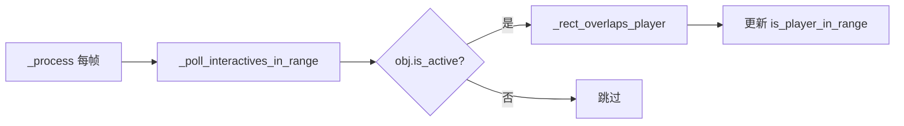
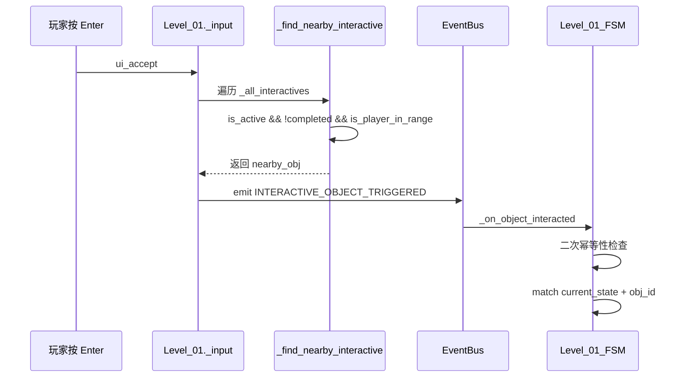

# HackathonGame 关卡技术架构报告（叙事驱动版）

> **目标读者**：关卡设计师 / 下游 AI 关卡设计助手
> **更新日期**：2026-06-10
> **引擎版本**：Godot 4.6 (GL Compatibility, GDScript)
> **项目版本**：v0.3.1（SmoothCamera 重构为玩家子组件 + 摄像机频闪修复 + EventBus 简化）

---

## 1. 项目元信息

| 属性 | 值 |
|---|---|
| 项目名称 | HackathonGame |
| 类型 | 2D 横向叙事探索游戏（类空洞骑士） |
| 屏幕分辨率 | 1280×720，canvas_items 拉伸 |
| 主场景 | `res://Global/MainEntry.tscn`（正式入口） |
| 自测场景 | `res://LevelModule/SelfTest/LevelTest.tscn` |
| 3 个 Autoload | `GlobalDefine`、`EventBus`、`GameManager` |
| 运行模式 | `FORMAL`（正式）/ `SELF_TEST`（自测） |

---

## 2. 系统总览

### 2.1 分层架构

```
┌──────────────────────────────────────────────────────────┐
│ 入口层                                                   │
│   MainEntry.gd / .tscn   (正式入口，emit GAME_START)     │
├──────────────────────────────────────────────────────────┤
│ 关卡控制层（叙事驱动）                                    │
│   Level_01.gd            (关卡主控/状态调度/叙事编排)     │
│   ├── Level_01_SceneBuilder.gd   (地形/交互物/UI 构建)  │
│   ├── Level_01_FSM.gd            (7 态叙事状态机)        │
│   ├── Level_01_UIBuilder.gd      (Canvas UI 纯代码构建)  │
│   └── InteractiveObject.gd       (交互物基类 Area2D)     │
├──────────────────────────────────────────────────────────┤
│ 通用模块层                                               │
│   SmoothCamera.gd/.tscn  (死区+lerp+lookahead 摄像机)   │
│   ※ 玩家预制体子节点，关卡只配置 limit 参数              │
├──────────────────────────────────────────────────────────┤
│ 角色层                                                   │
│   Player_Warrior (.tscn)   - CharacterBody2D             │
│   Enemy_Slime   (.tscn)    - CharacterBody2D             │
│   TestRunnerCharacter      - SubViewport 预览用           │
├──────────────────────────────────────────────────────────┤
│ 数据配置层（纯 Resource，不挂节点）                        │
│   LevelConfig.gd  →  Level01Config.tres   (关卡数值)      │
│   Level01Data.gd →  Level01Data.tres      (关卡叙事文本)  │
│   PlayerConfig / EnemyConfig / SkillConfig (.tres)        │
├──────────────────────────────────────────────────────────┤
│ 基础设施层（Autoload）                                   │
│   GlobalDefine   (枚举/碰撞层常量/事件名常量)              │
│   EventBus       (跨模块唯一事件通信通道)                  │
│   GameManager    (player_ref/current_level/enemy_list)    │
└──────────────────────────────────────────────────────────┘
```

### 2.2 核心设计原则

1. **叙事驱动**：关卡 = 状态机 + 交互物 + 文案数据。设计师只需要编辑 `.tres` 与子类 `.gd`，不必碰核心系统。
2. **代码构建场景**：地形、墙壁、UI 全部用 `_create_static_body()` / `_create_interactive()` / `Level_01_UIBuilder` 等代码 API 创建，关卡 `.tscn` 只挂脚本与资源引用。
3. **事件总线唯一通信**：跨模块通信全部走 `EventBus.emit/subscribe`，严禁跨层直接 `get_node()`。
4. **碰撞层语义化**：所有 `collision_layer/mask` 必须用 `GlobalDefine.Collision.*` 常量，禁止写数字。
5. **数据驱动前置逻辑**：交互物之间的解锁条件（如"床交互≥4次解锁电脑"）由主控层布尔判定 + `is_active` 控制，不硬编码在 FSM 中。

---

## 3. 全局系统接口（强制约束）

### 3.1 `GlobalDefine` 常量（不可修改）

```gdscript
# 碰撞层（必须使用常量，禁止硬编码数字）
class Collision:
    const TERRAIN  := 1   # 地形
    const ENEMY    := 2   # 敌人
    const PLAYER   := 4   # 玩家
    const INTERACT := 8   # 交互物（InteractiveObject 用 layer=0 + mask=PLAYER）

# 事件名（统一管理，避免拼写错误）
class EventName:
    # 玩家
    const PLAYER_SPAWNED      = "player_spawned"
    const PLAYER_DIED         = "player_died"
    const PLAYER_HURT         = "player_hurt"
    const PLAYER_ATTACK_HIT   = "player_attack_hit"
    const PLAYER_STATE_CHANGED = "player_state_changed"
    # 敌人
    const ENEMY_SPAWNED       = "enemy_spawned"
    const ENEMY_DIED          = "enemy_died"
    const ENEMY_HURT          = "enemy_hurt"
    const ENEMY_DETECTED      = "enemy_detected"
    # 游戏
    const GAME_START          = "game_start"
    const GAME_PAUSE          = "game_pause"
    const GAME_RESUME         = "game_resume"
    const GAME_OVER           = "game_over"
    const LEVEL_LOADED        = "level_loaded"
    const LEVEL_COMPLETE      = "level_complete"
    # 交互
    const INTERACTIVE_OBJECT_TRIGGERED = "interactive_object_triggered"
    # 伤害
    const DAMAGE_APPLIED      = "damage_applied"
    const HEALTH_CHANGED      = "health_changed"

# 玩家/敌人/伤害/运行模式枚举（IDLE/RUN/JUMP/...）
enum PlayerState { IDLE, RUN, JUMP, FALL, DASH, ATTACK, SKILL, HURT, DEAD }
enum EnemyState  { IDLE, PATROL, CHASE, ATTACK, HURT, DEAD }
enum DamageType  { PHYSICAL, MAGIC, TRUE_DAMAGE }
enum RunMode     { FORMAL, SELF_TEST }
```

### 3.2 `EventBus` API

```gdscript
EventBus.subscribe(event_name: String, node: Node, method: String)
EventBus.unsubscribe(event_name: String, node: Node)
EventBus.unsubscribe_all(node: Node)            # 清除某节点全部订阅
EventBus.emit(event_name: String, data: Dictionary)
EventBus.emit_deferred(event_name: String, data: Dictionary)
```

> **v0.3.1 变更**：`subscribe` 内部自动清理逻辑已简化。节点退出场景树时（`tree_exited`），回调统一调用 `unsubscribe_all(node)` 清除该节点的所有事件订阅，不再区分单个事件/全部清理两条路径。`_on_subscriber_tree_exited(node, _event_name)` 第二个参数已改为占位符（不再使用）。

**关卡关键事件 data 字典约定**：

| 事件 | data |
|---|---|
| `LEVEL_LOADED` | `{"level": self}`（LevelBase 末尾自动 emit） |
| `LEVEL_COMPLETE` | `{"level": self, "next_level": "res://..."}`（关卡结束 emit） |
| `INTERACTIVE_OBJECT_TRIGGERED` | `{"object_id": "box"}`（输入层 emit，FSM 消费） |
| `GAME_START` | `{}`（MainEntry 入口 emit） |
| `ENEMY_DIED` | `{"enemy": Node2D, "exp_reward": int}` |
| `PLAYER_DIED` | `{"player": Node2D}` |
| `HEALTH_CHANGED` | `{"target": Node, "current_health": int, "max_health": int}` |

> 设计师新增交互事件时，请用命名空间式字符串（如 `level01.box_interacted`），并在 `Level_01_FSM` 中订阅。

### 3.3 `GameManager` API

```gdscript
var player_ref: Node2D         # 当前玩家（只读）
var current_level: Node        # 当前关卡（LevelBase 写入）
var enemy_list: Array[Node2D]  # 存活敌人

register_player(player)             # LevelBase._setup_player 自动调用
register_enemy(enemy)               # 敌人 _ready 自动调用
unregister_enemy(enemy)             # 敌人 die() 自动调用
get_enemies() -> Array[Node2D]      # 过滤无效引用
get_nearest_enemy(pos) -> Node2D
trigger_game_over() / toggle_pause() / is_self_test() / is_formal()
```

---

## 4. 关卡设计框架

### 4.1 模块划分（4 文件拆分原则）

每个叙事关卡由以下 4 个脚本 + 2 个资源 + 1 个场景组成：

| 模块 | 文件模式 | 职责 | 依赖 |
|------|---------|------|------|
| **主控** | `Level_XX.gd` | 生命周期/输入分发/叙事编排/摄像机/玩家控制 | LevelBase, EventBus, GameManager |
| **场景构建** | `Level_XX_SceneBuilder.gd` | 地形/交互物/出生点/Canvas 挂载 | 主控的 `_create_*` 方法 |
| **状态机** | `Level_XX_FSM.gd` | 状态调度 + 交互分发 + 幂等性防线 | 主控的公共方法 |
| **UI 构建** | `Level_XX_UIBuilder.gd` | CanvasLayer 下所有 UI 纯代码构建 | 主控的 UI 引用字段 |
| **关卡数值** | `LevelXXConfig.tres` | 地图尺寸/摄像机边界/出生点/背景色 | LevelConfig.gd |
| **关卡叙事** | `LevelXXData.tres` | 所有文案/对话/状态分支文本 | LevelXXData.gd |
| **场景文件** | `Level_XX.tscn` | 最小化：只挂脚本与资源引用 | — |

**模块间调用规则**：

```
SceneBuilder ──创建──▶ 主控的交互物/地形字段
FSM          ──调用──▶ 主控的公共方法（_show_narrative, _freeze_player 等）
UIBuilder    ──写入──▶ 主控的 UI 引用字段（_narrative_panel 等）
主控         ──读取──▶ Config/Data 资源
```

> **严格约束**：FSM 和 SceneBuilder 之间不直接通信，一切通过主控中转。

### 4.2 核心机制

#### 4.2.1 交互物检测与触发

交互物检测采用**双重保障**机制：

1. **Area2D 信号**（`body_entered/exited`）—— 理想路径，帧精度
2. **轮询检测**（`_poll_interactives_in_range`）—— 兜底路径，解决 `_ready` 时序与 `collision_layer` 不匹配



输入触发流程：



#### 4.2.2 叙事面板生命周期

```
_show_narrative(text)
  ├── _is_interacting = true, _narrative_open = true
  ├── _freeze_player(true)
  ├── panel.show(), text = text
  ├── await 0.3s（防误触）
  ├── while _narrative_open && timeout:
  │     等待 _narrative_enter_pressed（由 _input 设置）
  ├── panel.hide()
  ├── _freeze_player(false)
  ├── _narrative_open = false, _is_interacting = false
  └── callback.call()（如有）
```

> **关键**：`_narrative_enter_pressed` 标志由 `_input` 在 `_narrative_open` 分支设置，而非依赖 `Input.is_action_just_pressed`（后者在 await 间隔中不可靠）。

#### 4.2.3 交互物前置解锁

交互物之间的解锁关系通过主控层的布尔判定 + `InteractiveObject.is_active` 控制：

```gdscript
# 示例：床交互≥4次解锁电脑
func _try_unlock_computer() -> void:
    if sleep_count < 4: return
    if _computer_node.is_active: return
    _computer_node.is_active = true

# 调用时机：每次睡眠循环结束后
func _trigger_sleep_cycle():
    ...
    sleep_count += 1
    await _show_narrative(sleep_text)
    _try_unlock_computer()
    ...
```

**设计规范**：
- 初始 `is_active = false` 在 `SceneBuilder._build_interactives()` 中设置
- 解锁条件判断放在主控的独立方法中（`_try_unlock_*`）
- FSM 不需要关心解锁逻辑——未解锁的交互物 `is_active=false`，`_find_nearby_interactive` 自动跳过

#### 4.2.4 睡眠循环机制

```
_trigger_sleep_cycle()
  ├── _freeze_player(true)
  ├── 渐黑动画 1s
  ├── await _show_narrative(sleep_text)
  ├── _try_unlock_computer()
  ├── _freeze_player(true)  （叙事解冻后重新冻结，渐亮期间保持）
  ├── _sleep_fading = true  （防止 _process 误清交互锁）
  ├── 渐亮动画 1s
  └── 回调: _freeze_player(false), _safe_end_interaction(), bed.reset_completed()
```

> **`_sleep_fading` 标志**：睡眠渐变期间 `_process` 的防御性自愈逻辑不清除 `_is_interacting`，防止动画期间交互锁被误杀。

### 4.3 数据流转

#### 4.3.1 完整交互数据流

```
玩家按 Enter
  └─▶ Level_01._input(event)
        ├─ 叙事打开中 → _narrative_enter_pressed = true → return
        ├─ IDE_CHAT → _render_next_chat_line() → return
        ├─ 冻结/冷却中 → 防御性自愈检查 → return
        └─ 常规路径:
              └─▶ _find_nearby_interactive()
                    └─ 遍历 _all_interactives: is_active && !completed && is_player_in_range
              └─▶ EventBus.emit(INTERACTIVE_OBJECT_TRIGGERED, {object_id})
                    └─▶ _on_object_interacted(data)
                          └─▶ _run_safely(func(): _fsm.handle_interaction(obj_id))
                                └─▶ match current_state + obj_id
```

#### 4.3.2 二次幂等性防线

```
InteractiveObject.completed（第一防线，_find_nearby_interactive 过滤）
    +
FSM 入口 obj_ref.completed（第二防线，handle_interaction 顶部检查）
    =
确保玩家在叙事面板读完后再次按 Enter 不会重复触发剧情
```

设计师在 FSM 中**必须**先调 `level._mark_interaction_completed(obj_id)` 再做副作用。

### 4.4 SmoothCamera 通用摄像机

**路径**：`res://PlayerModule/Formal/SmoothCamera.gd` + `SmoothCamera.tscn`

> **v0.3.1 架构变更**：SmoothCamera 从 `LevelModule/Common/` 迁移至 `PlayerModule/Formal/`，并作为 `Player_Warrior.tscn` 的子节点预制。关卡不再创建/升级 Camera2D，只负责通过 `_setup_camera_limits()` 配置 limit 参数。

**算法**：死区 + lerp + lookahead 混合

```
每帧 _physics_process（与玩家物理帧同步，避免渲染帧/物理帧错位导致颤动）:
  1. 读取 _target.global_position（玩家）
  2. 计算 _cam_offset = target_pos - cam_pos
  3. X 轴 lookahead 决策（不设硬死区）:
     - 估算玩家水平速度 player_vx = target_pos.x - _last_target_x
     - 转向检测: player_vx 方向与残留 _lookahead_x 方向相反时立即清零（根除反向颤动）
     - |player_vx| > 0.1 → 按 sign(vx) * lookahead_offset 平滑插值
     - player_vx≈0 → lookahead 衰减为 0（lookahead 本身提供软死区效果）
     - 硬死区会导致玩家反向穿越边界时产生"锁止→猛跳→锁止"振荡，故 X 轴不设死区
  4. Y 轴死区:
     - |offset.y| < deadzone → Y 轴不移动（垂直方向保留死区避免上下微抖）
     - |offset.y| ≥ deadzone → Y 轴跟随（垂直方向不需要 lookahead）
  5. lerp 插值: new_pos = cam_pos.lerp(target_with_lookahead, clamp(lerp_speed * delta, 0, 1))
  6. clamp 到 limit 边界（FIXED_CENTER 模式，考虑视口半宽/半高）
  7. 赋值 camera.global_position
```

**预制体架构**：

```
Player_Warrior.tscn
  ├── Sprite (AnimatedSprite2D)
  └── SmoothCamera (Camera2D, 子节点实例)
        └── script = SmoothCamera.gd
        └── set_as_top_level(true)  ← _ready 自动设置，脱离父节点 transform 干扰
        └── position_smoothing_enabled = false  ← 禁用引擎内置平滑，避免与脚本 lerp 双重插值
        └── _physics_process  ← 与玩家 CharacterBody2D 同步
        └── _auto_bind_target()  ← 优先 owner，fallback 到 GameManager.player_ref
```

**初始化时序**：

```
Player_Warrior._ready() → SmoothCamera 作为子节点随玩家实例化
  → SmoothCamera._ready()
    → set_as_top_level(true)
    → position_smoothing_enabled = false
    → anchor_mode = DRAG_CENTER
    → make_current()
    → set_process(false), set_physics_process(true)
    → _auto_bind_target()  ← 自动绑定 owner(Player_Warrior) 或 GameManager.player_ref
    → 安全默认值: limit_right/bottom 防止负值导致 clamp 短路

Level_01._on_ready() → _setup_camera_limits()
  → player.get_node_or_null("SmoothCamera")
  → cam.limit_left/right/top/bottom = level_config.camera_limit_*
  → cam.bind_target(player)  ← 立即对齐到玩家位置，避免开局抖动
```

> **v0.3.1 修复**：旧架构中 `LevelBase._setup_camera()` 在 `_setup_player()` 之前执行，摄像机挂载位置不一致导致频闪。新架构将摄像机作为玩家预制体子节点，彻底消除时序问题。`LevelBase._setup_camera()` 现为空实现（pass）。

---

## 5. 关卡系统核心接口

### 5.1 `LevelBase` 基类（`res://LevelModule/Formal/LevelBase.gd`）

**继承链**：`Node2D` → `LevelBase` → `Level_01`（子类）

**导出字段**：

```gdscript
@export var level_config: LevelConfig = null
@export var enemy_spawn_points: Array[Marker2D] = []
@export var player_spawn_point: Marker2D = null
```

**生命周期（严格顺序，禁止在子类 `_ready` 中重做）**：

```
_ready()
├── _apply_config()          # 应用 LevelConfig.bg_color
├── _setup_camera()          # 空实现（pass）— 摄像机由玩家预制体持有
├── _setup_player()          # 自动 instantiate Player_Warrior.tscn（含 SmoothCamera 子节点）
├── _setup_enemies()         # 遍历 enemy_spawn_points 调 _spawn_enemy_at()
├── _setup_triggers()        # 虚函数
├── GameManager.current_level = self
├── EventBus.emit(LEVEL_LOADED, {"level": self})
└── _on_ready()              # 【子类入口】必须先 super._on_ready()
```

> **v0.3.1 变更**：`_setup_camera()` 不再创建 Camera2D。摄像机作为 `Player_Warrior.tscn` 的子节点（`SmoothCamera.tscn` 实例）随玩家实例化。子类通过 `_setup_camera_limits()` 配置 limit 参数即可。

**子类公共方法**（开箱即用）：

```gdscript
# 1. 静态地形（矩形 StaticBody2D + ColorRect）
create_ground(pos: Vector2, size: Vector2, color: Color = gray) -> StaticBody2D
create_wall(pos: Vector2, size: Vector2, color: Color = gray) -> StaticBody2D
# 内部 collision_layer = GlobalDefine.Collision.TERRAIN

# 2. 敌人实例化
spawn_enemy(enemy_scene_path: String, spawn_pos: Vector2) -> Node2D

# 3. 子类工具（建议复用 Level_01.gd 的私有方法实现）
get_or_create_child(node_name, type) -> Node
create_static_body(name, pos, size, color) -> StaticBody2D
create_interactive(name, obj_id, pos, size) -> InteractiveObject
add_physics_blocker(parent, size) -> void   # 在 InteractiveObject 上挂不可见碰撞体
```

**虚函数（子类重写点）**：

```gdscript
_on_ready()                         # 关卡入口（先 super）
_spawn_enemy_at(spawn_point) -> Node2D  # 标记点系统（当前未用，Level_01 改用 SceneBuilder）
_setup_triggers()                   # 触发器（当前未用）
```

---

### 5.2 `LevelConfig` 资源（关卡数值）

```gdscript
class_name LevelConfig extends Resource

@export_group("关卡信息")
@export var level_name: String = "未命名关卡"
@export var level_id: String = ""
@export var bgm_resource: AudioStream = null
@export var bg_color: Color = Color(0.1, 0.1, 0.2)

@export_group("摄像机")
@export var camera_limit_left: int = -10000
@export var camera_limit_right: int = 10000
@export var camera_limit_top: int = -10000
@export var camera_limit_bottom: int = 10000

@export_group("重生点")
@export var spawn_point: Vector2 = Vector2(100, 500)
```

### 5.3 `Level01Data` 资源（叙事文案）

```gdscript
class_name Level01Data extends Resource

@export_category("Obstacle Narrative")
@export_multiline var obstacle_1_text: String
@export_multiline var obstacle_2_text: String

@export_category("Bedroom Detail Objects")
@export_multiline var notice_text: String
@export_multiline var thermos_text: String

@export_category("Bed Sleep Cycles")
@export var sleep_texts: Array[String]    # 多次睡眠循环使用

@export_category("AI IDE Dialogues")
@export var ide_speakers: Array[String]   # "System" / "AI" / "Ming"
@export_multiline var ide_texts: Array[String]

@export_category("Phone Climax")
@export_multiline var phone_sender: String
@export_multiline var phone_content: String
@export_multiline var climax_monologue: String
```

> **新关卡建议**：照搬这个结构为 `Level02Data.gd` / `.tres`，避免把文案散落到 `.gd` 中。

---

## 6. 交互物系统 `InteractiveObject`

### 6.1 节点类型与碰撞层

- 节点类型：`Area2D`
- `collision_layer = 0`（不参与物理碰撞）
- `collision_mask  = GlobalDefine.Collision.PLAYER`（仅检测玩家）
- 内部通过 `body_entered / body_exited` 信号 + `_poll` 轮询双重判定玩家是否进入范围

### 6.2 导出字段

```gdscript
@export var object_id: String = ""         # 必须唯一："box" / "clothes" / "bed" / ...
@export var is_active: bool = true         # false 时玩家进入不显示提示，不可交互
@export var prompt_text: String = "按 Enter 交互"
@export var allow_repeat: bool = false     # true 时可重复交互（床、镜子等）
```

### 6.3 内部状态机

```
is_active=false     → 玩家进入不显示提示，_find_nearby_interactive 跳过
completed=false     → 黄字呼吸闪烁 "按 Enter 交互"
completed=true      → 灰字静态 "已完成 ✓"
allow_repeat=true   → 触发完成后可调 reset_completed() 重置
```

### 6.4 公共方法

```gdscript
mark_completed()    # 标记完成（幂等性）
reset_completed()   # 仅 allow_repeat=true 才生效
set_active(bool)    # 启用/禁用并隐藏提示
freeze_monitoring(frozen: bool)  # 冻结/解冻时控制 monitoring，防止 body_exited 误触发
check_player_in_range(player: Node2D)  # 轮询式玩家检测（AABB）
```

### 6.5 信号

```gdscript
signal player_entered
signal player_exited
```

> **关键设计**：交互物**不**自己处理 `ui_accept` 输入。`_input` 由 `Level_01` 统一捕获后通过 `EventBus.emit(INTERACTIVE_OBJECT_TRIGGERED, {object_id})` 派发到 FSM。这一设计解决了"动态 `_ready` 创建的节点 `_input()` 不可靠"的问题。

---

## 7. 关卡主控 `Level_01` 拆解

### 7.1 文件结构（拆分原则）

| 文件 | 职责 | 行数参考 |
|---|---|---|
| `Level_01.gd` | 主控/状态调度/输入/玩家控制/叙事编排/Glitch 终局 | ~670 |
| `Level_01_SceneBuilder.gd` | 地形 + 交互物 + 出生点 + Canvas UI 挂载 | ~84 |
| `Level_01_FSM.gd` | 7 态叙事状态机 + 交互处理 | ~118 |
| `Level_01_UIBuilder.gd` | SleepOverlay / NarrativePanel / IdeUI / GlitchOverlay | ~205 |
| `InteractiveObject.gd` | 交互物基类（可被新关卡复用） | ~177 |
| `SmoothCamera.gd` | 通用死区+lerp+lookahead 摄像机 | ~143 |
| `SmoothCamera.tscn` | Camera2D 预制场景（Player_Warrior 子节点） | ~7 |

### 7.2 7 态叙事状态机（`Level_01.LevelState`）

```gdscript
enum LevelState {
    LIVING_ROOM,        # 客厅：纸箱阻塞
    CORRIDOR,           # 走廊：衣服阻塞
    BEDROOM,            # 卧室：床（多次睡眠循环）+ 电脑（需前置解锁）
    IDE_CHAT,           # AI IDE 对话
    IDE_PREVIEW,        # SubViewport 预览 → 触发崩溃
    PHONE_RINGING,       # 手机震动 + 接听
    GLITCH_TRANSIT       # 终局：glitch 着色器 → emit LEVEL_COMPLETE
}
```

**状态流转图**：

```
                     ┌──────────────┐
   [进入关卡] ───▶    │ LIVING_ROOM  │ ── 交互 box ──▶ CORRIDOR
                     └──────────────┘

                     ┌──────────────┐
                     │   CORRIDOR   │ ── 交互 clothes ──▶ BEDROOM
                     └──────────────┘

   ┌──────────────────────────────────────────────────────────────┐
   │ BEDROOM                                                      │
   │   ── 交互 bed (×N)       ──▶ 睡眠叙事循环                    │
   │   ── bed 交互≥4次后       ──▶ 电脑解锁 (is_active=true)      │
   │   ── 交互 computer       ──▶ IDE_CHAT                       │
   │   ── 交互 notice/thermos ──▶ 一次性叙事                      │
   └──────────────────────────────────────────────────────────────┘

   IDE_CHAT ── 对话全部渲染完 ──▶ IDE_PREVIEW
   IDE_PREVIEW ── TestRunner 出界/8s超时 ──▶ PHONE_RINGING
   PHONE_RINGING ── 交互 phone ──▶ GLITCH_TRANSIT
   GLITCH_TRANSIT ── 交互 bed ──▶ 终局链 → emit LEVEL_COMPLETE
```

### 7.3 入口初始化（`Level_01._on_ready`）

```gdscript
func _on_ready() -> void:
    super._on_ready()

    if not level_config:
        level_config = load("res://DataConfig/Level/Level01Config.tres") as LevelConfig
        _apply_config()
    if not level_data:
        level_data = load("res://DataConfig/Level/Level01Data.tres") as Level01Data

    var builder = Level_01_SceneBuilder.new(self)
    builder.build_all()           # 地形/交互物/出生点/Canvas UI

    # SmoothCamera 已在 Player_Warrior.tscn 里预制为子节点，
    # 这里只需要把 level_config 的 limit 参数传给玩家身上的 SmoothCamera
    _setup_camera_limits()

    _cache_ui_refs()              # 把 UI 子节点缓存到私有字段
    _restrict_player_mechanics()  # 关卡禁用跳跃/攻击/冲刺（叙事期）

    # 初始化交互物统一列表（SceneBuilder 已设置 is_active 初始值）
    _all_interactives = [_obstacle_box, _obstacle_clothes, _bed_node,
                         _computer_node, _phone_node, _notice_node, _thermos_node]

    EventBus.subscribe(GlobalDefine.EventName.INTERACTIVE_OBJECT_TRIGGERED, self, "_on_object_interacted")
    _fsm = Level_01_FSM.new(self)
    _ensure_player_collision_layer()
    set_process(true)             # 启用 _process：冷却递减 + 交互物轮询
```

### 7.4 SceneBuilder 调用顺序

```
build_all()
├── _build_terrain()        # 地面 + 左墙 + 右墙
├── _build_interactives()   # box / clothes / notice / thermos / computer / phone / bed
├── _build_spawn_points()   # PlayerSpawnPoint Marker2D
└── _build_canvas_ui()      # CanvasLayerUI (layer=2) → UIBuilder.build_all()
```

### 7.5 关卡 1 当前地图参数

**地图尺寸**：1920×720（1.5 屏）

**摄像机边界**（Level01Config.tres）：

| 参数 | 值 |
|---|---|
| camera_limit_left | -50 |
| camera_limit_right | 1920 |
| camera_limit_top | -500 |
| camera_limit_bottom | 1200 |

> **v0.3.1 变更**：camera_limit_top 从 -100 调整为 -500，camera_limit_bottom 从 750 调整为 1200，以适配更大的垂直活动空间。

| 元素 | 坐标 | 尺寸 | 所属区域 |
|------|------|------|----------|
| MainGround | (960, 620) | 1920×40 | — |
| LeftWall | (-10, 360) | 20×720 | — |
| RightWall | (1930, 360) | 20×720 | — |
| Obstacle_Box | (350, 560) | 120×80 | 客厅 |
| Obstacle_Clothes | (750, 560) | 100×80 | 走廊 |
| Notice | (1100, 570) | 40×40 | 卧室 |
| Thermos | (1280, 580) | 30×40 | 卧室 |
| Computer | (1470, 560) | 100×80 | 卧室 |
| Phone | (1660, 580) | 50×40 | 卧室 |
| Bed | (1830, 570) | 160×60 | 卧室 |

### 7.6 UIBuilder 生成的 Canvas 节点树

```
CanvasLayerUI (CanvasLayer, layer=2, PROCESS_MODE_ALWAYS)
├── SleepOverlay        (ColorRect, 全屏黑渐变)
├── NarrativePanel      (Panel 1280×200, RichTextLabel)
├── IdeUI               (Control, 标题栏+ChatPanel+ViewportContainer+StatusBar)
│   ├── Background
│   ├── TitleBar / TitleLabel
│   ├── ChatPanel / TabLabel
│   ├── ChatWindow        (RichTextLabel, BBCode)
│   ├── PreviewPanel / PreviewTab
│   ├── ViewportContainer
│   │   └── MiniViewport   (SubViewport, 600×400)
│   └── StatusBar
└── GlitchOverlay       (ColorRect + ShaderMaterial)
```

### 7.7 玩家控制工具

```gdscript
_restrict_player_mechanics()    # 关卡禁用 can_jump/dash/attack/skill
_restore_player_mechanics()     # 恢复
_freeze_player(true|false)      # 物理冻结 + 输入冻结 + 切到 IDLE + 同步交互物 monitoring
```

### 7.8 关键流程 API

| API | 触发 | 用途 |
|---|---|---|
| `_setup_camera_limits()` | `_on_ready` | 查找玩家子节点 SmoothCamera，配置 limit 参数 + bind_target |
| `_show_narrative(text)` | 任意叙事 | 弹出 NarrativePanel → 等待 Enter → 关闭 |
| `_trigger_sleep_cycle()` | 床 | 渐黑 + 叙事 + 渐亮 + 解锁检测 |
| `_try_unlock_computer()` | 睡眠后 | sleep_count≥4 时解锁电脑 |
| `_enter_ide_mode()` | 电脑 | 显示 IdeUI + 逐行渲染对话 |
| `_start_ide_viewport_preview()` | 对话结束 | SubViewport 加载 MiniTestWorld.tscn |
| `_on_preview_crashed()` | TestRunner 出界/超时 | 崩溃信息 + 启用手机 + 震动 |
| `_start_phone_vibration()` | 终局前置 | 循环 Tween 让手机左右抖动 |
| `_trigger_climax_transition()` | 手机 | 来电消息 + 独白 + glitch 渐强 |
| `_start_glitch_shader_effect()` | 终局 | 2s 内 intensity 0→1 → emit LEVEL_COMPLETE |

---

## 8. 玩家系统（关卡用到的接口）

| 参数 | 默认值（Warrior） |
|---|---|
| `max_health` | 100 |
| `move_speed` | 300.0 |
| `jump_velocity` | -650.0 |
| `dash_speed` / `dash_duration` | 800.0 / 0.2s（期间无敌） |
| `attack_damage` | 25 |
| `attack_range` | 80.0 圆心判定 |
| `hurt_invincible_time` | 1.0s |

**关卡运行时可调用的开关**（`Level_01._restrict_player_mechanics` 用到）：

```gdscript
player.can_jump = false
player.can_dash = false
player.can_attack = false
player.can_skill = false
```

> Level_01 全程禁用战斗，叙事结束后通常不再恢复。

---

## 9. 敌人系统（关卡用到的接口）

- 场景：`res://EnemyModule/Formal/Enemy_Slime.tscn`
- 配置：`res://DataConfig/Enemy/SlimeConfig.tres`
- 关键参数：`max_health=30`, `attack_damage=8`, `detect_range=250`, `wander_radius=80`

**基类 API**：

```gdscript
enemy.take_damage(damage: int, knockback_dir: Vector2 = Vector2.ZERO)
enemy.current_health / max_health / current_state
enemy.config: EnemyConfig
```

> **当前 Level_01 不用任何敌人**（叙事型关卡）。如需战斗型关卡，在 `_build_enemies()` 中调用 `spawn_enemy("res://EnemyModule/Formal/Enemy_Slime.tscn", pos)`。

---

## 10. 碰撞层系统

| 层 | 常量 | 用途 |
|---|---|---|
| **1** | `Collision.TERRAIN` | `StaticBody2D`（地面、墙） |
| **2** | `Collision.ENEMY` | 敌人 |
| **4** | `Collision.PLAYER` | 玩家 |
| **8** | `Collision.INTERACT` | （预留） |

**硬约束**：
- 玩家和敌人之间**不**发生物理碰撞（伤害走代码级 Rect2）
- `InteractiveObject` 必走 Area2D + `monitoring=true` + `mask=PLAYER`
- 所有 StaticBody2D 必须 `collision_layer = GlobalDefine.Collision.TERRAIN`

---

## 11. 物理与坐标约定

| 参数 | 值 |
|---|---|
| 屏幕逻辑分辨率 | 1280×720 |
| 地图宽度规范 | 1.5 屏 = 1920px（当前 Level_01） |
| Y 轴 | 向下为正 |
| 重力 | 1200 px/s² |
| 摄像机锚点 | DRAG_CENTER（SmoothCamera 接管后为死区+lerp 控制） |
| 玩家出生 Y | 550（头顶在地面之上） |
| 地面 Y | 620（厚度 40~80） |
| `create_ground` 的 `pos` | **平台中心**坐标 |
| 平台 Y 推荐阶梯 | 500 / 460 / 420 / 340 / 200 |

---

## 12. 资源加载机制

### 12.1 关键路径

```
关卡:        res://LevelModule/Formal/Level_01.tscn
玩家:        res://PlayerModule/Formal/Player_Warrior.tscn
敌人:        res://EnemyModule/Formal/Enemy_Slime.tscn
HUD:        res://UI/HUD.tscn
入口:        res://Global/MainEntry.tscn
自测关卡:    res://LevelModule/SelfTest/LevelTest.tscn
预览世界:    res://LevelModule/SelfTest/MiniTestWorld.tscn
测试角色:    res://LevelModule/SelfTest/TestRunnerCharacter.tscn

关卡配置:    res://DataConfig/Level/Level01Config.tres
关卡叙事:    res://DataConfig/Level/Level01Data.tres
玩家配置:    res://DataConfig/Player/WarriorConfig.tres
敌人配置:    res://DataConfig/Enemy/SlimeConfig.tres
技能配置:    res://DataConfig/Skill/SlashConfig.tres

交互物:      res://LevelModule/Formal/InteractiveObject.gd
摄像机:      res://PlayerModule/Formal/SmoothCamera.gd + .tscn（玩家预制体子节点）
Shader:     res://LevelModule/Formal/glitch_effect.gdshader
```

### 12.2 美术资产（已导入但未全部使用）

- `res://LevelModule/Background images/` — 4 张 JPG（关卡背景图）
- `res://Assets/Sprites/player Ani/` — 6 张 PNG（玩家动画）

---

## 13. 数据流转机制（核心）

### 13.1 玩家按下 Enter 触发交互的完整数据流

```
玩家按 Enter
  └─▶ Level_01._input(event)
        ├─ 叙事打开? → _narrative_enter_pressed = true → return
        ├─ IDE_CHAT? → _render_next_chat_line() → return
        ├─ 冻结/冷却? → 防御性自愈检查 → return
        └─ 常规路径:
              └─▶ _find_nearby_interactive() 遍历 _all_interactives
                    └─▶ 找到 is_active && !completed && is_player_in_range
              └─▶ EventBus.emit(INTERACTIVE_OBJECT_TRIGGERED, {object_id})
                    └─▶ Level_01._on_object_interacted(data)
                          └─▶ _run_safely(func(): _fsm.handle_interaction(obj_id))
                                └─▶ match current_state + obj_id
```

### 13.2 二次幂等性防线

`InteractiveObject.completed`（第一防线，`_find_nearby_interactive` 过滤）+ FSM 入口再判定 `obj_ref.completed`（第二防线），确保玩家在叙事面板读完后再次按 Enter 不会重复触发剧情。设计师在 FSM 中**必须**先调 `level._mark_interaction_completed(obj_id)` 再做副作用。

### 13.3 状态机的副作用链路

```
_handle_box():
  level._mark_interaction_completed("box")
  level._show_narrative(text, callback)
    → callback():
          level._clear_obstacle(_obstacle_box)   # 物理禁用 + 淡出 + queue_free
          level.current_state = CORRIDOR

_handle_bed():
  level._trigger_sleep_cycle()
    → sleep_count += 1
    → 渐黑 + 叙事 + 渐亮
    → _try_unlock_computer()  # sleep_count≥4 时解锁
    → bed.reset_completed()   # 允许重复交互
```

---

## 14. 模块依赖关系

```
LevelBase (基类)
  ├── _apply_config       → LevelConfig
  ├── _setup_camera       → GameManager.player_ref
  ├── _setup_player       → Player_Warrior.tscn
  ├── _setup_enemies      → InteractiveObject / Enemy_*.tscn
  └── EventBus  ←→ 全局

Level_01 (子类)
  ├── extends LevelBase
  ├── _on_ready
  │     ├── Level_01_SceneBuilder.build_all
  │     │     └── Level_01_UIBuilder.build_all
  │     ├── _setup_camera_limits → Player_Warrior.SmoothCamera (配置 limit)
  │     ├── _all_interactives 初始化
  │     ├── EventBus.subscribe(INTERACTIVE_OBJECT_TRIGGERED)
  │     └── Level_01_FSM.new(self)
  ├── _input
  │     └── EventBus.emit(INTERACTIVE_OBJECT_TRIGGERED)
  ├── _show_narrative / _trigger_sleep_cycle / _enter_ide_mode
  │     └── Level01Data (文案)
  └── _start_glitch_shader_effect
        └── EventBus.emit(LEVEL_COMPLETE)

SmoothCamera (玩家子组件)
  ├── extends Camera2D (Player_Warrior.tscn 子节点预制)
  ├── set_as_top_level(true) → 脱离父节点 transform 干扰
  ├── _physics_process: 死区+lerp+lookahead (与物理帧同步)
  ├── _auto_bind_target() → owner / GameManager.player_ref
  └── bind_target(player) → 立即对齐到玩家位置

InteractiveObject
  ├── Area2D + body_entered/exited + check_player_in_range(轮询)
  ├── 渲染提示 Label
  └── 与 Level_01._input 解耦（设计关键点）

FSM
  ├── 引用 level（Level_01）
  └── 状态机 + 幂等性
```

---

## 15. 关卡设计规范

### 15.1 关卡编辑标准化流程

| 步骤 | 操作 | 输出 |
|------|------|------|
| 1 | 创建 `LevelXXConfig.tres` + `LevelXXData.gd` + `LevelXXData.tres` | 数据层 |
| 2 | 创建 4 个脚本文件（主控/SceneBuilder/FSM/UIBuilder） | 逻辑层 |
| 3 | 创建 `Level_XX.tscn`（最小化，只挂脚本与资源） | 场景层 |
| 4 | 在 SceneBuilder 中用代码构建地形和交互物 | 场景内容 |
| 5 | 在 FSM 中定义状态枚举 + 交互分支 | 状态逻辑 |
| 6 | 在 `_on_ready` 末尾初始化 `_all_interactives` | 交互物管理 |
| 7 | 注册到 `MainEntry._load_formal_level()` | 入口集成 |
| 8 | 创建自测场景并验证 | 质量保证 |

### 15.2 命名规则

| 类别 | 规则 | 示例 |
|------|------|------|
| 关卡主控类 | `Level_XX`（PascalCase，下划线后数字编号） | `Level_01`, `Level_02` |
| 关卡脚本文件 | 与类名一致 | `Level_01.gd` |
| SceneBuilder | `Level_XX_SceneBuilder` | `Level_01_SceneBuilder.gd` |
| FSM | `Level_XX_FSM` | `Level_01_FSM.gd` |
| UIBuilder | `Level_XX_UIBuilder` | `Level_01_UIBuilder.gd` |
| 关卡配置 | `LevelXXConfig.tres` | `Level01Config.tres` |
| 关卡叙事 | `LevelXXData.gd` + `LevelXXData.tres` | `Level01Data.gd` |
| 关卡场景 | `Level_XX.tscn` | `Level_01.tscn` |
| 交互物 object_id | 小写英文，下划线分隔 | `box`, `clothes`, `phone` |
| 交互物节点名 | PascalCase，类型前缀 | `Obstacle_Box`, `Bed` |
| 地形节点名 | PascalCase，描述性 | `MainGround`, `LeftWall` |
| UI 节点名 | PascalCase | `NarrativePanel`, `SleepOverlay` |
| 事件名 | 命名空间式 | `level01.box_interacted` |
| 私有字段 | 下划线前缀 | `_is_interacting`, `_phone_node` |

### 15.3 资源管理约束

| 约束 | 说明 |
|------|------|
| `.tscn` 最小化 | 关卡 `.tscn` 只挂脚本与资源引用，不拖拽节点 |
| 代码构建场景 | 地形、墙壁、交互物、UI 全部用代码 API 创建 |
| 文案不进 `.gd` | 所有文案必须放在 `LevelXXData.tres`，禁止硬编码 |
| 数值不进 `.gd` | 地图尺寸、摄像机边界、出生点等放在 `LevelXXConfig.tres` |
| `collision_layer/mask` 常量化 | 必须用 `GlobalDefine.Collision.*`，禁止硬编码数字 |
| 事件名常量化 | 必须用 `GlobalDefine.EventName.*`，禁止字符串字面量 |
| `.uid` 同步 | 修改 `.gd` 文件后，检查 `.tscn` 中的 UID 引用是否与 `.uid` 文件一致 |
| 通用模块复用 | `SmoothCamera.gd/.tscn` / `InteractiveObject.gd` 不复制，直接引用原路径 |

### 15.4 性能指标要求

| 指标 | 要求 | 说明 |
|------|------|------|
| 交互物数量 | ≤ 10 | 超过 10 个时 `_poll_interactives_in_range` 每帧遍历开销增大 |
| 地图宽度 | ≤ 3 屏（3840px） | 超过后摄像机 clamp 计算与渲染范围需额外优化 |
| 同时活跃 Tween | ≤ 5 | 避免动画系统过载 |
| `_process` 轮询 | 仅交互物检测 + cooldown | 禁止在 `_process` 中做资源加载或场景实例化 |
| 叙事面板 await 间隔 | ≥ 50ms | `_show_narrative` 轮询间隔不低于 50ms，避免空转 |
| `queue_free` 延迟 | 0.5s 淡出后 | 障碍物清除必须先淡出再 `queue_free`，避免闪烁 |
| SubViewport 尺寸 | ≤ 600×400 | IDE 预览 SubViewport 不超过此尺寸 |

### 15.5 验收标准

| 检查项 | 通过条件 |
|--------|----------|
| Headless 启动 | 零编译错误、零运行时错误 |
| 叙事面板 | 按 Enter 后面板持续显示，再次按 Enter 后关闭，玩家恢复控制 |
| 睡眠循环 | 睡眠结束后玩家可自由移动，bed 可重复交互 |
| 前置解锁 | 未满足条件的交互物不显示提示、不可交互 |
| 摄像机跟随 | SmoothCamera 正常激活，玩家移动时摄像机平滑跟随 |
| 状态机流转 | 7 个状态按设计顺序流转，无跳过或回退 |
| 幂等性 | 已完成的交互物不可再次触发 |
| 事件清理 | 关卡结束时 `EventBus.unsubscribe_all(self)` 已调用 |
| 交互锁自愈 | `_is_interacting` 在异常情况下被 `_process` 防御性清理 |
| Linter 零警告 | 无 SHADOWED_VARIABLE / UNUSED_PARAMETER 等警告 |

---

## 16. 地形/交互物设计参数速查

### 16.1 地形代码示例

```gdscript
# 主地面（1.5 屏宽）
level._create_static_body("MainGround", Vector2(960, 620), Vector2(1920, 40), Color(0.12, 0.12, 0.15))
# 左墙
level._create_static_body("LeftWall", Vector2(-10, 360), Vector2(20, 720), Color(0.1, 0.1, 0.12))
# 右墙
level._create_static_body("RightWall", Vector2(1930, 360), Vector2(20, 720), Color(0.1, 0.1, 0.12))
```

### 16.2 交互物代码示例

```gdscript
# 带物理阻挡的障碍（如纸箱）
var box = level._create_interactive("Obstacle_Box", "box", Vector2(350, 560), Vector2(120, 80))
level._add_physics_blocker(box, Vector2(120, 80))   # 玩家不能穿过
container.add_child(box)

# 可重复交互（如床）
var bed = level._create_interactive("Bed", "bed", Vector2(1830, 570), Vector2(160, 60))
bed.allow_repeat = true
container.add_child(bed)

# 初始禁用的道具（如电脑，需前置解锁）
var computer = level._create_interactive("Computer", "computer", Vector2(1470, 560), Vector2(100, 80))
computer.is_active = false  # SceneBuilder 中设置，主控层通过 _try_unlock_* 解锁
container.add_child(computer)
```

### 16.3 平台 Y 推荐阶梯

| 等级 | Y | 适用 |
|---|---|---|
| LOW | 500 | 略高于地面（一步跳上） |
| MID-LOW | 460 | 需二段跳 |
| MID | 420 | 需冲刺跳 |
| HIGH | 340 | 高难度 |
| VERY_HIGH | 200 | 极限 |

---

## 17. 接口调用示例（设计师 Cookbook）

### 17.1 在新关卡里加一个新交互物

```gdscript
# Level_02_SceneBuilder._build_interactives()
var window = level._create_interactive("Window", "window", Vector2(800, 400), Vector2(80, 60))
container.add_child(window)
```

### 17.2 在 FSM 里处理新交互

```gdscript
# Level_02_FSM.handle_interaction()
match level.current_state:
    Level_02.LevelState.ROOM_A:
        if obj_id == "window":
            _handle_window()
        elif obj_id == "door":
            _handle_door()
```

### 17.3 让玩家进入关卡后弹一段叙事

```gdscript
# Level_02._on_ready 末尾
level._show_narrative("……这里是新关卡的起点。", func():
    print("玩家已读序章")
)
```

### 17.4 让玩家失去能力（叙事期常见）

```gdscript
# 进入卧室时禁用跳跃
level._restrict_player_mechanics()  # 同时禁 jump/dash/attack/skill
```

### 17.5 设置前置解锁条件

```gdscript
# SceneBuilder: 初始禁用
computer.is_active = false

# 主控: 解锁判断
func _try_unlock_computer() -> void:
    if some_condition < THRESHOLD: return
    if _computer_node.is_active: return
    _computer_node.is_active = true
```

### 17.6 加载 SubViewport 预览

```gdscript
# 加载任何 .tscn 到 _mini_viewport
var mini_world = load("res://Path/To/MyMini.tscn").instantiate()
level._mini_viewport.add_child(mini_world)
if mini_world.has_signal("some_event"):
    mini_world.connect("some_event", level._on_some_event)
```

### 17.7 终局切换关卡

```gdscript
# 在 _start_glitch_shader_effect() 末尾
EventBus.emit(GlobalDefine.EventName.LEVEL_COMPLETE, {
    "level": self,
    "next_level": "res://LevelModule/Formal/Level_02.tscn"
})
```

### 17.8 监听敌人死亡以推进剧情

```gdscript
# 在 Level_XX._on_ready 末尾
EventBus.subscribe(GlobalDefine.EventName.ENEMY_DIED, self, "_on_enemy_died")

func _on_enemy_died(data: Dictionary) -> void:
    if GameManager.enemy_list.is_empty():
        level._show_narrative("……终于清完了。", func():
            EventBus.emit(GlobalDefine.EventName.LEVEL_COMPLETE, {...})
        )
```

---

## 18. 功能边界与已知限制

### 18.1 当前可立即使用

- 7 态叙事状态机（LIVING_ROOM → GLITCH_TRANSIT）
- InteractiveObject 交互物系统（带幂等性 + 重复交互 + 前置解锁）
- SmoothCamera 通用摄像机（死区 + lerp + lookahead，玩家预制体子组件）
- Canvas UI 纯代码构建（Narrative / Sleep / IDE / Glitch）
- SubViewport 嵌入预览世界并跨场景通信（`prototype_crashed` 信号）
- Glitch 终局着色器（色相分离 + 噪声 + 渐强）
- EventBus 事件驱动通信（自动清理失效订阅）
- 双运行模式（FORMAL / SELF_TEST）
- LevelConfig（数值）与 LevelData（叙事）分离
- `_all_interactives` 统一管理（消除硬编码重复）

### 18.2 已定义但未完整实现

| 功能 | 现状 | 后续接入点 |
|---|---|---|
| 多关卡切换 | `LEVEL_COMPLETE` 已 emit + 含 `next_level` | 在 `MainEntry` 监听并 `change_scene_to_file()` |
| 玩家重生 | `LevelConfig.spawn_point` 已定义 | `Player_Base` 需要 `respawn()` |
| 敌人标记点 | `enemy_spawn_points` 字段已存在 | 当前 `_spawn_enemy_at()` 返回 null |
| 触发器/门/传送 | `_setup_triggers()` 虚函数 | 建议用 Area2D + `body_entered` |
| 防御/Mana/经验/掉落 | 字段存在 | `Player_Base` 需扩展 |
| BGM | 字段为 null | 接 `.ogg` 资源并 AudioStreamPlayer |
| 伤害数字飘屏 | 无 | 需在 `PlayerBase` 攻击反馈里加 |
| 环境声效交叉渐变 | `_fade_ambient_audio()` 占位接口 | 接入 AudioStreamPlayer 列表 |

### 18.3 已知技术限制

- 敌人数量 > 50 时 `Player_Base._check_enemy_contact()` 可能掉帧（O(n) 每帧 Rect2）
- 地形只支持矩形，斜面/曲线需要自写多边形 CollisionShape
- 单玩家，无存档
- 玩家和敌人不发生物理碰撞（接触伤害走代码）

---

## 19. 附录：文件路径速查

```
项目根目录
├── project.godot                       # 引擎配置
├── TECHNICAL_ARCHITECTURE_REPORT.md    # 本文档
├── Global/                              # 3 个 Autoload + MainEntry
│   ├── GlobalDefine.gd                  # 枚举 + Collision + EventName 常量
│   ├── EventBus.gd                      # 跨模块事件总线
│   ├── GameManager.gd                   # player_ref / enemy_list / 状态
│   └── MainEntry.gd / .tscn             # 正式入口
├── Tools/
│   └── DamageCalculator.gd              # 静态伤害计算
├── UI/
│   ├── TitleScreen.gd / .tscn           # 主菜单
│   └── HUD.gd / .tscn                   # HUD
├── DataConfig/
│   ├── Player/ WarriorConfig (.gd/.tres)
│   ├── Enemy/  SlimeConfig   (.gd/.tres)
│   ├── Skill/  SlashConfig   (.gd/.tres)
│   └── Level/
│       ├── LevelConfig.gd               # 关卡数值基类
│       ├── Level01Config.tres
│       ├── Level01Data.gd               # 关卡叙事基类
│       └── Level01Data.tres
├── PlayerModule/
│   ├── Formal/ PlayerBase.gd + Player_Warrior.gd/.tscn
│   │            SmoothCamera.gd + SmoothCamera.tscn  # 摄像机（玩家子组件）
│   └── SelfTest/ PlayerTest.gd/.tscn
├── EnemyModule/
│   ├── Formal/ EnemyBase.gd + Enemy_Slime.gd/.tscn
│   └── SelfTest/ EnemyTest.gd/.tscn
├── LevelModule/
│   ├── Formal/
│   │   ├── LevelBase.gd                 # 关卡基类（核心 API）
│   │   ├── InteractiveObject.gd         # 交互物基类（核心 API）
│   │   ├── glitch_effect.gdshader       # 终局着色器
│   │   ├── Level_01.gd                  # 关卡主控
│   │   ├── Level_01_SceneBuilder.gd     # 场景构建器
│   │   ├── Level_01_FSM.gd              # 状态机
│   │   ├── Level_01_UIBuilder.gd        # UI 构建器
│   │   └── Level_01.tscn                # 关卡场景（最小化）
│   ├── Common/
│   ├── SelfTest/
│   │   ├── LevelTest.gd/.tscn
│   │   ├── MiniTestWorld.gd/.tscn       # IDE 预览世界
│   │   └── TestRunnerCharacter.gd/.tscn
│   └── Background images/               # 4 张 JPG
└── Assets/Sprites/                      # 玩家动画 6 张 PNG
```

---

**此报告已同步叙事驱动关卡架构（v0.3.1）。关卡设计时请严格遵循：**
1. **代码构建**地形/UI，不在 `.tscn` 拖拽
2. **`.tres` 编辑**文案与数值，不改 `.gd` 写死字符串
3. **事件总线**做跨模块通信，禁止 `get_node()` 跨层
4. **碰撞层常量** `GlobalDefine.Collision.*`，禁止硬编码数字
5. **新关卡 = 4 文件**（主控/SceneBuilder/FSM/UIBuilder）+ 2 资源（Config/Data）+ 1 场景
6. **前置解锁**通过 `is_active` + 主控布尔判定，不硬编码在 FSM
7. **交互物统一管理**通过 `_all_interactives` 数组，新增/移除交互物只改一处
