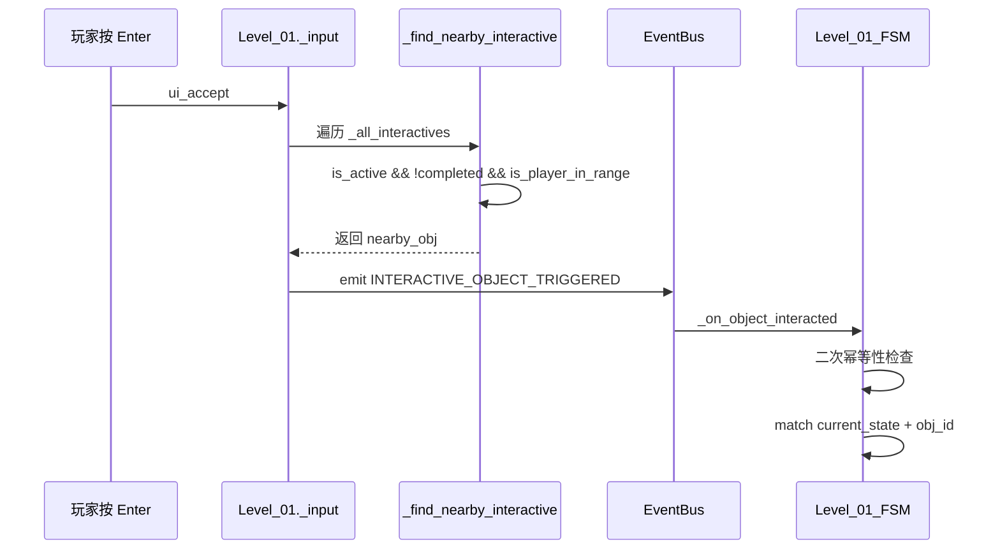

# HackathonGame 关卡技术架构报告（叙事驱动版）

> **目标读者**：关卡设计师 / 下游 AI 关卡设计助手
> **更新日期**：2026-06-10
> **引擎版本**：Godot 4.6 (GL Compatibility, GDScript)
> **项目版本**：v0.6.0（InputManager 全面接管 + 阶段3d 叙事联动 + 测试模块清理）
> **v0.6.0 变更摘要**：
> - InputManager.gd Autoload 全面接管游戏操作输入（attack/dash/skill/accept 信号分发）
> - PlayerBase 迁移至 game_action 信号驱动，_handle_input() 清空攻击/冲刺/技能轮询
> - Level_01 叙事/对话/睡眠/IDE/终局状态全量接入 InputManager.block_input() 联动
> - 删除 9 个测试模块文件（LevelTest/PlayerTest/EnemyTest），保留 MiniTestWorld 生产依赖
> - 清理 PlayerBase 4 个死代码输入方法
>
> **v0.5.0 变更摘要（历史）**：
> - SmoothCamera 从 LevelModule/Common 迁移至 PlayerModule/Formal，预置于3个玩家预制体
> - 根治反向移动颤动（转向清零 + lookahead 去硬边界 + X轴去死区）
> - EventBus tree_exited 改为 unsubscribe_all（全量清理）
> - MainEntry 不再创建 Camera2D/HUD（避免重复/泄漏）
> - InteractiveObject 输入检测统一收归 Level_01

---

## 1. 项目元信息

| 属性 | 值 |
|---|---|
| 项目名称 | HackathonGame |
| 类型 | 2D 横向叙事探索游戏（类空洞骑士） |
| 屏幕分辨率 | 1280×720，canvas_items 拉伸 |
| 主场景 | `res://Global/MainEntry.tscn`（正式入口） |
| 自测场景 | `res://LevelModule/SelfTest/LevelTest.tscn` |
| 4 个 Autoload | `GlobalDefine`、`EventBus`、`GameManager`、`InputManager` |
| 运行模式 | `FORMAL`（正式）/ `SELF_TEST`（自测） |
| 玩家外观 | Player_Warrior / Player_Warrior_Cyber / Player_Warrior_Lingnan |

---

## 2. 系统总览

### 2.1 分层架构

```
┌──────────────────────────────────────────────────────────┐
│ 入口层                                                   │
│   MainEntry.gd / .tscn   (正式入口, emit GAME_START)     │
│   注意: 不再创建 Camera2D 和 HUD (由预制体/关卡接管)      │
├──────────────────────────────────────────────────────────┤
│ 关卡控制层（叙事驱动）                                    │
│   Level_01.gd            (关卡主控/状态调度/叙事编排)     │
│   ├── Level_01_SceneBuilder.gd   (地形/交互物/UI 构建)  │
│   ├── Level_01_FSM.gd            (7 态叙事状态机)        │
│   ├── Level_01_UIBuilder.gd      (Canvas UI 纯代码构建)  │
│   └── InteractiveObject.gd       (交互物基类 Area2D)     │
├──────────────────────────────────────────────────────────┤
│ 角色层                                                   │
│   Player_Warrior (.tscn)   - CharacterBody2D             │
│     └─ SmoothCamera (.tscn/.gd) - 平滑跟随摄像机(内置)    │
│   Player_Warrior_Cyber (.tscn) - 赛博皮肤 + SmoothCamera  │
│   Player_Warrior_Lingnan (.tscn)- 岭南皮肤 + SmoothCamera  │
│   Enemy_Slime   (.tscn)    - CharacterBody2D             │
│   TestRunnerCharacter      - SubViewport 预览用           │
├──────────────────────────────────────────────────────────┤
│ 数据配置层（纯 Resource，不挂节点）                        │
│   LevelConfig.gd  →  Level01Config.tres   (关卡数值)      │
│   Level01Data.gd →  Level01Data.tres      (关卡叙事文本)  │
│   PlayerConfig / EnemyConfig / SkillConfig (.tres)        │
├──────────────────────────────────────────────────────────┤
│ 基础设施层（Autoload）                                   │
│   GlobalDefine   (枚举/碰撞层常量/事件名常量)              │
│   EventBus       (跨模块唯一事件通信通道, 全量tree_exited)  │
│   GameManager    (player_ref/current_level/enemy_list)    │
│   InputManager   (统一输入管理, 信号分发, block/unblock)   │
└──────────────────────────────────────────────────────────┘
```

### 2.2 核心设计原则

1. **叙事驱动**：关卡 = 状态机 + 交互物 + 文案数据。设计师只需要编辑 `.tres` 与子类 `.gd`，不必碰核心系统。
2. **代码构建场景**：地形、墙壁、UI 全部用 `_create_static_body()` / `_create_interactive()` / `Level_01_UIBuilder` 等代码 API 创建，关卡 `.tscn` 只挂脚本与资源引用。
3. **事件总线唯一通信**：跨模块通信全部走 `EventBus.emit/subscribe`，严禁跨层直接 `get_node()`。
4. **碰撞层语义化**：所有 `collision_layer/mask` 必须用 `GlobalDefine.Collision.*` 常量，禁止写数字。
5. **数据驱动前置逻辑**：交互物之间的解锁条件（如"床交互≥4次解锁电脑"）由主控层布尔判定 + `is_active` 控制，不硬编码在 FSM 中。
6. **摄像机归玩家**：SmoothCamera 作为子节点预置于每个玩家预制体内，不再由 LevelBase 或 MainEntry 动态创建。

---

## 3. 全局系统接口（强制约束）

### 3.1 `GlobalDefine` 常量（不可修改）

```gdscript
# 碰撞层（必须使用常量，禁止硬编码数字）
class Collision:
    const TERRAIN  := 1   # 地形
    const ENEMY    := 2   # 敌人
    const PLAYER   := 4   # 玩家
    const INTERACT := 8   # 交互物（InteractiveObject 用 layer=0 + mask=PLAYER）

# 事件名（统一管理，避免拼写错误）
class EventName:
    # 玩家
    const PLAYER_SPAWNED      = "player_spawned"
    const PLAYER_DIED         = "player_died"
    const PLAYER_HURT         = "player_hurt"
    const PLAYER_ATTACK_HIT   = "player_attack_hit"
    const PLAYER_STATE_CHANGED = "player_state_changed"
    # 敌人
    const ENEMY_SPAWNED       = "enemy_spawned"
    const ENEMY_DIED          = "enemy_died"
    const ENEMY_HURT          = "enemy_hurt"
    const ENEMY_DETECTED      = "enemy_detected"
    # 游戏
    const GAME_START          = "game_start"
    const GAME_PAUSE          = "game_pause"
    const GAME_RESUME         = "game_resume"
    const GAME_OVER           = "game_over"
    const LEVEL_LOADED        = "level_loaded"
    const LEVEL_COMPLETE      = "level_complete"
    # 交互
    const INTERACTIVE_OBJECT_TRIGGERED = "interactive_object_triggered"
    # 伤害
    const DAMAGE_APPLIED      = "damage_applied"
    const HEALTH_CHANGED      = "health_changed"

# 玩家/敌人/伤害/运行模式枚举（IDLE/RUN/JUMP/...）
enum PlayerState { IDLE, RUN, JUMP, FALL, DASH, ATTACK, SKILL, HURT, DEAD }
enum EnemyState  { IDLE, PATROL, CHASE, ATTACK, HURT, DEAD }
enum DamageType  { PHYSICAL, MAGIC, TRUE_DAMAGE }
enum RunMode     { FORMAL, SELF_TEST }
```

### 3.2 `EventBus` API

```gdscript
EventBus.subscribe(event_name: String, node: Node, method: String)
EventBus.unsubscribe(event_name: String, node: Node)
EventBus.unsubscribe_all(node: Node)            # 清除某节点全部订阅
EventBus.emit(event_name: String, data: Dictionary)
EventBus.emit_deferred(event_name: String, data: Dictionary)
```

**自动清理机制（v0.5.0 更新）**：

```gdscript
# subscribe() 时自动连接 node 的 tree_exited 信号 (CONNECT_ONE_SHOT)
# 节点销毁时回调 _on_subscriber_tree_exited(node):
#     → unsubscribe_all(node)  ← 一次性清除该节点的所有事件订阅
#     （旧版只清单个事件，已修复为全量清理）
```

**关卡关键事件 data 字典约定**：

| 事件 | data |
|---|---|
| `LEVEL_LOADED` | `{"level": self}`（LevelBase 末尾自动 emit） |
| `LEVEL_COMPLETE` | `{"level": self, "next_level": "res://..."}`（关卡结束 emit） |
| `INTERACTIVE_OBJECT_TRIGGERED` | `{"object_id": "box"}`（输入层 emit，FSM 消费） |
| `GAME_START` | `{}`（MainEntry 入口 emit） |
| `ENEMY_DIED` | `{"enemy": Node2D, "exp_reward": int}` |
| `PLAYER_DIED` | `{"player": Node2D}` |
| `HEALTH_CHANGED` | `{"target": Node, "current_health": int, "max_health": int}` |

> 设计师新增交互事件时，请用命名空间式字符串（如 `level01.box_interacted`），并在 `Level_01_FSM` 中订阅。

### 3.3 `GameManager` API

```gdscript
var player_ref: Node2D         # 当前玩家（只读）
var current_level: Node        # 当前关卡（LevelBase 写入）
var enemy_list: Array[Node2D]  # 存活敌人

register_player(player)             # LevelBase._setup_player 自动调用
register_enemy(enemy)               # 敌人 _ready 自动调用
unregister_enemy(enemy)             # 敌人 die() 自动调用
get_enemies() -> Array[Node2D]      # 过滤无效引用
get_nearest_enemy(pos) -> Node2D
trigger_game_over() / toggle_pause() / is_self_test() / is_formal()
```

---

## 4. 关卡设计框架

### 4.1 模块划分（4 文件拆分原则）

每个叙事关卡由以下 4 个脚本 + 2 个资源 + 1 个场景组成：

| 模块 | 文件模式 | 职责 | 依赖 |
|------|---------|------|------|
| **主控** | `Level_XX.gd` | 生命周期/输入分发/叙事编排/摄像机限制配置 | LevelBase, EventBus, GameManager |
| **场景构建** | `Level_XX_SceneBuilder.gd` | 地形/交互物/出生点/Canvas 挂载 | 主控的 `_create_*` 方法 |
| **状态机** | `Level_XX_FSM.gd` | 状态调度 + 交互分发 + 幂等性防线 | 主控的公共方法 |
| **UI 构建** | `Level_XX_UIBuilder.gd` | CanvasLayer 下所有 UI 纯代码构建 | 主控的 UI 引用字段 |
| **关卡数值** | `LevelXXConfig.tres` | 地图尺寸/摄像机边界/出生点/背景色 | LevelConfig.gd |
| **关卡叙事** | `LevelXXData.tres` | 所有文案/对话/状态分支文本 | LevelXXData.gd |
| **场景文件** | `Level_XX.tscn` | 最小化：只挂脚本与资源引用 | — |

**模块间调用规则**：

```
SceneBuilder ──创建──▶ 主控的交互物/地形字段
FSM          ──调用──▶ 主控的公共方法（_show_narrative, _freeze_player 等）
UIBuilder    ──写入──▶ 主控的 UI 引用字段（_narrative_panel 等）
主控         ──读取──▶ Config/Data 资源
```

> **严格约束**：FSM 和 SceneBuilder 之间不直接通信，一切通过主控中转。

### 4.2 核心机制

#### 4.2.1 交互物检测与触发

交互物检测采用**双重保障**机制：

1. **Area2D 信号**（`body_entered/exited`）—— 理想路径，帧精度
2. **轮询检测**（`check_player_in_range`）—— 兜底路径，解决 `_ready` 时序与 `collision_layer` 不匹配

输入触发流程（v0.5.0 统一化后）：



> **关键变更**：`InteractiveObject._process()` 不再检测 `ui_accept`。输入完全由 `Level_01._input()` 统一分发，消除三路重复触发隐患。

#### 4.2.2 叙事面板生命周期

```
_show_narrative(text)
  ├── _is_interacting = true, _narrative_open = true
  ├── _freeze_player(true)
  ├── panel.show(), text = text
  ├── await 0.3s（防误触）
  ├── while _narrative_open && timeout:
  │     等待 _narrative_enter_pressed（由 _input 设置）
  ├── panel.hide()
  ├── _freeze_player(false)
  ├── _narrative_open = false, _is_interacting = false
  └── callback.call()（如有）
```

> **关键**：`_narrative_enter_pressed` 标志由 `_input` 在 `_narrative_open` 分支设置，而非依赖 `Input.is_action_just_pressed`（后者在 await 间隔中不可靠）。

#### 4.2.3 交互物前置解锁

交互物之间的解锁关系通过主控层的布尔判定 + `InteractiveObject.is_active` 控制：

```gdscript
# 示例：床交互≥4次解锁电脑
func _try_unlock_computer() -> void:
    if sleep_count < 4: return
    if _computer_node.is_active: return
    _computer_node.is_active = true

# 调用时机：每次睡眠循环结束后
func _trigger_sleep_cycle():
    ...
    sleep_count += 1
    await _show_narrative(sleep_text)
    _try_unlock_computer()
    ...
```

#### 4.2.4 睡眠循环机制

```
_trigger_sleep_cycle()
  ├── _freeze_player(true)
  ├── 渐黑动画 1s
  ├── await _show_narrative(sleep_text)
  ├── _try_unlock_computer()
  ├── _freeze_player(true)  （叙事解冻后重新冻结，渐亮期间保持）
  ├── _sleep_fading = true  （防止 _process 误清交互锁）
  ├── 渐亮动画 1s
  └── 回调: _freeze_player(false), _safe_end_interaction(), bed.reset_completed()
```

### 4.3 数据流转

#### 4.3.1 完整交互数据流

```
玩家按 Enter
  └─▶ Level_01._input(event)
        ├─ 叙事打开中 → _narrative_enter_pressed = true → return
        ├─ IDE_CHAT → _render_next_chat_line() → return
        ├─ 冻结/冷却中 → 防御性自愈检查 → return
        └─ 常规路径:
              └─▶ _find_nearby_interactive()
                    └─ 遍历 _all_interactives: is_active && !completed && is_player_in_range
              └─▶ EventBus.emit(INTERACTIVE_OBJECT_TRIGGERED, {object_id})
                    └─▶ _on_object_interacted(data)
                          └─▶ _run_safely(func(): _fsm.handle_interaction(obj_id))
                                └─▶ match current_state + obj_id
```

#### 4.3.2 二次幂等性防线

```
InteractiveObject.completed（第一防线，_find_nearby_interactive 过滤）
    +
FSM 入口 obj_ref.completed（第二防线，handle_interaction 顶部检查）
    =
确保玩家在叙事面板读完后再次按 Enter 不会重复触发剧情
```

### 4.4 SmoothCamera 通用摄像机（v2.0）

**路径**：`res://PlayerModule/Formal/SmoothCamera.gd`
**位置**：作为 Camera2D 子节点预置于每个玩家预制体内

**架构变更（v0.5.0）**：

| 旧架构 | 新架构 |
|--------|--------|
| `LevelModule/Common/SmoothCamera.gd` | `PlayerModule/Formal/SmoothCamera.gd` |
| LevelBase._setup_camera() 动态创建 | 玩家 .tscn 内置, 无需动态创建 |
| Level_01._setup_smooth_camera() 升级 | Level_01._setup_camera_limits() 只配参数 |
| MainEntry._spawn_player() 创建裸 Camera2D | 已删除, 预制体自带 |
| 单一 Player_Warrior 支持 | Warrior/Cyber/Lingnan 三外观均含 |

**算法：Y轴死区 + X轴软死区(lookahead) + lerp插值 + 转向清零防颤**

```gdscript
每帧 _physics_process:
  1. 读取 target.global_position, 计算 _cam_offset
  2. 转向检测: player_vx 与 _lookahead_x 方向相反 → _lookahead_x = 0
     (防线1: 消除残留值对抗导致的单帧错跟)
  3. lookahead 计算(仅由 player_vx 控制, 不受 offset 死区约束):
     - abs(player_vx) > 0.1 → lerp 向目标方向增长
     - 否则 → lerp 衰减到 0
     (防线2: 消除 abs(offset)>deadzone 边界穿越导致的开关振荡)
  4. Y 轴死区: abs(offset.y) < deadzone_size.y → 锁定 cam_pos.y
     (垂直方向无 lookahead, 保留硬死区防上下微抖)
  5. X 轴无硬死区: lookahead 本身提供软死区(player_vx≈0 时自然衰减)
  6. lerp 插值: new_pos = cam_pos.lerp(target_with_lookahead, lerp_speed * delta)
  7. clamp 到 limit_left/right/top/bottom (DRAG_CENTER 模式公式)
  8. global_position = new_pos
```

**初始化流程**：

```
Player_Warrior.tscn 实例化
  └─ SmoothCamera 子节点 _ready():
       ├─ set_as_top_level(true)           // 脱离父节点transform干扰
       ├─ position_smoothing_enabled = false // 禁用引擎自带平滑(与本lerp冲突)
       ├─ anchor_mode = DRAG_CENTER         // 默认值0, position=视口中心世界坐标
       ├─ make_current()                     // 强制为主相机
       ├─ set_physics_process(true)          // 用物理帧同步(非渲染帧)
       ├─ _auto_bind_target()               // owner(Player_Warrior) → bind_target
       │    └─ global_position = 目标位置    // 立即对齐避免开局抖动
       └─ 安全默认limit                       // limit_right<0→10000 防clamp短路
```

**颤动根除记录（v0.5.0 迭代过程）**：

| 问题 | 尝试方案 | 结果 | 最终方案 |
|------|---------|------|---------|
| 反向移动颤动 | 方案B: 转向清零_lookahead_x | 减轻但未根治 | 保留(防线1) |
| 反向移动仍颤动 | 方案2: 删除X轴硬死区 | 减轻但未根治 | 保留 |
| 仍颤动 | 分析发现lookahead开关注册条件含abs(offset)>deadzone | **根因定位** | 删除该条件 |
| 最终 | lookahead只由player_vx控制, 无任何硬边界切换 | **根治** | 当前实现 |

---

## 5. 关卡系统核心接口

### 5.1 `LevelBase` 基类

**继承链**：`Node2D` → `LevelBase` → `Level_01`（子类）

**导出字段**：

```gdscript
@export var level_config: LevelConfig = null
@export var enemy_spawn_points: Array[Marker2D] = []
@export var player_spawn_point: Marker2D = null
```

**生命周期（严格顺序，禁止在子类 `_ready` 中重做）**：

```
_ready()
├── _apply_config()          # 应用 LevelConfig.bg_color
├── _setup_camera()          # pass (相机已移交 SmoothCamera, 见 §4.4)
├── _setup_player()          # 若 player_ref 不存在则实例化 Player_Warrior.tscn
├── _setup_enemies()         # 遍历 enemy_spawn_points 调 _spawn_enemy_at()
├── _setup_triggers()        # 虚函数
├── GameManager.current_level = self
├── EventBus.emit(LEVEL_LOADED, {"level": self})
└── _on_ready()              # 【子类入口】必须先 super._on_ready()
```

**子类公共方法**（开箱即用）：

```gdscript
# 1. 静态地形（矩形 StaticBody2D + ColorRect）
create_ground(pos: Vector2, size: Vector2, color: Color = gray) -> StaticBody2D
create_wall(pos: Vector2, size: Vector2, color: Color = gray) -> StaticBody2D
# 内部 collision_layer = GlobalDefine.Collision.TERRAIN

# 2. 敌人实例化
spawn_enemy(enemy_scene_path: String, spawn_pos: Vector2) -> Node2D

# 3. 子类工具
get_or_create_child(node_name, type) -> Node
create_static_body(name, pos, size, color) -> StaticBody2D
create_interactive(name, obj_id, pos, size) -> InteractiveObject
add_physics_blocker(parent, size) -> void
```

### 5.2 `LevelConfig` 资源

同前版，无变化。

### 5.3 `Level01Data` 资源

同前版，无变化。

---

## 6. 交互物系统 `InteractiveObject`

### 6.1 节点类型与碰撞层

- 节点类型：`Area2D`
- `collision_layer = 0`（不参与物理碰撞）
- `collision_mask  = GlobalDefine.Collision.PLAYER`（仅检测玩家）
- 内部通过 `body_entered / body_exited` 信号 + `_poll` 轮询双重判定玩家是否进入范围

### 6.2 导出字段

同前版，无变化。

### 6.3 输入处理设计（v0.5.0 变更）

```
旧架构(v0.4.0及之前):
  InteractiveObject._process() 检测 ui_accept → emit("interactive_object_triggered")
  Level_01._input() 也检测 ui_accept → emit("interactive_object_triggered")
  → 双重触发!

新架构(v0.5.0):
  InteractiveObject._process(): 不再检测 ui_accept, 仅负责视觉提示和范围检测
  Level_01._input(): 统一检测 ui_accept → _find_nearback_interactive() → emit
  → 单一触发路径, 幂等性有保障
```

### 6.4 公共方法

同前版，无变化。

---

## 7. 关卡主控 `Level_01` 拆解

同前版结构，主要变化：

| 项目 | 旧值 | 新值 |
|------|------|------|
| `_setup_smooth_camera()` | 升级 Camera2D→SmoothCamera | 已删除(SmoothCamera已内置于预制体) |
| 相机初始化 | Level_01 负责 | SmoothCamera._ready() 自行完成 |
| Level_01 对相机的操作 | 创建+升级+绑定 | 仅调用 `_setup_camera_limits()` 配置limit参数 |

### 7.3 入口初始化差异

```gdscript
func _on_ready() -> void:
    super._on_ready()
    # ... 同前 ...

    var builder = Level_01_SceneBuilder.new(self)
    builder.build_all()

    # v0.5.0: 不再需要 _setup_smooth_camera()
    # SmoothCamera 已在玩家预制体中自包含, 自动绑定+make_current
    _cache_ui_refs()
    _restrict_player_mechanics()

    _all_interactives = [...]
    EventBus.subscribe(...)
    _fsm = Level_01_FSM.new(self)

    # 新增: 配置已有 SmoothCamera 的 limit 参数
    _setup_camera_limits()  # 写入 level_config.camera_limit_* 到 smooth_cam
```

---

## 8~17. 其余章节

**第 8-17 章（玩家系统、敌人系统、碰撞层、物理约定、资源加载、数据流、依赖关系、设计规范、接口示例）与前版一致，无架构级变更。**

具体而言：
- 第 8 玩家系统：参数不变
- 第 9 敌人系统：不变
- 第 10 碰撞层系统：不变
- 第 11 物理与坐标约定：不变
- 第 12 资源加载机制：**SmoothCamera 路径更新为 `res://PlayerModule/Formal/SmoothCamera.gd`**
- 第 13-17 数据流/依赖/规范/示例：不变

---

## 18. 功能边界与已知限制

### 18.1 当前可立即使用

- 7 态叙事状态机（LIVING_ROOM → GLITCH_TRANSIT）
- InteractiveObject 交互物系统（幂等性 + 重复交互 + 前置解锁 + 统一输入分发）
- **SmoothCamera v2.0**（转向清零 + lookahead无硬边界 + Y轴死区 + 三外观预制体内置）
- Canvas UI 纯代码构建（Narrative / Sleep / IDE / Glitch）
- SubViewport 嵌入预览世界并跨场景通信
- Glitch 终局着色器
- EventBus 事件驱动通信（**全量** tree_exited 自动清理）
- 双运行模式（FORMAL / SELF_TEST）
- **三外观支持**（Warrior / Cyber / Lingnan 均含 SmoothCamera）
- LevelConfig（数值）与 LevelData（叙事）分离

### 18.2 已定义但未完整实现

| 功能 | 现状 | 后续接入点 |
|---|---|---|
| 多关卡切换 | `LEVEL_COMPLETE` 已 emit + 含 `next_level` | 在 `MainEntry` 监听并 `change_scene_to_file()` |
| 玩家重生 | `LevelConfig.spawn_point` 已定义 | `Player_Base` 需要 `respawn()` |
| **外观选择系统** | Cyber/Lingnan 预制体已就绪, SmoothCamera 已内置 | `MainEntry._spawn_player()` 需读取选中皮肤路径 |
| BGM | 字段为 null | 接 `.ogg` 资源并 AudioStreamPlayer |

### 18.3 已解决的技术债务（v0.5.0）

| 债务 | 严重度 | 解决方案 |
|------|--------|---------|
| 相机6处重复创建互相冲突 | 高危 | 统一为预制体内置 SmoothCamera, 删除 MainEntry/LevelBase 动态创建 |
| EventBus tree_exited只清单个事件 | 高危 | 改为 unsubscribe_all(node) 全量清理 |
| 交互输入三路重复触发 | 高危 | InteractiveObject._process() 移除 Enter 检测, 统一收归 Level_01 |
| MainEntry与Level双重加载/HUD | 高危 | 正式路径 return 不加载 HUD, 由关卡自行管理 |
| 摄像机limit默认值短路 | 中危 | _ready() 安全默认值兜底 |
| **反向移动相机颤动** | **严重** | 三道防线: 转向清零 + lookahead去硬边界 + X轴去死区 |

---

## 19. 附录：文件路径速查

```
项目根目录
├── project.godot                       # 引擎配置
├── TECHNICAL_ARCHITECTURE_REPORT.md    # 本文档 (v0.6.0)
├── Global/
│   ├── GlobalDefine.gd                  # 枚举 + Collision + EventName 常量
│   ├── EventBus.gd                      # 跨模块事件总线 (v0.5.0: 全量tree_exited)
│   ├── GameManager.gd                   # player_ref / enemy_list / 状态
│   ├── InputManager.gd                  # ★ 统一输入管理 (v0.6.0: 信号分发/block联动)
│   └── MainEntry.gd / .tscn             # 正式入口 (v0.5.0: 不创建Camera/HUD)
├── Tools/
│   └── DamageCalculator.gd              # 静态伤害计算
├── UI/
│   ├── TitleScreen.gd / .tscn           # 主菜单
│   └── HUD.gd / .tscn                   # HUD
├── DataConfig/
│   ├── Player/ WarriorConfig (.gd/.tres)
│   ├── Enemy/  SlimeConfig   (.gd/.tres)
│   ├── Skill/  SlashConfig   (.gd/.tres)
│   └── Level/
│       ├── LevelConfig.gd / Level01Config.tres
│       └── Level01Data.gd / Level01Data.tres
├── PlayerModule/
│   └── Formal/
│       ├── PlayerBase.gd                # 玩家基类 (v0.6.0: 信号驱动, 无攻击轮询)
│       ├── Player_Warrior.gd / .tscn    # 战士 (+ SmoothCamera 子节点)
│       ├── Player_Warrior_Cyber.gd / .tscn  # 赛博皮肤 (+ SmoothCamera)
│       ├── Player_Warrior_Lingnan.gd / .tscn # 岭南皮肤 (+ SmoothCamera)
│       └── SmoothCamera.gd / .tscn      # ★ 平滑跟随摄像机 v2.0
├── EnemyModule/
│   └── Formal/ EnemyBase.gd + Enemy_Slime.gd/.tscn
├── LevelModule/
│   ├── Formal/
│   │   ├── LevelBase.gd                 # 关卡基类 (_setup_camera=pass)
│   │   ├── InteractiveObject.gd         # 交互物基类 (无Enter检测)
│   │   ├── glitch_effect.gdshader       # 终局着色器
│   │   ├── Level_01.gd / .tscn          # 关卡主控 (v0.6.0: block_input 全联动)
│   │   ├── Level_01_SceneBuilder.gd
│   │   ├── Level_01_FSM.gd
│   │   └── Level_01_UIBuilder.gd
│   ├── SelfTest/
│   │   ├── MiniTestWorld.gd / .tscn     # IDE 预览微型世界（生产依赖）
│   │   └── TestRunnerCharacter.gd/.tscn # 测试角色（生产依赖）
│   └── Background images/               # JPG 背景
└── Assets/Sprites/                      # 玩家动画 PNG
```

---

**此报告已同步至 v0.6.0（InputManager 全面接管 + 叙事联动 + 测试清理）。关卡设计时请严格遵循：**

1. **代码构建**地形/UI，不在 `.tscn` 拖拽
2. **`.tres` 编辑**文案与数值，不改 `.gd` 写死字符串
3. **事件总线**做跨模块通信，禁止 `get_node()` 跨层
4. **碰撞层常量** `GlobalDefine.Collision.*`，禁止硬编码数字
5. **新关卡 = 4 文件**（主控/SceneBuilder/FSM/UIBuilder）+ 2 资源（Config/Data）+ 1 场景
6. **前置解锁**通过 `is_active` + 主控布尔判定，不硬编码在 FSM
7. **交互物统一管理**通过 `_all_interactives` 数组
8. **摄像机归玩家**: SmoothCamera 预置于玩家预制体, 不由关卡/入口创建
9. **交互输入统一**: 只有 Level_01._input() 检测 Enter, 交互物只管视觉提示
