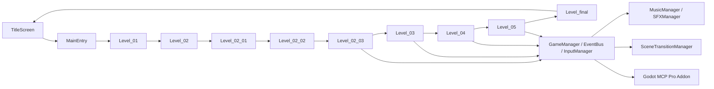

# HackathonGame 技术架构报告

> **目标读者**：关卡/玩法/系统设计与实现协作者
> **更新日期**：2026-06-27
> **引擎版本**：Godot 4.6，`GL Compatibility`
> **当前实现进度**：主流程已跑通到 `Level_final`，`Level_05`、`SceneTransitionManager`、`MusicManager`、`SFXManager`、Godot MCP Pro 插件均已接入
> **说明**：本文以当前仓库中的实际代码为准，不沿用旧版文档里的历史版本号

## 当前状态

项目是一个 2D 横版动作叙事游戏，已经形成完整的主线关卡骨架：

`TitleScreen -> MainEntry -> Level_01 -> Level_02 -> Level_02_01 -> Level_02_02 -> Level_02_03 -> Level_03 -> Level_04 -> Level_05 -> Level_final -> TitleScreen`

当前仓库里已经能看到这些关键落点：

- `Global/` 已有完整 Autoload 层
- `LevelModule/Formal/` 已有 `Level_01` 到 `Level_05` 和 `Level_final`
- `LevelModule/Backup/Level_02_CliffReality/` 保留了第二关旧的完整备份
- `LevelModule/Scenes/PixelworkMapStitch/` 存在大量关卡拼接与运行时生成资产
- `addons/godot_mcp/` 已启用 Godot MCP Pro 插件
- `project.godot` 已配置 MCP 相关 Autoload 与编辑器插件

## 架构总览



### 分层结构

1. **入口层**
   - `UI/TitleScreen.tscn`
   - `Global/MainEntry.tscn`

2. **关卡层**
   - `LevelModule/Formal/Level_01.gd`
   - `LevelModule/Formal/Level_02.gd`
   - `LevelModule/Formal/Level_02_01.gd`
   - `LevelModule/Formal/Level_02_02.gd`
   - `LevelModule/Formal/Level_02_03.gd`
   - `LevelModule/Formal/Level_03.gd`
   - `LevelModule/Formal/Level_04.gd`
   - `LevelModule/Formal/Level_05.gd`
   - `LevelModule/Formal/Level_final.gd`

3. **角色与敌人层**
   - `PlayerModule/`
   - `EnemyModule/`

4. **基础设施层**
   - `Global/`
   - `Tools/`
   - `addons/godot_mcp/`

5. **资源与拼图层**
   - `Assets/`
   - `Resources/`
   - `LevelModule/Scenes/PixelworkMapStitch/`

## 核心全局系统

### 已接入的 Autoload

`project.godot` 中当前启用的全局单例：

- `GlobalDefine`
- `EventBus`
- `GameManager`
- `InputManager`
- `KeybindManager`
- `MusicManager`
- `SFXManager`
- `SceneTransitionManager`
- `MCPScreenshot`
- `MCPInputService`
- `MCPGameInspector`

### 各系统职责

| 系统 | 作用 |
|---|---|
| `GlobalDefine` | 事件名、碰撞层、状态枚举等全局常量 |
| `EventBus` | 跨模块事件广播与订阅 |
| `GameManager` | 玩家引用、关卡引用、检查点、Boss 目标、跨关卡状态 |
| `InputManager` | 游戏输入分发、动作级屏蔽、整体输入屏蔽 |
| `KeybindManager` | 按键配置持久化 |
| `MusicManager` | BGM 播放、淡入淡出、暂停联动 |
| `SFXManager` | 音效池化、防抖、微随机音调 |
| `SceneTransitionManager` | Autoload 级关卡切换器，统一转场清理、整树场景切换与检查点重启 |
| `MCPScreenshot` / `MCPInputService` / `MCPGameInspector` | Godot MCP Pro 的运行时辅助接口 |

## 场景与关卡现状

### 入口流程

- `TitleScreen` 负责标题菜单与正式开始
- `MainEntry` 负责正式流程的关卡装载与 `LEVEL_COMPLETE` 接管
- `MainEntry` 现在不再自行创建 `Camera2D` 和 `HUD`，这些由关卡模块管理

### 关卡拆分

| 关卡 | 当前状态 | 说明 |
|---|---|---|
| `Level_01` | 已实现 | 基础关卡，包含输入规则、交互物、HUD 接入 |
| `Level_02` | 已实现 | 主关卡入口与过渡逻辑 |
| `Level_02_01` | 已实现 | 老街分段，带白屏转场出口 |
| `Level_02_02` | 已实现 | 梯子谜题段 |
| `Level_02_03` | 已实现 | 断崖、现实房间、IDE 对话、终局转场 |
| `Level_03` | 已实现 | 觉醒、战斗、世界异化与记忆收集 |
| `Level_04` | 已实现 | 维度侵蚀与空间崩塌阶段 |
| `Level_05` | 已实现 | 双世界撕裂 + Boss 战 |
| `Level_final` | 已实现 | 叙事终局关卡 |

### 关卡实现方式

- 每关通常由主控脚本 + 场景构建器 + FSM + UI 构建器组成
- 主要逻辑尽量保留在 `.gd` 中，静态关卡节点放在 `.tscn`
- 大型关卡会保留 PixelworkMapStitch 生成资产，方便编辑器直接复用

## 输入与交互

### 输入体系

`InputManager` 已经是主输入入口，支持：

- `game_action` 信号分发
- 全局输入屏蔽
- 单动作屏蔽
- 强制解除所有屏蔽
- 鼠标悬停 GUI 检测

当前输入动作主要包括：

- `ui_accept`
- `ui_pause`
- `player_attack`
- `player_jump`
- `player_dash`
- `player_skill`
- `player_up`
- `player_down`

### 交互模型

- `InteractiveObject` 作为通用交互物基类
- `EventBus` 发出 `INTERACTIVE_OBJECT_TRIGGERED`
- 关卡 FSM 决定交互后续行为
- 重要转场统一先屏蔽输入，再做动画或黑屏切换

### 事件与碰撞契约

当前主线关卡、角色、敌人和 HUD 之间复用这些事件：

| 事件 | 典型数据 | 用途 |
|---|---|---|
| `HEALTH_CHANGED` | `{target, current_health, max_health}` | 玩家/HUD 血量同步，换皮肤后必须重新发射 |
| `ENEMY_HURT` | `{enemy, ...}` | 敌人受击反馈、Boss 血条更新 |
| `ENEMY_DIED` | `{enemy, ...}` | 击杀统计、侵蚀值下降、关卡推进 |
| `INTERACTIVE_OBJECT_TRIGGERED` | `{object_id, ...}` | 交互物触发后交给关卡 FSM 处理 |
| `LEVEL_COMPLETE` | `{level, next_level}` | 主线关卡切换，由 `MainEntry` 接管 |
| `PLAYER_ATTACK_HIT` / `PLAYER_HURT` | `{...}` | 战斗反馈、Level_04/Level_05 世界切换触发 |

碰撞层统一收敛在 `GlobalDefine`，当前关键值为：

```gdscript
TERRAIN = 1
PLAYER = 2
ENEMY = 4
INTERACT = 8
```

## 角色与战斗

### 玩家层

- `PlayerBase` 是统一玩家基类
- 不同皮肤以独立场景承载
- `SmoothCamera` 已作为玩家内嵌跟随相机使用

### 当前已知皮肤

- `Player_Warrior`
- `Player_Warrior_Cyber`
- `Player_Warrior_Lingnan`

### 敌人层

当前仓库可见的敌人/首领：

- `Enemy_Slime`
- `Enemy_CyberWolf`
- `Enemy_CyberBull`
- `Enemy_LanternGhost`
- `Enemy_PaperEffigy`
- `Enemy_BossHuadan`

### 战斗要点

- 碰撞层与伤害层已经统一到 `GlobalDefine`
- `GameManager` 管理当前玩家与敌人列表
- `Level_05` 已接入 Boss 目标追踪与战斗转场
- 音效不再在每个对象里手动 new 播放器，而是统一走 `SFXManager`

### 敌人基类与 Boss 花旦

`EnemyBase` 是当前敌人层的统一基类，提供 `take_damage`、`stun_timer`、配置资源读取等基础能力。`Enemy_BossHuadan` 是 `Level_05` 的核心 Boss，相关文件包括：

| 文件 | 作用 |
|---|---|
| `EnemyModule/Formal/Enemy_BossHuadan.gd` | 花旦 Boss AI，四阶段决策与攻击逻辑 |
| `EnemyModule/Formal/Enemy_BossHuadan.tscn` | Boss 场景，包含动画节点和近战 hitbox |
| `EnemyModule/Formal/SwordEnergy.gd` | Boss 剑气弹体 |
| `EnemyModule/Formal/SwordEnergy.tscn` | Boss 剑气场景 |
| `Tools/SwordQiProjectile.gd` | 玩家剑气弹体，Boss 战时可追踪 `GameManager.boss_target` |
| `Assets/Sprites/boss_huadan/` | Boss 待机、行走、攻击序列帧 |
| `Assets/Effects/剑气.png` | 剑气贴图 |

花旦 Boss 的主要战斗设计：

- 固定血量为 `600`，覆盖普通敌人配置血量。
- `BossAction` 行为枚举包含 `IDLE`、`APPROACH`、`RETREAT`、`RANGED`、`MELEE`、`EVADE`、`JUMP`、`HOVER`。
- 每 `0.3s` 评估一次决策，攻击和闪避期间通过 `_action_lock` 锁定。
- 玩家位于上方平台时优先处理跳跃、远程或后撤逻辑。
- Phase 1 容易被打断；Phase 2 开始霸体；Phase 3 增加跳跃后悬停和三发独立瞄准剑气；Phase 4 近战附带剑气并提高移速、跳跃和近战权重。

| 参数 | Phase 1 | Phase 2 | Phase 3 | Phase 4 |
|---|---|---|---|---|
| HP 范围 | 600-451 | 450-301 | 300-151 | 150-0 |
| 移速 | 200 | 220 | 250 | 350 |
| 跳跃速度 | -500 | -520 | -580 | -720 |
| 剑气伤害 | 12 | 14 | 18 | 22 |
| 近战伤害 | 20 | 22 | 26 | 32 |
| CD 倍率 | 1.0 | 0.8 | 0.6 | 0.4 |
| 闪避概率 | 70% | 55% | 30% | 15% |
| 剑气数量 | 1 | 1 | 3 | 3 |

Boss 剑气实现约束：

- `SwordEnergy` 速度为 `350`，生命周期约 `8s`。
- `collision_mask = 4`，只检测玩家，穿过地形；不要改回包含 `TERRAIN` 的 mask，否则会被平台挡掉。
- Boss 不造成接触伤害，伤害来源应保持为剑气和近战 hitbox。
- `GameManager.boss_target` 只在 Boss 战场景设置，用于玩家剑气自动追踪，不应影响其他关卡。

## Level_05 专项结构

`Level_05` 是当前主线中系统复杂度最高的关卡，承担 Level_04 后的“双世界撕裂 + Boss 战 + 终局转场”。

### 文件与资源

| 文件 | 作用 |
|---|---|
| `LevelModule/Formal/Level_05.gd` | 第五关主控脚本 |
| `LevelModule/Formal/Level_05.tscn` | 第五关场景 |
| `LevelModule/Scenes/PixelworkMapStitch/Level05_Cyber/bg 3-1.png` | 赛博地图底层 |
| `LevelModule/Scenes/PixelworkMapStitch/Level05_Lingnan/bg 3-2.png` | 岭南地图上层 |
| `LevelModule/Scenes/PixelworkMapStitch/Level05_Cyber/bg 4.png` | Boss 战场背景 |

### 核心系统

- 双世界撕裂：通过 `PixelTearing` shader 表现上下层地图撕裂，`_corruption` 控制侵蚀强度，`player_uv` 由 `get_global_transform_with_canvas()` 计算。
- 侵蚀值：随时间增长，击杀敌人降低；满值后触发 `trigger_game_over()`；对话期间暂停增长。
- Level_04 数据继承：读取 `GameManager.dream_runtime_flags["erosion_value"]`、`["player_health"]`、`["player_max_health"]`。
- 战斗触发切换：`PLAYER_ATTACK_HIT` 和 `PLAYER_HURT` 可触发双世界状态变化。
- Boss 区域：由 `enter_boss` 交互点进入，完成登场对话后传送至 Boss 区域并限制相机。
- 终局转场：Boss 后续流程进入视频/黑屏，再切换到 `Level_final`。

### Boss 区域约定

- 入口交互点 `object_id = "enter_boss"`，当前设计位置约为 `(2842, 552)`。
- Boss 战传送点约为 `(931, 5037)`，Boss 生成点约为 `(1300, 5037)`。
- Boss 相机限制约为 `[718, 1655, 4509, 5135]`，zoom 为 `1.5`。
- Boss 背景使用 `bg 4.png`，原始尺寸为 `1376x768`，当前以约 `0.82` scale 覆盖战斗区域。
- `BossCollisions` 负责 Floor、LeftWall、RightWall 和多个平台碰撞。

### 对话、调试与换皮肤

- `_show_dialog(lines, callback)` 使用 RichTextLabel 和 BBCode，Enter 推进，对话期间通过 `InputManager.block_input("对话")` 屏蔽游戏输入。
- 对话结束通过 callback 串接传送、显示 Boss 血条或后续剧情。
- 调试面板可跳转到 bg3 撕裂区域或 bg4 Boss 区域。
- `_swap_player_skin("Cyber")` / `_swap_player_skin("Lingnan")` 会销毁旧玩家、实例化新皮肤，并继承血量、朝向和位置。
- 换皮肤后必须发射 `HEALTH_CHANGED`，否则 HUD 仍可能引用旧玩家或显示旧血量。

### HUD 血量同步

Level_04 和 Level_05 的 HUD 血条依赖事件同步，当前关键约束是：

- `_load_hud()` 后应立即发射 `HEALTH_CHANGED`，推送当前玩家血量。
- `_setup_player()` 创建玩家后应发射 `HEALTH_CHANGED`。
- `_swap_player_skin()` 替换玩家后应发射 `HEALTH_CHANGED`。
- GDScript 中 `var p` 若声明在 `if` 块内，仅在该块内可见；血量事件应放在能访问当前玩家引用的作用域中。

## 音频与转场

### 音频

`MusicManager` 与 `SFXManager` 已成为当前音频基础设施：

- BGM 支持播放、淡入淡出、暂停联动
- SFX 使用对象池
- 攻击、受击、行走、怪物待机、怪物受击、UI 点击等关键音效已接入

### 转场

`SceneTransitionManager` 是当前项目的专门关卡切换器，文件位于 `Global/SceneTransitionManager.gd`，并已在 `project.godot` 中作为 Autoload 接入：

- `cleanup_for_transition(source)`：切换前统一调用 `prepare_for_level_exit()`，解除暂停，清空 `GameManager.player_ref`、`current_level`、`enemy_list`、`boss_target`，强制解除 `InputManager` 输入屏蔽，清理音乐暂停状态，并释放 GUI 焦点。
- `request_scene_change(scene_path, source)`：非 `MainEntry` 托管场景的整树切换入口，内部走 `get_tree().change_scene_to_file()`。
- `request_checkpoint_restart()`：从 `GameManager.checkpoint_scene_path` 重启；如果当前根场景支持 `_switch_to_level()`，则复用 `MainEntry` 的托管切换，否则退回整树切换。
- `is_transitioning`：防止重复切换请求造成双重加载或状态污染。

当前存在两条切换路径：

1. **MainEntry 托管关卡链**
   - 适用于主线中的 `Level_01 -> Level_02 -> Level_02_01 -> Level_02_02 -> Level_02_03 -> Level_03 -> Level_04` 等作为 `MainEntry` 子节点运行的关卡。
   - 关卡通过 `EventBus.emit(GlobalDefine.EventName.LEVEL_COMPLETE, {"next_level": path})` 发出完成事件。
   - `MainEntry._on_level_complete()` 接管事件，调用 `_switch_to_level()`，先显示黑/白遮罩，再调用 `SceneTransitionManager.cleanup_for_transition(self)`，释放旧关卡并 `add_child()` 新关卡。
   - 这种路径不整树替换 `MainEntry`，因此能保留统一入口和淡出遮罩逻辑。

2. **直接整树场景切换**
   - 适用于标题页、返回标题、终局视频后切换、或脱离 `MainEntry` 托管单独运行的关卡。
   - 调用方式是 `SceneTransitionManager.request_scene_change("res://目标场景.tscn", self)`。
   - 当前可见调用包括 `TitleScreen -> MainEntry`、`HUD -> TitleScreen`、`Level_04 -> Level_05`、`Level_05 -> Level_final`、`Level_final -> TitleScreen`。

维护约定：

- 新增主线关卡时，优先让关卡发 `LEVEL_COMPLETE`，由 `MainEntry` 托管切换。
- 新增菜单、终局、调试入口或单独运行场景时，使用 `SceneTransitionManager.request_scene_change()`。
- 任何关卡若持有事件订阅、输入屏蔽、临时 UI、Boss 引用或特殊音乐状态，应实现 `prepare_for_level_exit()`，让切换器在清理阶段统一调用。
- 不建议在关卡脚本中直接调用 `get_tree().change_scene_to_file()`，否则容易绕过输入解除、引用清理、暂停复位和焦点释放。

## 编辑器与 MCP 集成

当前仓库已开启 `Godot MCP Pro`：

- Godot 插件已放入 `addons/godot_mcp/`
- `project.godot` 已启用插件
- 全局 Codex 配置已指向完整包的 MCP server

这层集成的作用不是游戏运行逻辑，而是让 AI 编辑器协作、截图、输入模拟和场景检查有统一入口。

## 资产与生成内容

当前项目资产结构较明显地分成几块：

- `Assets/`：图像、音频、特效等
- `Resources/`：配置型资源
- `LevelModule/Scenes/PixelworkMapStitch/`：关卡拼接资产与运行时生成数据
- `LevelModule/Backup/`：历史版本备份

这意味着项目已经从“纯手写关卡”进入到“手写逻辑 + 生成资产 + 场景拼装”混合阶段。

## 当前架构判断

### 已完成的部分

- 入口和正式流程已分离
- 输入、事件、转场、音频已形成统一基础设施
- 关卡主线已经扩展到终局
- Boss 战与终局叙事已落地
- MCP 编辑器协作层已接入

### 仍然明显依赖人工约束的部分

- 关卡逻辑文件数量较多，约定依赖强
- `Level_02` 系列存在历史拆分和备份，维护时要注意主线与备份的边界
- `Level_03`、`Level_04`、`Level_05` 的状态机与场景构建仍然高度耦合
- 窗体转场、输入屏蔽、HUD 显示状态需要在每个关卡里显式维持

## 后续建议

1. 把当前项目版本号与实际实现进度对齐，避免 `project.godot` 里的版本号长期停留在早期值。
2. 为 `Level_02`、`Level_03`、`Level_04`、`Level_05` 补一份统一的“关卡状态说明表”，减少跨文件查找成本。
3. 把 `MainEntry`、`SceneTransitionManager`、`InputManager` 的职责边界再收紧，避免转场逻辑分散。
4. 给 `Level_final` 和 `Level_05` 补一轮运行验证记录，确认当前主线闭环不是只在代码层成立。
5. 如果后续继续扩关，优先把重复的关卡构建模式抽成共同基类或模板，而不是继续复制 FSM。
