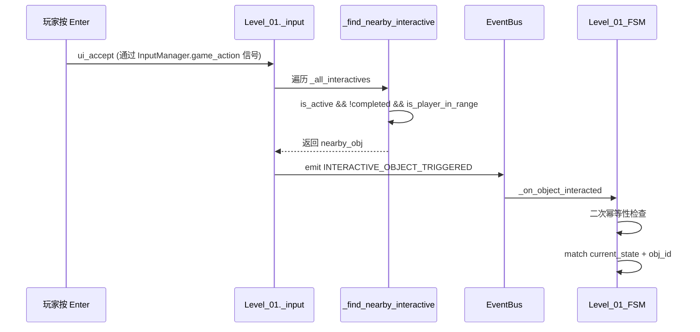

# HackathonGame 关卡技术架构报告（叙事驱动版）

> **目标读者**：关卡设计师 / 下游 AI 关卡设计助手
> **更新日期**：2026-06-26
> **引擎版本**：Godot 4.6 (GL Compatibility, GDScript)
> **项目版本**：v0.13.0（MusicManager/SFXManager 音频系统 + Level_final 终局关卡 + 全部7关流水线闭环）

> **v0.13.0 变更摘要**：
> - **音频系统完整实现**：新增 `MusicManager`（BGM 播放/淡入淡出/暂停联动）和 `SFXManager`（音效对象池/防抖/音调微变）两个 Autoload，总计 7 个 Autoload
> - **Level_final 终局关卡**：`Level_final.gd`（Node2D 直接实现），玩家出生 (320,616)，交互点 (192,592)，包含黄色光点呼吸闪烁、5s 黑屏渐入切回标题界面、"太阳照常升起"结局文本
> - **完整流水线闭环**：`TitleScreen → MainEntry → Level_01 → Level_02 → 02_01 → 02_02 → 02_03 → Level_03 → Level_04 → Level_05 → Level_final → TitleScreen`
> - **SFXManager 集成**：6 种预加载音效（攻击/受击/行走/怪物待机/怪物受击/UI点击），8 池 AudioStreamPlayer 轮询，50ms 防抖，暂停自动静音
> - **MusicManager 集成**：`play_bgm()` / `fade_to()` / `stop_bgm()` API，finished 信号自动循环，支持 `play_bgm_from_stream()` 直接传 Resource
> - **Level_final 特性**：不加载 HUD、禁止所有战斗操作、0.2x 移速、摄像机 zoom=3.5、橘黄暖色背景、纯叙事交互

> **v0.12.0 变更摘要**：
> - **CodeRain 完全重写**：新增 `Tools/CodeRain.gd`（Control 子类），改用 `_draw()` + `draw_char()` / `draw_string()` 实时渲染，不再使用静态 Label 节点双层架构：背景层 ~58 列单字符雨（片假名/数字/符号）+ 前景层 6 条项目函数名"数据包"缓慢穿行
> - **字体升级**：改用 `Silkscreen-Bold.ttf` 像素字体（16px 2x 原生），背景/前景统一，列间距 22px
> - **颜色系统**：统一 `#0aae43` 终端绿，RGB `(0.039, 0.682, 0.263)`
> - **新增 `warning_barrier.gdshader`**：系统入侵防火墙 Glitch 特效（能量带流动 + 横向撕裂 Glitch + RGB 色散 + 边缘 rim light + 底部最亮），加法合成
> - **新增 `Tools/WarningBarrier.gd`**：防火墙控制器（Node2D），状态机 IDLE→ALERT→BREACHED→DISABLED，支持距离连续渐变、爆发白光序列、红色火花粒子
> - **WarningBarrier 集成到 Level_03**：两个 WarningTrigger 区域上方挂载红色 Glitch 防火墙 + 滚动警告文字 "⚠ RESTRICTED ⚠"
> - **墙壁屏障统一**：5 面墙壁（HavenRightWall / AlleyRightWall / CorridorRightWall / CyberLeftWall / CyberRightWall）全部改用 `warning_barrier.gdshader`，深蓝 `(0.04, 0.12, 0.7)`
> - **墙面 CollisionShape2D 偏移修复**：`_add_barrier_shader_to_wall` 新增 `col_shape.position` 读取，ColorRect 居中于碰撞体位置
> - **背景分层变暗**：`_dim_background_smooth()` 方法，仅 modulate PixelworkMapStitch 背景层，敌人/玩家/UI 不受影响；强度 40%，3s TRANS_SINE 渐变
> - **Level_03 交互物黄色闪烁光点**：`InteractiveObject.apply_level01_dot_visual()` 应用于爷爷和两个记忆光团
> - **爷爷对话完成隐藏光点修复**：`_trigger_grandpa_glitch()` 入口增加 `_mark_interaction_completed("grandpa")`
> - **记忆光团贴图**：`memory_echo_effect.gdshader` 紫色扭曲+闪烁特效，贴图 `.tscn` 中配置为 MemoryEcho 子节点 Sprite2D（EchoSprite）
> - **画面抖动强度翻倍**：`_start_screen_shake()` 幅度 8.0px→16.0px
> - **颜色腐蚀效果删除**：`_corrupt_lingnan_colors()` 在 v0.11.0 tscn 迁移后所有 ColorRect 已移除，效果为空操作，安全清理
> - **敌人系统更新**：Level_03 走廊 CyberBull+PaperEffigy 各2只（x=2612,2930,3248,3566）
> - **场景文件更新**：Level_03.tscn 新增 ext_resource 时空裂缝final.png + memory_echo_effect.gdshader + 2个 ShaderMaterial子资源 + MemoryEcho1/2 EchoSprite 子节点
> - **场景节点化**：Level_03_SceneBuilder 构建逻辑迁移至 Level_03.tscn，节点可直接在编辑器中拖动编辑
> - **玩家系统**：初始皮肤改用 Player_Warrior_Lingnan，出生点 (56,296)；开场叙事 0.5s 延迟弹出
> - **敌人系统重构**：岭南阶段 LanternGhost + PaperEffigy 交替（冲脸怪 PaperEffigy x=680, detect_range=1000）; 走廊阶段 CyberBull + PaperEffigy 各2只; 赛博动态刷新间隔 5s
> - **摄像机统一**：zoom=1.75, top/bottom=168/608; 岭南 left=0/right=2120; 赛博 left=1728/right=6816
> - **换皮+重生**：切换赛博皮肤时血条回满+传送到(1792,552); 岭南死亡重生(120,512); 赛博死亡重生(1792,552)
> - **爷爷贴图**：Grandpa.png 作为 Sprite2D 节点，对话结束后 hidden
> - **区域重划分**：凉茶铺[0,640], 街巷[640,2128], 走廊[2144,4032], 赛博城[4032,6816]
> - **新增 Level_02_03「断崖坠落→现实干扰→睁眼→现实房间→IDE 交互→关三」**：从备份 `Level_02_CliffReality` 移植完整断崖坠落循环（坠落计数→干扰期红光+阴影敌人+沉重化→长按Tab睁眼），加入现实房间（手机→电脑→IDE对话→配置篡改→重编译→床），独立场景 `Level_02_03.tscn`（含碰撞体/触发器/出生点/像素地图）
> - **IDE 界面重设计为 CODE-BUDDY 风格**：左侧 220px 深色边栏（Logo、项目名、文件树、SESSION 状态）+ 右侧主对话区 + 底部输入框，纯代码构建
> - **交互式自由对话系统**：预写对话结束后进入 `REALITY_FREE_CHAT`，玩家在底部 `LineEdit` 输入 → Enter → 主区显示"阿明: [消息]" → CodeBuddy AI 关键词回复（7 类世界观匹配 + 随机默认回复），`/config` 命令进入配置编辑器
> - **对话逐行动画**：所有预写对话（含阿明确认后）均追加 1.2s 延迟动画再显示，提升渐进感
> - **黑屏过渡转场**：床交互触发 → 黑屏淡入(0.8s) → 居中文字"西关梦境 V2.0..."(2.5s) → `LEVEL_COMPLETE`(在黑屏中) → MainEntry 遮罩无缝衔接加载 Level_03
> - **全局玩家速度调整**：`WarriorConfig.tres` `move_speed` 300→250（正常 250 / 干扰期 137.5 / 现实房间 125）
> - **技能禁用体系**：Level_01 新增 `block_action("player_dash")` / `can_dash = false`，sub01 现实房间同步禁用攻击/跳跃/闪身/技能（共 4 项 action 级禁止）
> - **Level_01 新增技能禁用**：`_apply_level_input_rules` 新增闪身禁用，与现有攻击/跳跃禁用一致
> - **切换链更新**：`Level_02 → Level_02_01 → Level_02_02 → Level_02_03 → Level_03`
> - **`_emit_level_complete()` 重构**：事件发射提前到 `_full_cleanup()` 之前，新增 `_is_loaded_under_main_entry()` 双模切换
> - **InputManager 动作级禁用完善**：`block_action/unblock_action` 覆盖 player_attack / player_jump / player_dash / player_skill
> - **Level_02_01 白屏转场增强**：新增 `_exit_white_overlay` (ColorRect) + Tween 链条（0.8s 淡入至全白 + 4.0s 停留 + `_emit_level_complete`），`_freeze_player` + `InputManager.block_input` 保证切换期间无操作干扰
> - **LanternGhost 平衡调整**：`attack_damage` 10→6，`attack_cooldown` 1.5→2.0
>
> **v0.9.0 变更摘要（历史）**：
> - **Level_02 架构重构为分段式**：原单一 11 态双空间关卡（坠落/干扰/睁眼/配置篡改/重编译）已备份至 `LevelModule/Backup/Level_02_CliffReality/`，正式版拆为三段串联：
>   - `Level_02`（阁楼→老街，3态，引入薯片猫/子02传送门交互）
>   - `Level_02_01`（老街分段 0-4464，纸扎人+灯笼鬼战斗，白屏转场出口）
>   - `Level_02_02`（0-1474，梯子谜题「有些梯子看似能爬…有些墙看似不能穿过却可穿过」，相机2x缩放）
>   - 切换链：`Level_02 → Level_02_01 → Level_02_02 → Level_02_03 → Level_03`，均通过 `LEVEL_COMPLETE.next_level` 串联
> - **新增 Level_04「维度侵蚀与空间崩塌」**：承接 Level_03 觉醒，2态状态机，阶段1「半对半空间硬切」（赛博1-1 ↔ 岭南1-2 瞬移+闪帧+皮肤切换）已实现，后续阶段待开发
> - **新增 Ladder.gd 梯子攀爬机制**：Area2D 子类，双向攀爬（底部 W↑/顶部 S↓，使用 `player_up`/`player_down` 输入动作），攀爬期间禁用玩家 `_physics_process`
> - **新增输入动作** `player_up` / `player_down`（梯子攀爬用，保留轮询）
> - **MainEntry 关卡切换增强**：新增转场遮罩（CanvasLayer+ColorRect 淡入淡出 0.8s）、`transition_white` 白屏转场支持、调用 `InputManager.force_unblock_all()` 防跨关卡输入锁泄漏
> - **InputManager 新增** `force_unblock_all()` + **动作级禁用系统** `block_action/unblock_action`（关卡1通过 action 级禁用攻击/跳跃）+ **鼠标悬停 GUI 检测**（防止 HUD 按钮被关卡操作穿透）
> - **PixelworkMapStitch 现被实际使用**：Level_02_SceneBuilder._attach_dream_visual_layers() 将拼接地图 reparent 到 DreamWorldRoot（不再仅"预留"）
> - **dream_runtime_flags 写入链调整**：Level_02 不再写入配置篡改标志（机制已备份），Level_03 仍保留 `_apply_dream_runtime_flags()` 读取（当前为空字典安全跳过）
> - **Enemy_PaperEffigy 已投入使用**：Level_02_01 / Level_02_02 老街与梯子段均生成纸扎人（不再"预留"）
> - **Enemy_LanternGhost AI 完全实现**：漂浮系统 + 悬停距离保持 + 火球远程攻击（`FireballProjectile.gd` 弹体含拖尾粒子+命中效果），`deals_contact_damage()=false`，`MOTION_MODE_FLOATING` 重力免疫
> - **Level_01 大幅增强**：新增 `_apply_level_input_rules()` 关卡输入策略系统（0.5x 移动速度 + action 级禁用攻击/跳跃）+ 代码滚动面板（`CODE_SCROLL_LINES` 伪代码模拟 AI 编译，含语法高亮）+ 左侧边缘闪烁光效（提示手机位置）+ 眨眼效果（GLITCH_TRANSIT 意识模糊）+ `_disconnect_input_manager()` 关卡退出清理
> - **新增 FireballProjectile.gd**：`res://Tools/FireballProjectile.gd`，灯笼鬼远程弹体，含代码粒子拖尾、命中闪光、最大飞行距离消散
> - **Level_02 分段控制器双模切换**：Level_02 / Level_02_01 / Level_02_02 均支持 MainEntry 托管 (`LEVEL_COMPLETE`) 与独立运行 (`change_scene_to_file`) 双模式，通过 `_is_loaded_under_main_entry()` 判断
> - **Level_02 老街改用 LanternGhost**：StreetSlimeConfig.tres 配置驱动的灯笼鬼取代史莱姆作为老街敌人
> - **InteractiveObject.mark_completed() 增强**：标记完成后自动隐藏 Indicator 和 Glow 子节点
> - 删除 SelfTest 目录（LevelModule/SelfTest、EnemyModule/SelfTest、PlayerModule/SelfTest）
>
> **v0.8.0 变更摘要（历史，已被 v0.9.0 部分重构）**：
> - Level_02「撕裂与沉溺」原 11 态双空间实现（已备份至 Backup/，正式版改为分段式）
> - Level_03「赛博蜃景与真实回声」：6态状态机、无缝单坐标空间、世界异化演出、玩家皮肤切换、击退反转、异常数据光团收集
> - LevelConfig 新增 `player_scene_path` 字段，LevelBase._setup_player() 按配置加载皮肤
> - GameManager 新增 `dream_runtime_flags` 跨关卡配置字典
> - 新增 4 种敌人：Enemy_LanternGhost / Enemy_CyberWolf / Enemy_CyberBull / Enemy_PaperEffigy + 配套 Config
> - 新增 PixelworkMapStitch 像素地图拼接系统（LevelModule/Scenes/）
> - 触发区（Area2D TriggerZone）系统
> - `_enforce_level_restrictions()` 关卡级技能限制守卫
> - Level_03._swap_player_to_cyber() / _start_screen_shake() / 击退反转 / 音效安全降级
>
> **v0.6.0 变更摘要（历史）**：
> - InputManager.gd Autoload 全面接管游戏操作输入（attack/dash/skill/accept 信号分发）
> - PlayerBase 迁移至 game_action 信号驱动，_handle_input() 清空攻击/冲刺/技能轮询
> - Level_01 叙事/对话/睡眠/IDE/终局状态全量接入 InputManager.block_input() 联动
> - 清理 InputManager 全部测试日志输出（5处 print）
>
> **v0.5.0 变更摘要（历史）**：
> - SmoothCamera 从 LevelModule/Common 迁移至 PlayerModule/Formal，预置于3个玩家预制体
> - 根治反向移动颤动（转向清零 + lookahead 去硬边界 + X轴去死区）
> - EventBus tree_exited 改为 unsubscribe_all（全量清理）
> - MainEntry 不再创建 Camera2D/HUD（避免重复/泄漏）
> - InteractiveObject 输入检测统一收归 Level_01

---

## 1. 项目元信息

| 属性 | 值 |
|---|---|
| 项目名称 | HackathonGame |
| 类型 | 2D 横向叙事探索游戏（类空洞骑士） |
| 屏幕分辨率 | 1280×720，canvas_items 拉伸 |
| 主场景 | `res://UI/TitleScreen.tscn`（工程启动入口；开始游戏后进入 `res://Global/MainEntry.tscn`） |
| 自测场景 | *(v0.9.0 已删除 SelfTest 目录)* |
| **7 个 Autoload** | `GlobalDefine`、`EventBus`、`GameManager`、**`InputManager`**、`KeybindManager`、**`MusicManager`**、**`SFXManager`** |
| 运行模式 | `FORMAL`（正式）/ `SELF_TEST`（自测） |
| 玩家外观 | Player_Warrior / Player_Warrior_Cyber / Player_Warrior_Lingnan |

---

## 2. 系统总览

### 2.1 分层架构

```
┌──────────────────────────────────────────────────────────┐
│ 入口层                                                   │
│   TitleScreen.gd / .tscn (工程启动入口, 菜单/自测/正式模式) │
│   MainEntry.gd / .tscn   (正式流程容器, emit GAME_START)  │
│   注意: MainEntry 不再创建 Camera2D 和 HUD (由预制体/关卡接管) │
├──────────────────────────────────────────────────────────┤
│ 关卡控制层（叙事驱动）                                    │
│   Level_01.gd            (关卡1主控/7态叙事状态机)        │
│   ├── Level_01_SceneBuilder.gd   (地形/交互物/UI 构建)  │
│   ├── Level_01_FSM.gd            (7 态叙事状态机)        │
│   ├── Level_01_UIBuilder.gd      (Canvas UI 纯代码构建)  │
│   ├── InteractiveObject.gd       (交互物基类 Area2D)     │
│   Level_02.gd            (关卡2分段0/3态: 阁楼→老街)     │  ★ v0.9.0 重构
│   ├── Level_02_SceneBuilder.gd   (梦境世界构建, 简化版)   │
│   ├── Level_02_FSM.gd            (3态: ATTIC/STREET/END) │
│   ├── Level_02_UIBuilder.gd      (黑屏/叙事/终局, 简化版) │
│   Level_02_01.gd         (关卡2分段1/老街0-4464, 白屏出口)│  ★ v0.9.0 新增
│   Level_02_02.gd         (关卡2分段2/0-1474, 梯子谜题)   │  ★ v0.9.0 新增
│   Level_02_03.gd / .tscn (关卡2分段3: 断崖→干扰→睁眼→   │  ★ v0.10.0 新增
│   │                       现实房间→IDE→配置→床→关卡3)    │
│   Ladder.gd              (梯子攀爬 Area2D, 双向W/S)      │  ★ v0.9.0 新增
│   Level_03.gd            (关卡3主控/6态无缝空间状态机)     │
│   ├── Level_03_SceneBuilder.gd   (四区域单坐标空间构建)   │
│   ├── Level_03_FSM.gd            (6 态战斗+收集状态机)   │
│   └── Level_03_UIBuilder.gd      (代码雨/Glitch/温暖光晕) │
│   Level_04.gd            (关卡4主控/2态维度侵蚀)          │  ★ v0.9.0 新增
│   ├── Level_04_SceneBuilder.gd   (容器+UI, 后续扩展)     │
│   ├── Level_04_FSM.gd            (占位, 待扩展)          │
│   └── Level_04_UIBuilder.gd      (叙事/Glitch/终局)      │
│   Level_05.gd / .tscn   (关卡5双世界侵蚀+Boss战+视频演出)   │  ★ v0.12.0 新增
│   Level_final.gd / .tscn (终局关卡/纯叙事/太阳照常升起)     │  ★ v0.13.0 新增
├──────────────────────────────────────────────────────────┤
│ 角色层                                                   │
│   Player_Warrior (.tscn)   - CharacterBody2D             │
│     └─ SmoothCamera (.tscn/.gd) - 平滑跟随摄像机(内置)    │
│   Player_Warrior_Cyber (.tscn) - 赛博皮肤 + SmoothCamera  │
│   Player_Warrior_Lingnan (.tscn)- 岭南皮肤 + SmoothCamera  │
│   Enemy_Slime   (.tscn)    - CharacterBody2D             │
│   TestRunnerCharacter      - SubViewport 预览用           │
├──────────────────────────────────────────────────────────┤
│ 数据配置层（纯 Resource，不挂节点）                        │
│   LevelConfig.gd  →  Level01/02/03Config.tres  (关卡数值+玩家皮肤路径)│
│   Level01Data.gd →  Level01Data.tres      (关卡1叙事文本) │
│   Level02Data.gd →  Level02Data.tres      (关卡2叙事+谜题+音效挂点) │
│   Level03Data.gd →  Level03Data.tres      (关卡3对话+战斗+光团坐标) │
│   PlayerConfig / EnemyConfig / SkillConfig (.tres)        │
├──────────────────────────────────────────────────────────┤
│ 基础设施层（Autoload）                                   │
│   GlobalDefine   (枚举/碰撞层常量/事件名常量)              │
│   EventBus       (跨模块唯一事件通信通道, 全量tree_exited)  │
│   GameManager    (player_ref/current_level/enemy_list)    │
│   InputManager   (统一输入管理, 信号分发, block/unblock)   │
│   KeybindManager (键位配置/重绑定持久化)                   │
│   MusicManager   (BGM 播放/淡入淡出/暂停联动)             │  ★ v0.13.0
│   SFXManager     (音效对象池/防抖/音调微变)               │  ★ v0.13.0
└──────────────────────────────────────────────────────────┘
```

### 2.2 核心设计原则

1. **叙事驱动**：关卡 = 状态机 + 交互物 + 文案数据。设计师只需要编辑 `.tres` 与子类 `.gd`，不必碰核心系统。
2. **代码构建场景**：地形、墙壁、UI 全部用 `_create_static_body()` / `_create_interactive()` / `Level_XX_UIBuilder` 等代码 API 创建，关卡 `.tscn` 只挂脚本与资源引用。
3. **事件总线唯一通信**：跨模块通信全部走 `EventBus.emit/subscribe`，严禁跨层直接 `get_node()`。
4. **碰撞层语义化**：所有 `collision_layer/mask` 必须用 `GlobalDefine.Collision.*` 常量，禁止写数字。
5. **数据驱动前置逻辑**：交互物之间的解锁条件（如"床交互≥4次解锁电脑"）由主控层布尔判定 + `is_active` 控制，不硬编码在 FSM 中。
6. **摄像机归玩家**：SmoothCamera 作为子节点预置于每个玩家预制体内，不再由 LevelBase 或 MainEntry 动态创建。
7. **双空间碰撞隔离**（v0.8.0）：隐藏空间必须同时禁用碰撞 + 停用交互物 + 禁用内嵌物理阻挡体，防止同坐标系下碰撞泄漏。
8. **跨关卡配置传递**（v0.8.0，v0.9.0 调整）：通过 `GameManager.dream_runtime_flags` 字典跨关卡传递状态，关卡入口 `_apply_dream_runtime_flags()` 读取应用。**注**：v0.9.0 Level_02 重构后不再写入该字典（配置篡改机制已备份），Level_03 仍保留读取逻辑，当前为空字典安全跳过，后续关卡可重新启用写入。
9. **关卡级限制守卫**（v0.8.0）：`_enforce_level_restrictions()` 在 `_process()` 中每帧强制维持被禁技能状态，防止任何外部路径意外恢复。
10. **关卡分段串联**（v0.9.0 新增）：大型关卡可拆为多个分段控制器（如 Level_02 → Level_02_01 → Level_02_02），各段通过 `LEVEL_COMPLETE.next_level` 串联，分段控制器继承 LevelBase 并自建地形/敌人生成/出口触发器，支持 MainEntry 托管与独立 `change_scene_to_file` 双模式。
11. **全局音频归 Autoload**（v0.13.0 新增）：BGM 统一走 `MusicManager`（关卡 Config 自动播放 + 关卡脚本手动 `fade_to`），短音效统一走 `SFXManager`（PlayerBase/EnemyBase/HUD/TitleScreen 已集成）。关卡内不再各自 new AudioStreamPlayer 播放攻击/受击/UI 音效。

---

## 3. 全局系统接口（强制约束）

### 3.1 `GlobalDefine` 常量（不可修改）

```gdscript
# 碰撞层（必须使用常量，禁止硬编码数字）
class Collision:
    const TERRAIN  := 1   # 地形
    const ENEMY    := 2   # 敌人
    const PLAYER   := 4   # 玩家
    const INTERACT := 8   # 交互物（InteractiveObject 用 layer=0 + mask=PLAYER）

# 事件名（统一管理，避免拼写错误）
class EventName:
    # 玩家
    const PLAYER_SPAWNED      = "player_spawned"
    const PLAYER_DIED         = "player_died"
    const PLAYER_HURT         = "player_hurt"
    const PLAYER_ATTACK_HIT   = "player_attack_hit"
    const PLAYER_STATE_CHANGED = "player_state_changed"
    # 敌人
    const ENEMY_SPAWNED       = "enemy_spawned"
    const ENEMY_DIED          = "enemy_died"
    const ENEMY_HURT          = "enemy_hurt"
    const ENEMY_DETECTED      = "enemy_detected"
    # 游戏
    const GAME_START          = "game_start"
    const GAME_PAUSE          = "game_pause"
    const GAME_RESUME         = "game_resume"
    const GAME_OVER           = "game_over"
    const LEVEL_LOADED        = "level_loaded"
    const LEVEL_COMPLETE      = "level_complete"
    # 交互
    const INTERACTIVE_OBJECT_TRIGGERED = "interactive_object_triggered"
    # 伤害
    const DAMAGE_APPLIED      = "damage_applied"
    const HEALTH_CHANGED      = "health_changed"

# 玩家/敌人/伤害/运行模式枚举（IDLE/RUN/JUMP/...）
enum PlayerState { IDLE, RUN, JUMP, FALL, DASH, ATTACK, SKILL, HURT, DEAD }
enum EnemyState  { IDLE, PATROL, CHASE, ATTACK, HURT, DEAD }
enum DamageType  { PHYSICAL, MAGIC, TRUE_DAMAGE }
enum RunMode     { FORMAL, SELF_TEST }
```

### 3.2 `EventBus` API

```gdscript
EventBus.subscribe(event_name: String, node: Node, method: String)
EventBus.unsubscribe(event_name: String, node: Node)
EventBus.unsubscribe_all(node: Node)            # 清除某节点全部订阅
EventBus.emit(event_name: String, data: Dictionary)
EventBus.emit_deferred(event_name: String, data: Dictionary)
```

**自动清理机制（v0.5.0 更新）**：

```gdscript
# subscribe() 时自动连接 node 的 tree_exited 信号 (CONNECT_ONE_SHOT)
# 节点销毁时回调 _on_subscriber_tree_exited(node):
#     → unsubscribe_all(node)  ← 一次性清除该节点的所有事件订阅
# （旧版只清单个事件，已修复为全量清理）
```

**关卡关键事件 data 字典约定**：

| 事件 | data |
|---|---|
| `LEVEL_LOADED` | `{"level": self}`（LevelBase 末尾自动 emit） |
| `LEVEL_COMPLETE` | `{"level": self, "next_level": "res://..."}`（关卡结束 emit） |
| `INTERACTIVE_OBJECT_TRIGGERED` | `{"object_id": "box"}`（输入层 emit，FSM 消费） |
| `GAME_START` | `{}`（MainEntry 入口 emit） |
| `ENEMY_DIED` | `{"enemy": Node2D, "exp_reward": int}` |
| `PLAYER_DIED` | `{"player": Node2D}` |
| `HEALTH_CHANGED` | `{"target": Node, "current_health": int, "max_health": int}` |

> 设计师新增交互事件时，请用命名空间式字符串（如 `level01.box_interacted`），并在 `Level_01_FSM` 中订阅。

### 3.3 `GameManager` API

```gdscript
var player_ref: Node2D         # 当前玩家（只读）
var current_level: Node        # 当前关卡（LevelBase 写入）
var enemy_list: Array[Node2D]  # 存活敌人
var dream_runtime_flags: Dictionary = {}  # ★ v0.8.0: 跨关卡梦境配置（关卡2写入→关卡3读取）

register_player(player)             # LevelBase._setup_player 自动调用
register_enemy(enemy)               # 敌人 _ready 自动调用
unregister_enemy(enemy)             # 敌人 die() 自动调用
get_enemies() -> Array[Node2D]      # 过滤无效引用
get_nearest_enemy(pos) -> Node2D
trigger_game_over() / toggle_pause() / is_self_test() / is_formal()
```

> **跨关卡配置机制（v0.8.0 新增）**：关卡2「配置篡改」谜题完成后将 `dream_runtime_flags` 写入 GameManager（如 `player_damage_reduction=true, base_jump_height=99, allow_external_signal=false, dream_version="2.0"`），关卡3 在 `_on_ready()` 中通过 `_apply_dream_runtime_flags()` 读取并应用（如启用二段跳）。

### 3.4 `InputManager` API（v0.6.0 新增，v0.9.0 扩展）

```gdscript
## 游戏操作输入信号（仅未屏蔽 + 未暂停 + 无 UI 焦点时发射）
signal game_action(action: StringName, event: InputEvent)

## 订阅者: PlayerBase(attack/dash/skill), Level_01(ui_accept)
## 使用方式:
##   InputManager.game_action.connect(_on_game_action)
##   func _on_game_action(action: StringName, event: InputEvent): ...

var is_input_blocked: bool   # 输入屏蔽标志（只读）
var block_reason: String     # 屏蔽原因（调试用）
var captured_this_frame: StringName  # 本帧捕获的动作（外部查询用）

block_input(reason: String, caller: Node)   # 请求屏蔽游戏输入（栈式引用计数）
unblock_input(reason: String)                # 取消屏蔽游戏输入
force_unblock_all()                          # ★ v0.9.0: 强制清零屏蔽计数 + 清空动作禁用表（关卡切换兜底）

# ★ v0.9.0 新增：动作级禁用系统
block_action(action: StringName, reason: String)     # 禁用单个动作（如 player_attack）
unblock_action(action: StringName)                     # 恢复单个动作
is_action_blocked(action: StringName) -> bool          # 查询动作是否被禁用
clear_action_blocks()                                  # 清空所有动作禁用
# 用途: Level_01 禁用 attack/jump，保留 dash/skill 和移动
```

**输入分发规则**：

| 动作键 | 分发方式 | 订阅者 |
|--------|---------|--------|
| `player_attack` | `game_action` 信号 | PlayerBase._on_game_action |
| `player_dash` | `game_action` 信号 | PlayerBase._on_game_action |
| `player_skill` | `game_action` 信号 | PlayerBase._on_game_action |
| `ui_accept` | `game_action` 信号 | Level_XX._on_game_action |
| `ui_pause` (ESC) | **独占处理** | InputManager._handle_pause（不受守卫影响） |
| `player_jump` | **保留轮询** | PlayerBase._input_jump_just_pressed（需连续状态） |
| `ui_left/right/up/down` | **保留轮询** | PlayerBase._get_input_direction（需每帧向量） |
| `player_up` / `player_down` | **保留轮询** | Ladder._process（梯子攀爬，瞬时按键判定）★ v0.9.0 |

**守卫逻辑**（以下条件任一满足则阻断 `game_action` 信号发射）：
- `GameManager.is_paused == true`
- `is_input_blocked == true`（外部调用 block_input）
- UI 焦点在 Control 节点上
- `_blocked_actions` 中命中该动作（如 Level_01 禁用 `player_attack`/`player_jump`）★ v0.9.0
- 鼠标事件在可交互 GUI 控件上（`_is_mouse_over_interactive_gui` 检测 CanvasLayer 子树）★ v0.9.0

### 3.5 `MusicManager` API（v0.13.0 新增）

```gdscript
## BGM 全局管理（Autoload: res://Global/MusicManager.gd）
## 订阅 GAME_PAUSE / GAME_RESUME → stream_paused 联动

play_bgm(stream_path: String, from_position: float = 0.0)   # 播放（同曲去重）
play_bgm_from_stream(stream: Resource, from_position = 0.0) # 直接传 AudioStream（LevelConfig.bgm_resource）
fade_to(stream_path: String, duration: float = 1.0, ...)    # 淡出旧曲 + 淡入新曲
stop_bgm(fade_duration: float = 0.5)                        # 停止（可选淡出）
set_volume_db(db: float)                                      # 基础音量 -80~0
get_current_bgm() -> String / is_playing() -> bool
```

**集成点**：
- `LevelBase._on_ready()`：`level_config.bgm_resource` 优先，fallback `bgm_path` 自动播放
- 各关卡脚本手动调用：`Level_01` Nightfall / `Level_02_*` 2 test-2 / `Level_03` lv3 / `Level_05` lv5-bossfight→lv6 / `TitleScreen` lv5-end
- `finished` 信号自动重播实现循环（不依赖 WAV loop_mode）

### 3.6 `SFXManager` API（v0.13.0 新增）

```gdscript
## 短音效全局管理（Autoload: res://Global/SFXManager.gd）
## 8 池 AudioStreamPlayer 轮询，50ms 默认防抖，暂停时 set_muted(true)

const SFX = {
    PLAYER_ATTACK  = "player_attack",
    PLAYER_HURT      = "player_hurt",
    PLAYER_WALK      = "player_walk",
    ENEMY_IDLE_WALK  = "enemy_idle_walk",
    ENEMY_HURT       = "enemy_hurt",
    UI_CLICK         = "ui_click",
}

play(key, min_interval=0.05)                              # 标准播放（带防抖）
play_pitched(key, pitch_min=0.95, pitch_max=1.05, ...)    # 音调微变（攻击/受击/行走）
play_force(key)                                           # 跳过防抖
has(key) / set_volume_db(db) / set_muted(muted)
```

**集成点**：
- `PlayerBase`：攻击/受击/行走 → `play_pitched`
- `EnemyBase`：待机行走/受击 → `play_pitched`
- `HUD.gd` / `TitleScreen.gd`：按钮点击 → `SFX.UI_CLICK`
- 资源路径：`res://Assets/Sound/` 下 6 个预加载文件

---

## 4. 关卡设计框架

### 4.1 模块划分（4 文件拆分原则）

每个叙事关卡由以下 4 个脚本 + 2 个资源 + 1 个场景组成（三关卡均遵循此原则）：

| 模块 | 文件模式 | 职责 | 依赖 |
|------|---------|------|------|
| **主控** | `Level_XX.gd` | 生命周期/输入分发/叙事编排/摄像机限制配置/InputManager联动 | LevelBase, EventBus, GameManager, InputManager |
| **场景构建** | `Level_XX_SceneBuilder.gd` | 地形/交互物/出生点/Canvas 挂载 | 主控的 `_create_*` 方法 |
| **状态机** | `Level_XX_FSM.gd` | 状态调度 + 交互分发 + 幂等性防线 | 主控的公共方法 |
| **UI 构建** | `Level_XX_UIBuilder.gd` | CanvasLayer 下所有 UI 纯代码构建 | 主控的 UI 引用字段 |
| **关卡数值** | `LevelXXConfig.tres` | 地图尺寸/摄像机边界/出生点/背景色 | LevelConfig.gd |
| **关卡叙事** | `LevelXXData.tres` | 所有文案/对话/状态分支文本 | LevelXXData.gd |
| **场景文件** | `Level_XX.tscn` | 最小化：只挂脚本与资源引用 | — |

**模块间调用规则**：

```
SceneBuilder ──创建──▶ 主控的交互物/地形字段
FSM          ──调用──▶ 主控的公共方法（_show_narrative, _freeze_player 等）
UIBuilder    ──写入──▶ 主控的 UI 引用字段（_narrative_panel 等）
主控         ──读取──▶ Config/Data 资源
```

> **严格约束**：FSM 和 SceneBuilder 之间不直接通信，一切通过主控中转。

### 4.2 核心机制

#### 4.2.1 交互物检测与触发

交互物检测采用**双重保障**机制：

1. **Area2D 信号**（`body_entered/exited`）—— 理想路径，帧精度
2. **轮询检测**（`check_player_in_range`）—— 兜底路径，解决 `_ready` 时序与 `collision_layer` 不匹配

输入触发流程（v0.5.0 统一化后）：



> **关键变更（v0.5.0）**：`InteractiveObject._process()` 不再检测 `ui_accept`。输入完全由 `Level_01._input()` 统一分发（通过 InputManager.game_action 信号），消除三路重复触发隐患。
> **关键变更（v0.6.0）**：`ui_accept` 不再由 Level_01._input() 直接轮询，而是通过 InputManager.game_action 信号传递到 Level_01._on_game_action() 回调。

#### 4.2.2 叙事面板生命周期

```
_show_narrative(text)
  ├── InputManager.block_input("叙事面板", self)   # v0.6.0: 阻断游戏操作
  ├── _is_interacting = true, _narrative_open = true
  ├── _freeze_player(true)
  ├── panel.show(), text = text
  ├── await 0.3s（防误触）
  ├── while _narrative_open && timeout:
  │     等待 _narrative_enter_pressed（由 _on_game_action/ui_accept 设置）
  ├── panel.hide()
  ├── _freeze_player(false)
  ├── InputManager.unblock_input("叙事面板")        # v0.6.0: 恢复游戏操作
  ├── _narrative_open = false, _is_interacting = false
  └── callback.call()（如有）
```

> **关键**：`_narrative_enter_pressed` 标志由 `_on_game_action` 在 `ui_accept` 分支设置（v0.6.0 通过信号回调），而非依赖 `Input.is_action_just_pressed`（后者在 await 间隔中不可靠）。

#### 4.2.3 交互物前置解锁

交互物之间的解锁关系通过主控层的布尔判定 + `InteractiveObject.is_active` 控制：

```gdscript
# 示例：床交互≥4次解锁电脑
func _try_unlock_computer() -> void:
    if sleep_count < 4: return
    if _computer_node.is_active: return
    _computer_node.is_active = true

# 调用时机：每次睡眠循环结束后
func _trigger_sleep_cycle():
    ...
    sleep_count += 1
    await _show_narrative(sleep_text)
    _try_unlock_computer()
    ...
```

**设计规范**：
- 初始 `is_active = false` 在 `SceneBuilder._build_interactives()` 中设置
- 解锁条件判断放在主控的独立方法中（`_try_unlock_*`）
- FSM 不需要关心解锁逻辑——未解锁的交互物 `is_active=false`，`_find_nearby_interactive` 自动跳过

#### 4.2.4 睡眠循环机制

```
_trigger_sleep_cycle()
  ├── InputManager.block_input("睡眠循环", self)   # v0.6.0: 阻断游戏操作
  ├── _freeze_player(true)
  ├── 渐黑动画 1s
  ├── await _show_narrative(sleep_text)
  ├── _try_unlock_computer()
  ├── _freeze_player(true)  （叙事解冻后重新冻结，渐亮期间保持）
  ├── _sleep_fading = true  （防止 _process 误清交互锁）
  ├── 渐亮动画 1s
  ├── InputManager.unblock_input("睡眠循环")        # v0.6.0: 恢复游戏操作
  └── 回调: _freeze_player(false), _safe_end_interaction(), bed.reset_completed()
```

> **`_sleep_fading` 标志**：睡眠渐变期间 `_process` 的防御性自愈逻辑不清除 `_is_interacting`，防止动画期间交互锁被误杀。

#### 4.2.5 空间隔离架构（v0.9.0 调整）

> **v0.9.0 重要变更**：Level_02 原「单场景双空间（梦境/现实）」设计已随分段重构移除，旧实现备份至 `LevelModule/Backup/Level_02_CliffReality/`。当前 Level_02 仅保留梦境世界（DreamWorldRoot），不再有现实房间。

双空间碰撞隔离机制**仍保留并应用于 Level_03**（赛博城 `_cyber_city_root` 初始隐藏+碰撞禁用，世界异化演出后显现+启用）。其核心 API 不变：

```
_set_space_collision(root: Node2D, enabled: bool)
  → 递归遍历子节点，启用/禁用所有 StaticBody2D.CollisionShape2D.disabled
```

**关键设计（适用于 Level_03 赛博城显隐）**：
- **碰撞隔离**：隐藏空间必须同时禁用碰撞，否则地形互相干涉。
- **交互物停用**：空间切换时，旧空间的 InteractiveObject 必须同步 `set_active(false) + visible=false`，并禁用其内嵌物理阻挡体。
- **相机 limit 缩放**：异化演出后相机从凉茶铺区域扩展至全地图（0-15600）。

> Level_02 分段串联机制见 §4.2.12；Level_03 赛博城显隐见 §7C。

#### 4.2.6 触发区系统（v0.8.0）

非交互触发器（Area2D）用于检测玩家进入区域并触发状态推进/叙事，与 InteractiveObject 互补：

```gdscript
# 创建触发区（SceneBuilder 调用）
func _create_trigger_zone(zone_name: String, pos: Vector2, size: Vector2) -> Area2D:
    var area = Area2D.new()
    area.collision_layer = 0      # 不参与物理碰撞
    area.collision_mask = GlobalDefine.Collision.PLAYER  # 仅检测玩家
    area.monitoring = true
    area.monitorable = false
    # ... CollisionShape2D ...
    return area

# 连接信号
level._street_entry_trigger.body_entered.connect(level._on_street_entry_body_entered)
```

**触发区 vs 交互物对比**：

| 属性 | 触发区（Area2D） | 交互物（InteractiveObject） |
|------|-------------------|---------------------------|
| 触发方式 | 玩家踏入自动触发 | 玩家踏入 + 按 Enter |
| 类 | Area2D | Area2D（子类化） |
| 碰撞层 | layer=0, mask=PLAYER | layer=0, mask=PLAYER |
| 典型用途 | 状态推进、一次性区域事件 | 对话/交互、可重复或幂等操作 |
| 防重复 | 布尔标志（如 `has_entered_street`） | `completed` + `allow_repeat` |

**关卡2触发区**：老街进入触发、断崖接近触发、坠落深渊触发
**关卡3触发区**：AI阻挠弹窗触发1/2

#### 4.2.7 关卡级技能限制守卫（v0.8.0）

关卡2引入 `_enforce_level_restrictions()` 在 `_process()` 中**每帧强制维持**被禁技能状态，防止任何外部路径意外恢复：

```gdscript
# Level_02: 禁用二段跳（梦境规则限制，坠落循环是核心机制）
func _enforce_level_restrictions() -> void:
    var player = GameManager.player_ref
    if not player or not is_instance_valid(player): return
    if player.can_double_jump:
        player.can_double_jump = false

# Level_03: 战斗阶段强制保障攻击/冲刺/技能开启
func _enforce_level_restrictions() -> void:
    var player = GameManager.player_ref
    if not player or not is_instance_valid(player): return
    if current_state not in [LevelState.LEVEL_END_TRANSIT]:
        if not player.can_attack: player.can_attack = true
        if not player.can_dash: player.can_dash = true
        if not player.can_skill: player.can_skill = true
```

> **设计约束**：关卡级限制在关卡模块内拦截，**不修改 PlayerBase 核心代码**。

#### 4.2.8 运行时玩家皮肤切换（Level_03，v0.8.0）

关卡3在世界异化演出期间调用 `_swap_player_to_cyber()` 将玩家从岭南皮肤切换为赛博皮肤：

```gdscript
func _swap_player_to_cyber() -> void:
    var old_player = GameManager.player_ref
    # 1. 保存状态
    var saved_health = old_player.current_health
    var saved_max_health = old_player.max_health
    var saved_facing_right = old_player.is_facing_right
    # 2. 断连旧 InputManager 信号（防止幽灵订阅）
    if InputManager.game_action.is_connected(old_player._on_game_action):
        InputManager.game_action.disconnect(old_player._on_game_action)
    # 3. 注销+销毁旧玩家
    GameManager.player_ref = null
    old_player.queue_free()
    # 4. 实例化新皮肤+恢复状态
    var new_player = load(cyber_path).instantiate()
    add_child(new_player)
    new_player.current_health = saved_health
    new_player.max_health = saved_max_health
    new_player.global_position = old_player.global_position
    GameManager.register_player(new_player)  # 触发 PLAYER_SPAWNED，新玩家自动订阅 InputManager
```

> **关键**：必须断连旧玩家的 `InputManager.game_action` 信号，否则旧节点 `queue_free()` 前的幽灵订阅可能导致运行时错误。

#### 4.2.9 画面抖动（Level_03，v0.8.0）

世界异化演出使用 SmoothCamera.offset 实现画面抖动，不修改 SmoothCamera 内部逻辑：

```gdscript
func _start_screen_shake(duration: float) -> void:
    var cam = player.get_node_or_null("SmoothCamera") as SmoothCamera
    var original_offset = cam.offset
    var tween = create_tween()
    for i in range(int(duration * 20)):
        var shake_amount = 8.0 * (1.0 - float(i) / (duration * 20.0))  # 衰减
        tween.tween_property(cam, "offset", Vector2(randf_range(-shake_amount, shake_amount),
            randf_range(-shake_amount, shake_amount)), 0.05)
    tween.tween_property(cam, "offset", original_offset, 0.1)  # 归位
```

#### 4.2.10 击退反转（Level_03，v0.8.0）

赛博阶段敌人击中后玩家向**左**击退（而非正常方向），强化"梦境规则被篡改"的叙事：

```gdscript
# Level_03._on_player_hurt() 监听 PLAYER_HURT 事件
if current_state in [LevelState.CYBER_CITY, LevelState.MEMORY_COLLECTION]:
    player.velocity.x = -KNOCKBACK_REVERSE_FORCE  # 350.0，向左

# 伤害减免（跨关卡配置生效）
var has_damage_reduction = GameManager.dream_runtime_flags.get("player_damage_reduction", false)
if has_damage_reduction:
    var heal_amount = data.get("damage", 0) / 2
    player.current_health = mini(player.current_health + heal_amount, player.max_health)
```

#### 4.2.11 音效安全降级（Level_02，v0.8.0；v0.13.0 全局 SFX 已接管战斗/UI 音效）

关卡2 BGM 循环仍使用本地 `_play_sfx_loop_safe()` 检查资源存在性后播放；**攻击/受击/行走/UI 点击** 已由 `SFXManager` 全局接管（见 §3.6）。

```gdscript
func _play_sfx_loop_safe(path: String) -> AudioStreamPlayer:
    if path == "" or not ResourceLoader.exists(path):
        return null  # 安全跳过，不阻断流程
    var stream = load(path) as AudioStream
    if not stream: return null
    var player = AudioStreamPlayer.new()
    player.stream = stream
    add_child(player)
    player.finished.connect(func(): if is_instance_valid(player): player.play())
    player.play()
    return player
```

#### 4.2.12 全局音频系统（v0.13.0 新增）

| 类型 | 管理器 | 典型调用方 |
|------|--------|-----------|
| BGM | `MusicManager` | `LevelBase._on_ready()` 读 Config；关卡脚本 `fade_to()` 切换战斗/过渡曲 |
| 短音效 | `SFXManager` | `PlayerBase` / `EnemyBase` / `HUD` / `TitleScreen` |
| 暂停联动 | 两者均订阅 | `GAME_PAUSE` → BGM `stream_paused=true` / SFX `set_muted(true)` |

**各关 BGM 曲目**：

| 场景 | 曲目路径 | 触发方式 |
|------|---------|---------|
| TitleScreen | `Assets/Music/lv5-end.*` | `_ready()` |
| Level_01 | `Assets/Music/Nightfall.mp3` | `_on_ready()` |
| Level_02 / 02_01 / 02_02 / 02_03 | `Assets/Music/2 test-2.*` | 各段 `_on_ready()`；02_03 床转场前 `fade_to(lv3)` |
| Level_03 | `Assets/Music/lv3.*` | Config + `_on_ready()` |
| Level_04 | `Assets/Music/lv3.*` | Level04Config.bgm_path |
| Level_05 | `Assets/Music/lv5-bossfight.*` → `lv6.*` | Boss 战后 `fade_to(lv6)` |
| Level_final | 无（继承上一关或静音） | — |

#### 4.2.13 关卡分段串联（v0.9.0 新增）

大型关卡可拆为多个**分段控制器**串联，每段是一个独立的 LevelBase 子类场景，通过 `LEVEL_COMPLETE.next_level` 事件串联（MainEntry 托管）或 `change_scene_to_file`（独立模式）切换：

```
Level_02 (阁楼→老街, DREAM_STREET 末尾 LevelExitTrigger)
  └─ emit LEVEL_COMPLETE { next_level: "Level_02_01.tscn" }
        └─ Level_02_01 (老街 0-4464, 出口触发器 + 白屏4s)
              └─ emit LEVEL_COMPLETE { next_level: "Level_02_02.tscn", transition_white: true }
                    └─ Level_02_02 (0-1474, 梯子谜题, 出口触发器)
                          └─ emit LEVEL_COMPLETE { next_level: "Level_02_03.tscn" }
                                └─ Level_02_03 (断崖→现实→IDE→床, 黑屏转场)
                                      └─ emit LEVEL_COMPLETE { next_level: "Level_03.tscn" }
                                            └─ Level_03 → Level_04 (MainEntry 托管)
                                                  └─ Level_04 阶段3 → change_scene_to_file("Level_05.tscn") ★ 脱离 MainEntry
                                                        └─ Level_05 Boss+视频 → change_scene_to_file("Level_final.tscn")
                                                              └─ Level_final 交互 → change_scene_to_file("TitleScreen.tscn") ★ 闭环
```

> **完整流水线**（v0.13.0）：`TitleScreen → MainEntry → Level_01 → Level_02 → 02_01 → 02_02 → 02_03 → Level_03 → Level_04 → Level_05 → Level_final → TitleScreen`
>
> **切换模式说明**：Level_01~Level_04 前半段由 `MainEntry` 监听 `LEVEL_COMPLETE` 托管切换；Level_04→05、Level_05→Level_final、Level_final→TitleScreen 使用 `change_scene_to_file` 整树替换（MainEntry 不再作为父节点）。

**分段控制器共性**（Level_02_01 / Level_02_02 / Level_02_03）：
- 继承 `LevelBase`，重写 `_setup_player()`（优先 `level_config.player_scene_path`，否则默认 Lingnan/Warrior）
- 自建地形（`_build_collision_bodies`）、敌人（`_spawn_paper_effigies` / `_spawn_lantern_ghosts`）、出口触发器（`_build_exit_trigger`）
- 相机缩放（`cam.zoom`，分段01=1.5x，分段02=2x）+ 自定义 `limit_*` + `lerp_speed`
- `_emit_level_complete()` 统一模式：`force_unblock_all()` → `unsubscribe_all(self)` → 判断是否在 MainEntry 下 → emit 或 `change_scene_to_file`
- `transition_white` 字段：Level_02_01 出口使用白屏转场（MainEntry 据此将遮罩色置白）

#### 4.2.14 Ladder 梯子攀爬机制（v0.9.0 新增）

`Ladder.gd`（`res://LevelModule/Formal/Ladder.gd`）是 Area2D 子类，支持玩家在垂直梯子上双向攀爬，用于 Level_02_02 的"梯子/穿墙"谜题：

```gdscript
class_name Ladder extends Area2D
@export var ladder_top_y: float    # 顶端 Y（小值=上方）
@export var ladder_bottom_y: float # 底端 Y（大值=下方）
@export var climb_speed: float = 250.0
```

**机制**：
- 碰撞层 `layer=0, mask=PLAYER`，`monitoring=true`，与触发区同构
- `body_entered` 绑定玩家；`_process` 中按玩家 Y 位置显示 `W↑`（近底端）/`S↓`（近顶端）提示
- 底部按 `player_up` → 向上攀爬；顶部按 `player_down` → 向下攀爬
- 攀爬期间 `_player.set_physics_process(false)`，按 `player_jump` 可中途取消
- `_finish_climb()` 落点修正：向上落顶端平台上方，向下落底端平台上方

> **关键**：Ladder 直接轮询 `Input.is_action_just_pressed("player_up"/"player_down"/"player_jump")`，不走 InputManager.game_action 信号（需瞬时按键判定，与 jump 同类）。`.tscn` 中放置的 Ladder 节点的 ColorRect 视觉体在 `_on_ready` 后由 `_remove_ladder_color_rects()` 移除（改由 Ladder.gd 自身渲染）。

#### 4.2.15 FireballProjectile 火球弹体（v0.9.0 新增）

`FireballProjectile.gd`（`res://Tools/FireballProjectile.gd`）是 Area2D 弹体基类，由 `Enemy_LanternGhost` 发射，实现远程火球攻击：

```gdscript
class_name 无（直接继承 Area2D，set_script 动态加载）
func setup(dir: Vector2, dmg: int, owner: Node2D, dist: float = 500.0, spd: float = 300.0)
```

**机制**：
- `_ready` 创建圆形碰撞体 + 精灵（回退纯代码 ColorRect 核心），`collision_layer=0, mask=PLAYER`
- `_physics_process` 每帧方向 * 速度 * delta 移动，累积 `_traveled` 超出 `max_distance` 消散
- 拖尾粒子系统：每 `TRAIL_SPAWN_INTERVAL(0.03s)` 生成 ColorRect 粒子，生命周期 `TRAIL_PARTICLE_LIFE(0.35s)`，最多 `TRAIL_MAX_PARTICLES(20)` 个，随生命周期衰减 alpha 和 scale
- `body_entered` 命中玩家：通过 `DamageCalculator.calculate()` 计算伤害 + 击退方向 + 爆炸闪光（6个随机方向 spark ColorRect 渐隐 0.25s）
- `_fade_out()` 消散：停物理 + 清拖尾 + modulate 渐隐 0.15s + queue_free

**使用关卡**：Enemy_LanternGhost 在 Level_02 分段0/1/2 使用此弹体。

#### 4.2.16 Action 级输入禁用系统（v0.9.0 新增）

`InputManager` 新增 `block_action()` / `unblock_action()` API，支持从信号源头阻断单个游戏动作，与 `block_input()` 栈式屏蔽互补：

```gdscript
# action 级禁用：阻断单个动作的信号发射，不受 PlayerBase 内部状态影响
InputManager.block_action(&"player_attack", "Level_01 禁止攻击")
InputManager.block_action(&"player_jump", "Level_01 禁止跳跃")
InputManager.block_action(&"player_dash", "Level_01 禁止闪身")  # ★ v0.10.0

# 每帧强制维持（防止 UI 焦点/叙事冻结等意外恢复）
func _enforce_level_restrictions() -> void:
    if _level_input_rules_active:
        _apply_level_input_rules()

# 关卡退出时清理
func _exit_tree() -> void:
    InputManager.unblock_action(&"player_attack")
    InputManager.unblock_action(&"player_jump")
```

**两种模式对比**：

| 模式 | API | 用途 | 生命周期 | "stack"?
|------|-----|------|---------|--------|
| **Block 级** | `block_input/unblock_input` | 叙事/IDE/睡眠等临时场景 | 成对调用，引用计数 | 栈式 |
| **Action 级** | `block_action/unblock_action` | 关卡级永久限制（如禁攻击/跳跃） | 关卡生命周期 | 字典覆盖 |

> **设计原则**：Block 级适用于"暂时不让玩家做任何操作"的临时屏蔽；Action 级适用于"这个动作在本关永远禁用"的永久限制。两者在 `InputManager._input()` 中按次序守卫—先检查 block 级，再检查 action 级。关卡退出时必须同时清理两种屏蔽。

### 4.3 数据流转

#### 4.3.1 完整交互数据流（v0.6.0 更新）

```
玩家按 Enter
  └─▶ InputManager._unhandled_input()
        ├─ 守卫检查(pass) → _identify_game_action("ui_accept")
        └─▶ _emit_action("ui_accept", event)
              └─▶ game_action 信号发射
                    └─▶ Level_01._on_game_action("ui_accept")
                          ├─ 叙事打开? → _narrative_enter_pressed = true → return
                          ├─ IDE_CHAT? → _render_next_chat_line() → return
                          ├─ 冻结/冷却? → 防御性自愈检查 → return
                          └─ 常规路径:
                                └─▶ _find_nearny_interactive() 遍历 _all_interactives
                                      └─▶ 找到 is_active && !completed && is_player_in_range
                                └─▶ EventBus.emit(INTERACTIVE_OBJECT_TRIGGERED, {object_id})
                                      └─▶ Level_01._on_object_interacted(data)
                                            └─▶ _run_safely(func(): _fsm.handle_interaction(obj_id))
                                                  └─▶ match current_state + obj_id
```

#### 4.3.2 二次幂等性防线

```
InteractiveObject.completed（第一防线，_find_nearby_interactive 过滤）
    +
FSM 入口 obj_ref.completed（第二防线，handle_interaction 顶部检查）
    =
确保玩家在叙事面板读完后再次按 Enter 不会重复触发剧情
```

设计师在 FSM 中**必须**先调 `level._mark_interaction_completed(obj_id)` 再做副作用。

### 4.4 SmoothCamera 通用摄像机（v2.0）

**路径**：`res://PlayerModule/Formal/SmoothCamera.gd`
**位置**：作为 Camera2D 子节点预置于每个玩家预制体内

**架构变更（v0.5.0）**：

| 旧架构 | 新架构 |
|--------|--------|
| `LevelModule/Common/SmoothCamera.gd` | `PlayerModule/Formal/SmoothCamera.gd` |
| LevelBase._setup_camera() 动态创建 | 玩家 .tscn 内置, 无需动态创建 |
| Level_01._setup_smooth_camera() 升级 | Level_01._setup_camera_limits() 只配参数 |
| MainEntry._spawn_player() 创建裸 Camera2D | 已删除, 预制体自带 |
| 单一 Player_Warrior 支持 | Warrior/Cyber/Lingnan 三外观均含 |

**算法：Y轴死区 + X轴软死区(lookahead) + lerp插值 + 转向清零防颤**

```gdscript
每帧 _physics_process:
  1. 读取 target.global_position, 计算 _cam_offset
  2. 转向检测: player_vx 与 _lookahead_x 方向相反 → _lookahead_x = 0
     (防线1: 消除残留值对抗导致的单帧错跟)
  3. lookahead 计算(仅由 player_vx 控制, 不受 offset 死区约束):
     - abs(player_vx) > 0.1 → lerp 向目标方向增长
     - 否则 → lerp 衰减到 0
     (防线2: 消除 abs(offset)>deadzone 边界穿越导致的开关振荡)
  4. Y 轴死区: abs(offset.y) < deadzone_size.y → 锁定 cam_pos.y
     (垂直方向无 lookahead, 保留硬死区防上下微抖)
  5. X 轴无硬死区: lookahead 本身提供软死区(player_vx≈0 时自然衰减)
  6. lerp 插值: new_pos = cam_pos.lerp(target_with_lookahead, lerp_speed * delta)
  7. clamp 到 limit_left/right/top/bottom (DRAG_CENTER 模式公式)
  8. global_position = new_pos
```

**预制体架构**：

```
Player_Warrior.tscn
  ├── Sprite (AnimatedSprite2D)
  └── SmoothCamera (Camera2D, 子节点实例)
        └── script = SmoothCamera.gd
        └── set_as_top_level(true)  ← _ready 自动设置，脱离父节点 transform 干扰
        └── position_smoothing_enabled = false  ← 禁用引擎内置平滑，避免与脚本 lerp 双重插值
        └── _physics_process  ← 与玩家 CharacterBody2D 同步
        └── _auto_bind_target()  ← 优先 owner，fallback 到 GameManager.player_ref
```

**初始化时序**：

```
Player_Warrior._ready() → SmoothCamera 作为子节点随玩家实例化
  → SmoothCamera._ready()
    → set_as_top_level(true)
    → position_smoothing_enabled = false
    → anchor_mode = DRAG_CENTER
    → make_current()
    → set_process(false), set_physics_process(true)
    → _auto_bind_target()  ← 自动绑定 owner(Player_Warrior) 或 GameManager.player_ref
    → 安全默认值: limit_right/bottom 防止负值导致 clamp 短路

Level_01._on_ready() → _setup_camera_limits()
  → player.get_node_or_null("SmoothCamera")
  → cam.limit_left/right/top/bottom = level_config.camera_limit_*
  → cam.bind_target(player)  ← 立即对齐到玩家位置，避免开局抖动
```

**颤动根除记录（v0.5.0 迭代过程）**：

| 问题 | 尝试方案 | 结果 | 最终方案 |
|------|---------|------|---------|
| 反向移动颤动 | 方案B: 转向清零_lookahead_x | 减轻但未根治 | 保留(防线1) |
| 反向移动仍颤动 | 方案2: 删除X轴硬死区 | 减轻但未根治 | 保留 |
| 仍颤动 | 分析发现lookahead开关注册条件含abs(offset)>deadzone | **根因定位** | 删除该条件 |
| 最终 | lookahead只由player_vx控制, 无任何硬边界切换 | **根治** | 当前实现 |

---

## 5. 关卡系统核心接口

### 5.1 `LevelBase` 基类

**继承链**：`Node2D` → `LevelBase` → `Level_01` / `Level_02` / `Level_03`（子类）

**导出字段**：

```gdscript
@export var level_config: LevelConfig = null       # 含 player_scene_path (v0.8.0)
@export var enemy_spawn_points: Array[Marker2D] = []
@export var player_spawn_point: Marker2D = null
```

**生命周期（严格顺序，禁止在子类 `_ready` 中重做）**：

```
_ready()
├── _apply_config()          # 应用 LevelConfig.bg_color
├── _setup_camera()          # pass (相机已移交 SmoothCamera, 见 §4.4)
├── _setup_player()          # 若 player_ref 不存在则按 level_config.player_scene_path 实例化 ★ v0.8.0
├── _setup_enemies()         # 遍历 enemy_spawn_points 调 _spawn_enemy_at()
├── _setup_triggers()        # 虚函数
├── GameManager.current_level = self
├── EventBus.emit(LEVEL_LOADED, {"level": self})
└── _on_ready()              # 【子类入口】必须先 super._on_ready()
```

> **v0.8.0 变更**：`_setup_player()` 优先从 `level_config.player_scene_path` 加载玩家皮肤，关卡2 配置为 `Player_Warrior_Lingnan.tscn`。
>
> **v0.9.0 勘误**：Level_03 与 Level_04 均重写了 `_setup_player()` 且**硬编码**皮肤路径（Level_03=`Player_Warrior.tscn`，Level_04=`Player_Warrior_Cyber.tscn`），**未读取** `level_config.player_scene_path`。Level_02_01/02 分段控制器则正确读取该字段（回退默认 Lingnan）。

**子类公共方法**（开箱即用）：

```gdscript
# 1. 静态地形（矩形 StaticBody2D + ColorRect）
create_ground(pos: Vector2, size: Vector2, color: Color = gray) -> StaticBody2D
create_wall(pos: Vector2, size: Vector2, color: Color = gray) -> StaticBody2D
# 内部 collision_layer = GlobalDefine.Collision.TERRAIN

# 2. 敌人实例化
spawn_enemy(enemy_scene_path: String, spawn_pos: Vector2) -> Node2D

# 3. 子类工具
get_or_create_child(node_name, type) -> Node
create_static_body(name, pos, size, color) -> StaticBody2D
create_interactive(name, obj_id, pos, size) -> InteractiveObject
add_physics_blocker(parent, size) -> void
```

**虚函数（子类重写点）**：

```gdscript
_on_ready()                         # 关卡入口（先 super）
_spawn_enemy_at(spawn_point) -> Node2D  # 标记点系统（Level_02/03 改用 SceneBuilder 内联生成）
_setup_triggers()                   # 触发器（Level_02/03 在 SceneBuilder._build_triggers() 中创建）
```

### 5.2 `LevelConfig` 资源

```gdscript
class_name LevelConfig extends Resource

@export_group("关卡信息")
@export var level_name: String = "未命名关卡"
@export var level_id: String = ""
@export var bgm_resource: AudioStream = null
@export var bgm_path: String = ""               # BGM 路径（bgm_resource 为空时使用）★ v0.13.0 MusicManager 自动播放
@export var bg_color: Color = Color(0.1, 0.1, 0.2)

@export_group("摄像机")
@export var camera_limit_left: int = -10000
@export var camera_limit_right: int = 10000
@export var camera_limit_top: int = -10000
@export var camera_limit_bottom: int = 10000

@export_group("重生点")
@export var spawn_point: Vector2 = Vector2(100, 500)

@export_group("玩家")                          # ★ v0.8.0 新增
@export var player_scene_path: String = "res://PlayerModule/Formal/Player_Warrior.tscn"
# LevelBase._setup_player() 读取此字段加载对应皮肤预制体
# 关卡2 / Level_02_01/02 使用 Player_Warrior_Lingnan
# Level_03 _setup_player() 硬编码 Player_Warrior（未读此字段）★ v0.9.0 勘误
# Level_04 _setup_player() 硬编码 Player_Warrior_Cyber
```

> **v0.8.0 变更**：新增 `player_scene_path` 字段。`LevelBase._setup_player()` 优先从此字段加载玩家皮肤，而非硬编码 `Player_Warrior.tscn`。
>
> **v0.13.0 变更**：`LevelBase._on_ready()` 在读取 `bg_color` 后自动调用 `MusicManager.play_bgm_from_stream(bgm_resource)` 或 `MusicManager.play_bgm(bgm_path)`。

### 5.3 `Level01Data` 资源

```gdscript
class_name Level01Data extends Resource

@export_category("Obstacle Narrative")
@export_multiline var obstacle_1_text: String
@export_multiline var obstacle_2_text: String

@export_category("Bedroom Detail Objects")
@export_multiline var notice_text: String
@export_multiline var thermos_text: String

@export_category("Bed Sleep Cycles")
@export var sleep_texts: Array[String]    # 多次睡眠循环使用

@export_category("AI IDE Dialogues")
@export var ide_speakers: Array[String]   # "System" / "AI" / "Ming"
@export_multiline var ide_texts: Array[String]

@export_category("Phone Climax")
@export_multiline var phone_sender: String
@export_multiline var phone_content: String
@export_multiline var climax_monologue: String
```

> **新关卡建议**：照搬这个结构为 `LevelXXData.gd` / `.tres`，避免把文案散落到 `.gd` 中。

### 5.4 `Level02Data` 资源（v0.8.0）

```gdscript
class_name Level02Data extends Resource

@export_category("Dream Attic")
@export_multiline var attic_intro_text: String
@export_multiline var window_text_l2: String
@export_multiline var attic_door_text: String

@export_category("Dream Street")
@export_multiline var rattan_chair_monologue: String
@export var street_enemy_spawn_points: Array[Vector2]

@export_category("Cliff Loop")
@export_multiline var cliff_first_sight_text: String
@export var cliff_safe_spawn: Vector2          # 坠落重置安全点
@export var interference_fall_threshold: int    # 坠落几次触发干扰
@export var dream_phone_echo_sender: String
@export_multiline var dream_phone_echo_text: String
@export var wake_hold_required: float           # 长按 Tab 时长(秒)

@export_category("Reality Room")
@export_multiline var wake_up_monologue: String
@export_multiline var computer_locked_text: String
@export_multiline var bed_locked_text: String
@export var reality_phone_sender: String
@export_multiline var reality_phone_content: String
@export_multiline var reality_phone_monologue: String

@export_category("IDE Chat")
@export var ide_speakers: Array[String]
@export_multiline var ide_texts: Array[String]

@export_category("Config Puzzle")
@export var config_item_ids: Array[String]       # 如 ["player_damage_reduction", ...]
@export var config_item_labels: Array[String]
@export var config_initial_values: Array[String]
@export var config_target_values: Array[String]
@export var config_initial_display: Array[String]  # UI中文显示(空则回退到values)
@export var config_target_display: Array[String]
@export var config_success_feedbacks: Array[String]
@export var recompilation_lines: Array[String]   # 重编译日志
@export_multiline var compile_success_text: String
@export_multiline var bed_unlocked_text: String

@export_category("Audio Hooks")                   # ★ 音效安全降级挂点
@export var sfx_phone_vibrate_path: String       # 资源不存在时跳过
@export var sfx_electric_noise_path: String
@export var bgm_dream_warm_path: String

@export_category("Ending")
@export_multiline var dream_rebuilt_text: String
@export var next_level_path: String
```

### 5.5 `Level03Data` 资源（v0.8.0）

```gdscript
class_name Level03Data extends Resource

# 阶段1: 凉茶铺对话
@export var grandpa_dialogues: Array[Dictionary]  # [{speaker, text}, ...]
@export var grandpa_glitch_text: String
@export var ming_realization_text: String

# 阶段2: 岭南街巷战斗
@export var lingnan_enemy_count: int = 5
@export var lingnan_enemy_spawn_points: Array[Vector2]

# 阶段3: 世界异化
@export var codebuddy_broadcast_lines: Array[String]

# 阶段4: 赛博城探索
@export var ai_warning_1_text: String
@export var ai_warning_2_text: String

# 阶段5: 异常数据光团（全局坐标，赛博城偏移+3600后）
@export var memory_echo_1_pos: Vector2 = Vector2(12000, 550)
@export var memory_echo_2_pos: Vector2 = Vector2(14400, 550)
@export var memory_echo_1_subtitle: String
@export var memory_echo_1_codebuddy: String
@export var memory_echo_2_subtitle: String
@export var memory_echo_2_codebuddy: String

# 阶段6: 觉醒
@export var awakening_monologue: String
@export var override_protocol_text: String
@export var next_level_path: String

# 敌人刷新点（赛博阶段，全局坐标已偏移+3600）
@export var cleaner_spawn_points: Array[Vector2]
@export var security_spawn_points: Array[Vector2]
```

---

## 6. 交互物系统 `InteractiveObject`

### 6.1 节点类型与碰撞层

- 节点类型：`Area2D`
- `collision_layer = 0`（不参与物理碰撞）
- `collision_mask  = GlobalDefine.Collision.PLAYER`（仅检测玩家）
- 内部通过 `body_entered / body_exited` 信号 + `_poll` 轮询双重判定玩家是否进入范围

### 6.2 导出字段

```gdscript
@export var object_id: String = ""         # 必须唯一："box" / "clothes" / "bed" / ...
@export var is_active: bool = true         # false 时玩家进入不显示提示，不可交互
@export var prompt_text: String = "按 Enter 交互"
@export var allow_repeat: bool = false     # true 时可重复交互（床、镜子等）
```

### 6.3 内部状态机

```
is_active=false     → 玩家进入不显示提示，_find_nearby_interactive 跳过
completed=false     → 黄字呼吸闪烁 "按 Enter 交互"
completed=true      → 灰字静态 "已完成 ✓"
allow_repeat=true   → 触发完成后可调 reset_completed() 重置
```

### 6.4 公共方法

```gdscript
mark_completed()    # 标记完成（幂等性）
reset_completed()   # 仅 allow_repeat=true 才生效
set_active(bool)    # 启用/禁用并隐藏提示
freeze_monitoring(frozen: bool)  # 冻结/解冻时控制 monitoring，防止 body_exited 误触发
check_player_in_range(player: Node2D)  # 轮询式玩家检测（距离判定: 中心距 ≤ 半径和+容差）
```

### 6.5 信号

```gdscript
signal player_entered  # 已声明（保留供外部订阅，内部用 is_player_in_range 布尔值）
signal player_exited    # 已声明（保留供外部订阅，内部用 is_player_in_range 布尔值）
```

### 6.6 输入处理设计（v0.5.0 变更）

```
旧架构(v0.4.0及之前):
  InteractiveObject._process() 检测 ui_accept → emit("interactive_object_triggered")
  Level_01._input() 也检测 ui_accept → emit("interactive_object_triggered")
  → 双重触发!

新架构(v0.5.0+):
  InteractiveObject._process(): 不再检测 ui_accept, 仅负责视觉提示和范围检测
  Level_01._input(): 统一检测 ui_accept → _find_nearby_interactive() → emit
  → 单一触发路径, 幂等性有保障

v0.6.0 进一步演化:
  Level_01._input() 不再直接轮询 ui_accept
  改为 InputManager.game_action("ui_accept") 信号回调到 Level_01._on_game_action()
  _input() 降级为纯兜底（仅 InputManager 未拦截时触发），且必须检查 block_input 守卫
  → 信号统一入口, block/unblock 可控, 无守卫绕过风险
```

> **关键设计**：交互物**不**自己处理 `ui_accept` 输入。输入由 InputManager 统一分发 → Level_01 处理 → EventBus 派发到 FSM。这一设计解决了"动态 `_ready` 创建的节点 `_input()` 不可靠"的问题。

---

## 7. 关卡主控 `Level_01` 拆解（关卡2见 §7B，关卡3见 §7C）

### 7.1 文件结构（拆分原则）

| 文件 | 职责 | 行数参考 |
|---|---|---|
| `Level_01.gd` | 主控/状态调度/输入/玩家控制/叙事编排/代码滚动/左侧闪烁/Glitch终局/InputManager联动 | ~1024 |
| `Level_01_SceneBuilder.gd` | 地形 + 交互物 + 出生点 + Canvas UI 挂载 | ~84 |
| `Level_01_FSM.gd` | 7 态叙事状态机 + 交互处理 | ~118 |
| `Level_01_UIBuilder.gd` | SleepOverlay / NarrativePanel / IdeUI / GlitchOverlay / CodeScrollPanel / LeftEdgeFlash | ~205 |
| `InteractiveObject.gd` | 交互物基类（可被新关卡复用） | ~252 |
| `SmoothCamera.gd` | 通用死区+lerp+lookahead 摄像机 | ~143 |
| `SmoothCamera.tscn` | Camera2D 预制场景（Player_Warrior 子节点） | ~7 |

### 7.2 7 态叙事状态机（`Level_01.LevelState`）

```gdscript
enum LevelState {
    LIVING_ROOM,        # 客厅：纸箱阻塞
    CORRIDOR,           # 走廊：衣服阻塞
    BEDROOM,            # 卧室：床（多次睡眠循环）+ 电脑（需前置解锁）
    IDE_CHAT,           # AI IDE 对话
    IDE_PREVIEW,        # SubViewport 预览 → 触发崩溃
    PHONE_RINGING,      # 手机震动 + 接听
    GLITCH_TRANSIT      # 终局：glitch 着色器 → emit LEVEL_COMPLETE
}
```

**状态流转图**：

```
                     ┌──────────────┐
   [进入关卡] ───▶    │ LIVING_ROOM  │ ── 交互 box ──▶ CORRIDOR
                     └──────────────┘

                     ┌──────────────┐
                     │   CORRIDOR   │ ── 交互 clothes ──▶ BEDROOM
                     └──────────────┘

   ┌──────────────────────────────────────────────────────────────┐
   │ BEDROOM                                                      │
   │   ── 交互 bed (×N)       ──▶ 睡眠叙事循环                    │
   │   ── bed 交互≥4次后       ──▶ 电脑解锁 (is_active=true)      │
   │   ── 交互 computer       ──▶ IDE_CHAT                       │
   │   ── 交互 notice/thermos ──▶ 一次性叙事                      │
   └──────────────────────────────────────────────────────────────┘

   IDE_CHAT ── 对话全部渲染完 ──▶ IDE_PREVIEW
   IDE_PREVIEW ── TestRunner 出界/8s超时 ──▶ PHONE_RINGING
   PHONE_RINGING ── 交互 phone ──▶ GLITCH_TRANSIT
   GLITCH_TRANSIT ── 交互 bed ──▶ 终局链 → emit LEVEL_COMPLETE
```

### 7.3 入口初始化（`Level_01._on_ready`，v0.6.0 更新）

```gdscript
func _on_ready() -> void:
    super._on_ready()

    if not level_config:
        level_config = load("res://DataConfig/Level/Level01Config.tres") as LevelConfig
        _apply_config()
    if not level_data:
        level_data = load("res://DataConfig/Level/Level01Data.tres") as Level01Data

    var builder = Level_01_SceneBuilder.new(self)
    builder.build_all()           # 地形/交互物/出生点/Canvas UI

    # SmoothCamera 已在 Player_Warrior.tscn 里预制为子节点，
    # 这里只需要把 level_config 的 limit 参数传给玩家身上的 SmoothCamera
    _setup_camera_limits()

    _cache_ui_refs()              # 把 UI 子节点缓存到私有字段
    _apply_level_input_rules()    # ★ v0.9.0: 关卡输入策略，action 级禁用攻击/跳跃，0.5x移速

    # 初始化交互物统一列表（SceneBuilder 已设置 phone/computer 的 is_active=false）
    _all_interactives = [_obstacle_box, _obstacle_clothes, _bed_node,
                         _computer_node, _phone_node, _notice_node, _thermos_node]

    EventBus.subscribe(GlobalDefine.EventName.INTERACTIVE_OBJECT_TRIGGERED, self, "_on_object_interacted")
    _fsm = Level_01_FSM.new(self)
    _ensure_player_collision_layer()
    if not InputManager.game_action.is_connected(_on_game_action):
        InputManager.game_action.connect(_on_game_action)
    _load_hud()                   # 加载 HUD
    set_process(true)             # 启用 _process：冷却递减 + 交互物轮询
```

### 7.4 InputManager block/unblock 联动表（v0.6.0，v0.9.0 新增 action 级禁用）

Level_01 的输入控制分为两个层级：
1. **Action 级禁用**（`InputManager.block_action()`）：`_on_ready` 时禁用 `player_attack`/`player_jump`，保持永久生效，由 `_process` 中 `_enforce_level_restrictions()` 每帧强制维持
2. **Block 级屏蔽**（`InputManager.block_input()`）：叙事/睡眠/IDE/终局等需要阻断所有输入的场景，成对 block/unblock

| 控制点 | 层级 | 原因 | 解除方式 |
|-------|------|-----|---------|
| `_on_ready()` | action 级 | `block_action("player_attack")` / `block_action("player_jump")` | `_exit_tree()` + `_clear_level_input_rules()` |
| 0.5x 移动速度 | `runtime_move_speed_multiplier` | Level_01 专属减速 | `_clear_level_input_rules()` 恢复 1.0 |
| 进入叙事面板 | block 级 | `"叙事面板"` | `"叙事面板"` |
| 进入睡眠循环 | block 级 | `"睡眠循环"` | `"睡眠循环"` |
| 进入 IDE 对话 | block 级 | `"IDE对话"` | `"IDE对话"` |
| 进入终局叙事 | block 级 | `"终局叙事"` | `"终局叙事"` |
| 进入终局转场 | block 级 | `"终局转场"` | `force_unblock_all()`（`_emit_level_complete`） |
| 关卡退出 | block 级+action 级 | `_cleanup_input_before_level_switch()` | `_disconnect_input_manager()` + `force_unblock_all()` + `_clear_level_input_rules()` |

### 7.5 SceneBuilder 调用顺序

```
build_all()
├── _build_terrain()        # 地面 + 左墙 + 右墙
├── _build_interactives()   # box / clothes / notice / thermos / computer / phone / bed
├── _build_spawn_points()   # PlayerSpawnPoint Marker2D
└── _build_canvas_ui()      # CanvasLayerUI (layer=2) → UIBuilder.build_all()
```

### 7.6 关卡 1 当前地图参数

**地图尺寸**：1920×720（1.5 屏）

**摄像机边界**（Level01Config.tres）：

| 参数 | 值 |
|---|---|
| camera_limit_left | -50 |
| camera_limit_right | 1920 |
| camera_limit_top | -500 |
| camera_limit_bottom | 1200 |

| 元素 | 坐标 | 尺寸 | 所属区域 |
|------|------|------|----------|
| MainGround | (960, 620) | 1920×40 | — |
| LeftWall | (-10, 360) | 20×720 | — |
| RightWall | (1930, 360) | 20×720 | — |
| Obstacle_Box | (350, 560) | 120×80 | 客厅 |
| Obstacle_Clothes | (750, 560) | 100×80 | 走廊 |
| Notice | (1100, 570) | 40×40 | 卧室 |
| Thermos | (1280, 580) | 30×40 | 卧室 |
| Computer | (1470, 560) | 100×80 | 卧室 |
| Phone | (1660, 580) | 50×40 | 卧室 |
| Bed | (1830, 570) | 160×60 | 卧室 |

### 7.7 UIBuilder 生成的 Canvas 节点树

```
CanvasLayerUI (CanvasLayer, layer=2, PROCESS_MODE_ALWAYS)
├── SleepOverlay        (ColorRect, 全屏黑渐变)
├── NarrativePanel      (Panel 1280×200, RichTextLabel)
├── IdeUI               (Control, 标题栏+ChatPanel+ViewportContainer+StatusBar)
│   ├── Background
│   ├── TitleBar / TitleLabel
│   ├── ChatPanel / TabLabel
│   ├── ChatWindow        (RichTextLabel, BBCode)
│   ├── PreviewPanel / PreviewTab
│   ├── ViewportContainer
│   │   └── MiniViewport   (SubViewport, 600×400)
│   └── StatusBar
├── CodeScrollPanel     (Control, 右侧伪代码滚动面板)    ★ v0.9.0
│   └── CodeScrollText   (RichTextLabel, BBCode 语法高亮)
├── LeftEdgeFlash       (ColorRect, 黄色闪烁)            ★ v0.9.0
├── LeftEdgeGlow        (ColorRect, 黄色光晕)            ★ v0.9.0
└── GlitchOverlay       (ColorRect + ShaderMaterial)
```

### 7.8 玩家控制工具（v0.9.0 更新）

```gdscript
# ★ v0.9.0: action 级禁用系统（替代旧 _restrict_player_mechanics）
_apply_level_input_rules()      # block_action("player_attack"), block_action("player_jump"),
                                # can_dash=true, can_skill=true, runtime_move_speed_multiplier=0.5
_clear_level_input_rules()      # 恢复所有能力 + runtime_move_speed_multiplier=1.0

# 每帧强制维持（外部路径无法恢复被禁动作）
_enforce_level_restrictions()   # if _level_input_rules_active: _apply_level_input_rules()

_freeze_player(true|false)      # 物理冻结 + 输入冻结 + 切到 IDLE + 同步交互物 monitoring
```

> **v0.9.0 设计决策**：Level_01 改用 `InputManager.block_action()` 在**动作级**禁用攻击/跳跃（`_apply_level_input_rules()`），配合 `runtime_move_speed_multiplier=0.5` 实现叙事期减速。`_enforce_level_restrictions()` 在 `_process` 中每帧强制维持。与旧 `_restrict_player_mechanics` 的最大区别是：action 级禁用从 InputManager 源头发起阻断，不受 PlayerBase 内部状态影响。

### 7.9 关键流程 API（v0.9.0 新增项）

| API | 触发 | 用途 |
|---|---|---|
| `_setup_camera_limits()` | `_on_ready` | 查找玩家子节点 SmoothCamera，配置 limit 参数 + bind_target，zoom=2 |
| `_set_camera_limits(left, right, top, bottom)` | 运行时 | 动态切换相机边界（空间切换/区域推进用） |
| `_show_narrative(text)` | 任意叙事 | 弹出 NarrativePanel → 等待 Enter → 关闭（含 block/unblock 联动） |
| `_trigger_sleep_cycle()` | 床 | 渐黑 + 叙事 + 渐亮 + 解锁检测（含 block/unblock 联动） |
| `_try_unlock_computer()` | 睡眠后 | sleep_count≥4 时解锁电脑 |
| `_enter_ide_mode()` | 电脑 | 显示 IdeUI + 逐行渲染对话（含 block 联动） |
| `_render_next_chat_line()` | IDE 对话 | 渲染下一行 AI/System/Ming 对话，带 BBCode 着色 |
| `_start_code_scroll()` | IDE 对话中"正在编译" | 启动右侧伪代码滚动面板（`CODE_SCROLL_LINES` 17行） |
| `_advance_code_scroll()` | `_process` 定时 | 每 0.12s 输出一行带语法高亮的伪代码 |
| `_colorize_code_line(line)` | 代码滚动 | BBCode 语法高亮（注释暗绿、关键字蓝、字符串橙） |
| `_start_ide_viewport_preview()` | 对话结束 | SubViewport 加载 MiniTestWorld.tscn |
| `_on_preview_crashed()` | TestRunner 出界/超时 | 崩溃信息 + 启用手机 + 震动 + 启动左侧边缘闪烁 |
| `_start_phone_vibration()` | 终局前置 | 循环 Tween 让手机左右抖动 |
| `_start_left_edge_flash()` | `_on_preview_crashed` | 左侧边缘黄色闪烁光效提示手机位置 |
| `_stop_left_edge_flash()` | 手机入镜/交互 | 平滑停止闪烁 |
| `_check_flash_target_in_view()` | `_process` 每帧 | 相机视野检测：手机进入画面则停止闪烁 |
| `_trigger_climax_transition()` | 手机 | 来电消息 + 独白 + GLITCH_TRANSIT（含 block/unblock 联动） |
| `_start_flicker_effect()` | GLITCH_TRANSIT | 眨眼效果：5次渐变变暗再恢复，模拟意识沉重 |
| `_on_final_bed_trigger()` | GLITCH_TRANSIT 床 | 终局转场：淡入黑屏4s + emit LEVEL_COMPLETE |
| `_start_glitch_shader_effect()` | 终局 | 2s 内 intensity 0→1 → emit LEVEL_COMPLETE |
| `_emit_level_complete()` | 终局 | `_cleanup_input_before_level_switch()` + EventBus 清理 + LEVEL_COMPLETE 事件 |
| `_cleanup_input_before_level_switch()` | 关卡退出 | 清 action 禁用 + force_unblock_all + gui_release_focus |
| `_disconnect_input_manager()` | `_cleanup_input_before_level_switch` / `_exit_tree` | 断开 InputManager.game_action 信号，防幽灵订阅 |

---

## 7B. 关卡主控 `Level_02` 拆解（v0.9.0 分段重构版）

> **重大变更**：v0.8.0 的单一 11 态双空间 Level_02（坠落/干扰/睁眼/配置篡改/重编译）已整体备份至 `LevelModule/Backup/Level_02_CliffReality/`。正式版改为**分段串联**：`Level_02`（阁楼→老街）→ `Level_02_01`（老街战斗段）→ `Level_02_02`（梯子谜题段）→ `Level_03`。本节描述当前正式版实现。

### 7B.1 文件结构

| 文件 | 职责 |
|---|---|
| `Level_02.gd` | 分段0主控：阁楼→老街，3态状态机，交互物(window/attic_door/rattan_chair/sub02_portal/chips_cat) |
| `Level_02_SceneBuilder.gd` | 梦境世界构建（简化版）：阁楼(0-424)+老街(424-5328)+PixelworkMapStitch挂载 |
| `Level_02_FSM.gd` | 3态状态机（简化版）：ATTIC/STREET 交互分发 |
| `Level_02_UIBuilder.gd` | 简化版 UI：BlackoutOverlay / NarrativePanel / EndingPrompt（干扰/睁眼/IDE/配置 UI 已备份） |
| `Level_02_01.gd` | 分段1主控：老街 0-4464，纸扎人+灯笼鬼战斗，白屏转场出口 |
| `Level_02_02.gd` | 分段2主控：0-1474，梯子谜题，纸扎人+灯笼鬼，出口→Level_03 |
| `Ladder.gd` | 梯子攀爬 Area2D（见 §4.2.14） |
| `Level_02_sub01.tscn` / `Level_02_sub02.tscn` | 子场景（Level_02 通过 sub02_portal 加载 SUB02） |
| `Level02Data.gd` + `.tres` | 叙事文案（阁楼/老街/藤椅回忆） |
| `Level02Config.tres` | 地图尺寸/相机边界/出生点/玩家皮肤 |

### 7B.2 Level_02 分段0 状态机（3态）

```gdscript
enum LevelState {
    DREAM_ATTIC,       # 梦境阁楼：满洲窗、木趟栊门
    DREAM_STREET,      # 老街探索：藤椅回忆、薯片猫、子02传送门
    LEVEL_END_TRANSIT  # 右边界出口触发器 → 切换到 Level_02_01
}
```

**状态流转**：

```
[进入关卡] ──▶ DREAM_ATTIC
  ── 交互 window_l2  → 观窗叙事
  ── 交互 attic_door → _transition_attic_to_street() → DREAM_STREET

DREAM_STREET
  ── 交互 rattan_chair → 藤椅回忆叙事（一次性）
  ── 交互 chips_cat    → 薯片猫对话（可重复，CHIPS_CAT_TEXTS）
  ── 交互 sub02_portal → _transition_to_sub02()（加载 Level_02_sub02.tscn）
  ── LevelExitTrigger(5256) body_entered → _trigger_level_end() → LEVEL_END_TRANSIT
  ── LEVEL_END_TRANSIT → _emit_level_complete() → next_level=Level_02_01.tscn
```

### 7B.3 Level_02_01 分段1（老街战斗段）

- **地图**：0–4464，地面 Y=620，含上层走道（UpperWalkwayCollision @ 3620, Y=420）
- **相机**：`zoom=1.5x`，limit [0, 4464, 0, 616]，lerp_speed=2.5
- **敌人**：纸扎人（PaperEffigy，间隔 700px 生成）+ 灯笼鬼（LanternGhost，间隔 1000px 生成，含上层走道刷怪点）
- **出口**：`Level0201ExitTrigger`(4336,460) → `_freeze_player` + `InputManager.block_input` → `_exit_white_overlay` Tween 链条（0.8s 淡入至全白 `Color.WHITE` + 4.0s 停留 `FINAL_WHITEOUT_DURATION`）→ `_emit_level_complete()` 携带 `transition_white=true`，next_level=`Level_02_02.tscn`
- **白屏实现**：`_build_exit_white_overlay()` 创建 CanvasLayer(layer=2) + `ExitWhiteOverlay` ColorRect(全屏, PRESET_FULL_RECT)，Tween 驱动 `color:a` 0→1，`tween_callback(_emit_level_complete)`
- **双模切换**：`_is_loaded_under_main_entry()` 判断，支持 MainEntry 托管与 `change_scene_to_file` 独立运行

### 7B.4 Level_02_02 分段2（梯子谜题段）

- **地图**：0–1474，相机 `zoom=1.5x` (`const`)，limit [0, 1474, -835, 638]，lerp_speed=2.5（**v0.10.0 重构**）
- **谜题叙事**：开场 2s 后弹"有些梯子看似能爬，却不能爬…有些墙看似不能穿过，却可以穿过…"
- **机制**：梯子（Ladder 节点置于 .tscn 的 Ladders 容器）+ 可穿墙，玩家需辨别真梯子/假梯子与可穿墙
- **敌人**：纸扎人（PaperEffigy，6 固定刷新点 `PAPER_EFFIGY_SPAWN_POSITIONS`）+ 灯笼鬼（LanternGhost，4 固定刷新点 `LANTERN_GHOST_SPAWN_POSITIONS`），`detect_range` 上限截断至 500（`ENEMY_DETECT_RANGE_CAP`）
- **`_remove_ladder_color_rects()`**：`call_deferred` 移除 .tscn 中 Ladder 子节点的 ColorRect（改由 Ladder.gd 自渲染）
- **出口**：`Level0202ExitTrigger` → `_emit_level_complete()` → next_level=`Level_02_03.tscn`（**v0.10.0: 改为 Level_02_03**）
- **新增 UI**：NarrativePanel + RichTextLabel（由 `_build_narrative_ui()` 直接构建）+ 开场叙事延迟 2.0s 自动弹出
- **双模切换**：`_is_loaded_under_main_entry()` 判断是否在 MainEntry 下 → MainEntry 模式 emit LEVEL_COMPLETE，独立模式 `change_scene_to_file`

### 7B.5 SceneBuilder 调用顺序（Level_02 分段0）

```
build_all()
├── _build_dream_world()         # 梦境: 阁楼(0-424) + 老街(424-5328) + 街区阻挡体
│   └── _attach_dream_visual_layers()  # 将 PixelworkMapStitch 子节点 reparent 到 DreamWorldRoot ★ v0.9.0
├── _build_interactives()        # 5个: window_l2 / attic_door / rattan_chair / sub02_portal / chips_cat
├── _build_triggers()            # 2个触发区: StreetEntryTrigger(500) / LevelExitTrigger(5256)
├── _build_spawn_points()        # AtticSpawn
├── _build_dynamic_actors_container()  # DynamicActors
└── _build_canvas_ui()           # CanvasLayerUI(layer=10) → UIBuilder.build_all()
```

> 分段1/2（Level_02_01/02）不使用 SceneBuilder，由主控 `_on_ready()` 直接调用 `_build_collision_bodies` / `_build_enemy_spawn_points` / `_spawn_*` / `_build_exit_trigger` 等内联方法构建。

### 7B.6 UIBuilder 生成的 Canvas 节点树（简化版）

```
CanvasLayerUI (CanvasLayer, layer=10)
├── BlackoutOverlay         (ColorRect, 全屏黑渐变, 转场共用)
├── NarrativePanel          (Panel 1280×200, RichTextLabel BBCode)
└── EndingPrompt             (Control, 终局提示)
    └── EndingLabel
```

> 分段1 另有 `ExitWhiteOverlay`（白屏转场用 ColorRect）。分段2 的 NarrativePanel 由 `_build_narrative_ui()` 直接构建。

### 7B.7 InputManager block/unblock 联动表

| 状态切换 | block 原因 | unblock 原因 | 触发位置 |
|---------|-----------|-------------|---------|
| 进入叙事面板 | `"叙事面板"` | `"叙事面板"` | `_show_narrative()` 进/出 |
| 关卡2分段0终局 | — | `force_unblock_all()` | `_emit_level_complete()` |
| 关卡2分段1/2叙事 | `"叙事面板"` | `"叙事面板"` | Level_02_01/02 `_show_narrative()` |
| 关卡2分段1/2出口 | — | `force_unblock_all()` | `_emit_level_complete()` |

### 7B.8 关卡2地图参数（分段0）

| 区域 | X 范围 | 地面 Y | 描述 |
|------|--------|--------|------|
| 阁楼 | 0–424 | 620 | 满洲窗、木趟栊门、出生点 AtticSpawn(140,550) |
| 老街 | 424–5328 | 620 | 街区阻挡体、藤椅回忆、薯片猫、子02传送门 |
| 出口 | 5256 | — | LevelExitTrigger 切换到 Level_02_01 |

| 参数 | 值 |
|---|---|
| camera_limit_left | -50 |
| camera_limit_right | 5328 |
| camera_limit_top | -500 |
| camera_limit_bottom | 1200 |
| bg_color | Color(0.32, 0.2, 0.14) 暖棕 |
| player_scene_path | Player_Warrior_Lingnan.tscn |

### 7B.9 关键流程 API（关卡2分段版）

| API | 触发 | 用途 |
|---|---|---|
| `_handle_window_observe()` | 满洲窗交互 | 观窗叙事 |
| `_transition_attic_to_street()` | 木趟栊门交互 | 渐黑→移除门墙→移动玩家→渐亮→DREAM_STREET |
| `_handle_chips_cat_interaction()` | 薯片猫交互 | 薯片猫对话（可重复，CHIPS_CAT_TEXTS 循环） |
| `_transition_to_sub02()` | sub02_portal 交互 | 加载 Level_02_sub02.tscn 子场景 |
| `_trigger_level_end()` | LevelExitTrigger | 渐黑→LEVEL_END_TRANSIT |
| `_emit_level_complete()` | 终局 | force_unblock_all→cleanup→emit LEVEL_COMPLETE{next_level=Level_02_01} |
| `_enforce_level_restrictions()` | _process 每帧 | 禁用二段跳（can_double_jump=false） |
| `Level_02_01._emit_level_complete()` | 出口触发器 | 白屏4s→emit LEVEL_COMPLETE{next_level=Level_02_02, transition_white=true} |
| `Level_02_02._emit_level_complete()` | 出口触发器 | emit LEVEL_COMPLETE{next_level=Level_03} |
| `Level_02_02._remove_ladder_color_rects()` | _on_ready deferred | 移除 .tscn 中 Ladder 的 ColorRect 视觉体 |

> **旧版（v0.8.0）机制归档**：坠落循环 / 干扰期 / 长按Tab睁眼 / 配置篡改 / 重编译 / dream_runtime_flags 写入 / 双空间切换 等机制的实现见 `LevelModule/Backup/Level_02_CliffReality/`（含 README + snapshots/Level_02.gd + Level_02_FSM.gd）。当前正式版不再使用。

---

## 7C. 关卡主控 `Level_03` 拆解（v0.11.0 更新）

> **v0.11.0 重大变更**：场景节点已从 SceneBuilder 代码构建迁移至 `Level_03.tscn` 可视化编辑。Level_03.gd 通过 `_bind_scene_nodes()` 绑定已有节点。SceneBuilder.gd 保留作为参考但不再被调用。

### 7C.1 文件结构

| 文件 | 职责 | 行数参考 |
|---|---|---|---|
| `Level_03.gd` | 主控/场景绑定/世界异化/皮肤切换/击退反转/光团收集/终局/重生 | ~1110 |
| `Level_03.tscn` | **场景节点主文件**（地形/碰撞体/交互物/触发器/出生点 可视化编辑） | ~280 |
| `Level_03_SceneBuilder.gd` | （已退役，保留作原始数据参考） | ~489 |
| `Level_03_FSM.gd` | 6 态战斗+收集状态机 | ~25 |
| `Level_03_UIBuilder.gd` | NarrativePanel / CodeRainOverlay / WarmGlowOverlay / GlitchOverlay / EndingPrompt | ~175 |
| `Level03Data.gd` + `.tres` | 对话链+战斗参数+光团坐标+敌人生成坐标 | — |
| `Level03Config.tres` | 地图尺寸/相机边界/玩家皮肤(Lingnan) | — |

### 7C.2 6 态无缝空间状态机

```gdscript
enum LevelState {
    TEA_SHOP_FRONT,       # 凉茶铺前：爷爷NPC对话链，开场叙事0.5s延迟弹出
    LINGNAN_COMBAT,       # 岭南街巷战斗（冲脸怪+5只敌人）
    WORLD_SHIFT,          # 世界异化演出（抖动+颜色腐蚀+墙壁消失+走廊敌人+赛博城显现）
    CYBER_CITY,           # 赛博城中村探索+战斗+动态刷新
    MEMORY_COLLECTION,    # 异常数据光团收集（2个）
    AWAKENING,            # 彻底觉醒独白
    LEVEL_END_TRANSIT     # 关卡结束转场
}
```

**状态流转图**：

```
   [进入关卡] ── 0.5s延迟 → 开场叙事"我…我真的回来了！" ──▶ TEA_SHOP_FRONT
     └── 交互 grandpa(多次) ──▶ 爷爷异常 → LINGNAN_COMBAT

   LINGNAN_COMBAT ── 全灭6只敌人 ──▶ WORLD_SHIFT
     ├── 冲脸怪 PaperEffigy(x=680, detect_range=1000, 强制CHASE)
     ├── 5只常规: LanternGhost + PaperEffigy 交替
     └── 监听 ENEMY_DIED 事件追踪 _lingnan_enemies_alive

   WORLD_SHIFT ── 无缝异化演出 ──▶ CYBER_CITY
     ├── 画面抖动 3s
     ├── Glitch 增强 (shader intensity 0→0.8)
     ├── 凉茶铺+街巷颜色腐蚀 (暖→冷 2s)
     ├── 打开3面墙壁 (HavenRightWall / AlleyRightWall / CorridorRightWall)
     ├── 走廊敌人生成: CyberBull+PaperEffigy 各2只 (x=2612,2930,3248,3566)
     ├── 赛博城显现 + 碰撞启用 + 移除赛博城左墙
     ├── 玩家皮肤切换 → Player_Warrior_Cyber (血条回满, 传送至 1792,552)
     ├── 摄像机切换: left=1728/right=6816/zoom=1.75
     ├── Glitch 渐退
     ├── 代码雨
     ├── CodeBuddy 广播
     ├── 赛博敌人生成 (CyberWolf 固定5只+动态刷新Timer 5s)
     └── 激活光团交互物

   CYBER_CITY ── 收集第1个光团 ──▶ MEMORY_COLLECTION
   MEMORY_COLLECTION ── 收集第2个光团 ──▶ AWAKENING
   AWAKENING ── 觉醒独白 ──▶ LEVEL_END_TRANSIT
   LEVEL_END_TRANSIT ── 按 Enter ──▶ emit LEVEL_COMPLETE
```

### 7C.3 核心新机制（v0.11.0 更新）

#### 场景节点化

场景内容已从 `Level_03_SceneBuilder` 迁移至 `Level_03.tscn`。所有 StaticBody2D、Area2D、触发器、交互物均为 .tscn 中的真实节点，可直接在 Godot 编辑器中拖动/缩放/调整。

`Level_03.gd._on_ready()` 通过 `_bind_scene_nodes()` 查找已有节点并赋值引用变量。Canvas UI 仍由 `Level_03_UIBuilder` 运行时构建。`_set_all_color_rect_mouse_ignore()` 方法已移至 Level_03.gd。

#### 四区域连续空间（由 Ground 碰撞体实际位置决定）

```
X:    0 ────640──────2128────2144───4032──────6816
      │ 凉茶铺 │ 岭南街巷 │→←│ 走廊 │  赛博城  │
    HavenGrnd  AlleyGrnd    Corridor  CyberGround
```

- 赛博城 Root 偏移 `position.x = 3600`
- **间隙**：街巷末端 2128 与走廊起点 2144 之间只有 16px 间隙

#### 摄像机参数（v0.11.0 统一）

| 阶段 | left | right | top | bottom | zoom |
|------|------|-------|-----|--------|------|
| 凉茶铺+岭南 | 0 | 2120 | 168 | 608 | 1.75 |
| 赛博城 | 1728 | 6816 | 168 | 608 | 1.75 |

- 换皮后需重新调用 `_set_camera_limits()`（新 SmoothCamera 会重置为默认值）

#### 敌人系统（v0.11.0 重构）

| 阶段 | 敌人类型 | 数量 | 位置 |
|------|---------|:--:|------|
| 岭南-冲脸 | PaperEffigy | 1 | (680,540), detect_range=1000, 强制CHASE |
| 岭南-常规 | LanternGhost + PaperEffigy 交替 | 5 | (955~1815, 540) 均匀分布 |
| 走廊 | CyberBull + PaperEffigy 各2只 | 4 | (2612,2930,3248,3566, 540) |
| 赛博-固定 | CyberWolf (Cleaner×5 + Security×3) | 8 | 配置文件 |
| 赛博-动态 | CyberWolf Timer刷新 | — | 每5s, clamp[4100,6700] |

#### 玩家重生（v0.11.0 新增）

| 状态 | 重生位置 |
|------|---------|
| LINGNAN_COMBAT | (120, 512) |
| CYBER_CITY / MEMORY_COLLECTION | (1792, 552) |

重生时血量回满、速度归零、切 IDLE 状态。

#### 换皮机制（v0.11.0 更新）

- 初始皮肤：`Player_Warrior_Lingnan`（从 `level_config.player_scene_path` 读取）
- 换皮后：血量回满、固定传送至 (1792, 552)、重设摄像机

#### 开场叙事

进入关卡 0.5s 后弹出叙事面板："我……我真的回来了！\n爷爷就在前面！爷爷！爷爷！"

#### 爷爷NPC

- Grandpa 节点包含 `Sprite2D` 子节点（`Assets/Grandpa.png` 贴图）
- 对话结束后 `sprite.visible = false`

### 7C.4 场景绑定顺序（替代原 SceneBuilder）

```
_on_ready()
├── 加载 Config/Data 资源
├── 预加载 4 种敌人场景 (CyberWolf/LanternGhost/PaperEffigy/CyberBull)
├── _bind_scene_nodes()
│     ├── $SafeHavenRoot / $CyberCityRoot / $DynamicActors
│     ├── $InteractiveObjects/Grandpa / MemoryEcho1 / MemoryEcho2
│     ├── $TriggerZones/Warning1Trigger / Warning2Trigger（连接信号）
│     └── $SpawnPoints/TeaShopSpawn
├── _build_canvas_ui()       # UIBuilder 运行时构建 CanvasLayer
├── _set_all_color_rect_mouse_ignore(self)
├── _set_space_collision(_cyber_city_root, false)  # 赛博城初始碰撞禁用
├── _setup_camera_limits()
├── _set_camera_limits(0, 2120, 168, 608)
├── _cache_ui_refs()
├── 事件订阅 + FSM + Timer + HUD
└── 0.5s延迟 → 开场叙事
```

### 7C.5 UIBuilder 生成的 Canvas 节点树

```
CanvasLayerUI (CanvasLayer, layer=2, PROCESS_MODE_ALWAYS)
├── NarrativePanel          (Panel 1280×200, RichTextLabel)
├── CodeRainOverlay         (CodeRain 独立类, _draw() 渲染, Silkscreen-Bold 16px, 双层面板)
├── WarmGlowOverlay         (ColorRect, 暖黄色, 光团收集时泛光)
├── GlitchOverlay           (ColorRect + ShaderMaterial, glitch_effect.gdshader)
└── EndingPrompt            (Control, 绿色终端文字)
```

### 7C.6 关卡3地图参数（v0.11.0）

**全地图**：6816px 宽

| 区域 | X 范围 | 描述 |
|------|--------|------|
| 凉茶铺 | 0–640 | 地面640px宽, 出生点(56,296) |
| 岭南街巷 | 640–2128 | 地面1488px宽, 5只敌人生成点 |
| 过渡走廊 | 2144–4032 | 地面1888px宽, 4只敌人生成点 |
| 赛博城中村 | 4032–6816 | 地面2784px宽(CyberCityRoot.x=3600) |

| 参数 | 值 |
|---|---|
| camera_limit_left | 0 |
| camera_limit_right | 2120 (岭南) / 6816 (赛博) |
| 摄像机 zoom | 1.75 |
| bg_color | Color(0.12, 0.1, 0.08) 暗褐 |
| 初始玩家皮肤 | **Player_Warrior_Lingnan.tscn**（从 `level_config.player_scene_path` 读取） |
| 玩家出生点 | (56, 296) |

### 7C.7 关键流程 API（v0.11.0 更新）

| API | 触发 | 用途 |
|---|---|---|
| `_bind_scene_nodes()` | _on_ready | 从 .tscn 查找并绑定所有场景节点（替代SceneBuilder） |
| `_build_canvas_ui()` | _on_ready | 运行时构建 CanvasLayer UI |
| `_set_all_color_rect_mouse_ignore()` | _on_ready | 递归设置 ColorRect 鼠标穿透 |
| `_start_grandpa_dialogue()` | 爷爷交互 | 启动对话链（递归回调推进） |
| `_trigger_lingnan_combat()` | 对话链结束 | 消失爷爷+开墙+冲脸怪+5只敌人生成 |
| `_spawn_lingnan_enemies()` | 岭南战斗开始 | LanternGhost+PaperEffigy 交替生成 |
| `_spawn_corridor_enemies()` | 世界异化 | 走廊 CyberBull+PaperEffigy 各2只 ★新 |
| `_on_enemy_died()` | ENEMY_DIED事件 | 追踪 _lingnan_enemies_alive→0时触发异化 |
| `_on_player_died()` | PLAYER_DIED事件 | 根据当前状态重生到 (120,512) 或 (1792,552) ★新 |
| `_on_lingnan_combat_complete()` | 岭南全灭 | 12+1步世界异化演出（含走廊敌人生成） |
| `_start_screen_shake(duration)` | 异化期 | SmoothCamera.offset 随机偏移 |
| `_corrupt_lingnan_colors()` | 异化期 | 暖色→冷色 modulate 渐变 |
| `_remove_wall(path)` | 异化/战斗 | 禁用碰撞+视觉淡出 |
| `_swap_player_to_cyber()` | 异化期 | 血回满+传送(1792,552)+换Cyber皮肤 |
| `_start_code_rain()` | 赛博阶段 | 代码雨覆盖层渐显 |
| `_show_codebuddy_broadcast()` | 异化末 | 逐条渲染AI广播 |
| `_on_player_hurt()` | PLAYER_HURT | 击退反转+伤害减免 |
| `_on_enemy_spawn_timer_timeout()` | Timer 5s | 赛博动态刷新 CyberWolf |
| `_handle_memory_echo_1/2()` | 光团交互 | 暖光晕+字幕+CodeBuddy评论 |
| `_trigger_awakening()` | 2/2光团 | 停止赛博元素+觉醒独白 |
| `_apply_dream_runtime_flags()` | _on_ready | 读取跨关卡配置（当前为空安全跳过） |
| `_dim_background_smooth()` | _swap_player_to_cyber后 | 仅 PixelworkMapStitch 背景层变暗，敌人/玩家不受影响 |
| `_build_wall_visuals()` | _on_ready | 为5面墙壁挂载 warning_barrier.gdshader 结界光幕 |
| `_add_barrier_shader_to_wall()` | 墙壁初始化 | 读取 CollisionShape2D 尺寸/位置，创建 ColorRect + ShaderMaterial |

> **v0.12.0 更新**：新增 `_dim_background_smooth()` 背景分层变暗、`_build_wall_visuals()` 墙壁结界光幕。`_setup_player()` 从 `level_config.player_scene_path` 读取皮肤路径。

---

## 7D. 关卡主控 `Level_04` 拆解（v0.9.0 新增）

> 承接 Level_03 觉醒：阿明启动 Override Protocol 试图返回现实，CodeBuddy AI 发起最后反扑，启动「维度侵蚀」将赛博与岭南拼接成混乱空间。**当前仅阶段1「半对半空间硬切」已实现，后续阶段待开发。**

### 7D.1 文件结构

| 文件 | 职责 |
|---|---|
| `Level_04.gd` | 主控/维度侵蚀/地图切换/皮肤切换/终局 |
| `Level_04_SceneBuilder.gd` | 仅创建 DynamicActors 容器 + Canvas UI（地形由 .tscn 提供，后续扩展） |
| `Level_04_FSM.gd` | 占位（`handle_interaction` 空实现，后续阶段扩展） |
| `Level_04_UIBuilder.gd` | NarrativePanel / GlitchOverlay / EndingPrompt |
| `Level04Data.gd` + `.tres` | 五阶段叙事文案 + 敌人刷新点 + 空间碎片坐标 |
| `Level04Config.tres` | 地图尺寸/相机边界/出生点 |

### 7D.2 4 态状态机（v0.13.0 更新：阶段2/3 已实现）

```gdscript
enum LevelState {
    HOMOMORPHIC_COMBAT,   # 阶段1：赛博1-1 ↔ 岭南1-2 瞬移 + 闪帧 + 表层敌人
    STAGE2,               # 阶段2：bg 2-1/2-2 自动世界切换 + 侵蚀值 + 双地图敌人
    STAGE3,               # 阶段3过渡：黑屏 → change_scene_to_file("Level_05.tscn")
    LEVEL_END_TRANSIT     # 关卡结束转场（备用）
}
```

### 7D.3 核心机制（阶段1）

#### 地图切换（HOMOMORPHIC_COMBAT）

```
_current_world: 0=赛博(1-1) / 1=岭南(1-2)
战斗交互触发 → _swap_count++ → 在两个世界间瞬移玩家 + 闪帧(Glitch)
  赛博世界: CYBER_TELEPORT(2298,-75), cam=[-50,2500,-900,1200]
  岭南世界: LNGN_POSITIONS[] 三处坐标轮换, cam=[-50,4000,600,2500]
  每次切换播放 LNGN_DIALOGS 推进叙事
```

#### 玩家皮肤

- 初始：`_setup_player()` 硬编码 `Player_Warrior_Cyber.tscn`（赛博皮肤）
- `_swap_player_skin(skin: String)`：通用皮肤切换（保存血量/朝向/位置，断连旧 InputManager 信号，register_player 重建），与 Level_03 `_swap_player_to_cyber` 同模式

### 7D.4 Level04Data 五阶段规划（v0.13.0 进度更新）

| 阶段 | 内容 | 状态 |
|------|------|------|
| 阶段0 起始地 | 维度异常预警叙事 | 文案就绪 |
| 阶段1 境域置换 | 半对半空间硬切 + 表层敌人(surface_enemy_count=5) | **已实现** |
| 阶段2 异质渗透 | bg 2-1/2-2 自动切换（5~12s 随机）+ 侵蚀值系统 + 岭南/赛博双地图敌人 + 预警脉冲/警报音 | **已实现** |
| 阶段3 空间撕裂 | 交互触发 → 黑屏 → 传递 `erosion_value` + 玩家血量至 `dream_runtime_flags` → 跳转 Level_05 | **过渡已实现**（完整撕裂玩法待扩展） |
| 阶段4 终焉之域 | 碎片汇聚 + Boss降临 + Override Protocol | 待开发（已移至 Level_05） |

### 7D.5 关键流程 API

| API | 触发 | 用途 |
|---|---|---|
| `_setup_player()` | _on_ready | 创建赛博皮肤玩家（硬编码 Cyber 路径） |
| `_swap_player_skin(skin)` | 阶段切换 | 通用运行时皮肤切换 |
| `_swap_world()` | 战斗交互 | 赛博↔岭南瞬移 + 闪帧 + 叙事推进 |
| `_enter_stage2()` | 交互物 enter_stage2 | 进入阶段2：清除阶段1敌人，启用自动世界切换 + 侵蚀条 |
| `_perform_stage2_swap()` | Timer 到期 | bg 2-1 ↔ bg 2-2 瞬移玩家 + 切换碰撞层 |
| `_enter_stage3()` | 交互物 enter_stage3 / 入镜检测 | 黑屏 → 写入 dream_runtime_flags → `change_scene_to_file("Level_05.tscn")` |
| `_emit_level_complete()` | 终局 | force_unblock_all→emit LEVEL_COMPLETE（当前主流程不走此路径） |

---

## 7E. 关卡主控 `Level_02_03` 拆解（v0.10.0 新增）

> Level_02_02 出口指向 Level_02_03.tscn。玩家从梯子谜题段进入断崖场景，经历坠落循环→干扰期→长按Tab睁眼→现实房间(Level_02_sub01.tscn)→手机→电脑(IDE)→自由对话→配置编辑→重编译→床→切换到 Level_03。

### 7E.1 文件结构

| 文件 | 职责 |
|---|---|
| `Level_02_03.gd` | 主控（10态状态机：梦境街区 → 断崖 → 干扰 → 睁眼 → 现实房间 → IDE对话 → 自由对话 → 配置编辑 → 重编译 → 床） |
| `Level_02_03.tscn` | 场景文件（DreamWorldRoot 碰撞体/触发器/出生点 + PixelworkMapStitch 视觉层） |
| `Level_02_sub01.tscn` | 现实房间子场景（手机/电脑/床 交互物 + 地形） |
| `Level02Data.tres` | 备份叙事文案（断崖独白/干扰短信/IDE对话/配置谜题/编译日志等） |
| `Level02Config.tres` | 地图尺寸/相机边界/出生点/玩家皮肤 |

### 7E.2 状态机

```gdscript
enum LevelState {
    DREAM_STREET,            # 梦境街区（初始）
    DREAM_CLIFF_LOOP,        # 断崖坠落循环
    DREAM_INTERFERENCE,      # 现实干扰：红光、短信、阴影敌人、沉重化
    WAKING_HOLD_TAB,         # 长按 Tab 睁眼
    REALITY_PHONE_LOCKED,    # 现实房间：仅手机可交互
    REALITY_PHONE_READ,      # 已读短信，电脑解锁
    REALITY_IDE_CHAT,        # CodeBuddy 预写对话
    REALITY_FREE_CHAT,       # CodeBuddy 自由对话（底部输入→主区显示→AI回复）
    REALITY_CONFIG_EDIT,     # 配置篡改解谜
    REALITY_RECOMPILE,       # 重新编译日志播放
    REALITY_BED_READY,       # 床解锁
}
```

### 7E.3 场景布局

- 地图范围：0–1136
- 地面 Y=576，相机 top=0, bottom=640
- 断崖坠落区域 x=432~922（无地面碰撞体，玩家坠落触发重置循环）
- 现实房间场景 `Level_02_sub01.tscn`（睁眼转场后动态加载为子节点）

### 7E.4 核心机制

| 机制 | 描述 |
|---|---|
| **断崖坠落循环** | `CliffApproachTrigger`(x=344) → 独白 → 走入深渊 → `FallPitTrigger` → 黑屏重置到 `CliffSafeSpawn(232,440)`，`fall_count++`，达阈值触发干扰 |
| **干扰期** | 红光循环闪烁(Tween loops) + 梦境灰化 + 短信回声 UI(右上角 870,30) + 阴影敌人刷新(Timer 1.5s) + 玩家沉重化(禁冲刺/技能/移速×0.55) + 死亡兜底(HP≤10强制睁眼) |
| **长按Tab睁眼** | `_process` 轮询 `KEY_TAB`，4 块 ColorRect 向屏幕中心收拢，蓄满 1.5s 完成睁眼转场 |
| **睁眼转场** | 隐藏梦境 → `_swap_to_reality_player(Player_Warrior)` → 加载 sub01 → `apply_level01_dot_visual()` → `_apply_reality_player_rules`（禁用攻击/跳跃/闪身/技能，移速×0.5） |
| **现实交互** | 手机(短信)→电脑(IDE预写对话)→自由对话→`/config`→配置编辑器(3项参数修改)→重编译→床→黑屏过渡 |
| **IDE CODE-BUDDY** | 左侧 220px 深色边栏 + 主对话区 + 底部 LineEdit。预写对话按 Enter 确认；自由对话输入→AI关键词回复(7类+默认) |
| **对话动画** | 所有预写对话行均 1.2s 延迟后显示，阿明对话需先按 Enter 确认 |
| **床过渡** | 黑屏淡入(0.8s, TRANS_SINE) → 居中文字(2.5s) → 黑屏中 `LEVEL_COMPLETE` → MainEntry 转场加载 Level_03 |
| **\`_emit_level_complete\`** | `force_unblock_all` → `EventBus.emit(LEVEL_COMPLETE)`(先于清理) → `_is_loaded_under_main_entry()` 双模切换 |

### 7E.5 UI 结构

Canvas 节点树（约 20 个节点，纯代码构建）：

```
CanvasLayerUI (layer=10)
├── BlackoutOverlay (ColorRect, 全屏, 淡入淡出/终局共用)
├── RedWarningOverlay (ColorRect, 红光循环闪烁)
├── NarrativePanel (Panel, 底部200px, 锚定, StyleBoxFlat 圆角半透明)
├── WakeHintLabel (Label, 440,70, "长按【Tab】睁开眼睛")
├── PhoneMessageOverlay (Panel, 870,30, 380×180, 红边深色, 干扰期短信)
├── EyeCloseOverlay (Control, 4块ColorRect黑边向中心收缩)
├── LeftEdgeFlash + LeftEdgeGlow (ColorRect, PRESET_LEFT_WIDE, 黄色闪烁)
├── IdeUI (Control, 全屏, CODE-BUDDY 风格)
│   ├── Background (ColorRect, #0F111A)
│   ├── Sidebar (Panel, 220×720, #11131F, 细右边框)
│   │   ├── LogoBg + "CODE-BUDDY" 18号蓝 + ">_ v1.4.2" 11号灰
│   │   ├── "PROJECT" / "▣ Xiguan_Dream"
│   │   ├── "FILES" + 4 个文件项
│   │   └── "SESSION: RECOVERED"
│   ├── ChatPanel (Panel, x=220, 1060×720, #1A1C29)
│   │   ├── ChatWindow (RichTextLabel, pos(20,20), 1040×660, 14号, BBCode)
│   │   └── ChatInput (LineEdit, pos(10,684), 1040×28, 圆角深蓝边框)
├── ConfigEditorUI (Panel, 840×460, 绿边框, 3行配置)
├── RecompileLogPanel (Panel, 840×420, 深绿边框)
└── 信号连接: 3个修改按钮 + 重编译按钮
```

### 7E.6 玩家参数

| 参数 | 值 |
|---|---|
| 默认皮肤 | `level_config.player_scene_path`（回退 `Player_Warrior_Lingnan`，`WarriorConfig.tres move_speed=250`） |
| 干扰期移速 | 250 × 0.55 ≈ 137.5 |
| 现实房间移速 | 250 × 0.5 = 125 |
| 现实房间禁用 | 攻击/跳跃/闪身/技能（`block_action` + `can_* = false`） |
| 断崖安全出生点 | `CliffSafeSpawn(232, 440)` |

---

## 7F. 关卡主控 `Level_05` 拆解（v0.12.0 新增，v0.13.0 终局衔接）

> **双世界 PixelTearing 侵蚀关卡 + Boss 花旦战 + 视频演出**。安全区跟随玩家，`player_uv` 映射到 TopSprite 的 UV 空间。Boss 击杀后拾灯笼 → 视频演出 → 黑屏 → 跳转 `Level_final`。**Level_04 经 `change_scene_to_file` 进入，不经过 MainEntry。**

### 7F.1 文件结构

| 文件 | 职责 |
|---|---|
| `Level_05.gd` | 主控/双世界切换/侵蚀值系统/Boss战斗管理/Boss血条/对话框系统 |
| `Level_05.tscn` | 场景文件（TopSprite/BotSprite 双世界地图 + CyberCollisions/LingnanCollisions 双碰撞层 + Bg5 区域） |

### 7F.2 核心机制

| 机制 | 描述 |
|---|---|
| **双世界地图** | `TopSprite`（当前可见层）和 `BotSprite`（隐藏层），空格键切换上层地图。切换时清空 `_all_enemies` 并重建 |
| **侵蚀值系统** | `_erosion_value 0~100`，`EROSION_RATE=0.35/s` 持续增长；击杀敌人减少 15；`_process` 中更新 ColorRect 血条 |
| **世界碰撞层** | `CyberCollisions` / `LingnanCollisions` 两个 Node2D 容器，切换时启用/禁用碰撞 |
| **Boss 管理** | 双世界切换时自动检测 `BossArenaTrigger` 创建 `Enemy_BossHuadan`。Boss 血条 UI（`_boss_bar_container` 400px 宽） |
| **Boss 花旦** | 600HP，4阶段 AI（75%/50%/25%），自定义决策树（APPROACH/RETREAT/RANGED/MELEE/EVADE/JUMP/HOVER），Phase3 悬停+3发剑气，Phase4 近战附带剑气 |
| **对话框系统** | `_dialog_panel` + `_dialog_label(RichTextLabel)`，支持多条 `_dialog_lines` 逐条确认（Enter），`_dialog_close_cooldown` 防串扰 |
| **视频演出** | Boss 战结束后：黑屏淡入 → `VideoStreamPlayer` 播放 `Assets/视频演出.ogv`（静音原声，BGM 继续）→ 黑屏停留 1.5s → `change_scene_to_file("Level_final.tscn")` ★ v0.13.0 |
| **检查点恢复** | `GameManager.checkpoint_stage >= 4` 时跳过 bg3 直接进入 bg4 Boss 战 |
| **皮肤切换** | `G` 键在 Cyber/Lingnan 间切换，`LAYER_SWAP_COOLDOWN=1.2s` 防战斗频繁切换 |

### 7F.3 关键流程 API

| API | 用途 |
|---|---|
| `_setup_player()` | 清除 Level_04 遗留旧引用，创建 `Player_Warrior` |
| `_ready()` | 初始化地图/碰撞层/摄像机/交互物/侵蚀UI/Boss检测 |
| `_swap_layer()` | `_top_is_lingnan` 翻转；清敌人生成点并重建；切换碰撞层；`_snap_camera()` |
| `_spawn_layer_enemies()` | 根据当前层和位置生成 LanternGhost/PaperEffigy/CyberWolf/CyberBull |
| `_try_spawn_boss()` | `BossArenaTrigger` → 创建 BossHuadan + 连接死亡信号 + 显示 Boss 血条 |
| `_enter_bg5()` | Boss 击杀后灯笼对话跳转到 Bg5 区域 |
| `_play_video_cutscene()` | 视频演出全屏播放 → 结束后切换 Level_final ★ v0.13.0 |
| `_show_dialog()` | 弹出对话框面板，支持多行逐条确认 |
| `_emit_level_complete()` | 当前未用于终局（改用 `change_scene_to_file` 跳转 Level_final） |

---

## 7G. 关卡主控 `Level_final` 拆解（v0.13.0 新增）

> **终局纯叙事关卡**。Level_05 视频演出结束后进入。玩家与黄色光点交互，显示"太阳照常升起"，5s 黑屏渐入后切回标题界面，完成全流程闭环。**不继承 LevelBase**，直接 `extends Node2D`。

### 7G.1 文件结构

| 文件 | 职责 |
|---|---|
| `Level_final.gd` | 主控：玩家生成/交互/结局文本/黑屏转场 |
| `Level_final.tscn` | 最小场景（挂脚本） |

### 7G.2 核心参数

| 参数 | 值 |
|---|---|
| 玩家出生 | `(320, 616)`，`Player_Warrior.tscn`（普通外观） |
| 交互点 | `(192, 592)`，object_id=`final_sun` |
| 移速倍率 | `runtime_move_speed_multiplier = 0.2` |
| 摄像机 | zoom=3.5，limit [0, 400, 314, 640] |
| 背景 | 橘黄暖色 `Color(0.769, 0.6, 0.286)`，400×720 ColorRect |
| HUD | **不加载**（无血条/技能图标） |
| 战斗操作 | 全部禁用（can_jump/attack/dash/skill = false） |

### 7G.3 结局流程

```
玩家靠近交互点 → Enter/左键
  └─ InteractiveObject.apply_level01_dot_visual() 黄色光点
  └─ mark_completed + InputManager.block_input("终局")
  └─ 显示 RichTextLabel "太阳照常升起"
  └─ 同时 CanvasLayer 黑屏 alpha 0→1（5s TRANS_SINE）
  └─ change_scene_to_file("res://UI/TitleScreen.tscn")
        └─ TitleScreen 播放 lv5-end BGM + 光点闪烁热区
```

### 7G.4 关键 API

| API | 用途 |
|---|---|
| `_create_interactive()` | 代码创建 InteractiveObject + 黄色闪烁光点 |
| `_trigger_ending()` | 锁定交互 → 文本框 → 5s 黑屏 → 切标题 |
| `_process()` | 轮询 `_all_interactives.check_player_in_range()` |
| `_input()` | ui_accept / 左键触发附近交互物 |

---

## 8. 玩家系统（关卡用到的接口）

| 参数 | 默认值（Warrior） |
|---|---|
| `max_health` | 100 |
| `move_speed` | 250.0（WarriorConfig 全局调整，旧值300） |
| `jump_velocity` | -650.0 |
| `dash_speed` / `dash_duration` | 800.0 / 0.2s（期间无敌） |
| `attack_damage` | 25 |
| `attack_range` | 80.0 圆心判定 |
| `hurt_invincible_time` | 1.0s |
| `runtime_move_speed_multiplier` | 1.0（关卡1=0.5）★ v0.9.0 |

**关卡运行时可调用的控制方式**（v0.9.0 新增 action 级禁用替代旧 `_restrict_player_mechanics`）：

```gdscript
# 方式1（推荐 v0.9.0）: Action 级禁用 — 从 InputManager 源头发起阻断
InputManager.block_action(&"player_attack", "关卡叙事期禁用")
InputManager.block_action(&"player_jump", "关卡叙事期禁用")
player.runtime_move_speed_multiplier = 0.5  # 叙事期减速

# 方式2（传统）: Player 开关（已被 action 级禁用替代，保留兼容）
player.can_jump = false
player.can_dash = false
player.can_attack = false
player.can_skill = false
```

**v0.6.0 输入架构变更**：

```
旧架构:
  PlayerBase._handle_input():
    └─ _input_attack_just_pressed()  → 直接轮询 Input.is_action_just_pressed("player_attack")
    └─ _input_dash_just_pressed()    → 直接轮询
    └─ _input_skill_just_pressed()   → 直接轮询

新架构(v0.6.0):
  PlayerBase._ready():
    └─ InputManager.game_action.connect(_on_game_action)  ← 订阅信号
  PlayerBase._handle_input():
    └─ pass  ← 攻击/冲刺/技能全部清空
  PlayerBase._on_game_action(action, event):
    └─ match action:
         &"player_attack" → perform_attack()
         &"player_dash"   → perform_dash()
         &"player_skill"  → perform_skill()
  # jump 和 direction 仍保留轮询（需连续状态/向量值）
```

> **v0.9.0 Level_01 输入策略变更**：Level_01 现在永久禁用 `player_attack` 和 `player_jump`（通过 `InputManager.block_action()` 在 `_on_ready` 中设置），并设置 `runtime_move_speed_multiplier = 0.5` 实现叙事期减速。`_enforce_level_restrictions()` 在 `_process()` 中每帧强制维持此状态。叙事/IDE/睡眠等临时场景通过 `InputManager.block_input()` 栈式屏蔽所有游戏操作。`_exit_tree()` 中通过 `_clear_level_input_rules()` + `_disconnect_input_manager()` 清理。

**v0.13.0 音效集成**（PlayerBase / EnemyBase）：

```gdscript
# PlayerBase — 攻击/受击/行走
SFXManager.play_pitched(SFXManager.SFX.PLAYER_ATTACK, 0.95, 1.08)
SFXManager.play_pitched(SFXManager.SFX.PLAYER_HURT, 0.92, 1.08)
SFXManager.play_pitched(SFXManager.SFX.PLAYER_WALK, 0.92, 1.08, 0.0)  # 行走无防抖

# EnemyBase — 待机行走/受击
SFXManager.play_pitched(SFXManager.SFX.ENEMY_IDLE_WALK, 0.88, 1.12, 0.0)
SFXManager.play_pitched(SFXManager.SFX.ENEMY_HURT, 0.90, 1.12)
```

---

## 9. 敌人系统（关卡用到的接口）

### 9.1 敌人种类

| 敌人 | 场景路径 | 使用关卡 | 配置 |
|------|---------|---------|------|
| **Slime** | `res://EnemyModule/Formal/Enemy_Slime.tscn` | 自测 | SlimeConfig.tres |
| **LanternGhost** | `res://EnemyModule/Formal/Enemy_LanternGhost.tscn` | Level_02 分段0/1/2/3 / Level_03 岭南 / Level_05 | LanternGhostConfig.tres / StreetSlimeConfig.tres |
| **CyberWolf** | `res://EnemyModule/Formal/Enemy_CyberWolf.tscn` | Level_03 (岭南+赛博) / Level_04 / Level_05 | ShadowConfig.tres / CleanerConfig.tres / SecurityConfig.tres |
| **CyberBull** | `res://EnemyModule/Formal/Enemy_CyberBull.tscn` | Level_03 走廊 / Level_04 阶段2 / Level_05 | CyberBullConfig.tres |
| **PaperEffigy** | `res://EnemyModule/Formal/Enemy_PaperEffigy.tscn` | Level_02_01/02/03 / Level_03 走廊 / Level_05 | PaperEffigyConfig.tres |
| **BossHuadan** | `res://EnemyModule/Formal/Enemy_BossHuadan.tscn` | Level_05 花旦Boss战 | 硬编码 `BOSS_MAX_HP=600`，4阶段AI自定义决策树 |
| **SwordEnergy** | `res://EnemyModule/Formal/SwordEnergy.gd` | BossHuandan 剑气弹体 | Area2D，setup/setup_by_dir 双初始化 |

> **设计**：Enemy_CyberWolf 是复用度最高的敌人场景，通过不同的 EnemyConfig 注入不同数值和外观（modulate 颜色区分）。
>
> **LanternGhost AI（v0.9.0 完全实现）**：空中漂浮敌人（`MOTION_MODE_FLOATING`，重力免疫），行为包括 IDLE→PATROL→CHASE（保持 150-300px 悬停距离）→ATTACK（发射火球 `FireballProjectile.gd`）。火球弹体含代码粒子拖尾、命中闪光、最大飞行距离消散。
>
> **BossHuadan（v0.12.0 新增）**：花旦 BOSS（600HP），4阶段完全自定义决策树AI（完全覆盖 EnemyBase 默认行为）。阶段触发：75%HP→免疫打断，50%HP→跳跃悬停+3发独立瞄准剑气（`SwordEnergy.gd`），25%HP→近战附带剑气+移速跳跃提升。动作枚举 `BossAction` 包含 IDLE/APPROACH/RETREAT/RANGED/MELEE/EVADE/JUMP/HOVER，决策树每 0.3s 评估一次。
>
> **v0.9.0 刷新约束**：Level_02 分段1/2 老街与梯子段使用 LanternGhost + PaperEffigy 定点生成（无 Timer），`_load_capped_enemy_config()` 将 `detect_range` 上限截断至 500。

### 9.2 关卡级敌人生成

```gdscript
# 关卡2/3 共用模式: 先 instantiate 再赋 config 再 add_child（保证 _ready 应用配置）
func _spawn_enemy_with_config(scene: PackedScene, spawn_pos: Vector2, config: EnemyConfig) -> Node2D:
    var enemy = scene.instantiate()
    if config: enemy.config = config
    enemy.global_position = spawn_pos
    _dynamic_actors.add_child(enemy)  # 统一放入 DynamicActors 容器
    return enemy
```

### 9.3 敌人刷新约束

| 关卡 | 刷新机制 | 总存活上限 | 同屏上限 | 刷新间隔 |
|------|---------|-----------|---------|---------|
| Level_02 阴影 | *(v0.9.0 已备份，正式版无阴影刷新机制)* | — | — | — |
| Level_02_01/02 | 定点刷新（无 Timer） | — | — | 进入分段时一次性生成 |
| Level_02_03 干扰 | ShadowSpawnTimer | 8 | 6 | 1.5s |
| Level_03 赛博 | EnemySpawnTimer | 6 | 4 | 5.0s |
| Level_05 | 双世界切换时重建 + 定点刷新 | — | — | 切换层时重建 |

### 9.4 基类 API

```gdscript
enemy.take_damage(damage: int, knockback_dir: Vector2 = Vector2.ZERO)
enemy.current_health / max_health / current_state
enemy.config: EnemyConfig
```

> **当前 Level_01 不用任何敌人**（叙事型关卡）。Level_02 分段1/2/3 使用 LanternGhost + PaperEffigy 混合；Level_03 岭南使用 LanternGhost + PaperEffigy，走廊使用 CyberBull + PaperEffigy，赛博使用 CyberWolf（动态刷新 Timer 5s）；Level_04 使用 CyberWolf；Level_05 使用全部 6 种敌人（含 BossHuadan）。

---

## 10. 碰撞层系统

| 层 | 常量 | 用途 |
|---|---|---|
| **1** | `Collision.TERRAIN` | `StaticBody2D`（地面、墙） |
| **2** | `Collision.ENEMY` | 敌人 |
| **4** | `Collision.PLAYER` | 玩家 |
| **8** | `Collision.INTERACT` | （预留） |

**硬约束**：
- 玩家和敌人之间**不**发生物理碰撞（伤害走代码级 Rect2）
- `InteractiveObject` 必走 Area2D + `monitoring=true` + `mask=PLAYER`
- 所有 StaticBody2D 必须 `collision_layer = GlobalDefine.Collision.TERRAIN`

---

## 11. 物理与坐标约定

| 参数 | 值 |
|---|---|
| 屏幕逻辑分辨率 | 1280×720 |
| 地图宽度规范 | 1.5 屏 = 1920px（当前 Level_01） |
| Y 轴 | 向下为正 |
| 重力 | 1200 px/s² |
| 摄像机锚点 | DRAG_CENTER（SmoothCamera 接管后为死区+lerp 控制） |
| 玩家出生 Y | 550（头顶在地面之上） |
| 地面 Y | 620（厚度 40~80） |
| `create_ground` 的 `pos` | **平台中心**坐标 |
| 平台 Y 推荐阶梯 | 500 / 460 / 420 / 340 / 200 |

---

## 12. 资源加载机制

### 12.1 关键路径

```
关卡1:       res://LevelModule/Formal/Level_01.tscn
关卡2:       res://LevelModule/Formal/Level_02.tscn    ★ v0.8.0 新增
关卡3:       res://LevelModule/Formal/Level_03.tscn
关卡2分段0:  res://LevelModule/Formal/Level_02.tscn         ★ v0.9.0 分段重构
关卡2分段1:  res://LevelModule/Formal/Level_02_01.tscn      ★ v0.9.0 新增
关卡2分段2:  res://LevelModule/Formal/Level_02_02.tscn      ★ v0.9.0 新增
关卡2分段3:  res://LevelModule/Formal/Level_02_03.tscn      ★ v0.10.0 新增
关卡2子场景:  res://LevelModule/Formal/Level_02_sub01.tscn / Level_02_sub02.tscn
关卡4:       res://LevelModule/Formal/Level_04.tscn         ★ v0.9.0 新增
关卡5:       res://LevelModule/Formal/Level_05.tscn         ★ v0.12.0 新增
终局关卡:     res://LevelModule/Formal/Level_final.tscn    ★ v0.13.0 新增
梯子:        res://LevelModule/Formal/Ladder.gd             ★ v0.9.0 新增
玩家:        res://PlayerModule/Formal/Player_Warrior.tscn
赛博皮肤:     res://PlayerModule/Formal/Player_Warrior_Cyber.tscn
岭南皮肤:     res://PlayerModule/Formal/Player_Warrior_Lingnan.tscn
敌人:        res://EnemyModule/Formal/Enemy_Slime.tscn
灯笼鬼:      res://EnemyModule/Formal/Enemy_LanternGhost.tscn  ★ v0.8.0
赛博狼:      res://EnemyModule/Formal/Enemy_CyberWolf.tscn     ★ v0.8.0
赛博牛:      res://EnemyModule/Formal/Enemy_CyberBull.tscn     ★ v0.8.0
纸扎人:      res://EnemyModule/Formal/Enemy_PaperEffigy.tscn   ★ v0.8.0
花旦Boss:    res://EnemyModule/Formal/Enemy_BossHuadan.tscn   ★ v0.12.0 新增
剑气弹体:     res://EnemyModule/Formal/SwordEnergy.gd          ★ v0.12.0 新增
火球弹体:     res://Tools/FireballProjectile.gd                 ★ v0.9.0 新增
代码雨:      res://Tools/CodeRain.gd                            ★ v0.12.0 重写
防火墙:      res://Tools/WarningBarrier.gd                      ★ v0.12.0 新增
像素崩坏:     res://Tools/PixelGlitch.gd                        ★ v0.12.0 新增
刀光特效:     res://Tools/SlashEffect.gd                        ★ v0.12.0 新增
闪电剑气:     res://Tools/SwordQiProjectile.gd                  ★ v0.12.0 新增
HUD:         res://UI/HUD.tscn
启动入口:     res://UI/TitleScreen.tscn
正式入口:     res://Global/MainEntry.tscn
音乐管理:     res://Global/MusicManager.gd                 ★ v0.13.0 Autoload
音效管理:     res://Global/SFXManager.gd                   ★ v0.13.0 Autoload
BGM 资源:     res://Assets/Music/  (Nightfall / lv3 / lv5-bossfight / lv5-end / lv6 / 2 test-2 等)
音效资源:     res://Assets/Sound/  (6 种预加载：攻击/受击/行走/怪物待机/怪物受击/UI点击)
视频演出:     res://Assets/视频演出.ogv                    ★ Level_05 终局演出
自测关卡:     *(v0.9.0 SelfTest 目录已删除)*
预览世界:     *(v0.9.0 已删除；Level_01 IDE 预览引用路径可能悬空)*
测试角色:     *(v0.9.0 已删除)*
像素地图:     res://LevelModule/Scenes/PixelworkMapStitch/     ★ v0.9.0 Level_02 实际使用

关卡1配置:    res://DataConfig/Level/Level01Config.tres
关卡1叙事:    res://DataConfig/Level/Level01Data.tres
关卡2配置:    res://DataConfig/Level/Level02Config.tres          ★ v0.8.0
关卡2叙事:    res://DataConfig/Level/Level02Data.tres           ★ v0.8.0
关卡3配置:    res://DataConfig/Level/Level03Config.tres          ★ v0.8.0
关卡3叙事:    res://DataConfig/Level/Level03Data.tres
关卡4配置:    res://DataConfig/Level/Level04Config.tres          ★ v0.9.0 新增
关卡4叙事:    res://DataConfig/Level/Level04Data.tres           ★ v0.9.0 新增
玩家配置:    res://DataConfig/Player/WarriorConfig.tres
敌人配置:    res://DataConfig/Enemy/SlimeConfig.tres
           res://DataConfig/Enemy/LanternGhostConfig.tres      ★ v0.8.0
           res://DataConfig/Enemy/StreetSlimeConfig.tres       ★ v0.8.0
           res://DataConfig/Enemy/ShadowConfig.tres            ★ v0.8.0
           res://DataConfig/Enemy/CleanerConfig.tres           ★ v0.8.0
           res://DataConfig/Enemy/SecurityConfig.tres          ★ v0.8.0
           res://DataConfig/Enemy/CyberBullConfig.tres         ★ v0.8.0
           res://DataConfig/Enemy/PaperEffigyConfig.tres       ★ v0.8.0
技能配置:    res://DataConfig/Skill/SlashConfig.tres

交互物:      res://LevelModule/Formal/InteractiveObject.gd
摄像机:      res://PlayerModule/Formal/SmoothCamera.gd + .tscn（玩家预制体子节点）
Glitch Shader: res://LevelModule/Formal/glitch_effect.gdshader
警告光幕 Shader: res://LevelModule/Formal/warning_barrier.gdshader        ★ v0.12.0 新增
记忆光团 Shader: res://LevelModule/Formal/memory_echo_effect.gdshader     ★ v0.12.0 新增
代码雨:      res://Tools/CodeRain.gd                                       ★ v0.12.0 重写
防火墙:      res://Tools/WarningBarrier.gd                                 ★ v0.12.0 新增
输入管理:    res://Global/InputManager.gd
音乐管理:    res://Global/MusicManager.gd                    ★ v0.13.0
音效管理:    res://Global/SFXManager.gd                      ★ v0.13.0
```

### 12.2 美术资产（已导入但未全部使用）

- `res://LevelModule/Background images/` — 4 张 JPG（关卡背景图）
- `res://Assets/Sprites/player Ani/` — 6 张 PNG（玩家动画）
- `res://LevelModule/Formal/warning_barrier.gdshader` — 系统入侵防火墙 Glitch 特效 ★ v0.12.0
- `res://LevelModule/Formal/memory_echo_effect.gdshader` — 记忆光团紫色扭曲+闪烁特效 ★ v0.12.0

---

## 13. 数据流转机制（核心）

### 13.1 玩家按下 Enter 触发交互的完整数据流（v0.6.0）

```
玩家按 Enter
  └─▶ InputManager._unhandled_input()
        └─▶ _identify_game_action("ui_accept") → _emit_action()
              └─▶ game_action 信号发射
                    └─▶ Level_01._on_game_action("ui_accept")
                          ├─ 叙事打开? → _narrative_enter_pressed = true → return
                          ├─ IDE_CHAT? → _render_next_chat_line() → return
                          ├─ 冻结/冷却? → 防御性自愈检查 → return
                          └─ 常规路径:
                                └─▶ _find_nearby_interactive() 遍历 _all_interactives
                                      └─▶ 找到 is_active && !completed && is_player_in_range
                                └─▶ EventBus.emit(INTERACTIVE_OBJECT_TRIGGERED, {object_id})
                                      └─▶ Level_01._on_object_interacted(data)
                                            └─▶ _run_safely(func(): _fsm.handle_interaction(obj_id))
                                                  └─▶ match current_state + obj_id
```

### 13.2 二次幂等性防线

`InteractiveObject.completed`（第一防线，`_find_nearby_interactive` 过滤）+ FSM 入口再判定 `obj_ref.completed`（第二防线），确保玩家在叙事面板读完后再次按 Enter 不会重复触发剧情。设计师在 FSM 中**必须**先调 `level._mark_interaction_completed(obj_id)` 再做副作用。

### 13.3 状态机的副作用链路

```
_handle_box():
  level._mark_interaction_completed("box")
  level._show_narrative(text, callback)
    → callback():
          level._clear_obstacle(_obstacle_box)   # 物理禁用 + 淡出 + queue_free
          level.current_state = CORRIDOR

_handle_bed():
  level._trigger_sleep_cycle()
    → sleep_count += 1
    → 渐黑 + 叙事 + 渐亮
    → _try_unlock_computer()  # sleep_count≥4 时解锁
    → bed.reset_completed()   # 允许重复交互
```

---

## 14. 模块依赖关系

```
LevelBase (基类)
  ├── _apply_config       → LevelConfig
  ├── _setup_camera       → pass（SmoothCamera 已内置于玩家预制体）
  ├── _setup_player       → Player_Warrior.tscn（含 InputManager 信号订阅）
  ├── _setup_enemies      → InteractiveObject / Enemy_*.tscn
  └── EventBus  ←→ 全局

Level_01 (子类) ★ v0.9.0 增强
  ├── extends LevelBase
  ├── _on_ready
  │     ├── Level_01_SceneBuilder.build_all
  │     │     └── Level_01_UIBuilder.build_all (含 CodeScrollPanel + LeftEdgeFlash)
  │     ├── _setup_camera_limits → Player_Warrior.SmoothCamera (配置 limit, zoom=2, lerp_speed=2.5)
  │     ├── _apply_level_input_rules()
  │     │     └── block_action(&"player_attack"), block_action(&"player_jump")
  │     │     └── runtime_move_speed_multiplier = 0.5
  │     ├── _all_interactives 初始化 (7个交互物)
  │     ├── EventBus.subscribe(INTERACTIVE_OBJECT_TRIGGERED)
  │     ├── Level_01_FSM.new(self)
  │     ├── InputManager.game_action.connect(_on_game_action)
  │     └── _load_hud()
  ├── _process: cooldown + _enforce_level_restrictions + IDE超时 + 交互物轮询 + 防御性自愈 + 代码滚动 + 左侧闪烁检测
  ├── _on_game_action  ★ v0.6.0: InputManager.game_action 回调
  │     └── _handle_accept_input()
  ├── _show_narrative / _trigger_sleep_cycle / _enter_ide_mode
  │     └── Level01Data (文案)
  │     └── InputManager.block/unblock 配对调用
  ├── _start_code_scroll / _advance_code_scroll / _colorize_code_line (★ v0.9.0)
  ├── _start_left_edge_flash / _stop_left_edge_flash / _check_flash_target_in_view (★ v0.9.0)
  ├── _start_flicker_effect (★ v0.9.0: GLITCH_TRANSIT 眨眼效果)
  ├── _start_glitch_shader_effect
  │     └── EventBus.emit(LEVEL_COMPLETE)
  ├── _cleanup_input_before_level_switch (★ v0.9.0: action清+force_unblock+信号断开)
  │     └── _disconnect_input_manager()
  └── _exit_tree
        └── _clear_level_input_rules() + _disconnect_input_manager()

Level_02 (子类) ★ v0.8.0
  ├── extends LevelBase
  ├── _on_ready
  │     ├── Level_02_SceneBuilder.build_all (梦境+现实双空间)
  │     │     └── Level_02_UIBuilder.build_all (9层UI)
  │     ├── _set_space_collision(_reality_root, false)  # 现实初始禁用
  │     ├── _setup_camera_limits → SmoothCamera
  │     ├── _all_interactives 初始化 (6个交互物)
  │     ├── EventBus.subscribe(INTERACTIVE_OBJECT_TRIGGERED)
  │     ├── Level_02_FSM.new(self)
  │     ├── InputManager.game_action.connect
  │     ├── ShadowSpawnTimer 创建
  │     └── _load_hud()
  ├── _on_game_action + _input (信号驱动+兜底双路径)
  ├── _process: cooldown + _enforce_level_restrictions + 输入安全守卫 + Tab轮询 + 防御性自愈
  ├── 双空间切换: _complete_wake_up_transition()
  │     └── _set_space_collision + 交互物停用 + 玩家移位 + 相机缩限
  ├── 干扰期: 红光+阴影+沉重化+死亡兜底
  ├── 配置篡改: ConfigEditor + Recompile + dream_runtime_flags
  └── _full_cleanup: Tween/Timer/音效/敌人/订阅全量清理

Level_03 (子类) ★ v0.11.0
  ├── extends LevelBase
  ├── _setup_player 重写 (读取 level_config.player_scene_path, 默认 Lingnan 皮肤)
  ├── _on_ready
  │     ├── 预加载 4 种敌人场景 (CyberWolf/LanternGhost/PaperEffigy/CyberBull)
  │     ├── _apply_dream_runtime_flags()  # 读取跨关卡配置
  │     ├── _bind_scene_nodes() ← .tscn 节点绑定（替代 SceneBuilder）
  │     ├── _build_canvas_ui()  ← UIBuilder 运行时构建
  │     ├── _set_all_color_rect_mouse_ignore()
  │     ├── _set_space_collision(_cyber_city_root, false)  # 赛博城初始禁用
  │     ├── _all_interactives 初始化 (3个交互物)
  │     ├── EventBus.subscribe(INTERACTIVE_OBJECT_TRIGGERED + PLAYER_HURT + ENEMY_DIED + PLAYER_DIED)
  │     ├── Level_03_FSM.new(self)
  │     ├── InputManager.game_action.connect
  │     ├── EnemySpawnTimer 创建 (5s间隔)
  │     ├── _load_hud()
  │     └── 0.5s延迟 → 开场叙事
  ├── _process: cooldown + _enforce_level_restrictions + 轮询 + 防御性自愈
  ├── 世界异化: _on_lingnan_combat_complete() (12+1步演出)
  │     └── 抖动 + Glitch + 开墙 + 走廊敌人 + 赛博显现 + 换皮+血回满+传送 + 背景变暗 + 代码雨 + 广播
  ├── 击退反转: _on_player_hurt() + 伤害减免
  ├── 死亡重生: _on_player_died() (岭南→120,512 / 赛博→1792,552)
  ├── 光团收集: memory_echoes_collected → 觉醒
  ├── 墙壁结界: _build_wall_visuals() → 5面墙 warning_barrier.gdshader 光幕
  ├── 警告防火墙: WarningBarrier.setup() → 红色 Glitch 结界 + 滚动文字 + 火花粒子
  ├── 记忆光团贴图: EchoSprite (Sprite2D) + memory_echo_effect.gdshader 紫色扭曲闪烁
  └── _full_cleanup: 敌人/Timer/订阅全量清理

PlayerBase (玩家基类)  ★ v0.6.0: 输入架构迁移
  ├── _ready: InputManager.game_action.connect(_on_game_action)
  ├── _handle_input: pass（攻击/冲刺/技能清空，jump/direction 保留轮询）
  └── _on_game_action(action, event):
        └─ match action → perform_attack / dash / skill

SmoothCamera (玩家子组件)
  ├── extends Camera2D (Player_Warrior.tscn 子节点预制)
  ├── set_as_top_level(true) → 脱离父节点 transform 干扰
  ├── _physics_process: 死区+lerp+lookahead (与物理帧同步)
  ├── _auto_bind_target() → owner / GameManager.player_ref
  └── bind_target(player) → 立即对齐到玩家位置

InteractiveObject
  ├── Area2D + body_entered/exited + check_player_in_range(轮询)
  ├── 渲染提示 Label
  └── 与 Level_01._on_game_action 解耦（设计关键点）

InputManager (Autoload)  ★ v0.6.0 新增
  ├── _unhandled_input: ESC独占 + 守卫检查 + 动作识别
  ├── game_action 信号: attack/dash/skill/accept 分发
  ├── block/unblock API: 外部可控输入屏蔽
  └── 订阅者: PlayerBase, Level_01

FSM
  ├── 引用 level（Level_01）
  └── 状态机 + 幂等性
```

---

## 15. 关卡设计规范

### 15.1 关卡编辑标准化流程

| 步骤 | 操作 | 输出 |
|------|------|------|
| 1 | 创建 `LevelXXConfig.tres`（含 `player_scene_path`）+ `LevelXXData.gd` + `LevelXXData.tres` | 数据层 |
| 2 | 创建 4 个脚本文件（主控/SceneBuilder/FSM/UIBuilder） | 逻辑层 |
| 3 | 创建 `Level_XX.tscn`（最小化，只挂脚本与资源） | 场景层 |
| 4 | 在 SceneBuilder 中用代码构建地形和交互物 | 场景内容 |
| 5 | 在 FSM 中定义状态枚举 + 交互分支 | 状态逻辑 |
| 6 | 在 `_on_ready` 末尾初始化 `_all_interactives` | 交互物管理 |
| 7 | 如需双空间，构建两个 Root 节点并管理显隐+碰撞 | 空间管理 |
| 8 | 如需触发区，在 SceneBuilder._build_triggers() 中创建 Area2D | 区域检测 |
| 9 | 在各叙事切换点添加 `InputManager.block/unblock` 配对 | 输入联动 |
| 10 | 如需跨关卡配置，写入 `GameManager.dream_runtime_flags` | 跨关卡通信 |
| 11 | 在上一关终局 `LEVEL_COMPLETE.next_level` 中指向新关卡；首关才需要由 `MainEntry._load_formal_level()` 加载 | 入口/串关集成 |
| 12 | 创建自测场景并验证 | 质量保证 |

### 15.2 命名规则

| 类别 | 规则 | 示例 |
|------|------|------|
| 关卡主控类 | `Level_XX`（PascalCase，下划线后数字编号） | `Level_01`, `Level_02` |
| 关卡脚本文件 | 与类名一致 | `Level_01.gd` |
| SceneBuilder | `Level_XX_SceneBuilder` | `Level_01_SceneBuilder.gd` |
| FSM | `Level_XX_FSM` | `Level_01_FSM.gd` |
| UIBuilder | `Level_XX_UIBuilder` | `Level_01_UIBuilder.gd` |
| 关卡配置 | `LevelXXConfig.tres` | `Level01Config.tres` |
| 关卡叙事 | `LevelXXData.gd` + `LevelXXData.tres` | `Level01Data.gd` |
| 关卡场景 | `Level_XX.tscn` | `Level_01.tscn` |
| 交互物 object_id | 小写英文，下划线分隔 | `box`, `clothes`, `phone` |
| 交互物节点名 | PascalCase，类型前缀 | `Obstacle_Box`, `Bed` |
| 地形节点名 | PascalCase，描述性 | `MainGround`, `LeftWall` |
| UI 节点名 | PascalCase | `NarrativePanel`, `SleepOverlay` |
| 事件名 | 命名空间式 | `level01.box_interacted` |
| 私有字段 | 下划线前缀 | `_is_interacting`, `_phone_node` |

### 15.3 资源管理约束

| 约束 | 说明 |
|------|------|
| `.tscn` 最小化 | 关卡 `.tscn` 只挂脚本与资源引用，不拖拽节点 |
| 代码构建场景 | 地形、墙壁、交互物、UI 全部用代码 API 创建 |
| 文案不进 `.gd` | 所有文案必须放在 `LevelXXData.tres`，禁止硬编码 |
| 数值不进 `.gd` | 地图尺寸、摄像机边界、出生点等放在 `LevelXXConfig.tres` |
| 音效路径进 `.tres` | 音效路径放在 `LevelXXData.sfx_*_path`，播放时 `_play_sfx_loop_safe()` 安全降级 (v0.8.0) |
| `collision_layer/mask` 常量化 | 必须用 `GlobalDefine.Collision.*`，禁止硬编码数字 |
| 事件名常量化 | 必须用 `GlobalDefine.EventName.*`，禁止字符串字面量 |
| `.uid` 同步 | 修改 `.gd` 文件后，检查 `.tscn` 中的 UID 引用是否与 `.uid` 文件一致 |
| 通用模块复用 | `SmoothCamera.gd/.tscn` / `InteractiveObject.gd` 不复制，直接引用原路径 |
| 输入归 InputManager | 新模块不直接轮询 attack/dash/skill，改订 `game_action` 信号 |
| 双空间碰撞隔离 | 隐藏空间必须同时禁用碰撞+停用交互物+禁用内嵌阻挡体 (v0.8.0) |
| ColorRect 鼠标穿透 | 纯视觉 ColorRect 必须 `MOUSE_FILTER_IGNORE` (v0.8.0) |
| 皮肤切换安全 | 运行时换皮前断连旧 InputManager 信号 (v0.8.0) |

### 15.4 性能指标要求

| 指标 | 要求 | 说明 |
|------|------|------|
| 交互物数量 | ≤ 10 | 超过 10 个时 `_poll_interactives_in_range` 每帧遍历开销增大 |
| 地图宽度 | ≤ 12 屏（15600px） | 关卡3已达此上限，超过后需分段加载优化 |
| 同屏敌人上限 | ≤ 6 | Level_02 阴影: 6, Level_03 赛博: 4 |
| 敌人总存活上限 | ≤ 8 | Level_02 阴影: 8, Level_03 赛博: 6 |
| 同时活跃 Tween | ≤ 8 | 避免动画系统过载（关卡3异化演出峰值较多） |
| `_process` 轮询 | 交互物检测 + cooldown + 技能守卫 | 禁止在 `_process` 中做资源加载或场景实例化 |
| 叙事面板 await 间隔 | ≥ 50ms | `_show_narrative` 轮询间隔不低于 50ms，避免空转 |
| `queue_free` 延迟 | 0.5s 淡出后 | 障碍物清除必须先淡出再 `queue_free`，避免闪烁 |
| SubViewport 尺寸 | ≤ 600×400 | IDE 预览 SubViewport 不超过此尺寸 |
| 敌人刷新间隔 | ≥ 1.5s | 阴影/赛博敌人定时刷新不低于此间隔 |

### 15.5 验收标准

| 检查项 | 通过条件 |
|--------|----------|
| Headless 启动 | 零编译错误、零运行时错误 |
| 叙事面板 | 按 Enter 后面板持续显示，再次按 Enter 后关闭，玩家恢复控制 |
| 睡眠循环 | 睡眠结束后玩家可自由移动，bed 可重复交互 |
| 前置解锁 | 未满足条件的交互物不显示提示、不可交互 |
| 摄像机跟随 | SmoothCamera 正常激活，玩家移动时摄像机平滑跟随 |
| 状态机流转 | 各状态按设计顺序流转，无跳过或回退 |
| 幂等性 | 已完成的交互物不可再次触发 |
| 事件清理 | 关卡结束时 `EventBus.unsubscribe_all(self)` 已调用 |
| 交互锁自愈 | `_is_interacting` 在异常情况下被 `_process` 防御性清理 |
| Linter 零警告 | 无 SHADOWED_VARIABLE / UNUSED_PARAMETER 等警告 |
| 输入阻断 | 叙事/对话/睡眠期间 attack/dash/skill 被阻断；退出后恢复 |
| ESC 独占 | 即使在 block 状态下 ESC 仍能正常暂停/恢复游戏 |
| **双空间碰撞隔离 (v0.8.0)** | 隐藏空间无碰撞泄漏，交互物+内嵌阻挡体同步禁用 |
| **跨关卡配置传递 (v0.8.0)** | 关卡2配置篡改结果在关卡3正确应用（如二段跳） |
| **皮肤切换 (v0.8.0)** | 换皮后玩家控制正常，无幽灵 InputManager 订阅 |
| **关卡级限制守卫 (v0.8.0)** | 被禁技能无法被任何外部路径意外恢复 |
| **ColorRect 鼠标穿透 (v0.8.0)** | 纯视觉 ColorRect 不拦截鼠标攻击输入 |
| **敌人刷新约束 (v0.8.0)** | 同屏/总存活敌人不超过设计上限 |

---

## 16. 地形/交互物设计参数速查

### 16.1 地形代码示例

```gdscript
# 主地面（1.5 屏宽）
level._create_static_body("MainGround", Vector2(960, 620), Vector2(1920, 40), Color(0.12, 0.12, 0.15))
# 左墙
level._create_static_body("LeftWall", Vector2(-10, 360), Vector2(20, 720), Color(0.1, 0.1, 0.12))
# 右墙
level._create_static_body("RightWall", Vector2(1930, 360), Vector2(20, 720), Color(0.1, 0.1, 0.12))
```

### 16.2 交互物代码示例

```gdscript
# 带物理阻挡的障碍（如纸箱）
var box = level._create_interactive("Obstacle_Box", "box", Vector2(350, 560), Vector2(120, 80))
level._add_physics_blocker(box, Vector2(120, 80))   # 玩家不能穿过
container.add_child(box)

# 可重复交互（如床）
var bed = level._create_interactive("Bed", "bed", Vector2(1830, 570), Vector2(160, 60))
bed.allow_repeat = true
container.add_child(bed)

# 初始禁用的道具（如电脑，需前置解锁）
var computer = level._create_interactive("Computer", "computer", Vector2(1470, 560), Vector2(100, 80))
computer.is_active = false  # SceneBuilder 中设置，主控层通过 _try_unlock_* 解锁
container.add_child(computer)
```

### 16.3 平台 Y 推荐阶梯

| 等级 | Y | 适用 |
|---|---|---|
| LOW | 500 | 略高于地面（一步跳上） |
| MID-LOW | 460 | 需二段跳 |
| MID | 420 | 需冲刺跳 |
| HIGH | 340 | 高难度 |
| VERY_HIGH | 200 | 极限 |

---

## 17. 接口调用示例（设计师 Cookbook）

### 17.1 在新关卡里加一个新交互物

```gdscript
# Level_02_SceneBuilder._build_interactives()
var window = level._create_interactive("Window", "window", Vector2(800, 400), Vector2(80, 60))
container.add_child(window)
```

### 17.2 在 FSM 里处理新交互

```gdscript
# Level_02_FSM.handle_interaction()
match level.current_state:
    Level_02.LevelState.ROOM_A:
        if obj_id == "window":
            _handle_window()
        elif obj_id == "door":
            _handle_door()
```

### 17.3 让玩家进入关卡后弹一段叙事

```gdscript
# Level_02._on_ready 末尾
level._show_narrative("……这里是新关卡的起点。", func():
    print("玩家已读序章")
)
# _show_narrative 内部会自动处理 InputManager.block/unblock
```

### 17.4 让玩家失去能力（叙事期常见）

```gdscript
# 方式1: can_* 开关（不影响 InputManager 信号接收，但 perform_* 内部检查）
level._restrict_player_mechanics()  # 同时禁 jump/dash/attack/skill

# 方式2: InputManager block（推荐，v0.6.0，从信号源头阻断）
InputManager.block_input("叙事期禁战", self)
# ... 叙事结束 ...
InputManager.unblock_input("叙事期禁战")
```

### 17.5 设置前置解锁条件

```gdscript
# SceneBuilder: 初始禁用
computer.is_active = false

# 主控: 解锁判断
func _try_unlock_computer() -> void:
    if some_condition < THRESHOLD: return
    if _computer_node.is_active: return
    _computer_node.is_active = true
```

### 17.6 加载 SubViewport 预览

```gdscript
# 加载任何 .tscn 到 _mini_viewport
var mini_world = load("res://Path/To/MyMini.tscn").instantiate()
level._mini_viewport.add_child(mini_world)
if mini_world.has_signal("some_event"):
    mini_world.connect("some_event", level._on_some_event)
```

### 17.7 终局切换关卡

```gdscript
# 在 _start_glitch_shader_effect() 末尾
EventBus.emit(GlobalDefine.EventName.LEVEL_COMPLETE, {
    "level": self,
    "next_level": "res://LevelModule/Formal/Level_02.tscn"
})
```

> **注意**: 正式流程中由 `MainEntry._on_level_complete()` 监听 `LEVEL_COMPLETE`，
> 释放旧关卡、清理玩家/敌人引用、解除输入屏蔽后加载 `next_level`。若 `next_level` 为空或资源不存在，
> `MainEntry` 会显示「未完待续」安全降级画面。

### 17.8 监听敌人死亡以推进剧情

```gdscript
# 在 Level_XX._on_ready 末尾
EventBus.subscribe(GlobalDefine.EventName.ENEMY_DIED, self, "_on_enemy_died")

func _on_enemy_died(data: Dictionary) -> void:
    if GameManager.enemy_list.is_empty():
        level._show_narrative("……终于清完了。", func():
            EventBus.emit(GlobalDefine.EventName.LEVEL_COMPLETE, {...})
        )
```

### 17.9 在新模块中接入 InputManager（v0.6.0）

```gdscript
# 订阅游戏操作信号
func _ready() -> void:
    if not Engine.is_editor_hint():
        InputManager.game_action.connect(_on_game_action)

func _on_game_action(action: StringName, _event: InputEvent) -> void:
    match action:
        &"player_attack":
            handle_attack()
        &"player_dash":
            handle_dash()
        # ...

# 临时阻断输入（如过场动画）
func play_cutscene() -> void:
    InputManager.block_input("过场动画", self)
    # ... 动画播放 ...
    await animation_finished
    InputManager.unblock_input("过场动画")
```

### 17.10 创建双空间关卡（v0.8.0）

```gdscript
# Level_XX_SceneBuilder._build_space_a()
var space_a = level._get_or_create_child("SpaceARoot", Node2D)
level._space_a_root = space_a
# ... 地形构建 ...

# Level_XX_SceneBuilder._build_space_b()
var space_b = level._get_or_create_child("SpaceBRoot", Node2D)
level._space_b_root = space_b
# ... 地形构建 ...
space_b.visible = false  # 初始隐藏

# Level_XX._on_ready() 中:
level._set_space_collision(_space_b_root, false)  # 禁用隐藏空间碰撞

# 切换空间时:
_space_a_root.visible = false
_set_space_collision(_space_a_root, false)
_space_b_root.visible = true
_set_space_collision(_space_b_root, true)
# 停用旧空间交互物（含内嵌阻挡体）
for obj in _space_a_interactives:
    if is_instance_valid(obj):
        obj.set_active(false)
        obj.visible = false
        var blocker = obj.get_node_or_null("StaticBody2D")
        if blocker:
            var blocker_shape = blocker.get_node_or_null("CollisionShape2D")
            if blocker_shape: blocker_shape.disabled = true
```

### 17.11 创建触发区（v0.8.0）

```gdscript
# Level_XX_SceneBuilder._build_triggers()
var trigger = _create_trigger_zone("MyTrigger", Vector2(1000, 460), Vector2(80, 360))
container.add_child(trigger)
trigger.body_entered.connect(level._on_my_trigger_body_entered)

# Level_XX 主控
var _my_trigger_fired: bool = false
func _on_my_trigger_body_entered(body: Node2D) -> void:
    if not _is_player_body(body): return
    if _my_trigger_fired: return
    _my_trigger_fired = true
    # 触发叙事/状态推进...
```

### 17.12 写入跨关卡配置（v0.8.0）

```gdscript
# 关卡 N 写入
GameManager.dream_runtime_flags = {
    "some_flag": true,
    "some_value": 42,
    "dream_version": "N.0"
}

# 关卡 N+1 读取
func _apply_dream_runtime_flags() -> void:
    var flags = GameManager.dream_runtime_flags
    if flags.is_empty(): return
    var player = GameManager.player_ref
    if player and is_instance_valid(player):
        if flags.get("some_flag", false):
            player.can_double_jump = true
```

### 17.13 运行时切换玩家皮肤（v0.8.0）

```gdscript
func _swap_player_skin(new_skin_path: String) -> void:
    var old_player = GameManager.player_ref
    if not old_player or not is_instance_valid(old_player): return
    
    # 保存状态
    var saved_health = old_player.current_health
    var saved_max_health = old_player.max_health
    var saved_pos = old_player.global_position
    var saved_facing = old_player.is_facing_right
    
    # 断连旧信号（关键！防止幽灵订阅）
    if InputManager.game_action.is_connected(old_player._on_game_action):
        InputManager.game_action.disconnect(old_player._on_game_action)
    
    # 销毁旧玩家
    GameManager.player_ref = null
    old_player.queue_free()
    
    # 创建新皮肤
    var new_player = load(new_skin_path).instantiate()
    add_child(new_player)
    new_player.current_health = saved_health
    new_player.max_health = saved_max_health
    new_player.global_position = saved_pos
    new_player.is_facing_right = saved_facing
    GameManager.register_player(new_player)  # 触发 PLAYER_SPAWNED → 自动订阅 InputManager
```

### 17.14 画面抖动（v0.8.0）

```gdscript
func _start_screen_shake(duration: float = 2.0) -> void:
    var player = GameManager.player_ref
    if not player or not is_instance_valid(player): return
    var cam = player.get_node_or_null("SmoothCamera") as SmoothCamera
    if not cam: return
    var original_offset = cam.offset
    var tween = create_tween()
    for i in range(int(duration * 20)):
        var shake_amount = 8.0 * (1.0 - float(i) / (duration * 20.0))
        tween.tween_property(cam, "offset",
            Vector2(randf_range(-shake_amount, shake_amount),
                     randf_range(-shake_amount, shake_amount)), 0.05)
    tween.tween_property(cam, "offset", original_offset, 0.1)
```

---

## 18. 功能边界与已知限制

### 18.1 当前可立即使用

- **7 态叙事状态机**（LIVING_ROOM → GLITCH_TRANSIT）
- **Level_02 分段串联架构（4段：Level_02 → 02_01 → 02_02 → 02_03 → Level_03）** ★ v0.9.0
- **Level_02_03 断崖坠落→干扰→睁眼→现实房间→IDE→配置→床**（10态完整叙事） ★ v0.10.0
- **Level_05 双世界侵蚀 + BossHuadan 战 + 视频演出→Level_final** ★ v0.12.0 / v0.13.0
- **Level_final 终局纯叙事关卡**（太阳照常升起 → 5s 黑屏 → TitleScreen 闭环）★ v0.13.0
- **MusicManager 全局 BGM 系统**（播放/淡入淡出/暂停联动/finished 自动循环）★ v0.13.0
- **SFXManager 全局音效系统**（8 池轮询/50ms 防抖/音调微变/暂停静音）★ v0.13.0
- **完整 7 关流水线闭环**（TitleScreen ↔ MainEntry ↔ Level_01~05 ↔ Level_final）★ v0.13.0
- **6 态无缝空间状态机（含开场叙事、重生系统、走廊敌人）** ★ v0.11.0
- **Level_04 维度侵蚀关卡（2态，阶段1 半对半空间硬切已实现）** ★ v0.9.0
- **Ladder 梯子攀爬机制（双向 W/S，player_up/player_down）** ★ v0.9.0
- **关卡级输入策略**：`_apply_level_input_rules()` action 级禁用（block_action）+ `runtime_move_speed_multiplier` 减速 ★ v0.9.0
- **代码滚动面板**：`CODE_SCROLL_LINES` 伪代码 + BBCode 语法高亮 + 定时滚动 ★ v0.9.0
- **左侧边缘闪烁光效**：`_left_edge_flash` / `_left_edge_glow` 手机位置提示 ★ v0.9.0
- **眨眼视觉效果**：`_start_flicker_effect()` GLITCH_TRANSIT 意识模糊演出 ★ v0.9.0
- **LanternGhost 完整 AI**：`MOTION_MODE_FLOATING` + 悬停距离保持 + 火球远程攻击（`FireballProjectile.gd` 含粒子拖尾+命中效果）★ v0.9.0
- **BossHuadan 花旦Boss 4阶段AI**：600HP，自定义决策树（APPROACH/RETREAT/RANGED/MELEE/EVADE/JUMP/HOVER），Phase3 悬停+3发剑气，Phase4 近战附带剑气 ★ v0.12.0
- **CodeRain 双层面板代码雨**：`Tools/CodeRain.gd` 基于 `_draw()` 实时渲染，背景单字符列+前景函数名数据包 ★ v0.12.0
- **WarningBarrier 防火墙特效**：`Tools/WarningBarrier.gd` 状态机（HIDDEN/ALERT/BREACHED/DISABLED）+ `warning_barrier.gdshader` Glitch 结界 ★ v0.12.0
- **PixelGlitch 像素崩坏** + **SlashEffect 刀光** + **SwordQiProjectile 闪电剑气** 特效工具 ★ v0.12.0
- **分段控制器双模切换**：MainEntry 托管模式 + 独立 `change_scene_to_file` 模式，`_is_loaded_under_main_entry()` 判断 ★ v0.9.0
- **InputManager 动作级禁用**：`block_action/unblock_action` + `clear_action_blocks` + 鼠标悬停 GUI 检测 ★ v0.9.0
- InteractiveObject 交互物系统（带幂等性 + 重复交互 + 前置解锁）
- **触发区系统（Area2D TriggerZone，自动检测+状态推进）** ★ v0.8.0
- **无缝单坐标空间（四区域左右相连，无传送/无黑屏）** ★ v0.8.0
- **关卡级技能限制守卫（_enforce_level_restrictions）** ★ v0.8.0
- **运行时玩家皮肤切换（_swap_player_to_cyber / _swap_player_skin）** ★ v0.8.0（Level_03/04 共用模式）
- **画面抖动（SmoothCamera.offset 随机偏移）** ★ v0.8.0
- **击退反转（赛博阶段向左击退+跨关卡伤害减免）** ★ v0.8.0（Level_03）
- **跨关卡配置（GameManager.dream_runtime_flags）** ★ v0.8.0
- **5 种敌人场景 + 7 种敌人配置** ★ v0.8.0（PaperEffigy / LanternGhost v0.9.0 已投入使用）
- **PixelworkMapStitch 像素地图拼接系统** ★ v0.8.0（v0.9.0 Level_02 实际使用）
- SmoothCamera v2.0（转向清零 + lookahead无硬边界 + Y轴死区 + 三外观预制体内置）
- Canvas UI 纯代码构建（Narrative / Sleep / IDE / Glitch / CodeScrollPanel / LeftEdgeFlash / FlickerEffect / CodeRain / WarmGlow / EndingPrompt）
- **CodeRain _draw() 实时渲染**（Tools/CodeRain.gd，双层面板 + Silkscreen 像素字体 + 项目函数名）★ v0.12.0
- **WarningBarrier 防火墙系统**（Tools/WarningBarrier.gd + warning_barrier.gdshader，Glitch 结界 + 滚动文字 + 火花）★ v0.12.0
- **墙壁结界光幕**（5面墙统一 warning_barrier.gdshader，深蓝能量带 + 撕裂）★ v0.12.0
- **记忆光团扭曲闪烁**（memory_echo_effect.gdshader，紫色 2 层噪声 + 4 层闪烁 + .tscn 配置 EchoSprite）★ v0.12.0
- **背景分层变暗**（_dim_background_smooth()，仅 modulate PixelworkMapStitch，敌人/玩家/UI 不受影响）★ v0.12.0
- **交互物黄色闪烁光点**（InteractiveObject.apply_level01_dot_visual()，应用于爷爷和记忆光团）★ v0.12.0
- SubViewport 嵌入预览世界并跨场景通信（`prototype_crashed` 信号）
- Glitch 终局着色器（色相分离 + 噪声 + 渐强）
- EventBus 事件驱动通信（自动清理失效订阅）
- 双运行模式（FORMAL / SELF_TEST）
- 三外观支持（Warrior / Cyber / Lingnan 均含 SmoothCamera）
- InputManager 统一输入管理（信号分发 + block/unblock + action 级禁用 + ESC独占 + 鼠标 GUI 检测）
- LevelConfig（数值+玩家皮肤路径）与 LevelData（叙事+谜题+音效）分离
- **Level_03 场景节点化**：所有地形/碰撞体/交互物/触发器在 .tscn 中可视化编辑 ★ v0.11.0
- **玩家重生系统**：岭南战斗死亡→(120,512); 赛博阶段死亡→(1792,552); 换皮血条回满 ★ v0.11.0
- **多类型敌人混合生成**：LanternGhost/PaperEffigy/CyberBull/CyberWolf 按区域分配 ★ v0.11.0
- `_all_interactives` 统一管理（消除硬编码重复）

### 18.2 已定义但未完整实现

| 功能 | 现状 | 后续接入点 |
|---|---|---|
| 玩家重生 | `LevelConfig.spawn_point` 已定义 | `Player_Base` 需要 `respawn()` |
| **外观选择系统** | Cyber/Lingnan 预制体已就绪, SmoothCamera 已内置, LevelConfig.player_scene_path 已支持 | 需要在 `TitleScreen` 或全局存档中记录玩家选择，关卡加载时由 `LevelConfig.player_scene_path` 或运行时选择结果决定 |
| BGM | **v0.13.0 已实现**（MusicManager + LevelConfig.bgm_path/bgm_resource + 各关手动 fade_to） | — |
| 战斗/UI 短音效 | **v0.13.0 已实现**（SFXManager 6 种预加载 + PlayerBase/EnemyBase/HUD/TitleScreen 集成） | — |
| 环境声效交叉渐变 | `_fade_ambient_audio()` 占位接口 | 接入 AudioStreamPlayer 列表 |
| **Enemy_CyberBull** | **v0.11.0 已被使用**（Level_03 走廊 / Level_04 阶段2 / Level_05） | — |
| **Enemy_PaperEffigy** | **v0.9.0 已被使用**（Level_02 多分段 + Level_03 走廊 + Level_05） | — |
| **PixelworkMapStitch** | **v0.9.0 已被 Level_02_SceneBuilder 实际使用**（reparent 到 DreamWorldRoot） | — |
| **Enemy_LanternGhost AI + FireballProjectile** | **v0.9.0 完全实现**（漂浮 + 火球远程攻击） | — |
| **Level_01 输入策略 action 级禁用** | **v0.9.0 已实现**（`block_action` 替代 `_restrict_player_mechanics`） | — |
| **Level_01 代码滚动面板** | **v0.9.0 已实现**（`CODE_SCROLL_LINES` + BBCode 语法高亮） | — |
| **Level_02_03 断崖→干扰→睁眼→现实房间→IDE→床** | **v0.10.0 已实现**（10态完整叙事） | — |
| **Level_05 双世界侵蚀 + BossHuadan + 视频→Level_final** | **v0.12.0/v0.13.0 已实现** | — |
| **Level_final 终局叙事 + TitleScreen 闭环** | **v0.13.0 已实现** | — |
| **MusicManager / SFXManager 全局音频** | **v0.13.0 已实现** | — |
| **CodeRain / WarningBarrier / PixelGlitch / SlashEffect / SwordQiProjectile** | **v0.12.0 已实现**（全部特效工具） | — |
| 伤害数字飘屏 | 无 | 需在 `PlayerBase` 攻击反馈里加 |

### 18.2.1 已实现的运行流程

| 功能 | 当前实现 |
|---|---|
| 工程启动入口 | `project.godot` 指向 `res://UI/TitleScreen.tscn`，标题页播放 `lv5-end` BGM，提供开始游戏/自测/退出 |
| 正式入口 | `TitleScreen` 点击开始游戏后进入 `res://Global/MainEntry.tscn`，由 `MainEntry` 设置 `FORMAL` 模式并发射 `GAME_START` |
| 多关卡切换（MainEntry 托管段） | `MainEntry._on_level_complete()` 监听 `LEVEL_COMPLETE`，按 `next_level` 加载下一关；切换前显示转场遮罩（0.8s，支持 `transition_white` 白屏）、清理旧关卡/玩家/敌人、`InputManager.force_unblock_all()` ★ v0.9.0 |
| 完整流水线（v0.13.0） | `TitleScreen → MainEntry → Level_01 → Level_02 → 02_01 → 02_02 → 02_03 → Level_03 → Level_04 → Level_05 → Level_final → TitleScreen` |
| 脱离 MainEntry 段 | Level_04 阶段3 → Level_05、Level_05 视频结束 → Level_final、Level_final 结局 → TitleScreen 均使用 `change_scene_to_file` 整树替换 |
| 终局闭环 | Level_final 交互"太阳照常升起" → 5s 黑屏渐入 → TitleScreen（lv5-end BGM 重播） |

### 18.3 已解决的技术债务

| 债务 | 严重度 | 解决方案 | 版本 |
|------|--------|---------|------|
| 相机6处重复创建互相冲突 | 高危 | 统一为预制体内置 SmoothCamera, 删除 MainEntry/LevelBase 动态创建 | v0.5.0 |
| EventBus tree_exited只清单个事件 | 高危 | 改为 unsubscribe_all(node) 全量清理 | v0.5.0 |
| 交互输入三路重复触发 | 高危 | InteractiveObject._process() 移除 Enter 检测, 统一收归 Level_01 | v0.5.0 |
| MainEntry与Level双重加载/HUD | 高危 | 正式路径 return 不加载 HUD, 由关卡自行管理 | v0.5.0 |
| 摄像机limit默认值短路 | 中危 | _ready() 安全默认值兜底 | v0.5.0 |
| **反向移动相机颤动** | **严重** | 三道防线: 转向清零 + lookahead去硬边界 + X轴去死区 | v0.5.0 |
| **输入分散轮询难维护** | 中危 | InputManager 统一信号分发, block/unblock 联动 | v0.6.0 |
| **叙事期无法可靠阻断攻击** | 中危 | 7个状态切换点全量接入 block/unblock 配对 | v0.6.0 |
| **双空间碰撞泄漏** | 高危 | _set_space_collision() 递归禁用/启用碰撞 + 交互物停用+内嵌阻挡体禁用 | v0.8.0 |
| **跨关卡状态无法传递** | 中危 | GameManager.dream_runtime_flags 字典 + _apply_dream_runtime_flags() | v0.8.0 |
| **运行时皮肤切换幽灵订阅** | 高危 | _swap_player_to_cyber() 先断连旧 InputManager.game_action 信号再 queue_free | v0.8.0 |
| **关卡级技能限制被意外恢复** | 中危 | _enforce_level_restrictions() 每帧强制维持 | v0.8.0 |
| **ColorRect 拦截鼠标攻击** | 中危 | _set_all_color_rect_mouse_ignore() 递归设置 MOUSE_FILTER_IGNORE | v0.8.0 |
| **Level_01 输入策略陈旧** | 中危 | 改用 _apply_level_input_rules() + block_action 替代旧 _restrict_player_mechanics | v0.9.0 |
| **关卡退出信号泄漏** | 中危 | 增加 _disconnect_input_manager() + _cleanup_input_before_level_switch() 三件套清理 | v0.9.0 |
| **HUD 分散加载** | 低 | Level_01~05 各自调用 _load_hud()（统一由 MainEntry 或 LevelBase 管理为更佳方案） | v0.9.0 |
| **ColorRect 视觉效果过时** | 低 | CodeRain / WarningBarrier / PixelGlitch 等工具级特效已独立为正式 Tools 模块，不再依赖关卡内嵌静态节点 | v0.12.0 |
| **Boss 系统新增** | 新 | Enemy_BossHuadan 4阶段自定义决策树 + SwordEnergy 剑气弹体，敌人系统支持BOSS级独立AI | v0.12.0 |
| **全局音频 Autoload** | 新 | MusicManager + SFXManager 接管 BGM/战斗/UI 音效，LevelBase 自动播 Config BGM | v0.13.0 |
| **终局关卡 Level_final** | 新 | 纯叙事 Node2D，不继承 LevelBase，change_scene_to_file 回 TitleScreen 闭环 | v0.13.0 |

### 18.4 已知技术限制

- 敌人数量 > 50 时 `Player_Base._check_enemy_contact()` 可能掉帧（O(n) 每帧 Rect2）
- 地形只支持矩形，斜面/曲线需要自写多边形 CollisionShape
- 单玩家，无存档
- 玩家和敌人不发生物理碰撞（接触伤害走代码）

---

## 19. 附录：文件路径速查

```
项目根目录
├── project.godot                       # 引擎配置
├── TECHNICAL_ARCHITECTURE_REPORT.md    # 本文档 (v0.13.0)
├── Global/
│   ├── GlobalDefine.gd                  # 枚举 + Collision + EventName 常量
│   ├── EventBus.gd                      # 跨模块事件总线 (v0.5.0: 全量tree_exited)
│   ├── GameManager.gd                   # player_ref / enemy_list / 状态
│   ├── InputManager.gd                  # ★ 统一输入管理 (v0.6.0: 信号分发/block联动)
│   ├── KeybindManager.gd                # 键位配置/重绑定持久化
│   ├── MusicManager.gd                  # ★ 全局 BGM 管理 (v0.13.0)
│   ├── SFXManager.gd                    # ★ 全局音效管理 (v0.13.0)
│   └── MainEntry.gd / .tscn             # 正式入口 (v0.5.0: 不创建Camera/HUD)
├── Tools/
│   ├── DamageCalculator.gd              # 静态伤害计算
│   ├── FireballProjectile.gd            # ★ 灯笼鬼火球弹体 (v0.9.0: 拖尾粒子+命中效果)
│   ├── CodeRain.gd                      # ★ Matrix 代码雨 (v0.12.0: draw_char 实时渲染)
│   ├── WarningBarrier.gd                # ★ 防火墙 (v0.12.0: 状态机+Shader结界+粒子)
│   ├── PixelGlitch.gd                   # ★ 像素崩坏覆盖层 (v0.12.0)
│   ├── SlashEffect.gd                   # ★ 刀光特效 (v0.12.0)
│   └── SwordQiProjectile.gd            # ★ 闪电剑气弹体 (v0.12.0)
├── UI/
│   ├── TitleScreen.gd / .tscn           # 工程启动入口/主菜单（开始游戏+自测按钮入口）
│   ├── KeybindSettingsScreen.gd / .tscn # 键位设置界面
│   └── HUD.gd / .tscn                   # HUD
├── DataConfig/
│   ├── Player/ WarriorConfig (.gd/.tres)
│   ├── Enemy/  SlimeConfig   (.gd/.tres)
│   ├── Skill/  SlashConfig   (.gd/.tres)
│   └── Level/
│       ├── LevelConfig.gd / Level01Config.tres / Level02Config.tres / Level03Config.tres / Level04Config.tres ★
│       ├── Level01Data.gd / Level01Data.tres
│       ├── Level02Data.gd / Level02Data.tres ★ (阁楼/老街叙事)
│       ├── Level03Data.gd / Level03Data.tres ★ (对话+战斗+光团坐标)
│       └── Level04Data.gd / Level04Data.tres ★ (v0.9.0: 五阶段维度侵蚀文案)
│       └── Level05Config.tres             ★ (v0.12.0: Boss战 BGM)
├── Assets/
│   ├── Music/                           # BGM 资源 (Nightfall / lv3 / lv5-* / lv6 等)
│   ├── Sound/                           # SFX 资源 (6 种预加载音效)
│   └── 视频演出.ogv                      # Level_05 终局视频
├── PlayerModule/
│   ├── Formal/
│   │   ├── PlayerBase.gd                # 玩家基类 (v0.6.0: game_action 信号驱动)
│   │   ├── Player_Warrior.gd / .tscn    # 战士 (+ SmoothCamera 子节点)
│   │   ├── Player_Warrior_Cyber.gd / .tscn  # 赛博皮肤 (+ SmoothCamera)
│   │   ├── Player_Warrior_Lingnan.gd / .tscn # 岭南皮肤 (+ SmoothCamera)
│   │   └── SmoothCamera.gd / .tscn      # 平滑跟随摄像机 v2.0
│   └── SelfTest/
│       └── PlayerTest.gd / .tscn        # 玩家模块自测
├── EnemyModule/
│   ├── Formal/
│   │   ├── EnemyBase.gd + Enemy_Slime.gd/.tscn
│   │   ├── Enemy_LanternGhost.gd/.tscn  ★ v0.8.0
│   │   ├── Enemy_CyberWolf.gd/.tscn     ★ v0.8.0
│   │   ├── Enemy_CyberBull.gd/.tscn     ★ v0.8.0
│   │   ├── Enemy_PaperEffigy.gd/.tscn   ★ v0.8.0
│   │   ├── Enemy_BossHuadan.gd/.tscn    ★ v0.12.0 花旦BOSS
│   │   └── SwordEnergy.gd               ★ v0.12.0 Boss剑气弹体
│   └── SelfTest/
│       └── EnemyTest.gd / .tscn        # 敌人模块自测
├── LevelModule/
│   ├── Formal/
│   │   ├── LevelBase.gd                 # 关卡基类 (_setup_camera=pass, player_scene_path支持)
│   │   ├── InteractiveObject.gd         # 交互物基类 (无Enter检测)
│   │   ├── glitch_effect.gdshader       # 终局着色器
│   │   ├── Level_01.gd / .tscn          # 关卡1主控 (v0.6.0: block_input 全联动)
│   │   ├── Level_01_SceneBuilder.gd
│   │   ├── Level_01_FSM.gd
│   │   ├── Level_01_UIBuilder.gd
│   │   ├── Level_02.gd / .tscn          # ★ 关卡2分段0 (v0.9.0: 阁楼→老街, 3态)
│   │   ├── Level_02_SceneBuilder.gd     # ★ 梦境世界构建 (简化版, 含 PixelworkMapStitch 挂载)
│   │   ├── Level_02_FSM.gd              # ★ 3态状态机 (简化版)
│   │   ├── Level_02_UIBuilder.gd        # ★ 黑屏/叙事/终局 (简化版, 旧UI已备份)
│   │   ├── Level_02_01.gd / .tscn       # ★ 关卡2分段1 (v0.9.0: 老街战斗, 白屏转场)
│   │   ├── Level_02_02.gd / .tscn       # ★ 关卡2分段2 (v0.9.0: 梯子谜题)
│   │   ├── Level_02_03.gd / .tscn       # ★ 关卡2分段3 (v0.10.0: 断崖→干扰→现实→IDE→床)
│   │   ├── Level_02_sub01.tscn / _sub02.tscn  # ★ 关卡2子场景 / 现实房间子场景
│   │   ├── Ladder.gd                    # ★ 梯子攀爬 Area2D (v0.9.0)
│   │   ├── Level_03.gd / .tscn          # ★ 关卡3主控 (无缝空间+异化+皮肤切换+击退反转)
│   │   ├── Level_03_SceneBuilder.gd     # ★ 四区域单坐标空间构建
│   │   ├── Level_03_FSM.gd              # ★ 6态战斗+收集状态机
│   │   ├── Level_03_UIBuilder.gd        # ★ 代码雨/Glitch/温暖光晕
│   │   ├── Level_04.gd / .tscn          # ★ 关卡4主控 (v0.9.0: 维度侵蚀, 阶段1已实现)
│   │   ├── Level_04_SceneBuilder.gd     # ★ 容器+UI (v0.9.0)
│   │   ├── Level_04_FSM.gd              # ★ 占位待扩展 (v0.9.0)
│   │   ├── Level_04_UIBuilder.gd        # ★ 叙事/Glitch/终局 (v0.9.0)
│   │   ├── Level_05.gd / .tscn          # ★ 关卡5 (v0.12.0: 双世界侵蚀+Boss花旦+视频演出)
│   │   ├── Level_final.gd / .tscn       # ★ 终局关卡 (v0.13.0: 太阳照常升起→TitleScreen)
│   │   ├── warning_barrier.gdshader     # ★ 防火墙Glitch特效 (v0.12.0)
│   │   ├── memory_echo_effect.gdshader  # ★ 记忆光团特效 (v0.12.0)
│   │   └── Narrative/                   # 叙事资源目录（空）
│   ├── Backup/                          # ★ v0.9.0 旧版归档
│   │   └── Level_02_CliffReality/       #   旧11态双空间 Level_02 (snapshots/ + README)
│   ├── Common/
│   ├── Scenes/
│   │   └── PixelworkMapStitch/          # ★ 像素地图拼接系统 (v0.9.0 Level_02 实际使用)
│   ├── SelfTest/                        # (v0.9.0 已清空/删除)
│   └── Background images/               # JPG 背景
└── Assets/Sprites/                      # 玩家动画 PNG
```

---

**此报告已同步至 v0.13.0（MusicManager/SFXManager 全局音频 + Level_final 终局关卡 + 完整7关流水线闭环 + Level_04 阶段2/3 + Level_05 视频演出衔接）。关卡设计时请严格遵循：**

1. **代码构建**地形/UI，不在 `.tscn` 拖拽
2. **`.tres` 编辑**文案与数值，不改 `.gd` 写死字符串
3. **事件总线**做跨模块通信，禁止 `get_node()` 跨层
4. **碰撞层常量** `GlobalDefine.Collision.*`，禁止硬编码数字
5. **新关卡 = 4 文件**（主控/SceneBuilder/FSM/UIBuilder）+ 2 资源（Config/Data）+ 1 场景
6. **前置解锁**通过 `is_active` + 主控布尔判定，不硬编码在 FSM
7. **交互物统一管理**通过 `_all_interactives` 数组
8. **摄像机归玩家**: SmoothCamera 预置于玩家预制体, 不由关卡/入口创建
9. **交互输入统一**: 只有 Level_XX._on_game_action() 检测 Enter, 交互物只管视觉提示
10. **输入归 InputManager**: attack/dash/skill/accept 走信号分发, 叙事期用 block/unblock 控制
11. **双空间隔离**: 隐藏空间必须同时禁用碰撞 + 停用交互物 + 禁用内嵌阻挡体 ★ v0.8.0
12. **跨关卡配置**: 通过 GameManager.dream_runtime_flags 传递，关卡入口 _apply_dream_runtime_flags() 读取 ★ v0.8.0
13. **皮肤切换安全**: 运行时换皮前断连旧 InputManager 信号，防止幽灵订阅 ★ v0.8.0
14. **关卡级限制守卫**: _enforce_level_restrictions() 每帧强制维持被禁技能 ★ v0.8.0
15. **ColorRect 鼠标穿透**: 纯视觉 ColorRect 必须 MOUSE_FILTER_IGNORE ★ v0.8.0
16. **关卡分段串联**: 大型关卡拆为分段控制器（Level_02 → 02_01 → 02_02），各段通过 LEVEL_COMPLETE.next_level 串联，分段控制器支持 MainEntry 托管与 change_scene_to_file 双模式，出口统一 force_unblock_all + unsubscribe_all ★ v0.9.0
17. **梯子/瞬时动作轮询**: Ladder 等 Area2D 攀爬类交互直接轮询 player_up/player_down/player_jump（与 jump 同类），不走 InputManager.game_action 信号 ★ v0.9.0
18. **白屏转场**: 出口可携带 `transition_white=true`，MainEntry 据此将转场遮罩置白（Level_02_01 白屏4s出口）★ v0.9.0
19. **Action 级禁用优先于 Block 级**: 关卡级长期禁用（如 Level_01 禁攻击/跳跃）用 `InputManager.block_action()`，叙事期临时禁用用 `InputManager.block_input()`。前者从信号源头阻断，适合永久性限制；后者栈式引用计数，适合临时性屏蔽 ★ v0.9.0
20. **关卡退出三件套**: `_emit_level_complete()` 前必须调用 `force_unblock_all()` + `_disconnect_input_manager()` + `EventBus.unsubscribe_all(self)`，确保无任何输入/事件/信号泄漏到下一关 ★ v0.9.0
21. **音频归 Autoload**: BGM 走 `MusicManager`（Config 自动播 + 脚本 `fade_to` 切换），短音效走 `SFXManager.play/play_pitched`，禁止在 PlayerBase/EnemyBase 外重复 new AudioStreamPlayer 播战斗音效 ★ v0.13.0
22. **终局关卡例外**: `Level_final` 不继承 LevelBase、不加载 HUD、不使用 4 文件拆分；结局用 `change_scene_to_file("TitleScreen.tscn")` 而非 LEVEL_COMPLETE ★ v0.13.0
23. **MainEntry 边界**: Level_04→05 之后脱离 MainEntry 托管，后续关卡切换均为 `change_scene_to_file` 整树替换 ★ v0.13.0
