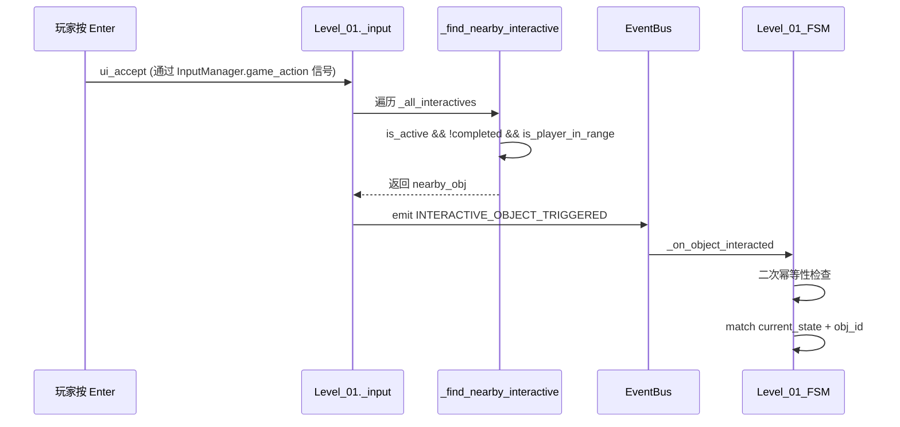

# HackathonGame 关卡技术架构报告（叙事驱动版）

> **目标读者**：关卡设计师 / 下游 AI 关卡设计助手
> **更新日期**：2026-06-15
> **引擎版本**：Godot 4.6 (GL Compatibility, GDScript)
> **项目版本**：v0.8.0（三关卡完成 + 双空间架构 + 跨关卡配置 + 玩家皮肤切换）
>
> **v0.8.0 变更摘要**：
> - Level_02「撕裂与沉溺」完整实现：11态状态机、单场景双空间、坠落循环、干扰期、长按Tab睁眼、配置篡改解谜、重编译流程
> - Level_03「赛博蜃景与真实回声」完整实现：6态状态机、无缝单坐标空间、世界异化演出、玩家皮肤切换、击退反转、异常数据光团收集
> - LevelConfig 新增 `player_scene_path` 字段，LevelBase._setup_player() 按配置加载皮肤
> - GameManager 新增 `dream_runtime_flags` 跨关卡配置字典（关卡2写入→关卡3读取应用）
> - 新增 4 种敌人：Enemy_LanternGhost / Enemy_CyberWolf / Enemy_CyberBull / Enemy_PaperEffigy + 配套 Config
> - 新增 PixelworkMapStitch 像素地图拼接系统（LevelModule/Scenes/）
> - 触发区（Area2D TriggerZone）系统：非交互一次性/可重复检测区，与 InteractiveObject 共存
> - `_enforce_level_restrictions()` 关卡级技能限制守卫（每帧强制维持被禁技能）
> - Level_03._swap_player_to_cyber() 运行时玩家皮肤切换（保留血量/朝向/位置，断连旧 InputManager 信号）
> - Level_03._start_screen_shake() 画面抖动（通过 SmoothCamera.offset 随机偏移实现）
> - Level_02 音效安全降级：_play_sfx_loop_safe() 资源不存在时跳过播放
>
> **v0.6.0 变更摘要（历史）**：
> - InputManager.gd Autoload 全面接管游戏操作输入（attack/dash/skill/accept 信号分发）
> - PlayerBase 迁移至 game_action 信号驱动，_handle_input() 清空攻击/冲刺/技能轮询
> - Level_01 叙事/对话/睡眠/IDE/终局状态全量接入 InputManager.block_input() 联动
> - 清理 InputManager 全部测试日志输出（5处 print）
>
> **v0.5.0 变更摘要（历史）**：
> - SmoothCamera 从 LevelModule/Common 迁移至 PlayerModule/Formal，预置于3个玩家预制体
> - 根治反向移动颤动（转向清零 + lookahead 去硬边界 + X轴去死区）
> - EventBus tree_exited 改为 unsubscribe_all（全量清理）
> - MainEntry 不再创建 Camera2D/HUD（避免重复/泄漏）
> - InteractiveObject 输入检测统一收归 Level_01

---

## 1. 项目元信息

| 属性 | 值 |
|---|---|
| 项目名称 | HackathonGame |
| 类型 | 2D 横向叙事探索游戏（类空洞骑士） |
| 屏幕分辨率 | 1280×720，canvas_items 拉伸 |
| 主场景 | `res://UI/TitleScreen.tscn`（工程启动入口；开始游戏后进入 `res://Global/MainEntry.tscn`） |
| 自测场景 | `res://LevelModule/SelfTest/LevelTest.tscn` |
| **5 个 Autoload** | `GlobalDefine`、`EventBus`、`GameManager`、**`InputManager`**、`KeybindManager` |
| 运行模式 | `FORMAL`（正式）/ `SELF_TEST`（自测） |
| 玩家外观 | Player_Warrior / Player_Warrior_Cyber / Player_Warrior_Lingnan |

---

## 2. 系统总览

### 2.1 分层架构

```
┌──────────────────────────────────────────────────────────┐
│ 入口层                                                   │
│   TitleScreen.gd / .tscn (工程启动入口, 菜单/自测/正式模式) │
│   MainEntry.gd / .tscn   (正式流程容器, emit GAME_START)  │
│   注意: MainEntry 不再创建 Camera2D 和 HUD (由预制体/关卡接管) │
├──────────────────────────────────────────────────────────┤
│ 关卡控制层（叙事驱动）                                    │
│   Level_01.gd            (关卡1主控/7态叙事状态机)        │
│   ├── Level_01_SceneBuilder.gd   (地形/交互物/UI 构建)  │
│   ├── Level_01_FSM.gd            (7 态叙事状态机)        │
│   ├── Level_01_UIBuilder.gd      (Canvas UI 纯代码构建)  │
│   ├── InteractiveObject.gd       (交互物基类 Area2D)     │
│   Level_02.gd            (关卡2主控/11态双空间状态机)     │
│   ├── Level_02_SceneBuilder.gd   (梦境/现实双空间构建)   │
│   ├── Level_02_FSM.gd            (11 态双空间状态机)     │
│   ├── Level_02_UIBuilder.gd      (干扰/睁眼/配置/重编UI) │
│   Level_03.gd            (关卡3主控/6态无缝空间状态机)     │
│   ├── Level_03_SceneBuilder.gd   (四区域单坐标空间构建)   │
│   ├── Level_03_FSM.gd            (6 态战斗+收集状态机)   │
│   └── Level_03_UIBuilder.gd      (代码雨/Glitch/温暖光晕) │
├──────────────────────────────────────────────────────────┤
│ 角色层                                                   │
│   Player_Warrior (.tscn)   - CharacterBody2D             │
│     └─ SmoothCamera (.tscn/.gd) - 平滑跟随摄像机(内置)    │
│   Player_Warrior_Cyber (.tscn) - 赛博皮肤 + SmoothCamera  │
│   Player_Warrior_Lingnan (.tscn)- 岭南皮肤 + SmoothCamera  │
│   Enemy_Slime   (.tscn)    - CharacterBody2D             │
│   TestRunnerCharacter      - SubViewport 预览用           │
├──────────────────────────────────────────────────────────┤
│ 数据配置层（纯 Resource，不挂节点）                        │
│   LevelConfig.gd  →  Level01/02/03Config.tres  (关卡数值+玩家皮肤路径)│
│   Level01Data.gd →  Level01Data.tres      (关卡1叙事文本) │
│   Level02Data.gd →  Level02Data.tres      (关卡2叙事+谜题+音效挂点) │
│   Level03Data.gd →  Level03Data.tres      (关卡3对话+战斗+光团坐标) │
│   PlayerConfig / EnemyConfig / SkillConfig (.tres)        │
├──────────────────────────────────────────────────────────┤
│ 基础设施层（Autoload）                                   │
│   GlobalDefine   (枚举/碰撞层常量/事件名常量)              │
│   EventBus       (跨模块唯一事件通信通道, 全量tree_exited)  │
│   GameManager    (player_ref/current_level/enemy_list)    │
│   InputManager   (统一输入管理, 信号分发, block/unblock)   │
│   KeybindManager (键位配置/重绑定持久化)                   │
└──────────────────────────────────────────────────────────┘
```

### 2.2 核心设计原则

1. **叙事驱动**：关卡 = 状态机 + 交互物 + 文案数据。设计师只需要编辑 `.tres` 与子类 `.gd`，不必碰核心系统。
2. **代码构建场景**：地形、墙壁、UI 全部用 `_create_static_body()` / `_create_interactive()` / `Level_XX_UIBuilder` 等代码 API 创建，关卡 `.tscn` 只挂脚本与资源引用。
3. **事件总线唯一通信**：跨模块通信全部走 `EventBus.emit/subscribe`，严禁跨层直接 `get_node()`。
4. **碰撞层语义化**：所有 `collision_layer/mask` 必须用 `GlobalDefine.Collision.*` 常量，禁止写数字。
5. **数据驱动前置逻辑**：交互物之间的解锁条件（如"床交互≥4次解锁电脑"）由主控层布尔判定 + `is_active` 控制，不硬编码在 FSM 中。
6. **摄像机归玩家**：SmoothCamera 作为子节点预置于每个玩家预制体内，不再由 LevelBase 或 MainEntry 动态创建。
7. **双空间碰撞隔离**（v0.8.0）：隐藏空间必须同时禁用碰撞 + 停用交互物 + 禁用内嵌物理阻挡体，防止同坐标系下碰撞泄漏。
8. **跨关卡配置传递**（v0.8.0）：通过 `GameManager.dream_runtime_flags` 字典跨关卡传递状态，关卡入口 `_apply_dream_runtime_flags()` 读取应用。
9. **关卡级限制守卫**（v0.8.0）：`_enforce_level_restrictions()` 在 `_process()` 中每帧强制维持被禁技能状态，防止任何外部路径意外恢复。

---

## 3. 全局系统接口（强制约束）

### 3.1 `GlobalDefine` 常量（不可修改）

```gdscript
# 碰撞层（必须使用常量，禁止硬编码数字）
class Collision:
    const TERRAIN  := 1   # 地形
    const ENEMY    := 2   # 敌人
    const PLAYER   := 4   # 玩家
    const INTERACT := 8   # 交互物（InteractiveObject 用 layer=0 + mask=PLAYER）

# 事件名（统一管理，避免拼写错误）
class EventName:
    # 玩家
    const PLAYER_SPAWNED      = "player_spawned"
    const PLAYER_DIED         = "player_died"
    const PLAYER_HURT         = "player_hurt"
    const PLAYER_ATTACK_HIT   = "player_attack_hit"
    const PLAYER_STATE_CHANGED = "player_state_changed"
    # 敌人
    const ENEMY_SPAWNED       = "enemy_spawned"
    const ENEMY_DIED          = "enemy_died"
    const ENEMY_HURT          = "enemy_hurt"
    const ENEMY_DETECTED      = "enemy_detected"
    # 游戏
    const GAME_START          = "game_start"
    const GAME_PAUSE          = "game_pause"
    const GAME_RESUME         = "game_resume"
    const GAME_OVER           = "game_over"
    const LEVEL_LOADED        = "level_loaded"
    const LEVEL_COMPLETE      = "level_complete"
    # 交互
    const INTERACTIVE_OBJECT_TRIGGERED = "interactive_object_triggered"
    # 伤害
    const DAMAGE_APPLIED      = "damage_applied"
    const HEALTH_CHANGED      = "health_changed"

# 玩家/敌人/伤害/运行模式枚举（IDLE/RUN/JUMP/...）
enum PlayerState { IDLE, RUN, JUMP, FALL, DASH, ATTACK, SKILL, HURT, DEAD }
enum EnemyState  { IDLE, PATROL, CHASE, ATTACK, HURT, DEAD }
enum DamageType  { PHYSICAL, MAGIC, TRUE_DAMAGE }
enum RunMode     { FORMAL, SELF_TEST }
```

### 3.2 `EventBus` API

```gdscript
EventBus.subscribe(event_name: String, node: Node, method: String)
EventBus.unsubscribe(event_name: String, node: Node)
EventBus.unsubscribe_all(node: Node)            # 清除某节点全部订阅
EventBus.emit(event_name: String, data: Dictionary)
EventBus.emit_deferred(event_name: String, data: Dictionary)
```

**自动清理机制（v0.5.0 更新）**：

```gdscript
# subscribe() 时自动连接 node 的 tree_exited 信号 (CONNECT_ONE_SHOT)
# 节点销毁时回调 _on_subscriber_tree_exited(node):
#     → unsubscribe_all(node)  ← 一次性清除该节点的所有事件订阅
# （旧版只清单个事件，已修复为全量清理）
```

**关卡关键事件 data 字典约定**：

| 事件 | data |
|---|---|
| `LEVEL_LOADED` | `{"level": self}`（LevelBase 末尾自动 emit） |
| `LEVEL_COMPLETE` | `{"level": self, "next_level": "res://..."}`（关卡结束 emit） |
| `INTERACTIVE_OBJECT_TRIGGERED` | `{"object_id": "box"}`（输入层 emit，FSM 消费） |
| `GAME_START` | `{}`（MainEntry 入口 emit） |
| `ENEMY_DIED` | `{"enemy": Node2D, "exp_reward": int}` |
| `PLAYER_DIED` | `{"player": Node2D}` |
| `HEALTH_CHANGED` | `{"target": Node, "current_health": int, "max_health": int}` |

> 设计师新增交互事件时，请用命名空间式字符串（如 `level01.box_interacted`），并在 `Level_01_FSM` 中订阅。

### 3.3 `GameManager` API

```gdscript
var player_ref: Node2D         # 当前玩家（只读）
var current_level: Node        # 当前关卡（LevelBase 写入）
var enemy_list: Array[Node2D]  # 存活敌人
var dream_runtime_flags: Dictionary = {}  # ★ v0.8.0: 跨关卡梦境配置（关卡2写入→关卡3读取）

register_player(player)             # LevelBase._setup_player 自动调用
register_enemy(enemy)               # 敌人 _ready 自动调用
unregister_enemy(enemy)             # 敌人 die() 自动调用
get_enemies() -> Array[Node2D]      # 过滤无效引用
get_nearest_enemy(pos) -> Node2D
trigger_game_over() / toggle_pause() / is_self_test() / is_formal()
```

> **跨关卡配置机制（v0.8.0 新增）**：关卡2「配置篡改」谜题完成后将 `dream_runtime_flags` 写入 GameManager（如 `player_damage_reduction=true, base_jump_height=99, allow_external_signal=false, dream_version="2.0"`），关卡3 在 `_on_ready()` 中通过 `_apply_dream_runtime_flags()` 读取并应用（如启用二段跳）。

### 3.4 `InputManager` API（v0.6.0 新增）

```gdscript
## 游戏操作输入信号（仅未屏蔽 + 未暂停 + 无 UI 焦点时发射）
signal game_action(action: StringName, event: InputEvent)

## 订阅者: PlayerBase(attack/dash/skill), Level_01(ui_accept)
## 使用方式:
##   InputManager.game_action.connect(_on_game_action)
##   func _on_game_action(action: StringName, event: InputEvent): ...

var is_input_blocked: bool   # 输入屏蔽标志（只读）
var block_reason: String     # 屏蔽原因（调试用）

block_input(reason: String, caller: Node)   # 请求屏蔽游戏输入
unblock_input(reason: String)                # 取消屏蔽游戏输入
```

**输入分发规则**：

| 动作键 | 分发方式 | 订阅者 |
|--------|---------|--------|
| `player_attack` | `game_action` 信号 | PlayerBase._on_game_action |
| `player_dash` | `game_action` 信号 | PlayerBase._on_game_action |
| `player_skill` | `game_action` 信号 | PlayerBase._on_game_action |
| `ui_accept` | `game_action` 信号 | Level_01._on_game_action |
| `ui_pause` (ESC) | **独占处理** | InputManager._handle_pause（不受守卫影响） |
| `player_jump` | **保留轮询** | PlayerBase._input_jump_just_pressed（需连续状态） |
| `ui_left/right/up/down` | **保留轮询** | PlayerBase._get_input_direction（需每帧向量） |

**守卫逻辑**（以下条件任一满足则阻断 `game_action` 信号发射）：
- `GameManager.is_paused == true`
- `is_input_blocked == true`（外部调用 block_input）
- UI 焦点在 Control 节点上

---

## 4. 关卡设计框架

### 4.1 模块划分（4 文件拆分原则）

每个叙事关卡由以下 4 个脚本 + 2 个资源 + 1 个场景组成（三关卡均遵循此原则）：

| 模块 | 文件模式 | 职责 | 依赖 |
|------|---------|------|------|
| **主控** | `Level_XX.gd` | 生命周期/输入分发/叙事编排/摄像机限制配置/InputManager联动 | LevelBase, EventBus, GameManager, InputManager |
| **场景构建** | `Level_XX_SceneBuilder.gd` | 地形/交互物/出生点/Canvas 挂载 | 主控的 `_create_*` 方法 |
| **状态机** | `Level_XX_FSM.gd` | 状态调度 + 交互分发 + 幂等性防线 | 主控的公共方法 |
| **UI 构建** | `Level_XX_UIBuilder.gd` | CanvasLayer 下所有 UI 纯代码构建 | 主控的 UI 引用字段 |
| **关卡数值** | `LevelXXConfig.tres` | 地图尺寸/摄像机边界/出生点/背景色 | LevelConfig.gd |
| **关卡叙事** | `LevelXXData.tres` | 所有文案/对话/状态分支文本 | LevelXXData.gd |
| **场景文件** | `Level_XX.tscn` | 最小化：只挂脚本与资源引用 | — |

**模块间调用规则**：

```
SceneBuilder ──创建──▶ 主控的交互物/地形字段
FSM          ──调用──▶ 主控的公共方法（_show_narrative, _freeze_player 等）
UIBuilder    ──写入──▶ 主控的 UI 引用字段（_narrative_panel 等）
主控         ──读取──▶ Config/Data 资源
```

> **严格约束**：FSM 和 SceneBuilder 之间不直接通信，一切通过主控中转。

### 4.2 核心机制

#### 4.2.1 交互物检测与触发

交互物检测采用**双重保障**机制：

1. **Area2D 信号**（`body_entered/exited`）—— 理想路径，帧精度
2. **轮询检测**（`check_player_in_range`）—— 兜底路径，解决 `_ready` 时序与 `collision_layer` 不匹配

输入触发流程（v0.5.0 统一化后）：



> **关键变更（v0.5.0）**：`InteractiveObject._process()` 不再检测 `ui_accept`。输入完全由 `Level_01._input()` 统一分发（通过 InputManager.game_action 信号），消除三路重复触发隐患。
> **关键变更（v0.6.0）**：`ui_accept` 不再由 Level_01._input() 直接轮询，而是通过 InputManager.game_action 信号传递到 Level_01._on_game_action() 回调。

#### 4.2.2 叙事面板生命周期

```
_show_narrative(text)
  ├── InputManager.block_input("叙事面板", self)   # v0.6.0: 阻断游戏操作
  ├── _is_interacting = true, _narrative_open = true
  ├── _freeze_player(true)
  ├── panel.show(), text = text
  ├── await 0.3s（防误触）
  ├── while _narrative_open && timeout:
  │     等待 _narrative_enter_pressed（由 _on_game_action/ui_accept 设置）
  ├── panel.hide()
  ├── _freeze_player(false)
  ├── InputManager.unblock_input("叙事面板")        # v0.6.0: 恢复游戏操作
  ├── _narrative_open = false, _is_interacting = false
  └── callback.call()（如有）
```

> **关键**：`_narrative_enter_pressed` 标志由 `_on_game_action` 在 `ui_accept` 分支设置（v0.6.0 通过信号回调），而非依赖 `Input.is_action_just_pressed`（后者在 await 间隔中不可靠）。

#### 4.2.3 交互物前置解锁

交互物之间的解锁关系通过主控层的布尔判定 + `InteractiveObject.is_active` 控制：

```gdscript
# 示例：床交互≥4次解锁电脑
func _try_unlock_computer() -> void:
    if sleep_count < 4: return
    if _computer_node.is_active: return
    _computer_node.is_active = true

# 调用时机：每次睡眠循环结束后
func _trigger_sleep_cycle():
    ...
    sleep_count += 1
    await _show_narrative(sleep_text)
    _try_unlock_computer()
    ...
```

**设计规范**：
- 初始 `is_active = false` 在 `SceneBuilder._build_interactives()` 中设置
- 解锁条件判断放在主控的独立方法中（`_try_unlock_*`）
- FSM 不需要关心解锁逻辑——未解锁的交互物 `is_active=false`，`_find_nearby_interactive` 自动跳过

#### 4.2.4 睡眠循环机制

```
_trigger_sleep_cycle()
  ├── InputManager.block_input("睡眠循环", self)   # v0.6.0: 阻断游戏操作
  ├── _freeze_player(true)
  ├── 渐黑动画 1s
  ├── await _show_narrative(sleep_text)
  ├── _try_unlock_computer()
  ├── _freeze_player(true)  （叙事解冻后重新冻结，渐亮期间保持）
  ├── _sleep_fading = true  （防止 _process 误清交互锁）
  ├── 渐亮动画 1s
  ├── InputManager.unblock_input("睡眠循环")        # v0.6.0: 恢复游戏操作
  └── 回调: _freeze_player(false), _safe_end_interaction(), bed.reset_completed()
```

> **`_sleep_fading` 标志**：睡眠渐变期间 `_process` 的防御性自愈逻辑不清除 `_is_interacting`，防止动画期间交互锁被误杀。

#### 4.2.5 单场景双空间架构（Level_02，v0.8.0）

关卡2「撕裂与沉溺」采用**单场景双空间**设计：梦境世界（DreamWorldRoot）和现实房间（RealityRoomRoot）共存于同一 `.tscn` 的同一坐标系中，通过显隐+碰撞联动切换：

```
DREAM_ATTIC/STREET/CLIFF/INTERFERENCE  →  _dream_root.visible=true, 碰撞启用
                                           _reality_root.visible=false, 碰撞禁用
WAKING_HOLD_TAB → REALITY_PHONE_LOCKED  →  _dream_root.visible=false, 碰撞禁用
                                           _reality_root.visible=true, 碰撞启用
```

**关键设计**：
- **碰撞隔离**：`_set_space_collision(root, enabled)` 递归遍历子节点，启用/禁用所有 `StaticBody2D.CollisionShape2D.disabled`。隐藏空间必须同时禁用碰撞，否则地形互相干涉。
- **交互物停用**：空间切换时，旧空间的 InteractiveObject 必须同步 `set_active(false) + visible=false`，并禁用其内嵌物理阻挡体（如藤椅的 StaticBody2D），否则跨空间碰撞泄漏。
- **梦境交互物坐标**：藤椅等梦境交互物的 Indicator/物理阻挡 可能落在现实房间范围内，切换时必须彻底停用。
- **相机 limit 缩放**：梦境世界大地图（6192px）→ 现实房间小地图（1920px），睁眼转场时需调用 `_set_camera_limits()` 收缩边界。

#### 4.2.6 触发区系统（v0.8.0）

非交互触发器（Area2D）用于检测玩家进入区域并触发状态推进/叙事，与 InteractiveObject 互补：

```gdscript
# 创建触发区（SceneBuilder 调用）
func _create_trigger_zone(zone_name: String, pos: Vector2, size: Vector2) -> Area2D:
    var area = Area2D.new()
    area.collision_layer = 0      # 不参与物理碰撞
    area.collision_mask = GlobalDefine.Collision.PLAYER  # 仅检测玩家
    area.monitoring = true
    area.monitorable = false
    # ... CollisionShape2D ...
    return area

# 连接信号
level._street_entry_trigger.body_entered.connect(level._on_street_entry_body_entered)
```

**触发区 vs 交互物对比**：

| 属性 | 触发区（Area2D） | 交互物（InteractiveObject） |
|------|-------------------|---------------------------|
| 触发方式 | 玩家踏入自动触发 | 玩家踏入 + 按 Enter |
| 类 | Area2D | Area2D（子类化） |
| 碰撞层 | layer=0, mask=PLAYER | layer=0, mask=PLAYER |
| 典型用途 | 状态推进、一次性区域事件 | 对话/交互、可重复或幂等操作 |
| 防重复 | 布尔标志（如 `has_entered_street`） | `completed` + `allow_repeat` |

**关卡2触发区**：老街进入触发、断崖接近触发、坠落深渊触发
**关卡3触发区**：AI阻挠弹窗触发1/2

#### 4.2.7 关卡级技能限制守卫（v0.8.0）

关卡2引入 `_enforce_level_restrictions()` 在 `_process()` 中**每帧强制维持**被禁技能状态，防止任何外部路径意外恢复：

```gdscript
# Level_02: 禁用二段跳（梦境规则限制，坠落循环是核心机制）
func _enforce_level_restrictions() -> void:
    var player = GameManager.player_ref
    if not player or not is_instance_valid(player): return
    if player.can_double_jump:
        player.can_double_jump = false

# Level_03: 战斗阶段强制保障攻击/冲刺/技能开启
func _enforce_level_restrictions() -> void:
    var player = GameManager.player_ref
    if not player or not is_instance_valid(player): return
    if current_state not in [LevelState.LEVEL_END_TRANSIT]:
        if not player.can_attack: player.can_attack = true
        if not player.can_dash: player.can_dash = true
        if not player.can_skill: player.can_skill = true
```

> **设计约束**：关卡级限制在关卡模块内拦截，**不修改 PlayerBase 核心代码**。

#### 4.2.8 运行时玩家皮肤切换（Level_03，v0.8.0）

关卡3在世界异化演出期间调用 `_swap_player_to_cyber()` 将玩家从岭南皮肤切换为赛博皮肤：

```gdscript
func _swap_player_to_cyber() -> void:
    var old_player = GameManager.player_ref
    # 1. 保存状态
    var saved_health = old_player.current_health
    var saved_max_health = old_player.max_health
    var saved_facing_right = old_player.is_facing_right
    # 2. 断连旧 InputManager 信号（防止幽灵订阅）
    if InputManager.game_action.is_connected(old_player._on_game_action):
        InputManager.game_action.disconnect(old_player._on_game_action)
    # 3. 注销+销毁旧玩家
    GameManager.player_ref = null
    old_player.queue_free()
    # 4. 实例化新皮肤+恢复状态
    var new_player = load(cyber_path).instantiate()
    add_child(new_player)
    new_player.current_health = saved_health
    new_player.max_health = saved_max_health
    new_player.global_position = old_player.global_position
    GameManager.register_player(new_player)  # 触发 PLAYER_SPAWNED，新玩家自动订阅 InputManager
```

> **关键**：必须断连旧玩家的 `InputManager.game_action` 信号，否则旧节点 `queue_free()` 前的幽灵订阅可能导致运行时错误。

#### 4.2.9 画面抖动（Level_03，v0.8.0）

世界异化演出使用 SmoothCamera.offset 实现画面抖动，不修改 SmoothCamera 内部逻辑：

```gdscript
func _start_screen_shake(duration: float) -> void:
    var cam = player.get_node_or_null("SmoothCamera") as SmoothCamera
    var original_offset = cam.offset
    var tween = create_tween()
    for i in range(int(duration * 20)):
        var shake_amount = 8.0 * (1.0 - float(i) / (duration * 20.0))  # 衰减
        tween.tween_property(cam, "offset", Vector2(randf_range(-shake_amount, shake_amount),
            randf_range(-shake_amount, shake_amount)), 0.05)
    tween.tween_property(cam, "offset", original_offset, 0.1)  # 归位
```

#### 4.2.10 击退反转（Level_03，v0.8.0）

赛博阶段敌人击中后玩家向**左**击退（而非正常方向），强化"梦境规则被篡改"的叙事：

```gdscript
# Level_03._on_player_hurt() 监听 PLAYER_HURT 事件
if current_state in [LevelState.CYBER_CITY, LevelState.MEMORY_COLLECTION]:
    player.velocity.x = -KNOCKBACK_REVERSE_FORCE  # 350.0，向左

# 伤害减免（跨关卡配置生效）
var has_damage_reduction = GameManager.dream_runtime_flags.get("player_damage_reduction", false)
if has_damage_reduction:
    var heal_amount = data.get("damage", 0) / 2
    player.current_health = mini(player.current_health + heal_amount, player.max_health)
```

#### 4.2.11 音效安全降级（Level_02，v0.8.0）

关卡2音效资源路径存于 Level02Data，播放时检查资源是否存在，不存在则跳过：

```gdscript
func _play_sfx_loop_safe(path: String) -> AudioStreamPlayer:
    if path == "" or not ResourceLoader.exists(path):
        return null  # 安全跳过，不阻断流程
    var stream = load(path) as AudioStream
    if not stream: return null
    var player = AudioStreamPlayer.new()
    player.stream = stream
    add_child(player)
    player.finished.connect(func(): if is_instance_valid(player): player.play())
    player.play()
    return player
```

### 4.3 数据流转

#### 4.3.1 完整交互数据流（v0.6.0 更新）

```
玩家按 Enter
  └─▶ InputManager._unhandled_input()
        ├─ 守卫检查(pass) → _identify_game_action("ui_accept")
        └─▶ _emit_action("ui_accept", event)
              └─▶ game_action 信号发射
                    └─▶ Level_01._on_game_action("ui_accept")
                          ├─ 叙事打开? → _narrative_enter_pressed = true → return
                          ├─ IDE_CHAT? → _render_next_chat_line() → return
                          ├─ 冻结/冷却? → 防御性自愈检查 → return
                          └─ 常规路径:
                                └─▶ _find_nearny_interactive() 遍历 _all_interactives
                                      └─▶ 找到 is_active && !completed && is_player_in_range
                                └─▶ EventBus.emit(INTERACTIVE_OBJECT_TRIGGERED, {object_id})
                                      └─▶ Level_01._on_object_interacted(data)
                                            └─▶ _run_safely(func(): _fsm.handle_interaction(obj_id))
                                                  └─▶ match current_state + obj_id
```

#### 4.3.2 二次幂等性防线

```
InteractiveObject.completed（第一防线，_find_nearby_interactive 过滤）
    +
FSM 入口 obj_ref.completed（第二防线，handle_interaction 顶部检查）
    =
确保玩家在叙事面板读完后再次按 Enter 不会重复触发剧情
```

设计师在 FSM 中**必须**先调 `level._mark_interaction_completed(obj_id)` 再做副作用。

### 4.4 SmoothCamera 通用摄像机（v2.0）

**路径**：`res://PlayerModule/Formal/SmoothCamera.gd`
**位置**：作为 Camera2D 子节点预置于每个玩家预制体内

**架构变更（v0.5.0）**：

| 旧架构 | 新架构 |
|--------|--------|
| `LevelModule/Common/SmoothCamera.gd` | `PlayerModule/Formal/SmoothCamera.gd` |
| LevelBase._setup_camera() 动态创建 | 玩家 .tscn 内置, 无需动态创建 |
| Level_01._setup_smooth_camera() 升级 | Level_01._setup_camera_limits() 只配参数 |
| MainEntry._spawn_player() 创建裸 Camera2D | 已删除, 预制体自带 |
| 单一 Player_Warrior 支持 | Warrior/Cyber/Lingnan 三外观均含 |

**算法：Y轴死区 + X轴软死区(lookahead) + lerp插值 + 转向清零防颤**

```gdscript
每帧 _physics_process:
  1. 读取 target.global_position, 计算 _cam_offset
  2. 转向检测: player_vx 与 _lookahead_x 方向相反 → _lookahead_x = 0
     (防线1: 消除残留值对抗导致的单帧错跟)
  3. lookahead 计算(仅由 player_vx 控制, 不受 offset 死区约束):
     - abs(player_vx) > 0.1 → lerp 向目标方向增长
     - 否则 → lerp 衰减到 0
     (防线2: 消除 abs(offset)>deadzone 边界穿越导致的开关振荡)
  4. Y 轴死区: abs(offset.y) < deadzone_size.y → 锁定 cam_pos.y
     (垂直方向无 lookahead, 保留硬死区防上下微抖)
  5. X 轴无硬死区: lookahead 本身提供软死区(player_vx≈0 时自然衰减)
  6. lerp 插值: new_pos = cam_pos.lerp(target_with_lookahead, lerp_speed * delta)
  7. clamp 到 limit_left/right/top/bottom (DRAG_CENTER 模式公式)
  8. global_position = new_pos
```

**预制体架构**：

```
Player_Warrior.tscn
  ├── Sprite (AnimatedSprite2D)
  └── SmoothCamera (Camera2D, 子节点实例)
        └── script = SmoothCamera.gd
        └── set_as_top_level(true)  ← _ready 自动设置，脱离父节点 transform 干扰
        └── position_smoothing_enabled = false  ← 禁用引擎内置平滑，避免与脚本 lerp 双重插值
        └── _physics_process  ← 与玩家 CharacterBody2D 同步
        └── _auto_bind_target()  ← 优先 owner，fallback 到 GameManager.player_ref
```

**初始化时序**：

```
Player_Warrior._ready() → SmoothCamera 作为子节点随玩家实例化
  → SmoothCamera._ready()
    → set_as_top_level(true)
    → position_smoothing_enabled = false
    → anchor_mode = DRAG_CENTER
    → make_current()
    → set_process(false), set_physics_process(true)
    → _auto_bind_target()  ← 自动绑定 owner(Player_Warrior) 或 GameManager.player_ref
    → 安全默认值: limit_right/bottom 防止负值导致 clamp 短路

Level_01._on_ready() → _setup_camera_limits()
  → player.get_node_or_null("SmoothCamera")
  → cam.limit_left/right/top/bottom = level_config.camera_limit_*
  → cam.bind_target(player)  ← 立即对齐到玩家位置，避免开局抖动
```

**颤动根除记录（v0.5.0 迭代过程）**：

| 问题 | 尝试方案 | 结果 | 最终方案 |
|------|---------|------|---------|
| 反向移动颤动 | 方案B: 转向清零_lookahead_x | 减轻但未根治 | 保留(防线1) |
| 反向移动仍颤动 | 方案2: 删除X轴硬死区 | 减轻但未根治 | 保留 |
| 仍颤动 | 分析发现lookahead开关注册条件含abs(offset)>deadzone | **根因定位** | 删除该条件 |
| 最终 | lookahead只由player_vx控制, 无任何硬边界切换 | **根治** | 当前实现 |

---

## 5. 关卡系统核心接口

### 5.1 `LevelBase` 基类

**继承链**：`Node2D` → `LevelBase` → `Level_01` / `Level_02` / `Level_03`（子类）

**导出字段**：

```gdscript
@export var level_config: LevelConfig = null       # 含 player_scene_path (v0.8.0)
@export var enemy_spawn_points: Array[Marker2D] = []
@export var player_spawn_point: Marker2D = null
```

**生命周期（严格顺序，禁止在子类 `_ready` 中重做）**：

```
_ready()
├── _apply_config()          # 应用 LevelConfig.bg_color
├── _setup_camera()          # pass (相机已移交 SmoothCamera, 见 §4.4)
├── _setup_player()          # 若 player_ref 不存在则按 level_config.player_scene_path 实例化 ★ v0.8.0
├── _setup_enemies()         # 遍历 enemy_spawn_points 调 _spawn_enemy_at()
├── _setup_triggers()        # 虚函数
├── GameManager.current_level = self
├── EventBus.emit(LEVEL_LOADED, {"level": self})
└── _on_ready()              # 【子类入口】必须先 super._on_ready()
```

> **v0.8.0 变更**：`_setup_player()` 优先从 `level_config.player_scene_path` 加载玩家皮肤，关卡2/3 配置为 `Player_Warrior_Lingnan.tscn`。Level_03 额外重写了 `_setup_player()` 以支持赛博皮肤切换后的重新绑定。

**子类公共方法**（开箱即用）：

```gdscript
# 1. 静态地形（矩形 StaticBody2D + ColorRect）
create_ground(pos: Vector2, size: Vector2, color: Color = gray) -> StaticBody2D
create_wall(pos: Vector2, size: Vector2, color: Color = gray) -> StaticBody2D
# 内部 collision_layer = GlobalDefine.Collision.TERRAIN

# 2. 敌人实例化
spawn_enemy(enemy_scene_path: String, spawn_pos: Vector2) -> Node2D

# 3. 子类工具
get_or_create_child(node_name, type) -> Node
create_static_body(name, pos, size, color) -> StaticBody2D
create_interactive(name, obj_id, pos, size) -> InteractiveObject
add_physics_blocker(parent, size) -> void
```

**虚函数（子类重写点）**：

```gdscript
_on_ready()                         # 关卡入口（先 super）
_spawn_enemy_at(spawn_point) -> Node2D  # 标记点系统（Level_02/03 改用 SceneBuilder 内联生成）
_setup_triggers()                   # 触发器（Level_02/03 在 SceneBuilder._build_triggers() 中创建）
```

### 5.2 `LevelConfig` 资源

```gdscript
class_name LevelConfig extends Resource

@export_group("关卡信息")
@export var level_name: String = "未命名关卡"
@export var level_id: String = ""
@export var bgm_resource: AudioStream = null
@export var bg_color: Color = Color(0.1, 0.1, 0.2)

@export_group("摄像机")
@export var camera_limit_left: int = -10000
@export var camera_limit_right: int = 10000
@export var camera_limit_top: int = -10000
@export var camera_limit_bottom: int = 10000

@export_group("重生点")
@export var spawn_point: Vector2 = Vector2(100, 500)

@export_group("玩家")                          # ★ v0.8.0 新增
@export var player_scene_path: String = "res://PlayerModule/Formal/Player_Warrior.tscn"
# LevelBase._setup_player() 读取此字段加载对应皮肤预制体
# 关卡2使用 Player_Warrior_Lingnan, 关卡3初始也使用 Lingnan
```

> **v0.8.0 变更**：新增 `player_scene_path` 字段。`LevelBase._setup_player()` 优先从此字段加载玩家皮肤，而非硬编码 `Player_Warrior.tscn`。

### 5.3 `Level01Data` 资源

```gdscript
class_name Level01Data extends Resource

@export_category("Obstacle Narrative")
@export_multiline var obstacle_1_text: String
@export_multiline var obstacle_2_text: String

@export_category("Bedroom Detail Objects")
@export_multiline var notice_text: String
@export_multiline var thermos_text: String

@export_category("Bed Sleep Cycles")
@export var sleep_texts: Array[String]    # 多次睡眠循环使用

@export_category("AI IDE Dialogues")
@export var ide_speakers: Array[String]   # "System" / "AI" / "Ming"
@export_multiline var ide_texts: Array[String]

@export_category("Phone Climax")
@export_multiline var phone_sender: String
@export_multiline var phone_content: String
@export_multiline var climax_monologue: String
```

> **新关卡建议**：照搬这个结构为 `LevelXXData.gd` / `.tres`，避免把文案散落到 `.gd` 中。

### 5.4 `Level02Data` 资源（v0.8.0）

```gdscript
class_name Level02Data extends Resource

@export_category("Dream Attic")
@export_multiline var attic_intro_text: String
@export_multiline var window_text_l2: String
@export_multiline var attic_door_text: String

@export_category("Dream Street")
@export_multiline var rattan_chair_monologue: String
@export var street_enemy_spawn_points: Array[Vector2]

@export_category("Cliff Loop")
@export_multiline var cliff_first_sight_text: String
@export var cliff_safe_spawn: Vector2          # 坠落重置安全点
@export var interference_fall_threshold: int    # 坠落几次触发干扰
@export var dream_phone_echo_sender: String
@export_multiline var dream_phone_echo_text: String
@export var wake_hold_required: float           # 长按 Tab 时长(秒)

@export_category("Reality Room")
@export_multiline var wake_up_monologue: String
@export_multiline var computer_locked_text: String
@export_multiline var bed_locked_text: String
@export var reality_phone_sender: String
@export_multiline var reality_phone_content: String
@export_multiline var reality_phone_monologue: String

@export_category("IDE Chat")
@export var ide_speakers: Array[String]
@export_multiline var ide_texts: Array[String]

@export_category("Config Puzzle")
@export var config_item_ids: Array[String]       # 如 ["player_damage_reduction", ...]
@export var config_item_labels: Array[String]
@export var config_initial_values: Array[String]
@export var config_target_values: Array[String]
@export var config_initial_display: Array[String]  # UI中文显示(空则回退到values)
@export var config_target_display: Array[String]
@export var config_success_feedbacks: Array[String]
@export var recompilation_lines: Array[String]   # 重编译日志
@export_multiline var compile_success_text: String
@export_multiline var bed_unlocked_text: String

@export_category("Audio Hooks")                   # ★ 音效安全降级挂点
@export var sfx_phone_vibrate_path: String       # 资源不存在时跳过
@export var sfx_electric_noise_path: String
@export var bgm_dream_warm_path: String

@export_category("Ending")
@export_multiline var dream_rebuilt_text: String
@export var next_level_path: String
```

### 5.5 `Level03Data` 资源（v0.8.0）

```gdscript
class_name Level03Data extends Resource

# 阶段1: 凉茶铺对话
@export var grandpa_dialogues: Array[Dictionary]  # [{speaker, text}, ...]
@export var grandpa_glitch_text: String
@export var ming_realization_text: String

# 阶段2: 岭南街巷战斗
@export var lingnan_enemy_count: int = 5
@export var lingnan_enemy_spawn_points: Array[Vector2]

# 阶段3: 世界异化
@export var codebuddy_broadcast_lines: Array[String]

# 阶段4: 赛博城探索
@export var ai_warning_1_text: String
@export var ai_warning_2_text: String

# 阶段5: 异常数据光团（全局坐标，赛博城偏移+3600后）
@export var memory_echo_1_pos: Vector2 = Vector2(12000, 550)
@export var memory_echo_2_pos: Vector2 = Vector2(14400, 550)
@export var memory_echo_1_subtitle: String
@export var memory_echo_1_codebuddy: String
@export var memory_echo_2_subtitle: String
@export var memory_echo_2_codebuddy: String

# 阶段6: 觉醒
@export var awakening_monologue: String
@export var override_protocol_text: String
@export var next_level_path: String

# 敌人刷新点（赛博阶段，全局坐标已偏移+3600）
@export var cleaner_spawn_points: Array[Vector2]
@export var security_spawn_points: Array[Vector2]
```

---

## 6. 交互物系统 `InteractiveObject`

### 6.1 节点类型与碰撞层

- 节点类型：`Area2D`
- `collision_layer = 0`（不参与物理碰撞）
- `collision_mask  = GlobalDefine.Collision.PLAYER`（仅检测玩家）
- 内部通过 `body_entered / body_exited` 信号 + `_poll` 轮询双重判定玩家是否进入范围

### 6.2 导出字段

```gdscript
@export var object_id: String = ""         # 必须唯一："box" / "clothes" / "bed" / ...
@export var is_active: bool = true         # false 时玩家进入不显示提示，不可交互
@export var prompt_text: String = "按 Enter 交互"
@export var allow_repeat: bool = false     # true 时可重复交互（床、镜子等）
```

### 6.3 内部状态机

```
is_active=false     → 玩家进入不显示提示，_find_nearby_interactive 跳过
completed=false     → 黄字呼吸闪烁 "按 Enter 交互"
completed=true      → 灰字静态 "已完成 ✓"
allow_repeat=true   → 触发完成后可调 reset_completed() 重置
```

### 6.4 公共方法

```gdscript
mark_completed()    # 标记完成（幂等性）
reset_completed()   # 仅 allow_repeat=true 才生效
set_active(bool)    # 启用/禁用并隐藏提示
freeze_monitoring(frozen: bool)  # 冻结/解冻时控制 monitoring，防止 body_exited 误触发
check_player_in_range(player: Node2D)  # 轮询式玩家检测（距离判定: 中心距 ≤ 半径和+容差）
```

### 6.5 信号

```gdscript
signal player_entered  # 已声明（保留供外部订阅，内部用 is_player_in_range 布尔值）
signal player_exited    # 已声明（保留供外部订阅，内部用 is_player_in_range 布尔值）
```

### 6.6 输入处理设计（v0.5.0 变更）

```
旧架构(v0.4.0及之前):
  InteractiveObject._process() 检测 ui_accept → emit("interactive_object_triggered")
  Level_01._input() 也检测 ui_accept → emit("interactive_object_triggered")
  → 双重触发!

新架构(v0.5.0+):
  InteractiveObject._process(): 不再检测 ui_accept, 仅负责视觉提示和范围检测
  Level_01._input(): 统一检测 ui_accept → _find_nearby_interactive() → emit
  → 单一触发路径, 幂等性有保障

v0.6.0 进一步演化:
  Level_01._input() 不再直接轮询 ui_accept
  改为 InputManager.game_action("ui_accept") 信号回调到 Level_01._on_game_action()
  _input() 降级为纯兜底（仅 InputManager 未拦截时触发），且必须检查 block_input 守卫
  → 信号统一入口, block/unblock 可控, 无守卫绕过风险
```

> **关键设计**：交互物**不**自己处理 `ui_accept` 输入。输入由 InputManager 统一分发 → Level_01 处理 → EventBus 派发到 FSM。这一设计解决了"动态 `_ready` 创建的节点 `_input()` 不可靠"的问题。

---

## 7. 关卡主控 `Level_01` 拆解（关卡2见 §7B，关卡3见 §7C）

### 7.1 文件结构（拆分原则）

| 文件 | 职责 | 行数参考 |
|---|---|---|
| `Level_01.gd` | 主控/状态调度/输入/玩家控制/叙事编排/Glitch 终局/InputManager联动 | ~700 |
| `Level_01_SceneBuilder.gd` | 地形 + 交互物 + 出生点 + Canvas UI 挂载 | ~84 |
| `Level_01_FSM.gd` | 7 态叙事状态机 + 交互处理 | ~118 |
| `Level_01_UIBuilder.gd` | SleepOverlay / NarrativePanel / IdeUI / GlitchOverlay | ~205 |
| `InteractiveObject.gd` | 交互物基类（可被新关卡复用） | ~177 |
| `SmoothCamera.gd` | 通用死区+lerp+lookahead 摄像机 | ~143 |
| `SmoothCamera.tscn` | Camera2D 预制场景（Player_Warrior 子节点） | ~7 |

### 7.2 7 态叙事状态机（`Level_01.LevelState`）

```gdscript
enum LevelState {
    LIVING_ROOM,        # 客厅：纸箱阻塞
    CORRIDOR,           # 走廊：衣服阻塞
    BEDROOM,            # 卧室：床（多次睡眠循环）+ 电脑（需前置解锁）
    IDE_CHAT,           # AI IDE 对话
    IDE_PREVIEW,        # SubViewport 预览 → 触发崩溃
    PHONE_RINGING,      # 手机震动 + 接听
    GLITCH_TRANSIT      # 终局：glitch 着色器 → emit LEVEL_COMPLETE
}
```

**状态流转图**：

```
                     ┌──────────────┐
   [进入关卡] ───▶    │ LIVING_ROOM  │ ── 交互 box ──▶ CORRIDOR
                     └──────────────┘

                     ┌──────────────┐
                     │   CORRIDOR   │ ── 交互 clothes ──▶ BEDROOM
                     └──────────────┘

   ┌──────────────────────────────────────────────────────────────┐
   │ BEDROOM                                                      │
   │   ── 交互 bed (×N)       ──▶ 睡眠叙事循环                    │
   │   ── bed 交互≥4次后       ──▶ 电脑解锁 (is_active=true)      │
   │   ── 交互 computer       ──▶ IDE_CHAT                       │
   │   ── 交互 notice/thermos ──▶ 一次性叙事                      │
   └──────────────────────────────────────────────────────────────┘

   IDE_CHAT ── 对话全部渲染完 ──▶ IDE_PREVIEW
   IDE_PREVIEW ── TestRunner 出界/8s超时 ──▶ PHONE_RINGING
   PHONE_RINGING ── 交互 phone ──▶ GLITCH_TRANSIT
   GLITCH_TRANSIT ── 交互 bed ──▶ 终局链 → emit LEVEL_COMPLETE
```

### 7.3 入口初始化（`Level_01._on_ready`，v0.6.0 更新）

```gdscript
func _on_ready() -> void:
    super._on_ready()

    if not level_config:
        level_config = load("res://DataConfig/Level/Level01Config.tres") as LevelConfig
        _apply_config()
    if not level_data:
        level_data = load("res://DataConfig/Level/Level01Data.tres") as Level01Data

    var builder = Level_01_SceneBuilder.new(self)
    builder.build_all()           # 地形/交互物/出生点/Canvas UI

    # SmoothCamera 已在 Player_Warrior.tscn 里预制为子节点，
    # 这里只需要把 level_config 的 limit 参数传给玩家身上的 SmoothCamera
    _setup_camera_limits()

    _cache_ui_refs()              # 把 UI 子节点缓存到私有字段
    _restrict_player_mechanics()  # 关卡禁用跳跃/攻击/冲刺（叙事期）
    _restore_player_mechanics()   # 立即恢复（can_* 开关交由 InputManager.block 控制）

    # 初始化交互物统一列表（SceneBuilder 已设置 is_active 初始值）
    _all_interactives = [_obstacle_box, _obstacle_clothes, _bed_node,
                         _computer_node, _phone_node, _notice_node, _thermos_node]

    EventBus.subscribe(GlobalDefine.EventName.INTERACTIVE_OBJECT_TRIGGERED, self, "_on_object_interacted")
    _fsm = Level_01_FSM.new(self)
    _ensure_player_collision_layer()
    set_process(true)             # 启用 _process：冷却递减 + 交互物轮询
```

### 7.4 InputManager block/unblock 联动表（v0.6.0）

Level_01 中所有叙事/对话/状态切换点的 block/unblock 配对：

| 状态切换 | block 原因 | unblock 原因 | 触发位置 |
|---------|-----------|-------------|---------|
| 进入叙事面板 | `"叙事面板"` | `"叙事面板"` | `_show_narrative()` 进/出 |
| 进入睡眠循环 | `"睡眠循环"` | `"睡眠循环"` | `_trigger_sleep_cycle()` 进/两条退出路径 |
| 进入 IDE 对话 | `"IDE对话"` | `"IDE对话"` | `_enter_ide_mode()` / `_on_preview_crashed()` |
| 进入终局叙事 | `"终局叙事"` | `"终局叙事"` | `_trigger_climax_transition()` / GLITCH_TRANSIT |
| 进入终局转场 | `"终局转场"` | *(永不解除)* | `_on_final_bed_trigger()` |
| 防御性解除 | — | `"终局转场"` | `_emit_level_complete()` |

### 7.5 SceneBuilder 调用顺序

```
build_all()
├── _build_terrain()        # 地面 + 左墙 + 右墙
├── _build_interactives()   # box / clothes / notice / thermos / computer / phone / bed
├── _build_spawn_points()   # PlayerSpawnPoint Marker2D
└── _build_canvas_ui()      # CanvasLayerUI (layer=2) → UIBuilder.build_all()
```

### 7.6 关卡 1 当前地图参数

**地图尺寸**：1920×720（1.5 屏）

**摄像机边界**（Level01Config.tres）：

| 参数 | 值 |
|---|---|
| camera_limit_left | -50 |
| camera_limit_right | 1920 |
| camera_limit_top | -500 |
| camera_limit_bottom | 1200 |

| 元素 | 坐标 | 尺寸 | 所属区域 |
|------|------|------|----------|
| MainGround | (960, 620) | 1920×40 | — |
| LeftWall | (-10, 360) | 20×720 | — |
| RightWall | (1930, 360) | 20×720 | — |
| Obstacle_Box | (350, 560) | 120×80 | 客厅 |
| Obstacle_Clothes | (750, 560) | 100×80 | 走廊 |
| Notice | (1100, 570) | 40×40 | 卧室 |
| Thermos | (1280, 580) | 30×40 | 卧室 |
| Computer | (1470, 560) | 100×80 | 卧室 |
| Phone | (1660, 580) | 50×40 | 卧室 |
| Bed | (1830, 570) | 160×60 | 卧室 |

### 7.7 UIBuilder 生成的 Canvas 节点树

```
CanvasLayerUI (CanvasLayer, layer=2, PROCESS_MODE_ALWAYS)
├── SleepOverlay        (ColorRect, 全屏黑渐变)
├── NarrativePanel      (Panel 1280×200, RichTextLabel)
├── IdeUI               (Control, 标题栏+ChatPanel+ViewportContainer+StatusBar)
│   ├── Background
│   ├── TitleBar / TitleLabel
│   ├── ChatPanel / TabLabel
│   ├── ChatWindow        (RichTextLabel, BBCode)
│   ├── PreviewPanel / PreviewTab
│   ├── ViewportContainer
│   │   └── MiniViewport   (SubViewport, 600×400)
│   └── StatusBar
└── GlitchOverlay       (ColorRect + ShaderMaterial)
```

### 7.8 玩家控制工具

```gdscript
_restrict_player_mechanics()    # 关卡禁用 can_jump/dash/attack/skill
_restore_player_mechanics()     # 恢复 can_* 开关
_freeze_player(true|false)      # 物理冻结 + 输入冻结 + 切到 IDLE + 同步交互物 monitoring
```

> **v0.6.0 设计决策**：`_restrict_player_mechanics()` + `_restore_player_mechanics()` 在 `_on_ready()` 中成对调用，不再长期锁定 can_* 开关。实际的输入阻断由 `InputManager.block_input()` 在各叙事状态切换点动态控制。

### 7.9 关键流程 API

| API | 触发 | 用途 |
|---|---|---|
| `_setup_camera_limits()` | `_on_ready` | 查找玩家子节点 SmoothCamera，配置 limit 参数 + bind_target |
| `_show_narrative(text)` | 任意叙事 | 弹出 NarrativePanel → 等待 Enter → 关闭（含 block/unblock 联动） |
| `_trigger_sleep_cycle()` | 床 | 渐黑 + 叙事 + 渐亮 + 解锁检测（含 block/unblock 联动） |
| `_try_unlock_computer()` | 睡眠后 | sleep_count≥4 时解锁电脑 |
| `_enter_ide_mode()` | 电脑 | 显示 IdeUI + 逐行渲染对话（含 block 联动） |
| `_start_ide_viewport_preview()` | 对话结束 | SubViewport 加载 MiniTestWorld.tscn（继承 IDE_CHAT 的 block） |
| `_on_preview_crashed()` | TestRunner 出界/超时 | 崩溃信息 + 启用手机 + 震动（含 unblock 联动） |
| `_start_phone_vibration()` | 终局前置 | 循环 Tween 让手机左右抖动 |
| `_trigger_climax_transition()` | 手机 | 来电消息 + 独白 + glitch 渐强（含 block/unblock 联动） |
| `_start_glitch_shader_effect()` | 终局 | 2s 内 intensity 0→1 → emit LEVEL_COMPLETE |
| `_emit_level_complete()` | 终局 | 防御性 unblock + LEVEL_COMPLETE 事件 |

---

## 7B. 关卡主控 `Level_02` 拆解

### 7B.1 文件结构

| 文件 | 职责 | 行数参考 |
|---|---|---|
| `Level_02.gd` | 主控/双空间管理/坠落循环/干扰期/睁眼/配置篡改/重编译/终局 | ~1237 |
| `Level_02_SceneBuilder.gd` | 梦境世界(阁楼/老街/断崖) + 现实房间 + 交互物 + 触发区 + Canvas UI | ~206 |
| `Level_02_FSM.gd` | 11 态双空间状态机 + 交互处理 | ~88 |
| `Level_02_UIBuilder.gd` | BlackoutOverlay / NarrativePanel / RedWarningOverlay / PhoneMessage / EyeClose / IdeUI / ConfigEditor / RecompileLog / EndingPrompt | ~403 |
| `Level02Data.gd` + `.tres` | 叙事文案 + 谜题数据 + 音效路径挂点 | — |
| `Level02Config.tres` | 地图尺寸/相机边界/出生点/玩家皮肤(Lingnan) | — |

### 7B.2 11 态双空间状态机

```gdscript
enum LevelState {
    DREAM_ATTIC,             # 梦境阁楼：满洲窗、木趟栊门
    DREAM_STREET,            # 老街探索：藤椅、低难度敌人
    DREAM_CLIFF_LOOP,        # 断崖坠落循环
    DREAM_INTERFERENCE,      # 现实干扰：红光、手机UI、阴影敌人、沉重化
    WAKING_HOLD_TAB,         # 长按 Tab 睁眼
    REALITY_PHONE_LOCKED,    # 现实房间：仅手机可交互
    REALITY_PHONE_READ,      # 已读短信，电脑解锁
    REALITY_IDE_CHAT,        # CodeBuddy 对话
    REALITY_CONFIG_EDIT,     # 配置篡改解谜（鼠标操作，Enter 不参与）
    REALITY_RECOMPILE,       # 重新编译日志播放
    REALITY_BED_READY,       # 床解锁，等待入梦
    LEVEL_END_TRANSIT        # 关卡结束转场
}
```

**状态流转图**：

```
                     ┌──────────────┐
   [进入关卡] ───▶    │ DREAM_ATTIC │ ── 交互 window_l2 → 观窗叙事
                     │  满洲窗/门  │ ── 交互 attic_door → DREAM_STREET
                     └──────────────┘

   ┌──────────────────────────────────────────────────────────────┐
   │ DREAM_STREET ── 老街探索 + 敌人战斗 + 藤椅记忆              │
   │   ── 步入断崖区   ──▶ DREAM_CLIFF_LOOP                     │
   └──────────────────────────────────────────────────────────────┘

   DREAM_CLIFF_LOOP ── 坠落N次(≥threshold) ──▶ DREAM_INTERFERENCE

   ┌──────────────────────────────────────────────────────────────┐
   │ DREAM_INTERFERENCE ── 红光+阴影敌人+沉重化+手机UI           │
   │   ── 长按 Tab       ──▶ WAKING_HOLD_TAB                     │
   │   ── Tab 蓄满/死亡兜底 ──▶ 睁眼转场 → REALITY_PHONE_LOCKED  │
   └──────────────────────────────────────────────────────────────┘

   REALITY_PHONE_LOCKED ── 交互 phone ──▶ REALITY_PHONE_READ
   REALITY_PHONE_READ   ── 交互 computer ──▶ REALITY_IDE_CHAT
   REALITY_IDE_CHAT      ── 对话结束 ──▶ REALITY_CONFIG_EDIT
   REALITY_CONFIG_EDIT   ── 三项配置全改+重编译 ──▶ REALITY_RECOMPILE
   REALITY_RECOMPILE     ── 编译完成 ──▶ 叙事 → REALITY_BED_READY
   REALITY_BED_READY     ── 交互 bed ──▶ LEVEL_END_TRANSIT
   LEVEL_END_TRANSIT     ── 按 Enter ──▶ emit LEVEL_COMPLETE
```

### 7B.3 核心新机制

#### 坠落循环（DREAM_CLIFF_LOOP）

```
触发: FallPitTrigger (Area2D) body_entered
流程:
  _trigger_fall_reset()
    ├── fall_count += 1
    ├── InputManager.block_input("坠落重置")
    ├── _fade_blackout(1.0, 0.5) → 移动玩家到安全点
    ├── _fade_blackout(0.0, 0.3) → InputManager.unblock_input
    └── if fall_count >= interference_fall_threshold → _trigger_reality_interference()
```

#### 干扰期（DREAM_INTERFERENCE）

```
_trigger_reality_interference()
  ├── 视觉: 红光循环闪烁 (Tween loops) + 梦境冷灰化 (modulate)
  ├── UI: 梦境短信回声 (PhoneMessageOverlay) + Tab 提示 (WakeHintLabel)
  ├── 睁眼遮罩: EyeCloseOverlay (4块ColorRect向中心收缩)
  ├── 听觉: _sfx_phone_player + _sfx_noise_player (安全降级)
  ├── 玩家"沉重化": 禁跳/禁冲刺/禁技能 + 移速×0.55 (保留攻击表达围攻压力)
  ├── 阴影敌人: ShadowSpawnTimer 每1.5s刷新, 总存活≤8, 同屏≤6
  └── 死亡兜底: 血量≤10 → 强制"噩梦惊醒", 不走GameOver
```

#### 长按 Tab 睁眼（WAKING_HOLD_TAB）

```
_process() 中轮询 KEY_TAB (非 InputManager 信号，因需连续状态)
  ├── Tab 按住: wake_hold_time += delta
  │     进度 > 0 → 切入 WAKING_HOLD_TAB
  │     进度 ≥ wake_hold_required (1.5s) → _complete_wake_up_transition()
  └── Tab 松开: wake_hold_time 衰减 (×2速度)
        衰减到 0 → 退回 DREAM_INTERFERENCE

EyeCloseOverlay: 4块黑色 ColorRect 从四边向中心收缩 (progress 0→1)
  Top:    size.y = progress × 720/2
  Bottom: size.y = progress × 720/2 (position 同步)
  Left:   size.x = progress × 1280/2
  Right:  size.x = progress × 1280/2
```

#### 配置篡改解谜（REALITY_CONFIG_EDIT）

```
3项配置 (按钮操作，不受 InputManager.game_action 屏蔽影响):
  1. player_damage_reduction: false → true
  2. base_jump_height: 10 → 99
  3. allow_external_signal: true → false

三项全部修改后:
  _can_recompile() = true → 启用 "重新编译" 按钮
  → _run_recompile_sequence() → 逐行渲染日志 → 写入 GameManager.dream_runtime_flags
  → 叙事 → _unlock_reality_bed()
```

### 7B.4 SceneBuilder 调用顺序

```
build_all()
├── _build_dream_world()         # 梦境: 阁楼(0-424) / 老街(424-5416) / 断崖深渊 / 右墙
├── _build_reality_room()        # 现实: 复用关卡1布局, 初始隐藏+灰暗化
├── _build_interactives()        # 6个: window_l2 / attic_door / rattan_chair / phone / computer / bed
├── _build_triggers()            # 3个触发区: 老街进入 / 断崖接近 / 坠落深渊
├── _build_spawn_points()        # AtticSpawn / CliffSafeSpawn / RealitySpawn
├── _build_dynamic_actors_container()  # DynamicActors (敌人/阴影共用)
└── _build_canvas_ui()           # CanvasLayerUI → UIBuilder.build_all()
```

### 7B.5 UIBuilder 生成的 Canvas 节点树

```
CanvasLayerUI (CanvasLayer, layer=2, PROCESS_MODE_ALWAYS)
├── BlackoutOverlay         (ColorRect, 全屏黑渐变, 坠落重置/转场共用)
├── NarrativePanel          (Panel 1280×200, RichTextLabel)
├── RedWarningOverlay       (ColorRect, 红光循环闪烁)
├── WakeHintLabel           (Label, "长按【Tab】睁开眼睛")
├── PhoneMessageOverlay     (Panel 380×180, 梦境短信回声)
│   └── MessageText         (RichTextLabel, BBCode)
├── EyeCloseOverlay         (Control, 睁眼遮罩)
│   ├── EyeTop              (ColorRect, 上边收缩)
│   ├── EyeBottom           (ColorRect, 下边收缩)
│   ├── EyeLeft             (ColorRect, 左边收缩)
│   └── EyeRight            (ColorRect, 右边收缩)
├── IdeUI                   (Control, CodeBuddy IDE)
│   ├── Background / TitleBar / TitleLabel
│   ├── ChatPanel / ChatWindow (RichTextLabel, BBCode)
│   └── ContinueHint
├── ConfigEditorUI          (Panel 840×460, Xiguan_Dream.ini)
│   ├── ConfigTitle
│   ├── ItemLabel_0/1/2 + ValueLabel_0/1/2 + ModifyButton_0/1/2 + Feedback_0/1/2
│   └── RecompileButton     (Button, 三项达标后启用)
├── RecompileLogPanel       (Panel 840×420, 逐行渲染日志)
│   └── LogText             (RichTextLabel, BBCode)
└── EndingPrompt             (Control, "西关梦境 v2.0 重构完毕")
    └── EndingLabel
```

### 7B.6 InputManager block/unblock 联动表

| 状态切换 | block 原因 | unblock 原因 | 触发位置 |
|---------|-----------|-------------|---------|
| 进入叙事面板 | `"叙事面板"` | `"叙事面板"` | `_show_narrative()` 进/出 |
| 趟栊门转场 | `"趟栊门转场"` | `"趟栊门转场"` | `_do_attic_door_transition()` 进/出 |
| 坠落重置 | `"坠落重置"` | `"坠落重置"` | `_trigger_fall_reset()` 进/出 |
| 睁眼转场 | `"睁眼转场"` | `"睁眼转场"` | `_complete_wake_up_transition()` 进/出 |
| IDE对话 | `"IDE对话"` | `"IDE对话"` | `_enter_ide_mode()` / `_run_recompile_sequence()`末尾 |
| 关卡2终局转场 | `"关卡2终局转场"` | `"关卡2终局转场"` | `_trigger_level_end()` / 终局Enter前 |
| 关卡2清理 | — | `"关卡2清理"` | `_full_cleanup()` |

### 7B.7 关卡2地图参数

**梦境世界**：6192px 宽（4.8 屏）

| 区域 | X 范围 | 地面 Y | 描述 |
|------|--------|--------|------|
| 阁楼 | 0–424 | 620 | 满洲窗、木趟栊门、出生点 |
| 老街 | 424–5416 | 620 | 敌人战斗、藤椅回忆 |
| 断崖深渊 | 5520–5896 | 无 | 无碰撞，玩家可坠落 |
| 断崖右墙 | 5896–6192 | — | 墙壁封路 |

**现实房间**：1920px（复用关卡1布局参数）

| 参数 | 值 |
|---|---|
| camera_limit_left | -50 |
| camera_limit_right | 6192 (梦境) / 1920 (现实) |
| camera_limit_top | -500 |
| camera_limit_bottom | 1200 |
| bg_color | Color(0.32, 0.2, 0.14) 暖棕 |
| player_scene_path | Player_Warrior_Lingnan.tscn |

### 7B.8 关键流程 API（关卡2新增）

| API | 触发 | 用途 |
|---|---|---|
| `_handle_window_observe()` | 满洲窗交互 | 观窗叙事 |
| `_transition_attic_to_street()` | 木趟栊门交互 | 渐黑→移除门墙→移动玩家→渐亮→DREAM_STREET |
| `_trigger_fall_reset()` | 坠落深渊触发 | 渐黑→重置位置→渐亮→干扰阈值检查 |
| `_trigger_reality_interference()` | fall_count≥阈值 | 红光+阴影敌人+沉重化+Tab提示 |
| `_update_wake_hold(delta)` | _process轮询 | 长按Tab累计→睁眼遮罩更新→转场 |
| `_complete_wake_up_transition()` | Tab蓄满/死亡兜底 | 空间切换: 隐藏梦境→显示现实+玩家移位+相机缩限 |
| `_handle_reality_phone()` | 手机交互 | 短信+独白→电脑解锁 |
| `_enter_ide_chat()` | 电脑交互 | IDE对话逐行渲染 |
| `_enter_config_edit()` | 对话结束 | 配置编辑器弹出 |
| `_on_config_button_pressed(index)` | 按钮点击 | 修改配置flag+UI反馈+达标检测 |
| `_run_recompile_sequence()` | 重编译按钮 | 逐行渲染日志+写入dream_runtime_flags |
| `_trigger_level_end()` | 床交互 | 渐黑→终局提示→等待Enter→LEVEL_COMPLETE |
| `_full_cleanup()` | 关卡退出 | 全量清理Tween/Timer/音效/敌人/订阅 |

---

## 7C. 关卡主控 `Level_03` 拆解

### 7C.1 文件结构

| 文件 | 职责 | 行数参考 |
|---|---|---|
| `Level_03.gd` | 主控/无缝空间管理/世界异化/皮肤切换/击退反转/光团收集/终局 | ~1003 |
| `Level_03_SceneBuilder.gd` | 四区域单坐标空间(凉茶铺/街巷/走廊/赛博城) + 交互物 + 触发区 | ~490 |
| `Level_03_FSM.gd` | 6 态战斗+收集状态机 | ~25 |
| `Level_03_UIBuilder.gd` | NarrativePanel / CodeRainOverlay / WarmGlowOverlay / GlitchOverlay / EndingPrompt | ~175 |
| `Level03Data.gd` + `.tres` | 对话链+战斗参数+光团坐标+广播文案 | — |
| `Level03Config.tres` | 全地图15600px/相机边界/玩家皮肤(Lingnan) | — |

### 7C.2 6 态无缝空间状态机

```gdscript
enum LevelState {
    TEA_SHOP_FRONT,       # 凉茶铺前：爷爷NPC对话链
    LINGNAN_COMBAT,       # 岭南街巷战斗
    WORLD_SHIFT,          # 世界异化演出（抖动+颜色腐蚀+墙壁消失+赛博城显现）
    CYBER_CITY,           # 赛博城中村探索+战斗
    MEMORY_COLLECTION,    # 异常数据光团收集（2个）
    AWAKENING,            # 彻底觉醒独白
    LEVEL_END_TRANSIT     # 关卡结束转场
}
```

**状态流转图**：

```
   [进入关卡] ──▶ TEA_SHOP_FRONT ── 交互 grandpa(多次) ──▶ 爷爷异常 → LINGNAN_COMBAT

   LINGNAN_COMBAT ── 全灭敌人 ──▶ WORLD_SHIFT
     └── 监听 ENEMY_DIED 事件追踪 _lingnan_enemies_alive

   WORLD_SHIFT ── 无缝异化演出 ──▶ CYBER_CITY
     ├── 画面抖动 3s
     ├── Glitch 增强 (shader intensity 0→0.8)
     ├── 凉茶铺+街巷颜色腐蚀 (暖→冷 2s)
     ├── 打开3面墙壁 (HavenRightWall / AlleyRightWall / CorridorRightWall)
     ├── 赛博城显现 + 碰撞启用 + 移除赛博城左墙
     ├── 相机扩至全地图 (0-15600)
     ├── 玩家皮肤切换 → Player_Warrior_Cyber
     ├── Glitch 渐退
     ├── 代码雨
     └── CodeBuddy 广播

   CYBER_CITY ── 收集第1个光团 ──▶ MEMORY_COLLECTION
   MEMORY_COLLECTION ── 收集第2个光团 ──▶ AWAKENING
   AWAKENING ── 觉醒独白 ──▶ LEVEL_END_TRANSIT
   LEVEL_END_TRANSIT ── 按 Enter ──▶ emit LEVEL_COMPLETE
```

### 7C.3 核心新机制

#### 无缝单坐标空间

关卡3采用**四区域连续空间**设计，所有区域在同一坐标系中左右相连，玩家可无缝步行穿越：

```
X: 0        1200       2400       3600                            15600
   |凉茶铺    |岭南街巷   |过渡走廊   |赛博城中村                      |
   |温馨暖色   |骑楼+招牌  |暖→冷渐变  |霓虹+集装箱+畸形缝合+全息广告  |
```

- 赛博城 Root 偏移 `position.x = 3600`，内部坐标从 0 开始（全局映射 +3600）
- 凉茶铺右墙、街巷右墙、走廊右墙初始封闭，世界异化后逐步打开
- **ColorRect 鼠标穿透**：`_set_all_color_rect_mouse_ignore()` 递归设置所有 ColorRect 的 `mouse_filter = MOUSE_FILTER_IGNORE`，防止纯视觉元素拦截鼠标攻击输入

#### 爷爷对话链（TEA_SHOP_FRONT）

```
_start_grandpa_dialogue()
  └── _advance_grandpa_dialogue() (递归回调)
        ├── 逐条渲染 Level03Data.grandpa_dialogues[]
        ├── speaker=="Grandpa" && index>=4 → "[GLITCH]" 前缀
        ├── index==4 → _flash_grandpa_indicator() (绿色闪烁)
        └── 全部完成 → _trigger_grandpa_glitch()
              └── 叙事 → _trigger_lingnan_combat()
```

#### 世界异化演出（WORLD_SHIFT）

```
_on_lingnan_combat_complete()
  ├── 1) _start_screen_shake(3.0)         # 画面抖动（SmoothCamera.offset）
  ├── 2) Glitch增强 (shader intensity 0→0.8, 2s)
  ├── 3) _corrupt_lingnan_colors()         # 暖→冷颜色腐蚀
  ├── 4) 等待2s → 打开3面墙壁
  ├── 5) 赛博城显现 + 碰撞启用 + 移除赛博城左墙
  ├── 6) 相机扩至全地图 (0-15600)
  ├── 7) _swap_player_to_cyber()           # 玩家皮肤切换
  ├── 8) Glitch渐退 (0.8→0, 1s)
  ├── 9) _start_code_rain()                # 代码雨
  ├── 10) _show_codebuddy_broadcast()      # AI广播
  ├── 11) 生成赛博敌人 + 刷新定时器
  └── 12) 激活光团交互物
```

#### 异常数据光团收集（MEMORY_COLLECTION）

```
2个光团 (memory_echo_1 / memory_echo_2)，位于赛博城深处
  └── 交互 → _show_warm_glow() (暖黄光晕) + 叙事(字幕+CodeBuddy评论) + _hide_warm_glow()
  └── memory_echoes_collected += 1
  └── 2/2 → _trigger_awakening()
```

#### 击退反转

```
Level_03 订阅 PLAYER_HURT 事件:
  ├── 赛博阶段 (CYBER_CITY / MEMORY_COLLECTION):
  │     player.velocity.x = -KNOCKBACK_REVERSE_FORCE (350.0)  # 向左击退
  └── 跨关卡伤害减免 (dream_runtime_flags.player_damage_reduction == true):
        heal_amount = damage / 2  # 被击反而回血
```

### 7C.4 SceneBuilder 调用顺序

```
build_all()
├── _build_safe_haven()            # 凉茶铺 (0-1200): 地面/墙/榕树/柜台/炉火/满洲窗/暖光/屋顶
├── _build_lingnan_alley()         # 岭南街巷 (1200-2400): 骑楼柱子/店铺/走廊顶棚/招牌/街灯/右墙
├── _build_transition_corridor()   # 过渡走廊 (2400-3600): 暖冷两段地面/残垣/代码渗出/半毁满洲窗/金属框架/霓虹/管道/右墙
├── _build_cyber_city()            # 赛博城 (3600-15600): position.x=3600, 地面/墙/霓虹灯管/管道/集装箱/畸形门/全息广告/光团装饰/监控眼, 初始隐藏
├── _build_interactives()          # 3个: grandpa / memory_echo_1 / memory_echo_2
├── _build_triggers()              # 2个: AI阻挠触发1(7600) / AI阻挠触发2(11600)
├── _build_spawn_points()          # TeaShopSpawn
├── _build_dynamic_actors_container()  # DynamicActors
└── _build_canvas_ui()             # CanvasLayerUI → UIBuilder.build_all()
    └── _set_all_color_rect_mouse_ignore(level)  # 递归设置鼠标穿透
```

### 7C.5 UIBuilder 生成的 Canvas 节点树

```
CanvasLayerUI (CanvasLayer, layer=2, PROCESS_MODE_ALWAYS)
├── NarrativePanel          (Panel 1280×200, RichTextLabel)
├── CodeRainOverlay         (ColorRect, 深绿半透明 + 12行伪代码Label)
│   └── CodeRainTexts       (Control, _generate_code_line() 生成)
├── WarmGlowOverlay         (ColorRect, 暖黄色, 光团收集时泛光)
├── GlitchOverlay           (ColorRect + ShaderMaterial, glitch_effect.gdshader)
└── EndingPrompt            (Control, 绿色终端文字)
    └── EndingLabel
```

### 7C.6 关卡3地图参数

**全地图**：15600px 宽（12.2 屏）

| 区域 | X 范围 | 地面 Y | 描述 |
|------|--------|--------|------|
| 凉茶铺 | 0–1200 | 620 | 温馨暖色，榕树/柜台/炉火 |
| 岭南街巷 | 1200–2400 | 620 | 骑楼/店铺/招牌/街灯 |
| 过渡走廊 | 2400–3600 | 620 | 左暖右冷渐变 |
| 赛博城中村 | 3600–15600 | 620 | 霓虹/管道/集装箱/畸形门/全息广告 |

| 参数 | 值 |
|---|---|
| camera_limit_left | -50 |
| camera_limit_right | 15600 |
| camera_limit_top | -500 |
| camera_limit_bottom | 1200 |
| bg_color | Color(0.12, 0.1, 0.08) 暗褐 |
| player_scene_path | Player_Warrior_Lingnan.tscn |

### 7C.7 关键流程 API（关卡3新增）

| API | 触发 | 用途 |
|---|---|---|
| `_start_grandpa_dialogue()` | 爷爷交互 | 启动对话链（递归回调推进） |
| `_trigger_lingnan_combat()` | 对话链结束 | 消失爷爷+开墙+敌人生成+叙事 |
| `_on_enemy_died()` | ENEMY_DIED事件 | 追踪 _lingnan_enemies_alive→0时触发异化 |
| `_on_lingnan_combat_complete()` | 岭南全灭 | 12步世界异化演出 |
| `_start_screen_shake(duration)` | 异化期 | SmoothCamera.offset 随机偏移 |
| `_corrupt_lingnan_colors()` | 异化期 | 暖色→冷色 modulate 渐变 |
| `_remove_wall(path)` | 异化/战斗 | 禁用碰撞+视觉淡出 |
| `_swap_player_to_cyber()` | 异化期 | 运行时皮肤切换（断连旧信号） |
| `_start_code_rain()` | 赛博阶段 | 代码雨覆盖层渐显 |
| `_show_codebuddy_broadcast()` | 异化末 | 逐条渲染AI广播 |
| `_on_player_hurt()` | PLAYER_HURT | 击退反转+伤害减免 |
| `_handle_memory_echo_1/2()` | 光团交互 | 暖光晕+字幕+CodeBuddy评论 |
| `_trigger_awakening()` | 2/2光团 | 停止赛博元素+觉醒独白 |
| `_apply_dream_runtime_flags()` | _on_ready | 读取跨关卡配置（如二段跳） |

---

## 8. 玩家系统（关卡用到的接口）

| 参数 | 默认值（Warrior） |
|---|---|
| `max_health` | 100 |
| `move_speed` | 300.0 |
| `jump_velocity` | -650.0 |
| `dash_speed` / `dash_duration` | 800.0 / 0.2s（期间无敌） |
| `attack_damage` | 25 |
| `attack_range` | 80.0 圆心判定 |
| `hurt_invincible_time` | 1.0s |

**关卡运行时可调用的开关**（`Level_01._restrict_player_mechanics` 用到）：

```gdscript
player.can_jump = false
player.can_dash = false
player.can_attack = false
player.can_skill = false
```

**v0.6.0 输入架构变更**：

```
旧架构:
  PlayerBase._handle_input():
    └─ _input_attack_just_pressed()  → 直接轮询 Input.is_action_just_pressed("player_attack")
    └─ _input_dash_just_pressed()    → 直接轮询
    └─ _input_skill_just_pressed()   → 直接轮询

新架构(v0.6.0):
  PlayerBase._ready():
    └─ InputManager.game_action.connect(_on_game_action)  ← 订阅信号
  PlayerBase._handle_input():
    └─ pass  ← 攻击/冲刺/技能全部清空
  PlayerBase._on_game_action(action, event):
    └─ match action:
         &"player_attack" → perform_attack()
         &"player_dash"   → perform_dash()
         &"player_skill"  → perform_skill()
  # jump 和 direction 仍保留轮询（需连续状态/向量值）
```

> Level_01 全程禁用战斗，叙事结束后通常不再恢复。战斗能力由 InputManager.block_input() 在需要时阻断。

---

## 9. 敌人系统（关卡用到的接口）

### 9.1 敌人种类

| 敌人 | 场景路径 | 使用关卡 | 配置 |
|------|---------|---------|------|
| **Slime** | `res://EnemyModule/Formal/Enemy_Slime.tscn` | 自测 | SlimeConfig.tres |
| **LanternGhost** | `res://EnemyModule/Formal/Enemy_LanternGhost.tscn` | Level_02 (老街) | LanternGhostConfig.tres / StreetSlimeConfig.tres |
| **CyberWolf** | `res://EnemyModule/Formal/Enemy_CyberWolf.tscn` | Level_02 (阴影) / Level_03 (岭南+赛博) | ShadowConfig.tres / CleanerConfig.tres / SecurityConfig.tres |
| **CyberBull** | `res://EnemyModule/Formal/Enemy_CyberBull.tscn` | *(预留)* | CyberBullConfig.tres |
| **PaperEffigy** | `res://EnemyModule/Formal/Enemy_PaperEffigy.tscn` | *(预留)* | PaperEffigyConfig.tres |

> **设计**：Enemy_CyberWolf 是复用度最高的敌人场景，通过不同的 EnemyConfig 注入不同数值和外观（modulate 颜色区分）。关卡2老街用 LanternGhost，阴影用 CyberWolf+ShadowConfig；关卡3岭南用 CyberWolf+CleanerConfig（暗紫色），赛博用 CyberWolf+CleanerConfig（灰色）+SecurityConfig（红色）。

### 9.2 关卡级敌人生成

```gdscript
# 关卡2/3 共用模式: 先 instantiate 再赋 config 再 add_child（保证 _ready 应用配置）
func _spawn_enemy_with_config(scene: PackedScene, spawn_pos: Vector2, config: EnemyConfig) -> Node2D:
    var enemy = scene.instantiate()
    if config: enemy.config = config
    enemy.global_position = spawn_pos
    _dynamic_actors.add_child(enemy)  # 统一放入 DynamicActors 容器
    return enemy
```

### 9.3 敌人刷新约束

| 关卡 | 刷新机制 | 总存活上限 | 同屏上限 | 刷新间隔 |
|------|---------|-----------|---------|---------|
| Level_02 阴影 | ShadowSpawnTimer | 8 | 6 | 1.5s |
| Level_03 赛博 | EnemySpawnTimer | 6 | 4 | 2.5s |

### 9.4 基类 API

```gdscript
enemy.take_damage(damage: int, knockback_dir: Vector2 = Vector2.ZERO)
enemy.current_health / max_health / current_state
enemy.config: EnemyConfig
```

> **当前 Level_01 不用任何敌人**（叙事型关卡）。Level_02 在老街和干扰期使用敌人，Level_03 在岭南街巷和赛博城使用敌人。

---

## 10. 碰撞层系统

| 层 | 常量 | 用途 |
|---|---|---|
| **1** | `Collision.TERRAIN` | `StaticBody2D`（地面、墙） |
| **2** | `Collision.ENEMY` | 敌人 |
| **4** | `Collision.PLAYER` | 玩家 |
| **8** | `Collision.INTERACT` | （预留） |

**硬约束**：
- 玩家和敌人之间**不**发生物理碰撞（伤害走代码级 Rect2）
- `InteractiveObject` 必走 Area2D + `monitoring=true` + `mask=PLAYER`
- 所有 StaticBody2D 必须 `collision_layer = GlobalDefine.Collision.TERRAIN`

---

## 11. 物理与坐标约定

| 参数 | 值 |
|---|---|
| 屏幕逻辑分辨率 | 1280×720 |
| 地图宽度规范 | 1.5 屏 = 1920px（当前 Level_01） |
| Y 轴 | 向下为正 |
| 重力 | 1200 px/s² |
| 摄像机锚点 | DRAG_CENTER（SmoothCamera 接管后为死区+lerp 控制） |
| 玩家出生 Y | 550（头顶在地面之上） |
| 地面 Y | 620（厚度 40~80） |
| `create_ground` 的 `pos` | **平台中心**坐标 |
| 平台 Y 推荐阶梯 | 500 / 460 / 420 / 340 / 200 |

---

## 12. 资源加载机制

### 12.1 关键路径

```
关卡1:       res://LevelModule/Formal/Level_01.tscn
关卡2:       res://LevelModule/Formal/Level_02.tscn    ★ v0.8.0 新增
关卡3:       res://LevelModule/Formal/Level_03.tscn    ★ v0.8.0 新增
玩家:        res://PlayerModule/Formal/Player_Warrior.tscn
赛博皮肤:     res://PlayerModule/Formal/Player_Warrior_Cyber.tscn
岭南皮肤:     res://PlayerModule/Formal/Player_Warrior_Lingnan.tscn
敌人:        res://EnemyModule/Formal/Enemy_Slime.tscn
灯笼鬼:      res://EnemyModule/Formal/Enemy_LanternGhost.tscn  ★ v0.8.0
赛博狼:      res://EnemyModule/Formal/Enemy_CyberWolf.tscn     ★ v0.8.0
赛博牛:      res://EnemyModule/Formal/Enemy_CyberBull.tscn     ★ v0.8.0
纸扎人:      res://EnemyModule/Formal/Enemy_PaperEffigy.tscn   ★ v0.8.0
HUD:         res://UI/HUD.tscn
启动入口:     res://UI/TitleScreen.tscn
正式入口:     res://Global/MainEntry.tscn
自测关卡:     res://LevelModule/SelfTest/LevelTest.tscn
预览世界:     res://LevelModule/SelfTest/MiniTestWorld.tscn
测试角色:     res://LevelModule/SelfTest/TestRunnerCharacter.tscn
像素地图:     res://LevelModule/Scenes/PixelworkMapStitch/     ★ v0.8.0

关卡1配置:    res://DataConfig/Level/Level01Config.tres
关卡1叙事:    res://DataConfig/Level/Level01Data.tres
关卡2配置:    res://DataConfig/Level/Level02Config.tres          ★ v0.8.0
关卡2叙事:    res://DataConfig/Level/Level02Data.tres           ★ v0.8.0
关卡3配置:    res://DataConfig/Level/Level03Config.tres          ★ v0.8.0
关卡3叙事:    res://DataConfig/Level/Level03Data.tres           ★ v0.8.0
玩家配置:    res://DataConfig/Player/WarriorConfig.tres
敌人配置:    res://DataConfig/Enemy/SlimeConfig.tres
           res://DataConfig/Enemy/LanternGhostConfig.tres      ★ v0.8.0
           res://DataConfig/Enemy/StreetSlimeConfig.tres       ★ v0.8.0
           res://DataConfig/Enemy/ShadowConfig.tres            ★ v0.8.0
           res://DataConfig/Enemy/CleanerConfig.tres           ★ v0.8.0
           res://DataConfig/Enemy/SecurityConfig.tres          ★ v0.8.0
           res://DataConfig/Enemy/CyberBullConfig.tres         ★ v0.8.0
           res://DataConfig/Enemy/PaperEffigyConfig.tres       ★ v0.8.0
技能配置:    res://DataConfig/Skill/SlashConfig.tres

交互物:      res://LevelModule/Formal/InteractiveObject.gd
摄像机:      res://PlayerModule/Formal/SmoothCamera.gd + .tscn（玩家预制体子节点）
Shader:      res://LevelModule/Formal/glitch_effect.gdshader
输入管理:    res://Global/InputManager.gd
```

### 12.2 美术资产（已导入但未全部使用）

- `res://LevelModule/Background images/` — 4 张 JPG（关卡背景图）
- `res://Assets/Sprites/player Ani/` — 6 张 PNG（玩家动画）

---

## 13. 数据流转机制（核心）

### 13.1 玩家按下 Enter 触发交互的完整数据流（v0.6.0）

```
玩家按 Enter
  └─▶ InputManager._unhandled_input()
        └─▶ _identify_game_action("ui_accept") → _emit_action()
              └─▶ game_action 信号发射
                    └─▶ Level_01._on_game_action("ui_accept")
                          ├─ 叙事打开? → _narrative_enter_pressed = true → return
                          ├─ IDE_CHAT? → _render_next_chat_line() → return
                          ├─ 冻结/冷却? → 防御性自愈检查 → return
                          └─ 常规路径:
                                └─▶ _find_nearby_interactive() 遍历 _all_interactives
                                      └─▶ 找到 is_active && !completed && is_player_in_range
                                └─▶ EventBus.emit(INTERACTIVE_OBJECT_TRIGGERED, {object_id})
                                      └─▶ Level_01._on_object_interacted(data)
                                            └─▶ _run_safely(func(): _fsm.handle_interaction(obj_id))
                                                  └─▶ match current_state + obj_id
```

### 13.2 二次幂等性防线

`InteractiveObject.completed`（第一防线，`_find_nearby_interactive` 过滤）+ FSM 入口再判定 `obj_ref.completed`（第二防线），确保玩家在叙事面板读完后再次按 Enter 不会重复触发剧情。设计师在 FSM 中**必须**先调 `level._mark_interaction_completed(obj_id)` 再做副作用。

### 13.3 状态机的副作用链路

```
_handle_box():
  level._mark_interaction_completed("box")
  level._show_narrative(text, callback)
    → callback():
          level._clear_obstacle(_obstacle_box)   # 物理禁用 + 淡出 + queue_free
          level.current_state = CORRIDOR

_handle_bed():
  level._trigger_sleep_cycle()
    → sleep_count += 1
    → 渐黑 + 叙事 + 渐亮
    → _try_unlock_computer()  # sleep_count≥4 时解锁
    → bed.reset_completed()   # 允许重复交互
```

---

## 14. 模块依赖关系

```
LevelBase (基类)
  ├── _apply_config       → LevelConfig
  ├── _setup_camera       → pass（SmoothCamera 已内置于玩家预制体）
  ├── _setup_player       → Player_Warrior.tscn（含 InputManager 信号订阅）
  ├── _setup_enemies      → InteractiveObject / Enemy_*.tscn
  └── EventBus  ←→ 全局

Level_01 (子类)
  ├── extends LevelBase
  ├── _on_ready
  │     ├── Level_01_SceneBuilder.build_all
  │     │     └── Level_01_UIBuilder.build_all
  │     ├── _setup_camera_limits → Player_Warrior.SmoothCamera (配置 limit)
  │     ├── _all_interactives 初始化
  │     ├── EventBus.subscribe(INTERACTIVE_OBJECT_TRIGGERED)
  │     ├── Level_01_FSM.new(self)
  │     └── InputManager block/unblock 联动点注册
  ├── _on_game_action  ★ v0.6.0: 替代 _input 中的 ui_accept 处理
  │     └── InputManager.game_action 回调
  ├── _show_narrative / _trigger_sleep_cycle / _enter_ide_mode
  │     └── Level01Data (文案)
  │     └── InputManager.block/unblock 配对调用
  └── _start_glitch_shader_effect
        └── EventBus.emit(LEVEL_COMPLETE)

Level_02 (子类) ★ v0.8.0
  ├── extends LevelBase
  ├── _on_ready
  │     ├── Level_02_SceneBuilder.build_all (梦境+现实双空间)
  │     │     └── Level_02_UIBuilder.build_all (9层UI)
  │     ├── _set_space_collision(_reality_root, false)  # 现实初始禁用
  │     ├── _setup_camera_limits → SmoothCamera
  │     ├── _all_interactives 初始化 (6个交互物)
  │     ├── EventBus.subscribe(INTERACTIVE_OBJECT_TRIGGERED)
  │     ├── Level_02_FSM.new(self)
  │     ├── InputManager.game_action.connect
  │     ├── ShadowSpawnTimer 创建
  │     └── _load_hud()
  ├── _on_game_action + _input (信号驱动+兜底双路径)
  ├── _process: cooldown + _enforce_level_restrictions + 输入安全守卫 + Tab轮询 + 防御性自愈
  ├── 双空间切换: _complete_wake_up_transition()
  │     └── _set_space_collision + 交互物停用 + 玩家移位 + 相机缩限
  ├── 干扰期: 红光+阴影+沉重化+死亡兜底
  ├── 配置篡改: ConfigEditor + Recompile + dream_runtime_flags
  └── _full_cleanup: Tween/Timer/音效/敌人/订阅全量清理

Level_03 (子类) ★ v0.8.0
  ├── extends LevelBase
  ├── _setup_player 重写 (默认使用 Lingnan 皮肤)
  ├── _on_ready
  │     ├── _apply_dream_runtime_flags()  # 读取跨关卡配置
  │     ├── Level_03_SceneBuilder.build_all (四区域单坐标空间)
  │     │     └── Level_03_UIBuilder.build_all
  │     │     └── _set_all_color_rect_mouse_ignore()
  │     ├── _set_space_collision(_cyber_city_root, false)  # 赛博城初始禁用
  │     ├── _all_interactives 初始化 (3个交互物)
  │     ├── EventBus.subscribe(INTERACTIVE_OBJECT_TRIGGERED + PLAYER_HURT + ENEMY_DIED)
  │     ├── Level_03_FSM.new(self)
  │     ├── InputManager.game_action.connect
  │     ├── EnemySpawnTimer 创建
  │     └── _load_hud()
  ├── _process: cooldown + _enforce_level_restrictions + 轮询 + 防御性自愈
  ├── 世界异化: _on_lingnan_combat_complete() (12步演出)
  │     └── 抖动 + Glitch + 颜色腐蚀 + 开墙 + 赛博城显现 + 皮肤切换 + 代码雨 + 广播
  ├── 击退反转: _on_player_hurt() + 伤害减免
  ├── 光团收集: memory_echoes_collected → 觉醒
  └── _full_cleanup: 敌人/Timer/订阅全量清理

PlayerBase (玩家基类)  ★ v0.6.0: 输入架构迁移
  ├── _ready: InputManager.game_action.connect(_on_game_action)
  ├── _handle_input: pass（攻击/冲刺/技能清空，jump/direction 保留轮询）
  └── _on_game_action(action, event):
        └─ match action → perform_attack / dash / skill

SmoothCamera (玩家子组件)
  ├── extends Camera2D (Player_Warrior.tscn 子节点预制)
  ├── set_as_top_level(true) → 脱离父节点 transform 干扰
  ├── _physics_process: 死区+lerp+lookahead (与物理帧同步)
  ├── _auto_bind_target() → owner / GameManager.player_ref
  └── bind_target(player) → 立即对齐到玩家位置

InteractiveObject
  ├── Area2D + body_entered/exited + check_player_in_range(轮询)
  ├── 渲染提示 Label
  └── 与 Level_01._on_game_action 解耦（设计关键点）

InputManager (Autoload)  ★ v0.6.0 新增
  ├── _unhandled_input: ESC独占 + 守卫检查 + 动作识别
  ├── game_action 信号: attack/dash/skill/accept 分发
  ├── block/unblock API: 外部可控输入屏蔽
  └── 订阅者: PlayerBase, Level_01

FSM
  ├── 引用 level（Level_01）
  └── 状态机 + 幂等性
```

---

## 15. 关卡设计规范

### 15.1 关卡编辑标准化流程

| 步骤 | 操作 | 输出 |
|------|------|------|
| 1 | 创建 `LevelXXConfig.tres`（含 `player_scene_path`）+ `LevelXXData.gd` + `LevelXXData.tres` | 数据层 |
| 2 | 创建 4 个脚本文件（主控/SceneBuilder/FSM/UIBuilder） | 逻辑层 |
| 3 | 创建 `Level_XX.tscn`（最小化，只挂脚本与资源） | 场景层 |
| 4 | 在 SceneBuilder 中用代码构建地形和交互物 | 场景内容 |
| 5 | 在 FSM 中定义状态枚举 + 交互分支 | 状态逻辑 |
| 6 | 在 `_on_ready` 末尾初始化 `_all_interactives` | 交互物管理 |
| 7 | 如需双空间，构建两个 Root 节点并管理显隐+碰撞 | 空间管理 |
| 8 | 如需触发区，在 SceneBuilder._build_triggers() 中创建 Area2D | 区域检测 |
| 9 | 在各叙事切换点添加 `InputManager.block/unblock` 配对 | 输入联动 |
| 10 | 如需跨关卡配置，写入 `GameManager.dream_runtime_flags` | 跨关卡通信 |
| 11 | 在上一关终局 `LEVEL_COMPLETE.next_level` 中指向新关卡；首关才需要由 `MainEntry._load_formal_level()` 加载 | 入口/串关集成 |
| 12 | 创建自测场景并验证 | 质量保证 |

### 15.2 命名规则

| 类别 | 规则 | 示例 |
|------|------|------|
| 关卡主控类 | `Level_XX`（PascalCase，下划线后数字编号） | `Level_01`, `Level_02` |
| 关卡脚本文件 | 与类名一致 | `Level_01.gd` |
| SceneBuilder | `Level_XX_SceneBuilder` | `Level_01_SceneBuilder.gd` |
| FSM | `Level_XX_FSM` | `Level_01_FSM.gd` |
| UIBuilder | `Level_XX_UIBuilder` | `Level_01_UIBuilder.gd` |
| 关卡配置 | `LevelXXConfig.tres` | `Level01Config.tres` |
| 关卡叙事 | `LevelXXData.gd` + `LevelXXData.tres` | `Level01Data.gd` |
| 关卡场景 | `Level_XX.tscn` | `Level_01.tscn` |
| 交互物 object_id | 小写英文，下划线分隔 | `box`, `clothes`, `phone` |
| 交互物节点名 | PascalCase，类型前缀 | `Obstacle_Box`, `Bed` |
| 地形节点名 | PascalCase，描述性 | `MainGround`, `LeftWall` |
| UI 节点名 | PascalCase | `NarrativePanel`, `SleepOverlay` |
| 事件名 | 命名空间式 | `level01.box_interacted` |
| 私有字段 | 下划线前缀 | `_is_interacting`, `_phone_node` |

### 15.3 资源管理约束

| 约束 | 说明 |
|------|------|
| `.tscn` 最小化 | 关卡 `.tscn` 只挂脚本与资源引用，不拖拽节点 |
| 代码构建场景 | 地形、墙壁、交互物、UI 全部用代码 API 创建 |
| 文案不进 `.gd` | 所有文案必须放在 `LevelXXData.tres`，禁止硬编码 |
| 数值不进 `.gd` | 地图尺寸、摄像机边界、出生点等放在 `LevelXXConfig.tres` |
| 音效路径进 `.tres` | 音效路径放在 `LevelXXData.sfx_*_path`，播放时 `_play_sfx_loop_safe()` 安全降级 (v0.8.0) |
| `collision_layer/mask` 常量化 | 必须用 `GlobalDefine.Collision.*`，禁止硬编码数字 |
| 事件名常量化 | 必须用 `GlobalDefine.EventName.*`，禁止字符串字面量 |
| `.uid` 同步 | 修改 `.gd` 文件后，检查 `.tscn` 中的 UID 引用是否与 `.uid` 文件一致 |
| 通用模块复用 | `SmoothCamera.gd/.tscn` / `InteractiveObject.gd` 不复制，直接引用原路径 |
| 输入归 InputManager | 新模块不直接轮询 attack/dash/skill，改订 `game_action` 信号 |
| 双空间碰撞隔离 | 隐藏空间必须同时禁用碰撞+停用交互物+禁用内嵌阻挡体 (v0.8.0) |
| ColorRect 鼠标穿透 | 纯视觉 ColorRect 必须 `MOUSE_FILTER_IGNORE` (v0.8.0) |
| 皮肤切换安全 | 运行时换皮前断连旧 InputManager 信号 (v0.8.0) |

### 15.4 性能指标要求

| 指标 | 要求 | 说明 |
|------|------|------|
| 交互物数量 | ≤ 10 | 超过 10 个时 `_poll_interactives_in_range` 每帧遍历开销增大 |
| 地图宽度 | ≤ 12 屏（15600px） | 关卡3已达此上限，超过后需分段加载优化 |
| 同屏敌人上限 | ≤ 6 | Level_02 阴影: 6, Level_03 赛博: 4 |
| 敌人总存活上限 | ≤ 8 | Level_02 阴影: 8, Level_03 赛博: 6 |
| 同时活跃 Tween | ≤ 8 | 避免动画系统过载（关卡3异化演出峰值较多） |
| `_process` 轮询 | 交互物检测 + cooldown + 技能守卫 | 禁止在 `_process` 中做资源加载或场景实例化 |
| 叙事面板 await 间隔 | ≥ 50ms | `_show_narrative` 轮询间隔不低于 50ms，避免空转 |
| `queue_free` 延迟 | 0.5s 淡出后 | 障碍物清除必须先淡出再 `queue_free`，避免闪烁 |
| SubViewport 尺寸 | ≤ 600×400 | IDE 预览 SubViewport 不超过此尺寸 |
| 敌人刷新间隔 | ≥ 1.5s | 阴影/赛博敌人定时刷新不低于此间隔 |

### 15.5 验收标准

| 检查项 | 通过条件 |
|--------|----------|
| Headless 启动 | 零编译错误、零运行时错误 |
| 叙事面板 | 按 Enter 后面板持续显示，再次按 Enter 后关闭，玩家恢复控制 |
| 睡眠循环 | 睡眠结束后玩家可自由移动，bed 可重复交互 |
| 前置解锁 | 未满足条件的交互物不显示提示、不可交互 |
| 摄像机跟随 | SmoothCamera 正常激活，玩家移动时摄像机平滑跟随 |
| 状态机流转 | 各状态按设计顺序流转，无跳过或回退 |
| 幂等性 | 已完成的交互物不可再次触发 |
| 事件清理 | 关卡结束时 `EventBus.unsubscribe_all(self)` 已调用 |
| 交互锁自愈 | `_is_interacting` 在异常情况下被 `_process` 防御性清理 |
| Linter 零警告 | 无 SHADOWED_VARIABLE / UNUSED_PARAMETER 等警告 |
| 输入阻断 | 叙事/对话/睡眠期间 attack/dash/skill 被阻断；退出后恢复 |
| ESC 独占 | 即使在 block 状态下 ESC 仍能正常暂停/恢复游戏 |
| **双空间碰撞隔离 (v0.8.0)** | 隐藏空间无碰撞泄漏，交互物+内嵌阻挡体同步禁用 |
| **跨关卡配置传递 (v0.8.0)** | 关卡2配置篡改结果在关卡3正确应用（如二段跳） |
| **皮肤切换 (v0.8.0)** | 换皮后玩家控制正常，无幽灵 InputManager 订阅 |
| **关卡级限制守卫 (v0.8.0)** | 被禁技能无法被任何外部路径意外恢复 |
| **ColorRect 鼠标穿透 (v0.8.0)** | 纯视觉 ColorRect 不拦截鼠标攻击输入 |
| **敌人刷新约束 (v0.8.0)** | 同屏/总存活敌人不超过设计上限 |

---

## 16. 地形/交互物设计参数速查

### 16.1 地形代码示例

```gdscript
# 主地面（1.5 屏宽）
level._create_static_body("MainGround", Vector2(960, 620), Vector2(1920, 40), Color(0.12, 0.12, 0.15))
# 左墙
level._create_static_body("LeftWall", Vector2(-10, 360), Vector2(20, 720), Color(0.1, 0.1, 0.12))
# 右墙
level._create_static_body("RightWall", Vector2(1930, 360), Vector2(20, 720), Color(0.1, 0.1, 0.12))
```

### 16.2 交互物代码示例

```gdscript
# 带物理阻挡的障碍（如纸箱）
var box = level._create_interactive("Obstacle_Box", "box", Vector2(350, 560), Vector2(120, 80))
level._add_physics_blocker(box, Vector2(120, 80))   # 玩家不能穿过
container.add_child(box)

# 可重复交互（如床）
var bed = level._create_interactive("Bed", "bed", Vector2(1830, 570), Vector2(160, 60))
bed.allow_repeat = true
container.add_child(bed)

# 初始禁用的道具（如电脑，需前置解锁）
var computer = level._create_interactive("Computer", "computer", Vector2(1470, 560), Vector2(100, 80))
computer.is_active = false  # SceneBuilder 中设置，主控层通过 _try_unlock_* 解锁
container.add_child(computer)
```

### 16.3 平台 Y 推荐阶梯

| 等级 | Y | 适用 |
|---|---|---|
| LOW | 500 | 略高于地面（一步跳上） |
| MID-LOW | 460 | 需二段跳 |
| MID | 420 | 需冲刺跳 |
| HIGH | 340 | 高难度 |
| VERY_HIGH | 200 | 极限 |

---

## 17. 接口调用示例（设计师 Cookbook）

### 17.1 在新关卡里加一个新交互物

```gdscript
# Level_02_SceneBuilder._build_interactives()
var window = level._create_interactive("Window", "window", Vector2(800, 400), Vector2(80, 60))
container.add_child(window)
```

### 17.2 在 FSM 里处理新交互

```gdscript
# Level_02_FSM.handle_interaction()
match level.current_state:
    Level_02.LevelState.ROOM_A:
        if obj_id == "window":
            _handle_window()
        elif obj_id == "door":
            _handle_door()
```

### 17.3 让玩家进入关卡后弹一段叙事

```gdscript
# Level_02._on_ready 末尾
level._show_narrative("……这里是新关卡的起点。", func():
    print("玩家已读序章")
)
# _show_narrative 内部会自动处理 InputManager.block/unblock
```

### 17.4 让玩家失去能力（叙事期常见）

```gdscript
# 方式1: can_* 开关（不影响 InputManager 信号接收，但 perform_* 内部检查）
level._restrict_player_mechanics()  # 同时禁 jump/dash/attack/skill

# 方式2: InputManager block（推荐，v0.6.0，从信号源头阻断）
InputManager.block_input("叙事期禁战", self)
# ... 叙事结束 ...
InputManager.unblock_input("叙事期禁战")
```

### 17.5 设置前置解锁条件

```gdscript
# SceneBuilder: 初始禁用
computer.is_active = false

# 主控: 解锁判断
func _try_unlock_computer() -> void:
    if some_condition < THRESHOLD: return
    if _computer_node.is_active: return
    _computer_node.is_active = true
```

### 17.6 加载 SubViewport 预览

```gdscript
# 加载任何 .tscn 到 _mini_viewport
var mini_world = load("res://Path/To/MyMini.tscn").instantiate()
level._mini_viewport.add_child(mini_world)
if mini_world.has_signal("some_event"):
    mini_world.connect("some_event", level._on_some_event)
```

### 17.7 终局切换关卡

```gdscript
# 在 _start_glitch_shader_effect() 末尾
EventBus.emit(GlobalDefine.EventName.LEVEL_COMPLETE, {
    "level": self,
    "next_level": "res://LevelModule/Formal/Level_02.tscn"
})
```

> **注意**: 正式流程中由 `MainEntry._on_level_complete()` 监听 `LEVEL_COMPLETE`，
> 释放旧关卡、清理玩家/敌人引用、解除输入屏蔽后加载 `next_level`。若 `next_level` 为空或资源不存在，
> `MainEntry` 会显示「未完待续」安全降级画面。

### 17.8 监听敌人死亡以推进剧情

```gdscript
# 在 Level_XX._on_ready 末尾
EventBus.subscribe(GlobalDefine.EventName.ENEMY_DIED, self, "_on_enemy_died")

func _on_enemy_died(data: Dictionary) -> void:
    if GameManager.enemy_list.is_empty():
        level._show_narrative("……终于清完了。", func():
            EventBus.emit(GlobalDefine.EventName.LEVEL_COMPLETE, {...})
        )
```

### 17.9 在新模块中接入 InputManager（v0.6.0）

```gdscript
# 订阅游戏操作信号
func _ready() -> void:
    if not Engine.is_editor_hint():
        InputManager.game_action.connect(_on_game_action)

func _on_game_action(action: StringName, _event: InputEvent) -> void:
    match action:
        &"player_attack":
            handle_attack()
        &"player_dash":
            handle_dash()
        # ...

# 临时阻断输入（如过场动画）
func play_cutscene() -> void:
    InputManager.block_input("过场动画", self)
    # ... 动画播放 ...
    await animation_finished
    InputManager.unblock_input("过场动画")
```

### 17.10 创建双空间关卡（v0.8.0）

```gdscript
# Level_XX_SceneBuilder._build_space_a()
var space_a = level._get_or_create_child("SpaceARoot", Node2D)
level._space_a_root = space_a
# ... 地形构建 ...

# Level_XX_SceneBuilder._build_space_b()
var space_b = level._get_or_create_child("SpaceBRoot", Node2D)
level._space_b_root = space_b
# ... 地形构建 ...
space_b.visible = false  # 初始隐藏

# Level_XX._on_ready() 中:
level._set_space_collision(_space_b_root, false)  # 禁用隐藏空间碰撞

# 切换空间时:
_space_a_root.visible = false
_set_space_collision(_space_a_root, false)
_space_b_root.visible = true
_set_space_collision(_space_b_root, true)
# 停用旧空间交互物（含内嵌阻挡体）
for obj in _space_a_interactives:
    if is_instance_valid(obj):
        obj.set_active(false)
        obj.visible = false
        var blocker = obj.get_node_or_null("StaticBody2D")
        if blocker:
            var blocker_shape = blocker.get_node_or_null("CollisionShape2D")
            if blocker_shape: blocker_shape.disabled = true
```

### 17.11 创建触发区（v0.8.0）

```gdscript
# Level_XX_SceneBuilder._build_triggers()
var trigger = _create_trigger_zone("MyTrigger", Vector2(1000, 460), Vector2(80, 360))
container.add_child(trigger)
trigger.body_entered.connect(level._on_my_trigger_body_entered)

# Level_XX 主控
var _my_trigger_fired: bool = false
func _on_my_trigger_body_entered(body: Node2D) -> void:
    if not _is_player_body(body): return
    if _my_trigger_fired: return
    _my_trigger_fired = true
    # 触发叙事/状态推进...
```

### 17.12 写入跨关卡配置（v0.8.0）

```gdscript
# 关卡 N 写入
GameManager.dream_runtime_flags = {
    "some_flag": true,
    "some_value": 42,
    "dream_version": "N.0"
}

# 关卡 N+1 读取
func _apply_dream_runtime_flags() -> void:
    var flags = GameManager.dream_runtime_flags
    if flags.is_empty(): return
    var player = GameManager.player_ref
    if player and is_instance_valid(player):
        if flags.get("some_flag", false):
            player.can_double_jump = true
```

### 17.13 运行时切换玩家皮肤（v0.8.0）

```gdscript
func _swap_player_skin(new_skin_path: String) -> void:
    var old_player = GameManager.player_ref
    if not old_player or not is_instance_valid(old_player): return
    
    # 保存状态
    var saved_health = old_player.current_health
    var saved_max_health = old_player.max_health
    var saved_pos = old_player.global_position
    var saved_facing = old_player.is_facing_right
    
    # 断连旧信号（关键！防止幽灵订阅）
    if InputManager.game_action.is_connected(old_player._on_game_action):
        InputManager.game_action.disconnect(old_player._on_game_action)
    
    # 销毁旧玩家
    GameManager.player_ref = null
    old_player.queue_free()
    
    # 创建新皮肤
    var new_player = load(new_skin_path).instantiate()
    add_child(new_player)
    new_player.current_health = saved_health
    new_player.max_health = saved_max_health
    new_player.global_position = saved_pos
    new_player.is_facing_right = saved_facing
    GameManager.register_player(new_player)  # 触发 PLAYER_SPAWNED → 自动订阅 InputManager
```

### 17.14 画面抖动（v0.8.0）

```gdscript
func _start_screen_shake(duration: float = 2.0) -> void:
    var player = GameManager.player_ref
    if not player or not is_instance_valid(player): return
    var cam = player.get_node_or_null("SmoothCamera") as SmoothCamera
    if not cam: return
    var original_offset = cam.offset
    var tween = create_tween()
    for i in range(int(duration * 20)):
        var shake_amount = 8.0 * (1.0 - float(i) / (duration * 20.0))
        tween.tween_property(cam, "offset",
            Vector2(randf_range(-shake_amount, shake_amount),
                     randf_range(-shake_amount, shake_amount)), 0.05)
    tween.tween_property(cam, "offset", original_offset, 0.1)
```

---

## 18. 功能边界与已知限制

### 18.1 当前可立即使用

- 7 态叙事状态机（LIVING_ROOM → GLITCH_TRANSIT）
- **11 态双空间状态机（DREAM_ATTIC → LEVEL_END_TRANSIT）** ★ v0.8.0
- **6 态无缝空间状态机（TEA_SHOP_FRONT → LEVEL_END_TRANSIT）** ★ v0.8.0
- InteractiveObject 交互物系统（带幂等性 + 重复交互 + 前置解锁）
- **触发区系统（Area2D TriggerZone，自动检测+状态推进）** ★ v0.8.0
- **单场景双空间架构（梦境/现实 显隐+碰撞联动切换）** ★ v0.8.0
- **无缝单坐标空间（四区域左右相连，无传送/无黑屏）** ★ v0.8.0
- **关卡级技能限制守卫（_enforce_level_restrictions）** ★ v0.8.0
- **运行时玩家皮肤切换（_swap_player_to_cyber）** ★ v0.8.0
- **画面抖动（SmoothCamera.offset 随机偏移）** ★ v0.8.0
- **击退反转（赛博阶段向左击退+跨关卡伤害减免）** ★ v0.8.0
- **音效安全降级（_play_sfx_loop_safe）** ★ v0.8.0
- **跨关卡配置（GameManager.dream_runtime_flags）** ★ v0.8.0
- **配置篡改解谜（ConfigEditor + Recompile）** ★ v0.8.0
- **5 种敌人场景 + 7 种敌人配置** ★ v0.8.0
- **PixelworkMapStitch 像素地图拼接系统** ★ v0.8.0
- SmoothCamera v2.0（转向清零 + lookahead无硬边界 + Y轴死区 + 三外观预制体内置）
- Canvas UI 纯代码构建（Narrative / Sleep / IDE / Glitch / RedWarning / EyeClose / ConfigEditor / RecompileLog / CodeRain / WarmGlow / EndingPrompt）
- SubViewport 嵌入预览世界并跨场景通信（`prototype_crashed` 信号）
- Glitch 终局着色器（色相分离 + 噪声 + 渐强）
- EventBus 事件驱动通信（自动清理失效订阅）
- 双运行模式（FORMAL / SELF_TEST）
- 三外观支持（Warrior / Cyber / Lingnan 均含 SmoothCamera）
- InputManager 统一输入管理（信号分发 + block/unblock + ESC独占）
- LevelConfig（数值+玩家皮肤路径）与 LevelData（叙事+谜题+音效）分离
- `_all_interactives` 统一管理（消除硬编码重复）

### 18.2 已定义但未完整实现

| 功能 | 现状 | 后续接入点 |
|---|---|---|
| 玩家重生 | `LevelConfig.spawn_point` 已定义 | `Player_Base` 需要 `respawn()` |
| **外观选择系统** | Cyber/Lingnan 预制体已就绪, SmoothCamera 已内置, LevelConfig.player_scene_path 已支持 | 需要在 `TitleScreen` 或全局存档中记录玩家选择，关卡加载时由 `LevelConfig.player_scene_path` 或运行时选择结果决定 |
| BGM | 字段为 null | 接 `.ogg` 资源并 AudioStreamPlayer |
| 伤害数字飘屏 | 无 | 需在 `PlayerBase` 攻击反馈里加 |
| 环境声效交叉渐变 | `_fade_ambient_audio()` 占位接口 | 接入 AudioStreamPlayer 列表 |
| **Enemy_CyberBull / PaperEffigy** | 场景+配置已就绪，尚未被关卡使用 | 关卡4+战斗设计 |
| **PixelworkMapStitch** | 运行时脚本已生成，未被关卡引用 | 可作为视觉增强接入 SceneBuilder |

### 18.2.1 已实现的运行流程

| 功能 | 当前实现 |
|---|---|
| 工程启动入口 | `project.godot` 指向 `res://UI/TitleScreen.tscn`，标题页提供开始游戏、自测和退出入口 |
| 正式入口 | `TitleScreen` 点击开始游戏后进入 `res://Global/MainEntry.tscn`，由 `MainEntry` 设置 `FORMAL` 模式并发射 `GAME_START` |
| 多关卡切换 | `MainEntry._on_level_complete()` 监听 `LEVEL_COMPLETE`，按 `next_level` 加载下一关，并在切换前清理旧关卡、玩家/敌人引用和输入屏蔽 |

### 18.3 已解决的技术债务

| 债务 | 严重度 | 解决方案 | 版本 |
|------|--------|---------|------|
| 相机6处重复创建互相冲突 | 高危 | 统一为预制体内置 SmoothCamera, 删除 MainEntry/LevelBase 动态创建 | v0.5.0 |
| EventBus tree_exited只清单个事件 | 高危 | 改为 unsubscribe_all(node) 全量清理 | v0.5.0 |
| 交互输入三路重复触发 | 高危 | InteractiveObject._process() 移除 Enter 检测, 统一收归 Level_01 | v0.5.0 |
| MainEntry与Level双重加载/HUD | 高危 | 正式路径 return 不加载 HUD, 由关卡自行管理 | v0.5.0 |
| 摄像机limit默认值短路 | 中危 | _ready() 安全默认值兜底 | v0.5.0 |
| **反向移动相机颤动** | **严重** | 三道防线: 转向清零 + lookahead去硬边界 + X轴去死区 | v0.5.0 |
| **输入分散轮询难维护** | 中危 | InputManager 统一信号分发, block/unblock 联动 | v0.6.0 |
| **叙事期无法可靠阻断攻击** | 中危 | 7个状态切换点全量接入 block/unblock 配对 | v0.6.0 |
| **双空间碰撞泄漏** | 高危 | _set_space_collision() 递归禁用/启用碰撞 + 交互物停用+内嵌阻挡体禁用 | v0.8.0 |
| **跨关卡状态无法传递** | 中危 | GameManager.dream_runtime_flags 字典 + _apply_dream_runtime_flags() | v0.8.0 |
| **运行时皮肤切换幽灵订阅** | 高危 | _swap_player_to_cyber() 先断连旧 InputManager.game_action 信号再 queue_free | v0.8.0 |
| **关卡级技能限制被意外恢复** | 中危 | _enforce_level_restrictions() 每帧强制维持 | v0.8.0 |
| **ColorRect 拦截鼠标攻击** | 中危 | _set_all_color_rect_mouse_ignore() 递归设置 MOUSE_FILTER_IGNORE | v0.8.0 |

### 18.4 已知技术限制

- 敌人数量 > 50 时 `Player_Base._check_enemy_contact()` 可能掉帧（O(n) 每帧 Rect2）
- 地形只支持矩形，斜面/曲线需要自写多边形 CollisionShape
- 单玩家，无存档
- 玩家和敌人不发生物理碰撞（接触伤害走代码）

---

## 19. 附录：文件路径速查

```
项目根目录
├── project.godot                       # 引擎配置
├── TECHNICAL_ARCHITECTURE_REPORT.md    # 本文档 (v0.8.0)
├── Global/
│   ├── GlobalDefine.gd                  # 枚举 + Collision + EventName 常量
│   ├── EventBus.gd                      # 跨模块事件总线 (v0.5.0: 全量tree_exited)
│   ├── GameManager.gd                   # player_ref / enemy_list / 状态
│   ├── InputManager.gd                  # ★ 统一输入管理 (v0.6.0: 信号分发/block联动)
│   ├── KeybindManager.gd                # 键位配置/重绑定持久化
│   └── MainEntry.gd / .tscn             # 正式入口 (v0.5.0: 不创建Camera/HUD)
├── Tools/
│   └── DamageCalculator.gd              # 静态伤害计算
├── UI/
│   ├── TitleScreen.gd / .tscn           # 工程启动入口/主菜单（开始游戏+自测按钮入口）
│   ├── KeybindSettingsScreen.gd / .tscn # 键位设置界面
│   └── HUD.gd / .tscn                   # HUD
├── DataConfig/
│   ├── Player/ WarriorConfig (.gd/.tres)
│   ├── Enemy/  SlimeConfig   (.gd/.tres)
│   ├── Skill/  SlashConfig   (.gd/.tres)
│   └── Level/
│       ├── LevelConfig.gd / Level01Config.tres / Level02Config.tres ★ / Level03Config.tres ★
│       ├── Level01Data.gd / Level01Data.tres
│       ├── Level02Data.gd / Level02Data.tres ★ (叙事+谜题+音效挂点)
│       └── Level03Data.gd / Level03Data.tres ★ (对话+战斗+光团坐标)
├── PlayerModule/
│   ├── Formal/
│   │   ├── PlayerBase.gd                # 玩家基类 (v0.6.0: game_action 信号驱动)
│   │   ├── Player_Warrior.gd / .tscn    # 战士 (+ SmoothCamera 子节点)
│   │   ├── Player_Warrior_Cyber.gd / .tscn  # 赛博皮肤 (+ SmoothCamera)
│   │   ├── Player_Warrior_Lingnan.gd / .tscn # 岭南皮肤 (+ SmoothCamera)
│   │   └── SmoothCamera.gd / .tscn      # 平滑跟随摄像机 v2.0
│   └── SelfTest/
│       └── PlayerTest.gd / .tscn        # 玩家模块自测
├── EnemyModule/
│   ├── Formal/
│   │   ├── EnemyBase.gd + Enemy_Slime.gd/.tscn
│   │   ├── Enemy_LanternGhost.gd/.tscn  ★ v0.8.0
│   │   ├── Enemy_CyberWolf.gd/.tscn     ★ v0.8.0
│   │   ├── Enemy_CyberBull.gd/.tscn     ★ v0.8.0
│   │   └── Enemy_PaperEffigy.gd/.tscn   ★ v0.8.0
│   └── SelfTest/
│       └── EnemyTest.gd / .tscn        # 敌人模块自测
├── LevelModule/
│   ├── Formal/
│   │   ├── LevelBase.gd                 # 关卡基类 (_setup_camera=pass, player_scene_path支持)
│   │   ├── InteractiveObject.gd         # 交互物基类 (无Enter检测)
│   │   ├── glitch_effect.gdshader       # 终局着色器
│   │   ├── Level_01.gd / .tscn          # 关卡1主控 (v0.6.0: block_input 全联动)
│   │   ├── Level_01_SceneBuilder.gd
│   │   ├── Level_01_FSM.gd
│   │   ├── Level_01_UIBuilder.gd
│   │   ├── Level_02.gd / .tscn          # ★ 关卡2主控 (v0.8.0: 双空间+坠落+干扰+睁眼+配置篡改)
│   │   ├── Level_02_SceneBuilder.gd     # ★ 梦境+现实双空间构建
│   │   ├── Level_02_FSM.gd              # ★ 11态双空间状态机
│   │   ├── Level_02_UIBuilder.gd        # ★ 干扰/睁眼/配置/重编UI
│   │   ├── Level_03.gd / .tscn          # ★ 关卡3主控 (v0.8.0: 无缝空间+异化+皮肤切换+击退反转)
│   │   ├── Level_03_SceneBuilder.gd     # ★ 四区域单坐标空间构建
│   │   ├── Level_03_FSM.gd              # ★ 6态战斗+收集状态机
│   │   ├── Level_03_UIBuilder.gd        # ★ 代码雨/Glitch/温暖光晕
│   │   └── Narrative/                   # 叙事资源目录（空）
│   ├── Common/
│   ├── Scenes/
│   │   └── PixelworkMapStitch/          # ★ 像素地图拼接系统 (v0.8.0)
│   ├── SelfTest/
│   │   ├── LevelTest.gd / .tscn         # 关卡模块自测
│   │   ├── MiniTestWorld.gd / .tscn     # IDE 预览微型世界（生产依赖）
│   │   └── TestRunnerCharacter.gd/.tscn # 测试角色（生产依赖）
│   └── Background images/               # JPG 背景
└── Assets/Sprites/                      # 玩家动画 PNG
```

---

**此报告已同步至 v0.8.0（三关卡完成 + 双空间架构 + 跨关卡配置 + 玩家皮肤切换 + 5种敌人 + 像素地图拼接）。关卡设计时请严格遵循：**

1. **代码构建**地形/UI，不在 `.tscn` 拖拽
2. **`.tres` 编辑**文案与数值，不改 `.gd` 写死字符串
3. **事件总线**做跨模块通信，禁止 `get_node()` 跨层
4. **碰撞层常量** `GlobalDefine.Collision.*`，禁止硬编码数字
5. **新关卡 = 4 文件**（主控/SceneBuilder/FSM/UIBuilder）+ 2 资源（Config/Data）+ 1 场景
6. **前置解锁**通过 `is_active` + 主控布尔判定，不硬编码在 FSM
7. **交互物统一管理**通过 `_all_interactives` 数组
8. **摄像机归玩家**: SmoothCamera 预置于玩家预制体, 不由关卡/入口创建
9. **交互输入统一**: 只有 Level_XX._on_game_action() 检测 Enter, 交互物只管视觉提示
10. **输入归 InputManager**: attack/dash/skill/accept 走信号分发, 叙事期用 block/unblock 控制
11. **双空间隔离**: 隐藏空间必须同时禁用碰撞 + 停用交互物 + 禁用内嵌阻挡体 ★ v0.8.0
12. **跨关卡配置**: 通过 GameManager.dream_runtime_flags 传递，关卡入口 _apply_dream_runtime_flags() 读取 ★ v0.8.0
13. **皮肤切换安全**: 运行时换皮前断连旧 InputManager 信号，防止幽灵订阅 ★ v0.8.0
14. **关卡级限制守卫**: _enforce_level_restrictions() 每帧强制维持被禁技能 ★ v0.8.0
15. **ColorRect 鼠标穿透**: 纯视觉 ColorRect 必须 MOUSE_FILTER_IGNORE ★ v0.8.0
