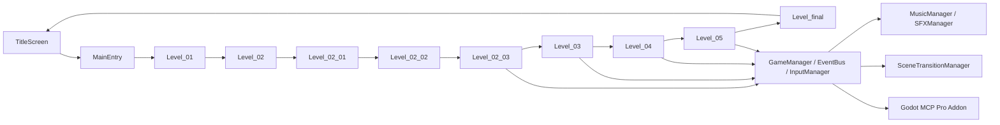

# HackathonGame 技术架构报告

> **目标读者**：关卡/玩法/系统设计与实现协作者
> **更新日期**：2026-06-27
> **引擎版本**：Godot 4.6，`GL Compatibility`
> **当前实现进度**：主流程已跑通到 `Level_final`，`Level_05`、`SceneTransitionManager`、`MusicManager`、`SFXManager`、Godot MCP Pro 插件均已接入
> **说明**：本文以当前仓库中的实际代码为准，不沿用旧版文档里的历史版本号

## 当前状态

项目是一个 2D 横版动作叙事游戏，已经形成完整的主线关卡骨架：

`TitleScreen -> MainEntry -> Level_01 -> Level_02 -> Level_02_01 -> Level_02_02 -> Level_02_03 -> Level_03 -> Level_04 -> Level_05 -> Level_final -> TitleScreen`

当前仓库里已经能看到这些关键落点：

- `Global/` 已有完整 Autoload 层
- `LevelModule/Formal/` 已有 `Level_01` 到 `Level_05` 和 `Level_final`
- `LevelModule/Backup/Level_02_CliffReality/` 保留了第二关旧的完整备份
- `LevelModule/Scenes/PixelworkMapStitch/` 存在大量关卡拼接与运行时生成资产
- `addons/godot_mcp/` 已启用 Godot MCP Pro 插件
- `project.godot` 已配置 MCP 相关 Autoload 与编辑器插件

## 架构总览

### 分层结构

1. **入口层**
   - `UI/TitleScreen.tscn`
   - `Global/MainEntry.tscn`

2. **关卡层**
   - `LevelModule/Formal/Level_01.gd`
   - `LevelModule/Formal/Level_02.gd`
   - `LevelModule/Formal/Level_02_01.gd`
   - `LevelModule/Formal/Level_02_02.gd`
   - `LevelModule/Formal/Level_02_03.gd`
   - `LevelModule/Formal/Level_03.gd`
   - `LevelModule/Formal/Level_04.gd`
   - `LevelModule/Formal/Level_05.gd`
   - `LevelModule/Formal/Level_final.gd`

3. **角色与敌人层**
   - `PlayerModule/`
   - `EnemyModule/`

4. **基础设施层**
   - `Global/`
   - `Tools/`
   - `addons/godot_mcp/`

5. **资源与拼图层**
   - `Assets/`
   - `Resources/`
   - `LevelModule/Scenes/PixelworkMapStitch/`

## 核心全局系统

### 已接入的 Autoload

`project.godot` 中当前启用的全局单例：

- `GlobalDefine`
- `EventBus`
- `GameManager`
- `InputManager`
- `KeybindManager`
- `MusicManager`
- `SFXManager`
- `SceneTransitionManager`
- `MCPScreenshot`
- `MCPInputService`
- `MCPGameInspector`

### 各系统职责

| 系统 | 作用 |
|---|---|
| `GlobalDefine` | 事件名、碰撞层、状态枚举等全局常量 |
| `EventBus` | 跨模块事件广播与订阅 |
| `GameManager` | 玩家引用、关卡引用、检查点、Boss 目标、跨关卡状态 |
| `InputManager` | 游戏输入分发、动作级屏蔽、整体输入屏蔽 |
| `KeybindManager` | 按键配置持久化 |
| `MusicManager` | BGM 播放、淡入淡出、暂停联动 |
| `SFXManager` | 音效池化、防抖、微随机音调 |
| `SceneTransitionManager` | 统一转场清理与场景切换 |
| `MCPScreenshot` / `MCPInputService` / `MCPGameInspector` | Godot MCP Pro 的运行时辅助接口 |

## 场景与关卡现状

### 入口流程

- `TitleScreen` 负责标题菜单与正式开始
- `MainEntry` 负责正式流程的关卡装载与 `LEVEL_COMPLETE` 接管
- `MainEntry` 现在不再自行创建 `Camera2D` 和 `HUD`，这些由关卡模块管理

### 关卡拆分

| 关卡 | 当前状态 | 说明 |
|---|---|---|
| `Level_01` | 已实现 | 基础关卡，包含输入规则、交互物、HUD 接入 |
| `Level_02` | 已实现 | 主关卡入口与过渡逻辑 |
| `Level_02_01` | 已实现 | 老街分段，带白屏转场出口 |
| `Level_02_02` | 已实现 | 梯子谜题段 |
| `Level_02_03` | 已实现 | 断崖、现实房间、IDE 对话、终局转场 |
| `Level_03` | 已实现 | 觉醒、战斗、世界异化与记忆收集 |
| `Level_04` | 已实现 | 维度侵蚀与空间崩塌阶段 |
| `Level_05` | 已实现 | 双世界撕裂 + Boss 战 |
| `Level_final` | 已实现 | 叙事终局关卡 |

### 关卡实现方式

- 每关通常由主控脚本 + 场景构建器 + FSM + UI 构建器组成
- 主要逻辑尽量保留在 `.gd` 中，静态关卡节点放在 `.tscn`
- 大型关卡会保留 PixelworkMapStitch 生成资产，方便编辑器直接复用

## 输入与交互

### 输入体系

`InputManager` 已经是主输入入口，支持：

- `game_action` 信号分发
- 全局输入屏蔽
- 单动作屏蔽
- 强制解除所有屏蔽
- 鼠标悬停 GUI 检测

当前输入动作主要包括：

- `ui_accept`
- `ui_pause`
- `player_attack`
- `player_jump`
- `player_dash`
- `player_skill`
- `player_up`
- `player_down`

### 交互模型

- `InteractiveObject` 作为通用交互物基类
- `EventBus` 发出 `INTERACTIVE_OBJECT_TRIGGERED`
- 关卡 FSM 决定交互后续行为
- 重要转场统一先屏蔽输入，再做动画或黑屏切换

## 角色与战斗

### 玩家层

- `PlayerBase` 是统一玩家基类
- 不同皮肤以独立场景承载
- `SmoothCamera` 已作为玩家内嵌跟随相机使用

### 当前已知皮肤

- `Player_Warrior`
- `Player_Warrior_Cyber`
- `Player_Warrior_Lingnan`

### 敌人层

当前仓库可见的敌人/首领：

- `Enemy_Slime`
- `Enemy_CyberWolf`
- `Enemy_CyberBull`
- `Enemy_LanternGhost`
- `Enemy_PaperEffigy`
- `Enemy_BossHuadan`

### 战斗要点

- 碰撞层与伤害层已经统一到 `GlobalDefine`
- `GameManager` 管理当前玩家与敌人列表
- `Level_05` 已接入 Boss 目标追踪与战斗转场
- 音效不再在每个对象里手动 new 播放器，而是统一走 `SFXManager`

## 音频与转场

### 音频

`MusicManager` 与 `SFXManager` 已成为当前音频基础设施：

- BGM 支持播放、淡入淡出、暂停联动
- SFX 使用对象池
- 攻击、受击、行走、怪物待机、怪物受击、UI 点击等关键音效已接入

### 转场

`SceneTransitionManager` 负责：

- 关卡切换前的输入解除
- 场景清理
- 和 `MainEntry` 的统一切换链协作

## 编辑器与 MCP 集成

当前仓库已开启 `Godot MCP Pro`：

- Godot 插件已放入 `addons/godot_mcp/`
- `project.godot` 已启用插件
- 全局 Codex 配置已指向完整包的 MCP server

这层集成的作用不是游戏运行逻辑，而是让 AI 编辑器协作、截图、输入模拟和场景检查有统一入口。

## 资产与生成内容

当前项目资产结构较明显地分成几块：

- `Assets/`：图像、音频、特效等
- `Resources/`：配置型资源
- `LevelModule/Scenes/PixelworkMapStitch/`：关卡拼接资产与运行时生成数据
- `LevelModule/Backup/`：历史版本备份

这意味着项目已经从“纯手写关卡”进入到“手写逻辑 + 生成资产 + 场景拼装”混合阶段。

## 当前架构判断

### 已完成的部分

- 入口和正式流程已分离
- 输入、事件、转场、音频已形成统一基础设施
- 关卡主线已经扩展到终局
- Boss 战与终局叙事已落地
- MCP 编辑器协作层已接入

### 仍然明显依赖人工约束的部分

- 关卡逻辑文件数量较多，约定依赖强
- `Level_02` 系列存在历史拆分和备份，维护时要注意主线与备份的边界
- `Level_03`、`Level_04`、`Level_05` 的状态机与场景构建仍然高度耦合
- 窗体转场、输入屏蔽、HUD 显示状态需要在每个关卡里显式维持

## 后续建议

1. 把当前项目版本号与实际实现进度对齐，避免 `project.godot` 里的版本号长期停留在早期值。
2. 为 `Level_02`、`Level_03`、`Level_04`、`Level_05` 补一份统一的“关卡状态说明表”，减少跨文件查找成本。
3. 把 `MainEntry`、`SceneTransitionManager`、`InputManager` 的职责边界再收紧，避免转场逻辑分散。
4. 给 `Level_final` 和 `Level_05` 补一轮运行验证记录，确认当前主线闭环不是只在代码层成立。
5. 如果后续继续扩关，优先把重复的关卡构建模式抽成共同基类或模板，而不是继续复制 FSM。

