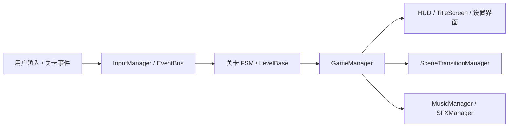
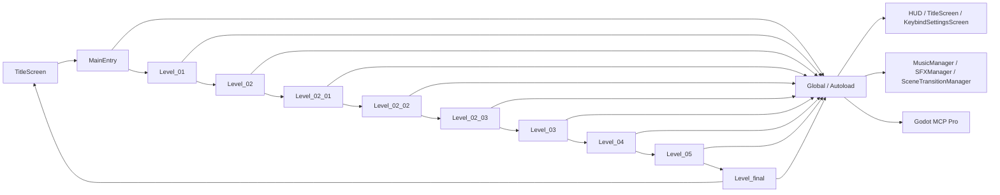

# HackathonGame 技术架构报告

> 目标读者：关卡、玩法、系统、工具和资源协作者
> 更新日期：2026-06-28
> 引擎版本：Godot 4.6，`GL Compatibility`
> 文档原则：以当前仓库实际文件为准，覆盖主流程、支撑系统、数据配置、资源组织与部署镜像

## 0. 如何使用本文档

这份文档的目标不是“描述项目很大”，而是让协作者能按图索骥地找到入口、调用接口、修改对应模块。

### 0.1 阅读顺序

如果你是第一次接手这个项目，建议按下面顺序读：

1. 先看第 3 章，理解运行时链路
2. 再看第 4 章，理解全局单例和允许的调用方式
3. 然后看第 5 到第 8 章，理解关卡、角色、敌人、Boss 和核心玩法
4. 再看第 9 到第 16 章，理解 UI、工具、配置、音频、shader、资源和部署
5. 最后看第 17 到第 20 章，理解事件契约、扩展任务、架构判断和结论

### 0.2 常用调用速查

| 场景 | 先读章节 | 关键文件 | 主要调用方式 |
|---|---|---|---|
| 启动正式游戏 | 3、16 | `UI/TitleScreen.gd`、`Global/MainEntry.gd` | `SceneTransitionManager.request_scene_change("res://Global/MainEntry.tscn", self)` |
| 关卡完成切换 | 3、5、17 | `LevelModule/Formal/*.gd`、`Global/MainEntry.gd` | `EventBus.emit(GlobalDefine.EventName.LEVEL_COMPLETE, {"next_level": "res://..."})` |
| 从检查点重开 | 4、16 | `Global/GameManager.gd`、`Global/SceneTransitionManager.gd` | `GameManager.restart_from_checkpoint()` |
| 对话/过场屏蔽输入 | 4、17 | `Global/InputManager.gd`、关卡脚本 | `InputManager.block_input()` / `unblock_input()` |
| 角色状态同步到 HUD | 4、17 | `UI/HUD.gd`、`PlayerModule/Formal/PlayerBase.gd` | `EventBus.emit(GlobalDefine.EventName.HEALTH_CHANGED, {...})` |
| 新增敌人 | 7、11、18 | `EnemyModule/Formal/`、`DataConfig/Enemy/` | `LevelBase.spawn_enemy()`（敌人 `_ready()` 后自动注册） |
| 新增关卡 | 5、11、18 | `LevelModule/Formal/`、`DataConfig/Level/` | 继承 `LevelBase`，在 `_on_ready()` 中装配 |
| 新增 UI 页面 | 9、16、18 | `UI/`、`Global/SceneTransitionManager.gd` | `SceneTransitionManager.request_scene_change()` 或叠层 `CanvasLayer` |
| 新增事件 | 4、17、18 | `Global/GlobalDefine.gd`、`Global/EventBus.gd` | 先定义 `GlobalDefine.EventName`，再 `subscribe/emit` |

### 0.3 调用原则

- 跨模块通信优先走 `EventBus`，不要直接持有别的模块节点引用
- 场景切换优先走 `SceneTransitionManager`，不要在普通关卡里直接 `change_scene_to_file()`
- 游戏操作输入优先走 `InputManager`，不要在多数节点里各自监听 `_input()`
- 关卡初始装配优先走 `LevelBase`，不要把相机、玩家、敌人初始化散落到 `MainEntry`
- 可调参数优先下沉到 `DataConfig/`，不要把平衡值继续写死在脚本里

## 1. 项目概况

本项目是一个 2D 横版动作叙事游戏，主题是“岭南文化 × 赛博未来 × 梦境撕裂”。当前仓库已经不只是单纯的演示原型，而是形成了完整的可运行主线、基础设施、数据配置层和一组复用工具。

当前主流程由标题页进入正式关卡，经过 `Level_01` 到 `Level_05`，再进入 `Level_final`，形成闭环。项目同时保留了若干 `SelfTest`、备份场景和编辑器辅助资源，用来支持调试和内容迭代。

## 2. 仓库结构总览

当前根目录的关键内容如下：

- `Global/`：全局单例、事件总线、输入、转场、音频、状态管理
- `LevelModule/`：关卡基类、正式关卡、FSM、场景构建器、UI 构建器、shader
- `PlayerModule/`：玩家基类、三个皮肤版本、相机
- `EnemyModule/`：普通敌人、Boss 花旦、Boss 剑气
- `UI/`：标题页、HUD、按键设置页
- `Tools/`：弹体、特效、代码雨、伤害计算等通用工具
- `DataConfig/`：玩家、敌人、关卡、技能的资源配置
- `Assets/`：贴图、音频、视频、UI 素材
- `Resources/`：少量共享资源
- `.edgeone/assets/`：部署镜像和导出相关文件的同步副本
- `.godot/`：Godot 编辑器缓存与导入产物

项目主入口由 `project.godot` 配置为 `UI/TitleScreen.tscn`，运行模式固定为 1280x720，`canvas_items` 拉伸，渲染后端为 `GL Compatibility`。

## 3. 运行时架构

### 3.1 入口链路

- `TitleScreen` 是应用主入口
- `MainEntry` 是正式流程承载节点
- `MainEntry` 负责加载正式关卡、接收 `LEVEL_COMPLETE`、做统一转场
- 关卡切换不再依赖手工拼接场景树，而是由主流程托管

### 3.2 关卡基类链路

- `LevelBase` 提供关卡初始化模板
- 每个正式关卡通常由主控脚本、场景节点、FSM、场景构建器、UI 构建器组成
- 玩家由关卡自动生成或在主流程中继承，不依赖手工重复布置
- 关卡完成后通过 `EventBus` 广播 `LEVEL_COMPLETE`

### 3.3 正式模式与自测模式

`GameManager` 会根据当前场景路径检测运行模式：

- 路径包含 `SelfTest` 时进入 `SELF_TEST`
- 其余场景进入 `FORMAL`

这意味着本仓库同时保留了“正式游戏链路”和“局部验证链路”，并且运行时会自动区分。

## 4. 全局单例层

`project.godot` 里当前启用的 Autoload 如下：

| 单例 | 作用 |
|---|---|
| `GlobalDefine` | 运行模式、状态枚举、碰撞层、事件名常量 |
| `EventBus` | 跨模块事件广播与订阅 |
| `GameManager` | 玩家、敌人、关卡、暂停、检查点、Boss 目标等全局状态 |
| `InputManager` | 输入分发、动作屏蔽、全局屏蔽 |
| `KeybindManager` | 按键配置持久化 |
| `MusicManager` | BGM 播放、淡入淡出、暂停联动 |
| `SFXManager` | 音效播放、池化与防抖 |
| `SceneTransitionManager` | 统一场景切换、检查点重启、清理跨场景状态 |
| `MCPScreenshot` | Godot MCP Pro 截图服务 |
| `MCPInputService` | Godot MCP Pro 输入服务 |
| `MCPGameInspector` | Godot MCP Pro 运行时检查服务 |

### 4.1 `GlobalDefine`

集中定义：

- `RunMode`
- `PlayerState`
- `EnemyState`
- `DamageType`
- `Collision`
- `EventName`

碰撞层目前统一为：

- `TERRAIN = 1`
- `ENEMY = 2`
- `PLAYER = 4`
- `INTERACT = 8`

### 4.2 `GameManager`

`GameManager` 负责全局状态与跨关卡引用：

- `player_ref`
- `current_level`
- `enemy_list`
- `dream_runtime_flags`
- `boss_target`
- 检查点场景路径、阶段和附加数据

它还负责：

- 全局字体注入
- 运行模式检测
- 玩家和敌人注册/注销
- 暂停与恢复
- 游戏结束广播
- 检查点重启入口

运行模式检测需要容忍启动和切场过程中的空树状态：当 `SceneTree` 或 `current_scene` 还不可用时，`GameManager` 默认回到 `FORMAL`，避免 Autoload 初始化早于主场景挂载时出现空实例访问。

### 4.3 `InputManager`

输入层已经不再依赖各关卡自己散落监听，而是集中处理：

- `game_action` 信号分发
- 全局输入屏蔽
- 单动作屏蔽
- 强制解除所有屏蔽
- GUI 悬停相关判断

### 4.4 `SceneTransitionManager`

这是当前项目的统一转场入口，主要职责是：

- 切换前清理玩家、敌人、输入屏蔽、暂停、焦点和音乐状态
- 提供整树场景切换
- 提供检查点重启
- 通过 `is_transitioning` 避免重复切换

转场清理采用防御式写法：先取 `tree = get_tree()` 并判空，再访问 `tree.current_scene`。涉及 `current_scene` 的局部变量显式标注为 `Node`，避免 GDScript 无法从 `current_scene` 推断类型。即使没有 `SceneTree`，清理流程仍会重置 `GameManager`、`InputManager` 和音频暂停状态，只跳过需要场景树的暂停、焦点和场景替换 API。

## 5. 关卡系统

### 5.1 关卡目录现状

正式关卡位于：

- `LevelModule/Formal/Level_01.gd`
- `LevelModule/Formal/Level_02.gd`
- `LevelModule/Formal/Level_02_01.gd`
- `LevelModule/Formal/Level_02_02.gd`
- `LevelModule/Formal/Level_02_03.gd`
- `LevelModule/Formal/Level_03.gd`
- `LevelModule/Formal/Level_04.gd`
- `LevelModule/Formal/Level_05.gd`
- `LevelModule/Formal/Level_final.gd`

补充文件还包括：

- `Level_01_FSM.gd`
- `Level_02_FSM.gd`
- `Level_03_FSM.gd`
- `Level_04_FSM.gd`
- `Level_01_SceneBuilder.gd`
- `Level_02_SceneBuilder.gd`
- `Level_03_SceneBuilder.gd`
- `Level_04_SceneBuilder.gd`
- `Level_01_UIBuilder.gd`
- `Level_02_UIBuilder.gd`
- `Level_03_UIBuilder.gd`
- `Level_04_UIBuilder.gd`
- `InteractiveObject.gd`
- `Ladder.gd`
- `LevelBase.gd`

### 5.2 关卡初始化约定

`LevelBase` 是正式关卡的统一基类，流程如下：

1. 应用关卡配置
2. 初始化相机逻辑
3. 生成玩家
4. 生成敌人
5. 安装触发器
6. 记录当前关卡到 `GameManager.current_level`
7. 广播 `LEVEL_LOADED`
8. 进入子类 `_on_ready()`

关卡退出时，若子类实现了 `prepare_for_level_exit()`，转场管理器会优先调用它清理自身状态。

### 5.3 关卡内容分工

| 关卡 | 主要职责 |
|---|---|
| `Level_01` | 起始教学、基础交互、HUD 接入、FSM 结构落地 |
| `Level_02` | 主线过渡关卡，拆分出多个子段 |
| `Level_02_01` | 老街分段与白屏出口 |
| `Level_02_02` | 梯子/空间连接谜题 |
| `Level_02_03` | 断崖、现实房间、IDE 对话、终局前过渡 |
| `Level_03` | 觉醒、战斗、世界异化与记忆收集 |
| `Level_04` | 维度侵蚀、空间崩塌、双世界切换 |
| `Level_05` | 双世界撕裂、侵蚀增长、Boss 战 |
| `Level_final` | 终局叙事和收束 |

### 5.4 特殊关卡资产

仓库中保留了多个拼图和历史分段资源，例如：

- `LevelModule/Scenes/PixelworkMapStitch/`
- `LevelModule/Backup/`
- `LevelModule/SelfTest/`

这些资源说明项目已经进入“手写逻辑 + 生成资产 + 场景拼装”的混合阶段，而不是单一手绘关卡阶段。

## 6. 玩家系统

### 6.1 玩家主结构

玩家基类位于：

- `PlayerModule/Formal/PlayerBase.gd`

当前可见的正式皮肤场景：

- `PlayerModule/Formal/Player_Warrior.tscn`
- `PlayerModule/Formal/Player_Warrior_Cyber.tscn`
- `PlayerModule/Formal/Player_Warrior_Lingnan.tscn`

### 6.2 玩家能力与相机

玩家系统当前包含：

- 移动
- 跳跃
- 冲刺
- 普攻
- 技能
- 受击
- 死亡

普通起跳会复用现有 `is_invincible` / `invincible_timer` 机制获得 `0.18s` 短无敌帧。该无敌帧通过 `maxf(invincible_timer, duration)` 叠加，不会缩短冲刺、受击等路径已经授予的更长无敌时间。

相机不再由关卡手动创建，而是作为 `SmoothCamera` 直接挂在玩家预制体里。这样做的好处是：

- 切换角色时相机跟随关系稳定
- 关卡层不再重复维护 Camera2D
- Boss 战和特殊段落可以只调整限制边界而不重构相机节点

### 6.3 皮肤切换

`Level_05` 中有双世界/双角色玩法，玩家皮肤在 `Cyber` 和 `Lingnan` 间切换。切换时会继承位置、朝向、摄像机限制和对应血量，并重新广播 `HEALTH_CHANGED`。

## 7. 敌人系统

### 7.1 普通敌人

当前仓库中的敌人场景包括：

- `Enemy_Slime`
- `Enemy_CyberWolf`
- `Enemy_CyberBull`
- `Enemy_LanternGhost`
- `Enemy_PaperEffigy`

敌人基类是 `EnemyModule/Formal/EnemyBase.gd`，用于统一：

- 受击
- 死亡
- 击退/硬直
- 配置资源读取

### 7.2 Boss 花旦

Boss 位于：

- `EnemyModule/Formal/Enemy_BossHuadan.gd`
- `EnemyModule/Formal/Enemy_BossHuadan.tscn`

Boss 的弹体和相关技能资源位于：

- `EnemyModule/Formal/SwordEnergy.gd`
- `EnemyModule/Formal/SwordEnergy.tscn`

花旦是当前战斗复杂度最高的敌人，具备多阶段行为、悬停、远程剑气、近战连击、规避和换阶段参数变化。

### 7.3 Boss 行为约束

当前实现中保留的关键约束是：

- Boss 由 `GameManager.boss_target` 辅助追踪
- Boss 战场景中剑气弹体可自动瞄准玩家
- Boss 的主要伤害来源是剑气和近战 hitbox，不依赖接触伤害

## 8. 关卡 05 专项架构

`Level_05` 是当前关卡里最复杂的一层，承担三件事：

1. 双世界视觉撕裂
2. 侵蚀值持续增长
3. Boss 花旦战斗与后续终局转场

### 8.1 双世界结构

`Level_05` 里分为：

- `TopSprite`
- `BotSprite`
- `CyberCollisions`
- `LingnanCollisions`
- `Bg5`
- `Bg5Collisions`

这个关卡使用 `PixelTearing`、`edge_tear`、`glitch_effect`、`erosion_vignette`、`memory_echo_effect` 等 shader 和视觉层，表现世界撕裂和侵蚀。

### 8.2 双角色血量

Boss 段的玩家采用双角色独立血量策略：

- Cyber 角色一套血量
- Lingnan 角色一套血量

切换皮肤时不会把血量回满，而是保留对应角色的独立状态。这是 `Level_05` 的核心战斗规则之一。

### 8.3 侵蚀值系统

侵蚀值会随时间增长，击杀敌人可降低。侵蚀值达到上限后触发游戏结束。对话期间、进入 `bg5` 后，以及花旦 Boss 死亡后都会暂停自然增长。

花旦死亡时，`Level_05` 通过 `_erosion_growth_locked` 锁住后续自然增长；这只影响 `EROSION_RATE` 驱动的自动增加，不改变侵蚀条显示、击杀敌人降低侵蚀值、Boss 死亡后的灯笼和终局转场流程。

### 8.4 Boss 区域与 bg5 区域

`Level_05` 还包含两段后续流程：

- Boss 区域
- Boss 击杀后的 `bg5` 区域和灯笼对话段

这说明 `Level_05` 不只是一个 Boss 关，而是一个组合型关卡容器。

## 9. UI 系统

### 9.1 当前 UI 场景

- `UI/TitleScreen.tscn`
- `UI/HUD.tscn`
- `UI/KeybindSettingsScreen.tscn`

### 9.2 UI 职责

- `TitleScreen`：开始菜单和正式流程入口
- `HUD`：血条、状态提示、可能的调试性显示
- `KeybindSettingsScreen`：按键配置界面

### 9.3 统一风格

`UI/GameUIStyle.gd` 负责项目 UI 主题风格。`GameManager` 在启动时还会注入像素字体，保证大部分文本节点使用统一字形。

## 10. 工具层

`Tools/` 目录提供了很多跨模块复用能力：

- `CodeRain.gd`：代码雨渲染
- `DamageCalculator.gd`：伤害计算
- `FireballProjectile.gd`：火球弹体
- `PixelGlitch.gd`：像素故障特效
- `SlashEffect.gd`：刀光特效
- `SwordQiProjectile.gd`：剑气弹体
- `WarningBarrier.gd`：警告屏障

这些工具层脚本说明本项目并没有把攻击、特效、弹体逻辑硬塞进关卡脚本，而是提取出了可复用的战斗和视觉组件。

## 11. 数据配置层

`DataConfig/` 目录是项目从“脚本直接写死参数”过渡到“资源配置驱动”的标志。

### 11.1 玩家配置

- `DataConfig/Player/PlayerConfig.gd`
- `DataConfig/Player/WarriorConfig.tres`

### 11.2 敌人配置

- `DataConfig/Enemy/EnemyConfig.gd`
- `DataConfig/Enemy/SlimeConfig.tres`
- `DataConfig/Enemy/StreetSlimeConfig.tres`
- `DataConfig/Enemy/CyberBullConfig.tres`
- `DataConfig/Enemy/LanternGhostConfig.tres`
- `DataConfig/Enemy/PaperEffigyConfig.tres`
- `DataConfig/Enemy/SecurityConfig.tres`
- `DataConfig/Enemy/ShadowConfig.tres`
- `DataConfig/Enemy/CleanerConfig.tres`

### 11.3 关卡配置

- `DataConfig/Level/LevelConfig.gd`
- `DataConfig/Level/Level01Config.tres`
- `DataConfig/Level/Level02Config.tres`
- `DataConfig/Level/Level03Config.tres`
- `DataConfig/Level/Level04Config.tres`
- `DataConfig/Level/Level05Config.tres`
- `DataConfig/Level/Level01Data.gd`
- `DataConfig/Level/Level02Data.gd`
- `DataConfig/Level/Level03Data.gd`
- `DataConfig/Level/Level04Data.gd`

### 11.4 技能配置

- `DataConfig/Skill/SkillConfig.gd`
- `DataConfig/Skill/SlashConfig.tres`

这套配置层的意义是把角色、敌人、关卡、技能的大部分可调参数从脚本中剥离出来，降低后续平衡改动成本。

## 12. 音频系统

音频资源位于：

- `Assets/Music/`
- `Assets/Sound/`

当前仓库中的音频管理层是：

- `MusicManager`
- `SFXManager`

它们负责：

- BGM 播放和切换
- 淡入淡出
- 暂停联动
- 音效池化
- 重复音效防抖

## 13. 视觉特效与 shader

`LevelModule/Formal/` 下有一组专门的 shader：

- `PixelTearing.gdshader`
- `edge_tear.gdshader`
- `erosion_vignette.gdshader`
- `glitch_effect.gdshader`
- `memory_echo_effect.gdshader`
- `wall_barrier.gdshader`
- `warning_barrier.gdshader`

这意味着项目的视觉表现不是靠单一贴图堆叠，而是由：

- 地图拼接
- UI 图层
- 特效工具
- shader 扭曲

共同构成。

## 14. 资源与素材层

### 14.1 图像与动画

`Assets/` 下包含：

- 角色图像
- Boss 图像
- UI 图像
- 背景图
- 特效图

### 14.2 音频

`Assets/Music/` 和 `Assets/Sound/` 下分别存放 BGM 和音效。

### 14.3 视频

项目还包含 `Assets/视频演出.ogv`，说明主线里已经有视频型叙事资产。

### 14.4 编辑器缓存

`.godot/` 目录是 Godot 自动生成的导入和缓存内容，不属于业务代码，但会影响编辑器本地开发体验。

## 15. 编辑器与 MCP 集成

项目已启用 Godot MCP Pro 插件：

- `addons/godot_mcp/`

并在 `project.godot` 中注册了：

- `MCPScreenshot`
- `MCPInputService`
- `MCPGameInspector`

这层集成不参与游戏运行逻辑，但对调试、截图、输入模拟、场景检查很重要。

本地开发环境已安装 Godot Engine 4.7 CLI，可使用 `godot_console` 执行命令行解析和启动检查。项目配置仍声明 `Godot 4.6` 与 `GL Compatibility`，因此用 4.7 CLI 验证时需要把它视为兼容性检查，而不是严格等同于目标引擎版本。

当前命令行检查可以启动到标题页，但会报告 `project.godot` 中 3 个 Godot MCP Autoload 对应脚本缺失；这是编辑器协作插件文件缺失问题，不是主游戏链路脚本解析失败。若要让 CLI 日志完全干净，需要恢复 `addons/godot_mcp/` 下的服务脚本，或在无 MCP 的环境中移除这 3 个 Autoload 引用。

## 16. 部署与导出现状

当前仓库里能看到两类部署相关内容：

- `project.godot` 中的 Web 导出设置
- `.edgeone/assets/` 中的部署镜像文件

这说明项目已经开始把 Web 发布、静态资源和导出配置纳入仓库管理，不过当前根目录并没有把 Docker/Nginx 文件作为核心源码的一部分展示出来，因此这里不把它们写成“主代码依赖”，只把它们当作部署侧产物处理。

## 17. 事件、输入、碰撞约定

### 17.1 主要事件

当前最常见的全局事件包括：

- `GAME_START`
- `GAME_PAUSE`
- `GAME_RESUME`
- `GAME_OVER`
- `LEVEL_LOADED`
- `LEVEL_COMPLETE`
- `PLAYER_SPAWNED`
- `PLAYER_DIED`
- `PLAYER_HURT`
- `PLAYER_ATTACK_HIT`
- `ENEMY_SPAWNED`
- `ENEMY_DIED`
- `ENEMY_HURT`
- `INTERACTIVE_OBJECT_TRIGGERED`
- `HEALTH_CHANGED`

### 17.2 主要输入动作

`project.godot` 当前定义的输入动作包括：

- `ui_accept`
- `ui_left`
- `ui_right`
- `ui_up`
- `ui_down`
- `ui_pause`
- `player_jump`
- `player_attack`
- `player_dash`
- `player_skill`
- `player_up`
- `player_down`

### 17.3 碰撞层

碰撞层已经收敛到 `GlobalDefine.Collision`，避免在关卡或角色脚本里手写数字。

## 18. 常见扩展任务与接入方式

### 18.1 新增关卡

建议顺序：

1. 在 `DataConfig/Level/` 新建或复制一个关卡配置资源
2. 在 `LevelModule/Formal/` 新建关卡脚本和场景
3. 继承 `LevelBase`
4. 在 `_on_ready()` 中装配关卡特有对象
5. 需要过关时广播 `EventBus.emit(GlobalDefine.EventName.LEVEL_COMPLETE, {...})`

如果新关卡要接主线，优先让 `MainEntry` 托管切换；如果是标题页、终局页或独立调试页，直接使用 `SceneTransitionManager.request_scene_change()`。

### 18.2 新增敌人

建议顺序：

1. 在 `DataConfig/Enemy/` 建立敌人配置资源
2. 在 `EnemyModule/Formal/` 添加敌人脚本和场景
3. 让敌人继承 `EnemyBase`
4. 在关卡场景构建器或子关卡里实例化并 `add_child`
5. 敌人基类 `_ready()` 会自动执行 `GameManager.register_enemy(self)`
6. 通过 `EventBus` 触发受击、死亡和统计事件

如果敌人需要出现在多个关卡，优先做成资源配置驱动，而不是把参数写死在关卡脚本中。

### 18.3 新增玩家能力或皮肤

建议顺序：

1. 先确认能力是属于所有皮肤，还是只属于某个皮肤
2. 共有能力放在 `PlayerBase`
3. 皮肤专属能力放在各自皮肤脚本
4. 若能力改变血量、状态或 HUD 显示，记得广播 `HEALTH_CHANGED` 或相关事件

如果要新增皮肤，优先沿用现有 `SmoothCamera` 和 `GameManager.register_player()` 的接入方式。

### 18.4 新增 UI 页面

建议顺序：

1. 先确定它是“独立场景切换页”还是“叠层 UI”
2. 独立场景切换页走 `SceneTransitionManager.request_scene_change()`
3. 叠层 UI 走 `CanvasLayer + Control`
4. 需要暂停输入时，使用 `InputManager.block_input()`
5. 需要退出时，调用对应的 `unblock_input()` 或在 `prepare_for_level_exit()` 中统一清理

### 18.5 新增事件

建议顺序：

1. 在 `Global/GlobalDefine.gd` 的 `EventName` 里先定义事件常量
2. 在发送方使用 `EventBus.emit()` 或 `emit_deferred()`
3. 在接收方使用 `EventBus.subscribe()`
4. 节点退出后依赖 `tree_exited` 自动清理，必要时显式 `unsubscribe_all()`

不要直接写字符串事件名散落在脚本里，这会让后续重构成本上升。

### 18.6 新增输入动作

建议顺序：

1. 先在 `project.godot` 的 `[input]` 中定义动作
2. 再决定它是“全局快捷键”还是“游戏动作”
3. 游戏动作优先接入 `InputManager.game_action`
4. 方向键和跳跃这类需要连续值的输入，保留每帧轮询逻辑

### 18.7 新增转场

建议顺序：

1. 能用 `MainEntry` 托管切换的主线关卡，优先走 `LEVEL_COMPLETE`
2. 需要整树替换的场景，使用 `SceneTransitionManager.request_scene_change()`
3. 需要回到检查点的场景，使用 `GameManager.restart_from_checkpoint()`
4. 涉及暂停、输入屏蔽、音乐暂停、焦点时，确保 `prepare_for_level_exit()` 可被调用

## 19. 当前架构判断

### 19.1 已完成的部分

- 入口和正式流程已分离
- 基础设施层已经齐备
- 关卡主线已经闭环
- 玩家、敌人、Boss、UI、音频、转场都有统一职责
- 数据配置层已经建立
- 视觉特效与 shader 体系已经成型

### 19.2 仍需持续约束的部分

- 关卡脚本数量多，依赖约定较强
- `Level_02` 系列存在子段和历史结构，维护时要注意主线边界
- `Level_03`、`Level_04`、`Level_05` 的状态机与场景构建仍然耦合较深
- 转场、输入屏蔽、HUD、音频状态需要在每个关卡里显式维持
- `SelfTest`、备份和正式目录并存，后续必须继续保持目录边界清晰

## 20. 结论

当前项目已经具备一个完整 Godot 2D 动作叙事游戏的标准分层：

1. 入口层
2. 关卡层
3. 角色层
4. 敌人层
5. 数据配置层
6. UI 层
7. 工具层
8. 音频层
9. 特效层
10. 编辑器协作层

接下来的重点不再是“有没有架构”，而是“如何继续保持边界清晰、减少关卡脚本耦合、把可调参数继续下沉到配置资源中”。
